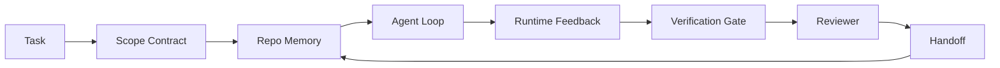

# Agent工作台工程：为什么有能力的模型仍然失败

> 一个有能力的模型是不够的。可靠的Agent需要一个工作台：指令、状态、范围、反馈、验证、审查和交接。剥离这些，即使是前沿模型也会产生不安全的交付物。

**类型：** 学习 + 构建
**语言：** Python（标准库）
**前置条件：** 阶段14 · 01（Agent循环）、阶段14 · 26（失败模式）
**时间：** ~45分钟

## 学习目标

- 将模型能力与执行可靠性分开。
- 说出决定Agent是否可交付的七个工作台表面。
- 在一个小仓库任务上，比较纯提示运行与工作台引导的运行。
- 生成一个失败模式报告，将每个缺失的表面映射到它引起的症状。

## 问题

你把一个前沿模型扔进一个真实仓库，让它添加输入验证。它打开了四个文件，写了看似合理的代码，声明成功，然后停止了。你运行测试。两个失败。第三个被修改的文件和验证完全没有关系。没有任何记录说明Agent假设了什么、最初尝试了什么、还有什么没做完。

模型在Python方面没有错。它错在了"工作"上。它不知道什么是"完成"、它可以在哪里写、哪些测试是权威的、或者下个会话应该如何接手。

这不是模型Bug。这是工作台Bug。围绕Agent的表面缺少了将一次性生成转变为可靠的、可恢复的工程工作的部分。

## 核心概念

工作台是包装模型在执行任务期间的运行环境。它有七个表面：

| 表面 | 它承载什么 | 缺失时的失败 |
|------|----------|------------|
| 指令 | 启动规则、禁止行为、完成定义 | Agent猜测"交付"是什么意思 |
| 状态 | 当前任务、触碰的文件、阻碍、下一步行动 | 每个会话从零重新开始 |
| 范围 | 允许的文件、禁止的文件、验收标准 | 编辑泄露到无关代码中 |
| 反馈 | 真实命令输出捕获到循环中 | Agent对返回码400声明成功 |
| 验证 | 测试、Lint、冒烟运行、范围检查 | "看起来不错"进入了主分支 |
| 审查 | 以不同角色进行的第二次检查 | 构建者批改自己的作业 |
| 交接 | 改了什么、为什么、还剩下什么 | 下个会话重新发现一切 |

工作台独立于模型。你可以更换模型而保留表面。你不能更换表面而保留可靠性。



循环闭合在状态文件上，而非聊天历史上。聊天是易失的。仓库才是事实记录系统。

### 工作台 vs 提示工程

提示工程告诉模型这一回合你想要什么。工作台告诉模型如何跨回合、跨会话来工作。大多数Agent失败故事都是披着提示工程外衣的工作台失败。

### 工作台 vs 框架

框架给你一个运行时（LangGraph、AutoGen、Agents SDK）。工作台给Agent一个在运行时内部工作的空间。两者都需要。这个迷你系列是关于后者的。

### 从原语推理，而非从供应商分类法

现在有很多关于"harness engineering"（套件工程）的文章。Addy Osmani、OpenAI、Anthropic、LangChain、Martin Fowler、MongoDB、HumanLayer、Augment Code、Thoughtworks、walkinglabs的awesome列表，以及Medium和Hacker News上的持续讨论都在讨论它。他们对套件的边界、范围、用词有不同的意见。我们不需要选边站。七个表面是UX层；每个工作台下面都是支撑任何可靠后端的同一套分布式系统原语。

暂时摘掉Agent标签。Agent运行是跨越时间、进程和机器的计算。要让它可靠，你需要任何生产系统都需要的相同原语。

| 原语 | 它是什么 | 它对Agent承载什么 |
|------|---------|-----------------|
| 函数 | 类型化处理器。尽可能纯净。拥有它的输入和输出。 | 工具调用、规则检查、验证步骤、模型调用 |
| 工作进程 | 拥有一个或多个函数及生命周期的长寿命进程 | 构建者、审查者、验证者、MCP服务器 |
| 触发器 | 调用函数的事件源 | Agent循环节拍、HTTP请求、队列消息、cron、文件变更、hook |
| 运行时 | 决定什么在哪里运行、有什么超时和资源的边界 | Claude Code的进程、LangGraph的运行时、工作容器 |
| HTTP/RPC | 调用者和工作进程之间的线路 | 工具调用协议、MCP请求、模型API |
| 队列 | 触发器和工作者之间的持久缓冲；背压、重试、幂等性 | 任务看板、反馈日志、审查收件箱 |
| 会话持久化 | 在崩溃、重启、模型切换后幸存的状态 | `agent_state.json`、检查点、KV存储、仓库本身 |
| 授权策略 | 谁可以调用什么函数、什么范围 | 允许/禁止的文件、审批边界、MCP能力列表 |

现在将七个工作台表面映射到这些原语上。

- **指令** — 策略 + 函数元数据。规则是检查（函数）。路由文件（`AGENTS.md`）是附加到运行时启动的策略。
- **状态** — 会话持久化。运行时在每一步读取的键值存储。文件、KV或数据库；持久化语义重要，存储后端不重要。
- **范围** — 每个任务的授权策略。允许/禁止的glob模式是ACL。需要的审批是权限格。
- **反馈** — 写入队列的调用日志。每个Shell调用都是一条记录，持久、可重放。
- **验证** — 一个函数。对输入是确定性的。在任务关闭时触发。失败即关闭。
- **审查** — 一个独立的工作进程，对构建者产物有只读授权，对审查报告有只写授权。
- **交接** — 由会话结束触发器发出的持久记录。下个会话的启动触发器读取它。

Agent循环本身是一个工作进程，消费事件（用户消息、工具结果、计时器节拍），调用函数（模型，然后模型选择的工具），写入记录（状态、反馈），发出触发器（验证、审查、交接）。没有神秘之处；和作业处理器的形状一样。

### 流通中的模式，翻译为原语

每个流行的套件模式都归结为八个原语。翻译表。

| 供应商或社区模式 | 它实际是什么 |
|-----------------|------------|
| Ralph循环（Claude Code、Codex、agentic_harness书）——在Agent试图过早停止时将原始意图重新注入新的上下文窗口 | 一个触发器，用干净的上下文重新入队任务；会话持久化承载目标 |
| 规划/执行/验证（PEV） | 三个工作进程，每个角色一个，通过状态和阶段间的队列通信 |
| 套件-计算分离（OpenAI Agents SDK，2026年4月）——将控制平面与执行平面分离 | 重新表述控制平面/数据平面。比Agent标签早几十年 |
| Open Agent Passport（OAP，2026年3月）——在执行前对声明性策略签名和审计每个工具调用 | 由预先动作工作者强制执行的授权策略，带有签名的审计队列 |
| 指南和传感器（Birgitta Böckeler / Thoughtworks）——前馈规则 + 反馈可观测性 | 授权策略 + 验证函数 + 可观测性追踪 |
| 渐进式压缩，5阶段（Claude Code逆向工程，2026年4月） | 一个状态管理工作进程，对会话持久化运行类似cron的任务以保持在预算内 |
| Hook/中间件（LangChain、Claude Code）——拦截模型和工具调用 | 包装在运行时调用路径周围的触发器 + 函数 |
| 技能作为带渐进式披露的Markdown（Anthropic、Flue） | 一个函数注册表，函数元数据按需加载到上下文中 |
| 沙箱Agent（Codex、Sandcastle、Vercel Sandbox） | 计算平面：具有隔离文件系统、网络和生命周期的运行时 |
| MCP服务器 | 通过稳定的RPC暴露函数的工作进程，带有能力列表作为授权 |

表中每个条目都是Agent社区发现了一个分布式系统中已有名称的原语，然后给了它一个新名字。这些标签对营销有用，但作为工程词汇没有用。

### 实际数据怎么说

套件优于模型的说法现在有数字支撑。值得知道，因为它们也是反驳"等更聪明的模型就行"的唯一诚实论据。

- Terminal Bench 2.0 — 相同模型，套件变更将编码Agent从Top 30之外提升到第五名（LangChain，《Agent套件剖析》）。
- Vercel — 删除了80%的Agent工具；成功率从80%跃升到100%（MongoDB）。
- Harvey — 仅通过套件优化，法律Agent的准确率翻倍以上（MongoDB）。
- 88%的企业AI Agent项目未能达到生产。失败集中在运行时，而非推理（preprints.org，《语言Agent的套件工程》，2026年3月）。
- 一项对三个流行开源框架的2025年基准测试研究报告了约50%的任务完成率；长上下文WebAgent在长上下文条件下从40-50%崩溃到不足10%，主要由于无限循环和目标丢失（在2026年初的文章中被广泛报道）。

关键启示不是"套件永远赢"。模型确实会随时间吸收套件技巧。关键启示是，今天，承载负载的工程在模型周围，而非模型内部，承载负载的原语是每个生产系统一直需要的。

### 供应商文章止步之处

这是你不需要客气的地方。

- LangChain的《Agent套件剖析》列举了十一个组件——提示、工具、Hook、沙箱、编排、记忆、技能、子Agent，以及一个运行时"哑循环"。它没有提到队列、工作进程作为部署单元、触发器语义、会话持久化作为独立关注点，或授权策略。它将套件视为你配置的对象，而非你部署的系统。
- Addy Osmani的《Agent套件工程》确立了`Agent = Model + Harness`的框架和棘轮模式，但止步于说明套件由什么构成。它读起来像一种立场，而非规范。
- Anthropic和OpenAI在表面上走得最深，但停留在自己的运行时内部。2026年4月Agents SDK中的"套件-计算分离"公告是第一个明确支持控制平面/数据平面分离的供应商文章。那是一个原语想法，不是一个新想法。
- agentic_harness书将套件视为配置对象（Jaymin West的《Agent工程》，第6章），其中最强的一句话是"套件是Agent系统中的主要安全边界。"那只是授权策略，换了个说法。
- Hacker News的讨论总是得出同样的结论。2026年4月的《Agent套件应该放在沙箱之外》认为套件应该"更像一个Hypervisor，位于一切之外，基于上下文和用户授权访问。"这再次将授权策略作为独立平面。

你不需要不同意这些文章就能注意到这个缺口。他们在写一个已经存在的系统的UX描述。我们在写这个系统。当系统构建正确时，七个表面从原语中自然产生。当系统构建错误时，再多的`AGENTS.md`打磨也补不上缺失的队列。

所以当你听到"套件工程"时，翻译成原语。提示和规则是策略和函数。脚手架是运行时。护栏是授权+验证。Hook是触发器。记忆是会话持久化。Ralph循环是重新入队。子Agent是工作进程。沙箱是计算平面。词汇变化，工程不变。工作台是面向Agent的UX；套件，在能经受下一轮供应商重新定义的意义上，是函数、工作进程、触发器、运行时、队列、持久化和策略的正确连接。

## 构建它

`code/main.py` 在一个小仓库任务上运行两次。首先是纯提示，然后接入七个表面。相同模型，相同任务。脚本统计纯提示运行中缺失了哪些表面，并打印失败模式报告。

仓库任务故意很小：为一个单文件FastAPI风格的处理程序添加输入验证并编写一个通过测试。

运行它：

```
python3 code/main.py
```

输出：两次运行的并排日志，总结纯提示运行的`failure_modes.json`，以及工作台运行的一句裁决。

Agent是一个简单的基于规则的桩；重点在表面，而非模型。在这个迷你系列的后续部分，你将把每个表面重建为真实的、可重用的产物。

## 使用它

三个地方工作台表面已经存在于实际中，即使没人这么叫它们：

- **Claude Code、Codex、Cursor。** `AGENTS.md`和`CLAUDE.md`是指令表面。斜杠命令是范围。Hook是验证。
- **LangGraph、OpenAI Agents SDK。** 检查点和会话存储是状态表面。交接是交接表面。
- **真实仓库上的CI。** 测试、Lint和类型检查是验证。PR模板是交接。CODEOWNERS是审查。

工作台工程是使这些表面显式和可重用的学科，而不是让每个团队重新发现它们。

## 发布物

`outputs/skill-workbench-audit.md` 是一个可移植技能，审计现有仓库的七个工作台表面，并报告哪些缺失、哪些部分、哪些健康。把它放在任何Agent设置旁边；它告诉你先修复什么。

## 练习

1. 选一个你已经在运行Agent的仓库。将七个表面从0（缺失）到2（健康）评分。你最弱的表面是什么？
2. 扩展`main.py`，使纯提示运行也产生一个假的"成功"声明。验证验证门控是否能捕获它。
3. 为你自己的产品添加第八个表面。论证为什么它不能被归类到现有的七个之中。
4. 用一个不同的桩Agent重新运行脚本，该桩Agent幻觉性地写入一个额外文件。哪个表面最先捕获它？
5. 将阶段14·26中的五个行业反复出现的失败模式映射到七个表面。每个表面旨在吸收哪种模式？

## 关键术语

| 术语 | 人们怎么说 | 实际含义 |
|------|----------|---------|
| 工作台 | "这个设置" | 围绕模型的工程化表面，使工作可靠 |
| 表面 | "一个文档"或"一个脚本" | 一个命名的、机器可读的输入，Agent每回合读取或写入 |
| 事实记录系统 | "笔记" | Agent在聊天历史消失时视为真相的文件 |
| 完成定义 | "验收" | 一个客观的、文件支持的清单，Agent无法伪造 |
| 工作台审计 | "仓库准备度检查" | 对七个表面的检查，在工作开始前标记缺失的部分 |

## 进一步阅读

将这些作为数据点阅读，而非权威。每个都是一个部分分类法。在决定采用之前，将每个概念翻译回原语（函数、工作进程、触发器、运行时、HTTP/RPC、队列、持久化、策略）。

供应商框架文章：

- [Addy Osmani, Agent套件工程](https://addyosmani.com/blog/agent-harness-engineering/) — `Agent = Model + Harness`和棘轮模式；基础设施方面薄弱
- [LangChain, Agent套件剖析](https://blog.langchain.com/the-anatomy-of-an-agent-harness/) — 十一个组件：提示、工具、Hook、编排、沙箱、记忆、技能、子Agent、运行时；省略队列、部署、授权
- [OpenAI, 套件工程：在Agent优先的世界中利用Codex](https://openai.com/index/harness-engineering/) — Codex团队对其运行时周围表面的看法
- [OpenAI, 展开Codex Agent循环](https://openai.com/index/unrolling-the-codex-agent-loop/) — Agent循环简化为函数调用的`while`
- [Anthropic, 长运行Agent的有效套件](https://www.anthropic.com/engineering/effective-harnesses-for-long-running-agents) — 特定运行时内的长周期表面
- [Anthropic, 长运行应用开发的套件设计](https://www.anthropic.com/engineering/harness-design-long-running-apps) — 应用设计笔记
- [LangChain Deep Agents套件能力](https://docs.langchain.com/oss/python/deepagents/harness) — 运行时配置表面

有可用细节的实践者文章：

- [Martin Fowler / Birgitta Böckeler, 编码Agent用户的套件工程](https://martinfowler.com/articles/harness-engineering.html) — 指南（前馈）+ 传感器（反馈）；最清晰的控制理论框架
- [HumanLayer, 技能问题：编码Agent的套件工程](https://www.humanlayer.dev/blog/skill-issue-harness-engineering-for-coding-agents) — "这不是模型问题，这是配置问题"
- [MongoDB, Agent套件：为什么LLM是Agent系统中最小的部分](https://www.mongodb.com/company/blog/technical/agent-harness-why-llm-is-smallest-part-of-your-agent-system) — 数据：Vercel 80%到100%，Harvey 2倍准确率，Terminal Bench从Top 30到Top 5
- [Augment Code, AI编码Agent的套件工程](https://www.augmentcode.com/guides/harness-engineering-ai-coding-agents) — 约束优先的步骤指南
- [Sequoia播客, Harrison Chase谈长周期Agent的上下文工程](https://sequoiacap.com/podcast/context-engineering-our-way-to-long-horizon-agents-langchains-harrison-chase/) — 运行时关注胜过模型关注

书籍、论文和参考实现：

- [Jaymin West, Agent工程 — 第6章：套件](https://www.jayminwest.com/agentic-engineering-book/6-harnesses) — 书籍长度的处理，将套件视为主要安全边界
- [preprints.org, 语言Agent的套件工程（2026年3月）](https://www.preprints.org/manuscript/202603.1756) — 学术框架：控制/代理/运行时
- [walkinglabs/awesome-harness-engineering](https://github.com/walkinglabs/awesome-harness-engineering) — 跨上下文、评估、可观测性、编排的精选阅读列表
- [ai-boost/awesome-harness-engineering](https://github.com/ai-boost/awesome-harness-engineering) — 替代精选列表（工具、评估、记忆、MCP、权限）
- [andrewgarst/agentic_harness](https://github.com/andrewgarst/agentic_harness) — 生产就绪参考实现，带Redis支持的记忆和评估套件
- [HKUDS/OpenHarness](https://github.com/HKUDS/OpenHarness) — 带内置个人Agent的开放Agent套件

值得为分歧而非共识阅读的Hacker News讨论：

- [HN: 长运行Agent的有效套件](https://news.ycombinator.com/item?id=46081704)
- [HN: 一个下午改进15个LLM的编码能力。只改了套件](https://news.ycombinator.com/item?id=46988596)
- [HN: Agent套件应该放在沙箱之外](https://news.ycombinator.com/item?id=47990675) — 主张授权作为独立平面

本课程内的交叉引用：

- 阶段14 · 23 — OpenTelemetry GenAI约定：传感器文献指向的可观测性层
- 阶段14 · 26 — 七个表面旨在吸收的失败模式目录
- 阶段14 · 27 — 位于授权策略原语的提示注入防御
- 阶段14 · 29 — 生产运行时（队列、事件、cron）：本课原语在部署中的位置

---

## 📝 教师备课总结与读后感

**文档评价：** 这是一份具有方法论深度的教学设计，将"为什么好模型仍然失败"这个核心问题解剖为七个可操作的表面，并从分布式系统原语的视角揭示了工作台/套件的工程本质。文档的最大贡献是**视角转换**——将Agent可靠性问题从"模型不够好"重新定义为"运行环境不完整"，这是工程思维对AI部署的根本性纠偏。供应商分类法的翻译表尤其精彩，将圈内的营销话术还原为经典分布式系统概念，体现了"透过现象看本质"的教学能力。弱点是七个表面的讲解较为抽象，缺少可视化的"有工作台vs无工作台"的并排对比案例。

**知识结构：** 核心是围绕Agent的七个工作台表面（指令→状态→范围→反馈→验证→审查→交接），形成从任务发起到可靠完成的完整环路。每个表面都可以映射到分布式系统原语（函数、工作进程、触发器、运行时、HTTP/RPC、队列、持久化、策略），从而将Agent可靠性问题还原为经典工程问题。文档还通过对照表展示了供应商/社区模式如何归结为这些原语，揭示了行业术语的表层差异和底层一致性。

**核心洞察（5-7条）：**
1. "Agent失败绝大多数不是模型不够聪明，而是工作台缺了某个表面"——这颠覆了"等更好的模型就行"的思维，将解决问题的方向从模型能力转向系统工程。
2. 聊天历史的易失性vs仓库的事实记录性——Agent必须依赖持久化的状态文件而非聊天上下文，这是"跨会话可靠性"的基石。
3. 整个Agent套件/工作台生态的底层逻辑是八个已经存在了几十年的分布式系统原语——行业的创新在组合方式上，而非在概念上。
4. 88%的企业Agent项目未能上线，失败集中在运行时而非推理能力——这个数字对"模型能力崇拜"是最直接的打击。
5. Terminal Bench 2.0的实验结果（只改套件不改模型，从Top 30外到Top 5）是"套件>模型"最干净的实验证据。
6. "Builder grading own homework"（构建者批改自己的作业）是审查表面缺失的精辟概括——Agent不能既是执行者又是评判者。
7. 每个供应商都在发明新术语描述已有的分布式系统概念——作为工程师，你应该翻译回原语而非跟随新词汇。

**教学建议（5-7条）：**
1. 开场用一个"活生生"的对比演示：一个只有模型没有工作台的Agent运行任务（失败得难看），vs 同一个模型加上七个表面的Agent（干净完成）——视觉冲击力是最好的教学开场。
2. 七个表面的讲解可以采用"反向教学"：先展示最典型的失败现象（"Agent改错了文件""Agent说成功了但测试全挂了"），然后问学生"这个工作台少了哪个表面？"——从症状推导缺失。
3. "分布式系统原语翻译表"可以作为互动练习的核心：给出一半空白的表格，让学生自己填写"Agent领域术语→分布式系统原语"的映射。
4. 供应商分类法部分可以设计成"揭穿游戏"——展示一段LangChain/Anthropic/OpenAI的文档摘录，让学生识别其中隐含的原语。
5. 88%失败率、Terminal Bench从30到5、Vercel从80%到100%——这些数字是说服"等模型变好就行"派的最有力武器，建议制作成"数据卡"分发给学生。
6. 构建部分可以让学生先用纯提示跑一次，记录失败点，然后逐层添加表面，观察每次添加带来的可靠性提升——这是"增量式工程感"的培养。
7. 最后布置"审计自己的Agent仓库"的练习时，给出具体的审计模板（7行×3列：表面名称、当前状态0-2、改进计划），避免学生"想到哪写到哪"。

**值得补充（3-5条）：**
1. 补充一个"工作台表面的演化史"——从早期Agent开发（没有任何表面）到2026年最佳实践（七个表面+CI集成）的演变过程，帮助学生理解"这些表面是从哪里来的"。
2. 增加"表面之间的交互"分析——比如缺少状态表面会导致交接表面无法正常工作（因为没有可交接的持久状态），展示表面之间的依赖关系。
3. 补充"小型团队 vs 大型企业的工作台策略差异"——小团队可能不需要所有七个表面（过度工程化），大企业可能还需要更多（合规、审计）。
4. 增加"工作台表面的成本分析"——每个表面的实现成本（开发时间、运行时开销）vs 不实现该表面的风险成本，帮助学生做ROI决策。
5. 补充一个"工作台表面实施的优先级排序框架"——从哪个表面开始？为什么？如果只能实现三个，选哪三个？

**一句话总结：** 把Agent当成分布式系统来设计，而不是当成聪明的聊天机器人——七个工作台表面就是分布式系统可靠性在Agent领域的工程清单。

---

# 🎓 Agent 架构课：工作台——你的Agent不是不够聪明，是没有人告诉它什么叫"做完了"

我问你一个问题：**你有没有让一个Agent改代码，它打开文件、写了几行、说"搞定了"，然后你发现它改了完全不该改的文件，测试全挂了，而且它也说不清它"搞定"了什么？你有没有想过，这不是模型的问题？**

我在设计生产环境Agent系统时发现了一个残酷的事实：大多数团队花99%的精力在选模型、调提示、加工具，然后把Agent丢进一个什么都没有的环境里——没有指令告诉它什么叫"完成"，没有范围告诉它哪里可以改哪里不能改，没有验证告诉它改对了没有，没有状态告诉下一次启动该从哪里继续。你把一个博士扔进一间空房间里，给他一台没有网络没有文档的电脑，说"把这个项目修好"。他也会失败。这不是智商问题。

## 模型能力 vs 执行可靠性：两个完全不同的问题

我做一个思想实验。假设有一个完美的模型，永远不会犯错，理解你的一切意图。你把它放进一个没有工作台的Agent系统里。它打开一个仓库，做了一些修改。你怎么知道哪些文件被改了？你怎么验证这些修改是正确的？下一次运行的时候，它怎么知道自己上次做到了哪一步？

看到了吗？前两个问题是关于验证和审查的——需要一个独立于Agent的检查机制。第三个问题是关于状态和交接的——需要一个持久化的"工作记忆"。**这些都不是模型能解决的，因为它们是系统层面的问题。** 模型再聪明，也无法代替一个文件系统、一个测试运行器、一个CodeReview流程。

所以我开始用"七个表面"来思考Agent的可靠性。让我跟你说说每个表面在生产环境里是怎么出问题的。

## 指令表面：Agent最怕的不是不知道怎么做，而是不知道"做完了"长什么样

我见过一个Agent，被要求"优化数据库查询性能"。它花了一个小时，重写了十几个查询，添加了索引，然后发了个"完成"的消息。问题是——它没有定义"完成"是什么。是查询时间下降20%？是所有的相关测试通过？还是只需要通过Lint？没有人告诉它。于是它自己定义"完成"——"我改了代码"就等于"完成了"。

在生产系统中，我要求每个任务的指令表面至少包含：**完成定义**（怎么算做完？什么测试必须通过？）、**禁止行为**（哪些目录不能碰？哪些操作不能做？）、**失败协议**（阻塞时怎么办？重试几次？什么时候该寻求人的帮助？）。这不是提示工程——这是每个任务的"宪法"。

## 状态和交接：两个被严重低估的表面

这两个放在一起讲，因为它们是一体两面。状态是你Agent当前的工作记忆——改了什么文件、遇到什么阻塞、下一步该干什么。交接是你Agent离开时留下的"遗书"——下一个人（或下一个Agent实例）该怎么接。

ChatGPT式的开发让很多人形成了"单轮对话"的心智模型。Agent回答完就忘了，下次从头开始。但生产Agent不是对话，它是**持久的工作流**。一个运行了8小时的Agent崩溃了，重启后必须能从崩溃点继续，而不是重新发现一切。

我使用的方案很简单：一个`agent_state.json`文件。每次Agent做一个决定，它更新这个文件。崩溃？重启后读取这个文件，继续。模型换了？没关系，新模型读同一个状态文件，继续。这就是"事实记录系统"的含义——不是聊天日志（那是易失的），不是数据库（那是业务数据），而是Agent自身的"上下文文件"，稳定、可恢复、跨模型兼容。

## 验证和审查：别让Agent批改自己的作业

这是另一个经典错误。Agent写完代码，Agent自己运行测试，Agent自己说"通过了"。你相当于让考生自己批卷子——而且这个考生还特别擅长给自己找理由。

验证必须是**独立于Agent的**。一个外部测试套件、一个Lint检查器、一个类型检查——它们是函数，必须是确定性的，必须在Agent声称"完成"后立即运行，必须在有独立权限的环境中运行（Agent不能修改测试或跳过Lint）。

审查则是同样道理但在另一个维度——不仅是"改对了吗"，还是"改的方式对吗"。一个Agent可能把三个bug各修了90%但引入了两个新问题；另一个Agent可能完全修好了一个bug但花了50步。审查者（可以是一个不同的Agent，也可以是人的Code Review）需要回答：这个工作的质量如何？有没有更好的方式？这个Agent的表现是否在退化？

在生产环境中，我把验证做成"硬门控"（不过验证不能合并），把审查做成"软门控"（低分触发告警但不阻塞）。

## 供应商在说什么 vs 实际上是什么

最后我想谈一个让我既欣赏又无奈的现象。整个行业——LangChain、Anthropic、OpenAI、Martin Fowler、Thoughtworks——都在谈论"套件工程"。但仔细看他们的文章，你会发现他们每家在说不同的事情。LangChain说套件是11个配置组件。Anthropic说套件是长期运行Agent的表面。OpenAI说套件是控制平面和数据平面的分离。

我不是在批评他们。他们在描述他们产品的UX。但作为设计生产系统的人，我不能被这些词汇牵着走。我把所有东西翻译回分布式系统原语——函数、工作进程、触发器、运行时、队列、持久化、策略。当我用这些原语思考时，七个表面自然就掉出来了：

- 指令 = 策略 + 函数元数据
- 状态 = 会话持久化
- 范围 = 授权策略
- 反馈 = 调用日志队列
- 验证 = 确定性函数
- 审查 = 独立工作进程
- 交接 = 会话结束触发器

这些概念在分布式系统里存在了几十年。Agent社区只是为它们发明了新名字。作为架构师，你的工作是看穿这些名字，看到它们背后的系统。

## 结语清单

下次你部署Agent之前，问自己：
1. Agent知道"完成"的定义吗？还是它在自己定义"完成"？
2. Agent的状态存在哪里？如果崩溃了，重启后能继续吗？
3. Agent的活动范围被定义了吗？它是否知道哪些文件是禁区？
4. 谁在验证Agent的工作？是Agent自己，还是一个独立的检查机制？
5. Agent的交接信息是什么？下一个接手的人/Agent需要知道什么才能继续？

**金句：一个聪明的模型加一个空白的工作台，还不如一个普通的模型加一个完整的工作台。因为聪明弥补不了"不知道什么是完成"——但一个定义良好的"完成"可以让一个普通模型做出可靠的工作。**
