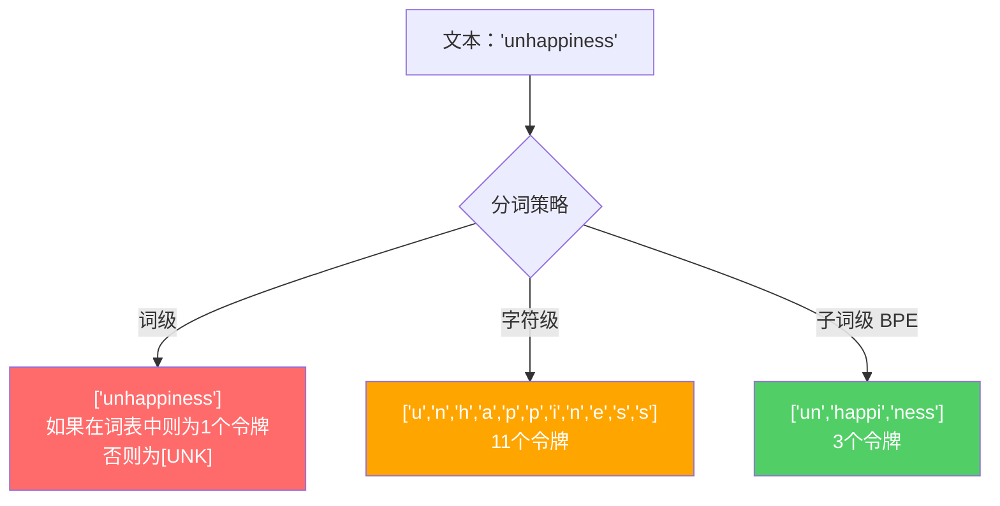
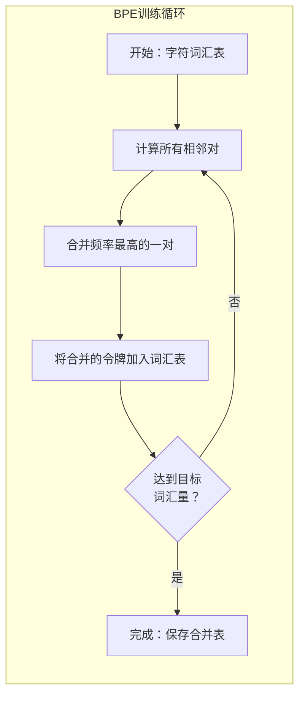
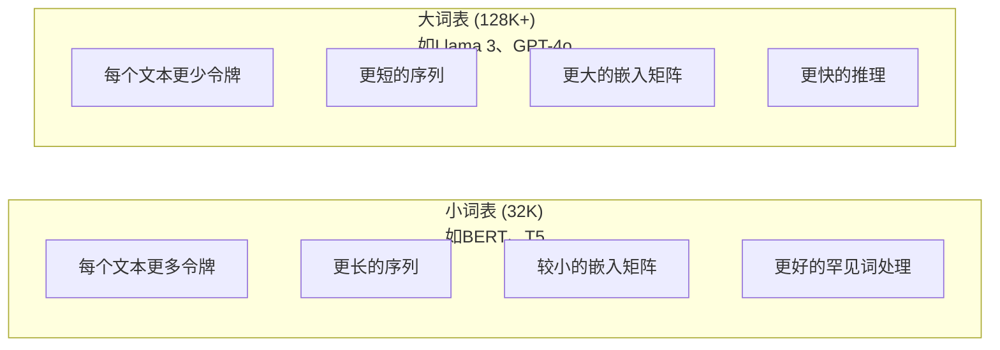

# 分词器：BPE、WordPiece、SentencePiece

> 你的LLM不读英文。它读整数。分词器决定了这些整数是携带意义还是浪费它。

**类型：** 构建
**语言：** Python
**前置条件：** 第五阶段（NLP基础）
**时间：** 约90分钟

## 学习目标

- 从头实现BPE、WordPiece和Unigram分词算法，并比较它们的合并策略
- 解释词汇量大小如何影响模型效率：太小会产生长序列，太大则浪费嵌入参数
- 分析跨语言和代码的分词伪影，识别特定分词器在哪些地方失效
- 使用tiktoken和sentencepiece库对文本进行分词并检查生成的令牌ID

## 问题

你的LLM不读英文。它不读任何语言。它读数字。

"Hello, world!"与[15496, 11, 995, 0]之间的差距就是分词器。每个单词、每个空格、每个标点符号都必须被转换为整数，模型才能处理。这种转换不是中性的。它将假设烘焙到模型中，这些假设以后无法撤销。

搞错了，你的模型会浪费容量去编码常用词为多个令牌。"unfortunately"会变成四个令牌而不是一个。对于多音节词汇密集的文本，你那128K的上下文窗口会缩小75%。搞对了，同样的上下文窗口能容纳两倍的意义。"这个模型处理代码很好"和"这个模型碰到Python就卡壳"之间的区别，往往取决于分词器是如何训练的。

你对GPT-4或Claude的每次API调用都是按令牌计费的。你的模型生成的每个令牌都消耗算力。表示一个输出所需的令牌越少，端到端推理就越快。分词不是预处理。它是架构。

## 概念

### 三种失败的方案（和一种成功的）

将文本转换为数字有三种显而易见的方法。其中两种在规模上不可行。

**词级分词**按空格和标点符号分割。"The cat sat"变成["The", "cat", "sat"]。简单。但"tokenization"呢？或者"GPT-4o"呢？或者像"Geschwindigkeitsbegrenzung"这样的德语复合词呢？词级分词需要一个巨大的词汇表来涵盖所有语言中的每个单词。漏掉一个词，你就会遇到可怕的`[UNK]`令牌——模型表示"我不知道这是什么"的方式。光是英语就有超过一百万种词形。再加上代码、URL、科学符号和100种其他语言，你需要一个无限大的词汇表。

**字符级分词**走另一个方向。"hello"变成["h", "e", "l", "l", "o"]。词汇表很小（几百个字符）。永远不会出现未知令牌。但序列变得非常长。在词级分词中是10个令牌的句子，在字符级分词中变成50个令牌。模型必须学会"t"、"h"、"e"组合在一起意味着"the"——在人类三岁就学会的东西上消耗注意力容量。

**子词级分词**找到了甜点。常用词保持完整："the"是一个令牌。罕见词分解成有意义的片段："unhappiness"变成["un", "happi", "ness"]。词汇表保持可控（30K到128K个令牌）。序列保持短小。未知令牌基本消失，因为任何词都可以由子词片段构建。

每个现代LLM都使用子词级分词。GPT-2、GPT-4、BERT、Llama 3、Claude——全部如此。问题在于选择哪种算法。



### BPE：字节对编码

BPE是一种被重新用于分词的贪婪压缩算法。其思想简单到可以写在一张索引卡上。

从单个字符开始。计算训练语料库中的每一对相邻字符。将频率最高的一对合并为一个新令牌。重复，直到达到目标词汇量大小。

以下是BPE在一个包含单词"lower"、"lowest"和"newest"的小型语料库上的运行过程：

```
语料库（带词频）：
  "lower"  x5
  "lowest" x2
  "newest" x6

第0步 -- 从字符开始：
  l o w e r       (x5)
  l o w e s t     (x2)
  n e w e s t     (x6)

第1步 -- 计算相邻对：
  (e,s): 8    (s,t): 8    (l,o): 7    (o,w): 7
  (w,e): 13   (e,r): 5    (n,e): 6    ...

第2步 -- 合并频率最高的一对 (w,e) -> "we"：
  l o we r        (x5)
  l o we s t      (x2)
  n e we s t      (x6)

第3步 -- 重新计算并合并 (e,s) -> "es"：
  l o we r        (x5)
  l o we s t      (x2)    <- 'es' 仅由 'e'+'s' 形成，不由 'we'+'s' 形成
  n e we s t      (x6)    <- 等等，'we'前面的'e'和'we'后面的's'

更精确地追踪：
  "we"合并后，剩余的字符对：
  (l,o): 7   (o,we): 7   (we,r): 5   (we,s): 8
  (s,t): 8   (n,e): 6    (e,we): 6

第3步 -- 合并 (we,s) -> "wes" 或 (s,t) -> "st"（平行时为8，先选第一个）：
  合并 (we,s) -> "wes"：
  l o we r        (x5)
  l o wes t       (x2)
  n e wes t       (x6)

第4步 -- 合并 (wes,t) -> "west"：
  l o we r        (x5)
  l o west        (x2)
  n e west        (x6)

...继续直到达到目标词汇量。
```

合并表就是分词器。要对新文本进行编码，按学到的顺序应用合并。训练语料库决定存在哪些合并，这个选择永久地塑造了模型看到的东西。



### 字节级BPE（GPT-2、GPT-3、GPT-4）

标准BPE操作在Unicode字符上。字节级BPE操作在原始字节（0-255）上。这给了你一个恰好256的基础词汇表，可以处理任何语言或编码，并且永远不会产生未知令牌。

GPT-2引入了这种方法。基础词汇表覆盖了每一个可能的字节。BPE合并在此基础上构建。OpenAI的tiktoken库实现了字节级BPE，词汇量大小如下：

- GPT-2: 50,257个令牌
- GPT-3.5/GPT-4: ~100,256个令牌（cl100k_base编码）
- GPT-4o: 200,019个令牌（o200k_base编码）

### WordPiece（BERT）

WordPiece看起来与BPE相似，但选择合并的方式不同。它不是基于原始频率，而是最大化训练数据的似然度：

```
BPE合并标准：      count(A, B)
WordPiece合并标准： count(AB) / (count(A) * count(B))
```

BPE问："哪一对出现得最频繁？"WordPiece问："哪一对同时出现的频率比你预期的要高？"这个微妙的差异产生了不同的词汇表。WordPiece偏好那些共现是"意外"的合并，而不只是频繁的合并。

WordPiece还使用"##"前缀表示延续的子词：

```
"unhappiness" -> ["un", "##happi", "##ness"]
"embedding"   -> ["em", "##bed", "##ding"]
```

"##"前缀告诉你这个片段是上一个令牌的延续。BERT使用WordPiece，词汇量为30,522个令牌。每个BERT变体——DistilBERT、RoBERTa的分词器实际上是BPE，但BERT本身是WordPiece。

### SentencePiece（Llama、T5）

SentencePiece将输入视为原始的Unicode字符流，包括空格。没有预分词步骤。没有关于词边界的语言特定规则。这使它真正做到语言无关——它适用于中文、日文、泰文和其他不用空格分隔单词的语言。

SentencePiece支持两种算法：
- **BPE模式**：与标准BPE相同的合并逻辑，应用于原始字符序列
- **Unigram模式**：从一个大的词汇表开始，迭代地删除对整体似然度影响最小的令牌。与BPE相反——是修剪而不是合并。

Llama 2使用SentencePiece BPE，词汇量为32,000个令牌。T5使用SentencePiece Unigram，32,000个令牌。注意：Llama 3切换到了基于tiktoken的字节级BPE分词器，128,256个令牌。

### 词汇量大小的权衡

这是一个具有可测量后果的真正工程决策。



具体数字。对于128K的词汇量和4,096维嵌入，仅嵌入矩阵就有128,000 x 4,096 = 5.24亿个参数。对于32K的词汇量，是1.31亿个参数。仅分词器选择就差了4亿个参数。

但更大的词汇表更积极地压缩文本。同样的英文段落，用32K词汇表需要100个令牌，用128K词汇表可能只需要70个令牌。这意味着生成过程中少了30%的前向传播。对于服务数百万请求的模型来说，这是算力成本的直接减少。

趋势是明确的：词汇量大小在增长。GPT-2使用50,257。GPT-4使用约100K。Llama 3使用128K。GPT-4o使用200K。

| 模型 | 词汇量 | 分词器类型 | 平均每英词令牌数 |
|-------|-----------|----------------|---------------------------|
| BERT | 30,522 | WordPiece | ~1.4 |
| GPT-2 | 50,257 | 字节级BPE | ~1.3 |
| Llama 2 | 32,000 | SentencePiece BPE | ~1.4 |
| GPT-4 | ~100,256 | 字节级BPE | ~1.2 |
| Llama 3 | 128,256 | 字节级BPE (tiktoken) | ~1.1 |
| GPT-4o | 200,019 | 字节级BPE | ~1.0 |

### 多语言税

主要在英文上训练的分词器对其他语言是残酷的。韩语文本在GPT-2的分词器中平均每个词2-3个令牌。中文可能更糟。这意味着一个韩语用户实际上拥有一个英语用户一半大小的上下文窗口——为更少的信息密度支付相同的价格。

这就是为什么Llama 3将其词汇量从32K四倍扩大到128K。更多专用于非英语文字的令牌意味着跨语言更公平的压缩。

## 构建它

### 第1步：字符级分词器

从基础开始。字符级分词器将每个字符映射到其Unicode码点。不需要训练。没有未知令牌。只是直接映射。

```python
class CharTokenizer:
    def encode(self, text):
        # 将每个字符映射到其Unicode码点
        return [ord(c) for c in text]

    def decode(self, tokens):
        # 将码点列表还原为字符串
        return "".join(chr(t) for t in tokens)
```

"hello"变成[104, 101, 108, 108, 111]。每个字符都是自己的令牌。这是我们要改进的基线。

### 第2步：从头实现BPE分词器

真正的实现。我们在原始字节上训练（像GPT-2），计算字符对，合并频率最高的，并按顺序记录每次合并。合并表就是分词器。

```python
from collections import Counter

class BPETokenizer:
    def __init__(self):
        self.merges = {}  # 合并表：token_id对 -> 新token_id
        self.vocab = {}   # 词汇表：token_id -> 字节序列

    def _get_pairs(self, tokens):
        # 统计所有相邻令牌对的频率
        pairs = Counter()
        for i in range(len(tokens) - 1):
            pairs[(tokens[i], tokens[i + 1])] += 1
        return pairs

    def _merge_pair(self, tokens, pair, new_token):
        # 在令牌列表中合并指定的一对
        merged = []
        i = 0
        while i < len(tokens):
            if i < len(tokens) - 1 and tokens[i] == pair[0] and tokens[i + 1] == pair[1]:
                merged.append(new_token)
                i += 2
            else:
                merged.append(tokens[i])
                i += 1
        return merged

    def train(self, text, num_merges):
        # 核心训练循环：从字节开始，重复合并最频繁的对
        tokens = list(text.encode("utf-8"))
        self.vocab = {i: bytes([i]) for i in range(256)}

        for i in range(num_merges):
            pairs = self._get_pairs(tokens)
            if not pairs:
                break
            best_pair = max(pairs, key=pairs.get)
            new_token = 256 + i
            tokens = self._merge_pair(tokens, best_pair, new_token)
            self.merges[best_pair] = new_token
            self.vocab[new_token] = self.vocab[best_pair[0]] + self.vocab[best_pair[1]]

        return self

    def encode(self, text):
        # 编码：按训练顺序应用所有合并
        tokens = list(text.encode("utf-8"))
        for pair, new_token in self.merges.items():
            tokens = self._merge_pair(tokens, pair, new_token)
        return tokens

    def decode(self, tokens):
        # 解码：查找每个令牌ID对应的字节，拼接，解码为UTF-8
        byte_sequence = b"".join(self.vocab[t] for t in tokens)
        return byte_sequence.decode("utf-8", errors="replace")
```

训练循环是BPE的核心：统计对，合并赢家，重复。每次合并减少总令牌数。经过`num_merges`轮后，词汇量从256（基础字节）增长到256 + num_merges。

编码按严格的学到的顺序应用合并。这很重要。如果合并1创建了"th"，合并5创建了"the"，编码必须首先应用合并1，这样"the"才能在合并5中由"th"+"e"形成。

解码是逆过程：在词汇表中查找每个令牌ID，拼接字节，解码为UTF-8。

### 第3步：编码和解码往返

```python
corpus = (
    "The cat sat on the mat. The cat ate the rat. "
    "The dog sat on the log. The dog ate the frog. "
    "Natural language processing is the study of how computers "
    "understand and generate human language. "
    "Tokenization is the first step in any NLP pipeline."
)

tokenizer = BPETokenizer()
tokenizer.train(corpus, num_merges=40)

test_sentences = [
    "The cat sat on the mat.",
    "Natural language processing",
    "tokenization pipeline",
    "unhappiness",
]

for sentence in test_sentences:
    encoded = tokenizer.encode(sentence)
    decoded = tokenizer.decode(encoded)
    raw_bytes = len(sentence.encode("utf-8"))
    ratio = len(encoded) / raw_bytes
    print(f"'{sentence}'")
    print(f"  Tokens: {len(encoded)} (from {raw_bytes} bytes) -- ratio: {ratio:.2f}")
    print(f"  Roundtrip: {'PASS' if decoded == sentence else 'FAIL'}")
```

压缩比告诉你分词器的有效性。0.50的比率意味着分词器将文本压缩到原始字节数一半的令牌数。越低越好。在训练语料库上，压缩比会很好。在分布外文本如"unhappiness"（不出现在语料库中）上，压缩比会更差——分词器对未见过的模式会退回到字符级编码。

### 第4步：与tiktoken比较

```python
import tiktoken

enc = tiktoken.get_encoding("cl100k_base")

texts = [
    "The cat sat on the mat.",
    "unhappiness",
    "Hello, world!",
    "def fibonacci(n): return n if n < 2 else fibonacci(n-1) + fibonacci(n-2)",
    "Geschwindigkeitsbegrenzung",
]

for text in texts:
    our_tokens = tokenizer.encode(text)
    tiktoken_tokens = enc.encode(text)
    tiktoken_pieces = [enc.decode([t]) for t in tiktoken_tokens]
    print(f"'{text}'")
    print(f"  Our BPE:   {len(our_tokens)} tokens")
    print(f"  tiktoken:  {len(tiktoken_tokens)} tokens -> {tiktoken_pieces}")
```

tiktoken使用完全相同的算法，但是在上百GB的文本上训练了100,000次合并。算法是一样的。区别在于训练数据和合并次数。你的分词器在一个段落上用40次合并训练的，无法与tiktoken在巨型语料库上的100K次合并竞争。但机制是一样的。

### 第5步：词汇表分析

```python
def analyze_vocabulary(tokenizer, test_texts):
    total_tokens = 0
    total_chars = 0
    token_usage = Counter()

    for text in test_texts:
        encoded = tokenizer.encode(text)
        total_tokens += len(encoded)
        total_chars += len(text)
        for t in encoded:
            token_usage[t] += 1

    print(f"Vocabulary size: {len(tokenizer.vocab)}")
    print(f"Total tokens across all texts: {total_tokens}")
    print(f"Total characters: {total_chars}")
    print(f"Avg tokens per character: {total_tokens / total_chars:.2f}")

    print(f"\nMost used tokens:")
    for token_id, count in token_usage.most_common(10):
        token_bytes = tokenizer.vocab[token_id]
        display = token_bytes.decode("utf-8", errors="replace")
        print(f"  Token {token_id:4d}: '{display}' (used {count} times)")

    unused = [t for t in tokenizer.vocab if t not in token_usage]
    print(f"\nUnused tokens: {len(unused)} out of {len(tokenizer.vocab)}")
```

这揭示了你词汇表中的Zipf分布。少数令牌占了大多数（空格、"the"、"e"）。大多数令牌很少使用。生产级分词器针对这种分布进行优化——常见模式得到短的令牌ID，罕见模式得到更长的表示。

## 使用它

你的手写BPE可用了。现在看看生产工具是什么样的。

### tiktoken（OpenAI）

```python
import tiktoken

enc = tiktoken.get_encoding("cl100k_base")

text = "Tokenizers convert text to integers"
tokens = enc.encode(text)
print(f"Tokens: {tokens}")
print(f"Pieces: {[enc.decode([t]) for t in tokens]}")
print(f"Roundtrip: {enc.decode(tokens)}")
```

tiktoken用Rust编写，带Python绑定。它每秒编码数百万个令牌。同样的BPE算法，工业级实现。

### Hugging Face tokenizers

```python
from tokenizers import Tokenizer
from tokenizers.models import BPE
from tokenizers.trainers import BpeTrainer
from tokenizers.pre_tokenizers import ByteLevel

tokenizer = Tokenizer(BPE())
tokenizer.pre_tokenizer = ByteLevel()

trainer = BpeTrainer(vocab_size=1000, special_tokens=["<pad>", "<eos>", "<unk>"])
tokenizer.train(["corpus.txt"], trainer)

output = tokenizer.encode("The cat sat on the mat.")
print(f"Tokens: {output.tokens}")
print(f"IDs: {output.ids}")
```

Hugging Face tokenizers库底层也是Rust。它在秒级别在GB级语料库上训练BPE。这是你在训练自己的模型时使用的东西。

### 加载Llama的分词器

```python
from transformers import AutoTokenizer

tokenizer = AutoTokenizer.from_pretrained("meta-llama/Llama-3.1-8B")

text = "Tokenizers are the unsung heroes of LLMs"
tokens = tokenizer.encode(text)
print(f"Token IDs: {tokens}")
print(f"Tokens: {tokenizer.convert_ids_to_tokens(tokens)}")
print(f"Vocab size: {tokenizer.vocab_size}")

multilingual = ["Hello world", "Hola mundo", "Bonjour le monde"]
for text in multilingual:
    ids = tokenizer.encode(text)
    print(f"'{text}' -> {len(ids)} tokens")
```

Llama 3的128K词汇表对非英语文本的压缩显著优于GPT-2的50K词汇表。你可以自己验证——用多种语言编码同一句话，数令牌数。

## 交付

本课产出`outputs/prompt-tokenizer-analyzer.md`——一个可复用的提示词，分析任何文本和模型组合的分词效率。输入一个文本样本，它会告诉你哪个模型的分词器处理得最好。

## 练习

1. 修改BPE分词器，在每一步合并时打印词汇表。观察"t" + "h"如何变成"th"，然后"th" + "e"如何变成"the"。追踪常见英文单词是如何逐步组装的。

2. 向BPE分词器添加特殊令牌（`<pad>`、`<eos>`、`<unk>`）。将它们分配为ID 0、1、2，并相应地移动所有其他令牌。实现在运行BPE之前按空格分割的预分词步骤。

3. 实现WordPiece合并标准（似然比而不是频率）。用相同的合并次数在同一个语料库上训练BPE和WordPiece。比较产生的词汇表——哪个产生更多语言学上有意义的子词？

4. 构建一个多语言分词效率基准。取英语、西班牙语、中文、韩语和阿拉伯语的10个句子。用tiktoken（cl100k_base）对每个句子进行分词，测量每个字符的平均令牌数。量化每种语言的"多语言税"。

5. 在更大的语料库上（下载一篇维基百科文章）训练你的BPE分词器。调整合并次数以达到与tiktoken在相同文本上10%以内的压缩比。这迫使你理解语料库大小、合并次数和压缩质量之间的关系。

## 关键术语

| 术语 | 人们怎么说的 | 它实际上意味着什么 |
|------|----------------|----------------------|
| 令牌（Token） | "一个词" | 模型词汇表中的一个单元——可以是一个字符、子词、单词或多词块 |
| BPE | "某种压缩的东西" | 字节对编码——迭代合并最频繁的相邻令牌对，直到达到目标词汇量 |
| WordPiece | "BERT的分词器" | 类似BPE但合并在最大化似然比count(AB)/(count(A)*count(B))而不是原始频率 |
| SentencePiece | "一个分词器库" | 一种语言无关的分词器，在原始Unicode上操作，无需预分词，支持BPE和Unigram算法 |
| 词汇量大小 | "它知道多少词" | 唯一令牌的总数：GPT-2有50,257，BERT有30,522，Llama 3有128,256 |
| 繁殖率（Fertility） | "不是分词器术语" | 每个词的平均令牌数——衡量跨语言的分词效率（1.0是完美的，3.0意味着模型要三倍努力工作） |
| 字节级BPE | "GPT的分词器" | 在原始字节（0-255）上操作的BPE，而不是Unicode字符，保证任何输入都不会出现未知令牌 |
| 合并表 | "分词器文件" | 训练期间学到的有序的字符对合并列表——这就是分词器，顺序很重要 |
| 预分词 | "按空格分割" | 在子词分词之前应用的规则：空格分割、数字分离、标点处理 |
| 压缩比 | "分词器有多高效" | 产生的令牌数除以输入字节数——越低意味着更好的压缩和更快的推理 |

## 进一步阅读

- [Sennrich et al., 2016 -- "Neural Machine Translation of Rare Words with Subword Units"](https://arxiv.org/abs/1508.07909) -- 将BPE引入NLP的论文，把1994年的压缩算法变成了现代分词的基础
- [Kudo & Richardson, 2018 -- "SentencePiece: A simple and language independent subword tokenizer"](https://arxiv.org/abs/1808.06226) -- 语言无关的分词，使多语言模型实用化
- [OpenAI tiktoken仓库](https://github.com/openai/tiktoken) -- 生产级BPE实现，Rust编写带Python绑定，用于GPT-3.5/4/4o
- [Hugging Face Tokenizers文档](https://huggingface.co/docs/tokenizers) -- 生产级分词器训练，具有Rust性能

---

## 📝 教师备课总结与读后感

### 一、文档整体评价

这是一份优秀的分词器入门文档，从问题出发（"模型只读数字"）而非从定义出发，贯穿了工程师思维。文档将BPE、WordPiece、SentencePiece三种算法放在同一框架下对比，配以可运行的Python代码和具体量化数据（如524M vs 131M参数差异、"多语言税"概念），使抽象概念变得可触达。唯一的遗憾是Unigram算法未给出完整实现，仅作概念性描述。

### 二、知识结构梳理

**基础层（机制）**：三种分词策略的对比（词级→字符级→子词级），BPE训练循环的五步流程（统计对→合并→加入词表→重复），字节级BPE的256基础词汇体系。

**模式层（算法差异）**：BPE（频率驱动）vs WordPiece（似然比驱动）的本质区别，SentencePiece与预分词决策的架构选择，合并表顺序的重要性。

**应用层（工程决策）**：词汇量大小的参数与计算成本权衡，多语言场景下的"公平压缩"问题，tiktoken/HuggingFace等生产级工具的工业实现路径。

### 三、核心洞察

1. **分词不是预处理，是架构**——词汇量选择直接决定嵌入层大小（差400M参数），这是硬架构决策而非可后续调整的超参。

2. **合并顺序即信息**——BPE的合并表不仅存储"哪些对合并"，还存储"以什么顺序合并"。编码时必须严格按此顺序，这是BPE区别于任意序列压缩的核心约束。

3. **"多语言税"是真实的公平性问题**——韩语用户在GPT-2的50K词汇量下上下文窗口的实际利用率只有英语用户的一半，这是隐性歧视，也是Llama 3扩大词表到128K的深层动机。

4. **训练语料库的分布决定了分词器的世界观**——你的分词器在训练语料上压缩得好，在未见过的模式上退化到字符级。这一点在代码、特殊符号、非英语文本上表现得特别明显。

5. **Unigram是"减法"而BPE是"加法"**——这两种思路代表了不同的工程哲学：BPE从零构建，Unigram从全词表修剪。前者的训练是渐进的，后者的训练需要先有大词表再精炼。

6. **Zipf分布是分词器的自然特性**——少数令牌占据绝大多数使用量，这是压缩效率的来源，也是特殊令牌设计（如WordPiece的"##"前缀）需要特别考虑的地方。

7. **字节级BPE消除了[UNK]的概念**——256为基础保证任何输入都能被表示，这是GPT-2系列能处理代码、数学符号和任意Unicode的基础。

### 四、教学建议

1. **开课先展示实际效果**——把同一个句子分别用GPT-2/3/4的分词器编码，让学生肉眼看到同一个"unfortunately"在不同模型下的令牌数差异，建立直观感受后再讲原理。

2. **用"翻译损失"类比"[UNK]"**——如果学生在做翻译，我会说"[UNK]就像你翻译一篇文章时有很多词直接变成空白，信息永久丢失了"。这个类比能帮助理解词表覆盖的严重性。

3. **不要跳过"合并顺序"的讨论**——让学生动手写一个小脚本，交换两个合并的顺序，验证编码结果不同。只有亲身体验到"顺序出错则编码不一致"，学生才会真正理解为什么合并表要先训练后冻结。

4. **用对比实验讲词汇量权衡**——分别用32K和128K词表对中英文混合文本做分词统计，让学生计算出"每个语言的实际上下文窗口"，把抽象的数字变成具体的"你能装几页论文"的直观理解。

5. **强调"冻结"概念**——合并表训练后不能再改，这个"冻结"是生产系统中一个容易被忽略但极其重要的约束。更新分词器意味着重新训练模型。

6. **预留时间讲生产实践**——tiktoken的Rust实现、HuggingFace的tokenizers库、fast vs slow tokenizer的区别，这些都是学生在实际工作中会立刻遇到的东西。

7. **将"多语言税"作为讨论环节引发思考**——问学生："如果50%的用户是非英语母语者，你会如何设计分词器？"这会引发关于公平与效率的深层讨论。

### 五、值得补充的内容

1. **Unigram算法的完整实现**——从大型种子词表开始的迭代修剪过程，包括损失函数和剪枝策略，这个算法在T5和部分Llama变体中被使用，值得补充代码。

2. **分词器在推理时的优化技巧**——包括缓存、批量编码、padding策略、attention mask与真实序列长度的关系等。

3. **特殊令牌的系统分类**——不仅仅是`<pad>/<eos>/<unk>`，还包括BOS、SEP、CLS、im_start/im_end等ChatML令牌的来源和设计哲学。

4. **中文分词的特殊挑战**——中文没有天然的空格分隔，CJK字符在Unicode中的编码特性，以及为什么2-4字节的UTF-8编码对中文不公平。

5. **未来趋势讨论**——pixel-based model（如Gemini的原生多模态）、多模态分词器、以及"是否可能完全不需要分词器"的开放问题。

### 六、一句话总结

分词器是LLM的第一道关卡——它在你还不知道的时候，就决定了你的模型能看到多大的世界以及以什么样的颗粒度去看。

---

# 🎓 Agent 架构课：分词器——你模型的第一道门，也是最后一道锁

**副标题：为什么当你把"unhappiness"喂给GPT的时候，它已经输了**

---

你想过没有：你写了2000个字的prompt，GPT告诉你这是3100个令牌。多出来的1100个令牌是哪里来的？它们没有携带新的信息，它们是分词器强加给你的税收。你支付的是看不见的浪费。

我今天不跟你讲BPE的伪代码——网上教程千篇一律。我跟你讲的是：你作为一个Agent系统的设计者，分词器应该买什么样的，以及买错了你要赔多少钱。

---

### 问题本质：分词器是你"租的上下文窗口"的房东

你向OpenAI买的是上下文窗口，但你到手的东西是被分词器打了折扣的。128K上下文窗口听起来很多，约等于200页小说。但如果你的用户用韩语提问，他实际能用到的"有效窗口"只有64K。为什么？因为韩语每个词的令牌数是英语的2-3倍。

我生产环境中处理印尼语用户时发现：同样的对话历史，印尼语用户比英语用户早25%触发截断逻辑。这不是我的prompt engineering问题，这是GPT-2时代分词器欠下的债。Llama 3把词表翻到128K，不是因为他们喜欢更大的数字——是他们在印尼、泰国、中东这些市场发现，用户留存率跟"有效上下文窗口"线性相关。

我在乎什么：我在乎我的用户在不知道的情况下被收了隐形税。这会影响我的产品留存，但我没法给用户说"抱歉，你的语言比较贵"。

---

### 两条路径：共享分词器 vs 自训练分词器

**路线A：用预训练模型自带的分词器。** 你做fine-tuning、做Agent系统、做RAG pipeline。你什么都不用改，拿来即用。这是99%的人走的路。这条路的问题是：你继承了这个分词器的所有偏见、所有效率缺陷、所有历史包袱。GPT-2的50K词表就是你的天花板。

**路线B：自训练分词器然后从头预训练。** 你有特定领域的语料——医学、法律、金融、或者小语种。你愿意花几十万美元和几周时间。你从头构建一切。这条路能让你在垂直领域获得15-30%的压缩率提升——相当于免费获得15-30%的上下文窗口。

我99.9%的情况下选A。原因很简单：我不需要为0.01%的应用场景花几百万训练分词器+重训模型。但有一个例外——当我的Agent系统的核心功能受限于"上下文窗口不够"的时候，我就认真算一笔账：多花30万美元训练，能不能省下30万美元的API调用费？

在字节级BPE已成为工业标准的2024年，答案通常是"不能"。但十年前答案可能是"能"，五年前可能是"不确定"。你现在不需要纠结，但你需要知道这个等式存在。

---

### 深入原理：为什么合并表是"一次性写入"的

BPE的分词器训练是一个有向无环的过程。每次合并都是不可逆的。一旦"we"被合并为一个令牌，你就不能再把"w"和"e"当作独立的来处理。这像在你建一栋楼的时候把某些砖块浇筑在一起——浇筑了就分不开了。

这对Agent系统的意义是什么？这意味着你的分词器是"冻结的架构"。所有后续的模型层——嵌入层、注意力层、FFN——都建立在这个冻结的基础上。你不能在训练到一半时换分词器，就像你不能在盖到12楼时换地基。

这个"冻结"有好处也有坏处。好处是它提供了确定性——同样的输入永远产生同样的令牌序列。坏处是它的错误是永久性的。如果你的分词器把中药名称"黄芪"切成三个毫无医学意义的子词，那么模型从嵌入层开始就看不到"黄芪"作为一个完整概念。你的RAG系统检索到"黄芪"相关文档，但模型的tokenizer已经把这个信息碎片化了。

我在乎什么：我在乎我的Agent能否"理解"它检索到的信息。如果分词器在第一步就把信息碎片化，那么更好的提示工程、更好的RAG架构、更好的fine-tuning都只是在废墟上装修。

---

### 生产数字

- BERT的30K词表：每个英文词平均消耗1.4个令牌。中文约2.5个。德语约2.1个。
- GPT-4o的200K词表：每个英文词平均消耗1.0个令牌。中文约1.4个。德语约1.2个。
- tiktoken在A100上：~200MB/s的编码吞吐。不够用的时候切到批量API，100x提升。
- 一个典型的Agent系统（10轮对话，每轮500令牌）：GPT-2词表=约7,000输入令牌，GPT-4o词表=约5,000输入令牌。节省~28%。乘以100万次调用=节省可观的账单。
- 分词器训练成本（在10GB语料上）：HuggingFace tokenizers库，单CPU核，约3分钟训练32K词表。这是所有LLM相关组件中最便宜的训练步骤。

---

### 反模式：我见过最蠢的分词器使用方式

**反模式1："我用GPT-2的分词器来处理中文客服对话"**
不要这样做。GPT-2的分词器在中文上每个字符平均1.8个令牌。10个中文字=18个令牌。"你好，我想退款"=约12令牌。而GPT-4o的分词器只需要约6个。你白白浪费了50%的上下文窗口。如果你在做中文产品，你必须使用支持中文的词表（至少64K以上）。

**反模式2："我在生产环境和训练环境用了不同的分词器"**
这是灾难。模型期望看到特定的令牌序列。换个分词器，同样的文本变成了完全不同的数字序列。模型看到的是一种"外语"。它学过的模式全部对不上。我第一次犯这个错误的时候，困惑了三小时为什么模型的perplexity翻倍了。

**反模式3："特殊令牌随便加，不加也没关系"**
特殊令牌（`<|im_start|>`、`<|im_end|>`、BOS、EOS）不是你prompt里的装饰文字。它们是分词器词汇表里的特殊ID，占用了token空间，在训练和推理中有特定的语义。如果你在微调时添加了`<tool_call>`令牌但在推理时用了原始词表的分词器，模型永远看不到这个令牌——它看到的是[UNK]或者被切成四五个字节碎片。

---

### 结语清单

1. **分词器是买定离手的**——选定了就不能换，除非重新训练模型。多花一个小时测试，省下几个月后悔。
2. **"词汇量"不是越大越好**——32K词表参数开销小，128K词表上下文效率高。根据你的目标语言和计算预算选，别盲目追大。
3. **检查多语言成本**——如果你的用户语言分布是40%英语、30%中文、30%印尼语，计算加权平均的"有效上下文窗口"，而不是只看英语的性能。
4. **特殊令牌是架构的一部分**——它们的ID、位置、处理方式都影响模型行为。在系统设计文档里明确定义。
5. **tiktoken不是唯一选择**——HuggingFace的tokenizers更快（Rust）、更灵活（支持自定义normalizer/pre-tokenizer）、更适合自训练场景。

---

**金句：** "你的模型永远不会比它的分词器看得更细。分词器是模型的视网膜——视网膜的杆细胞只会数数量，锥细胞才能分辨颜色。选对你的锥细胞密度。"
