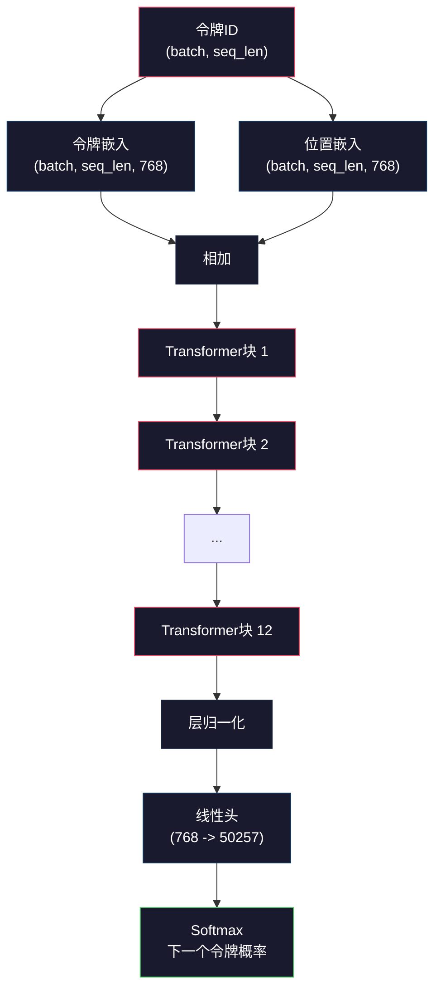
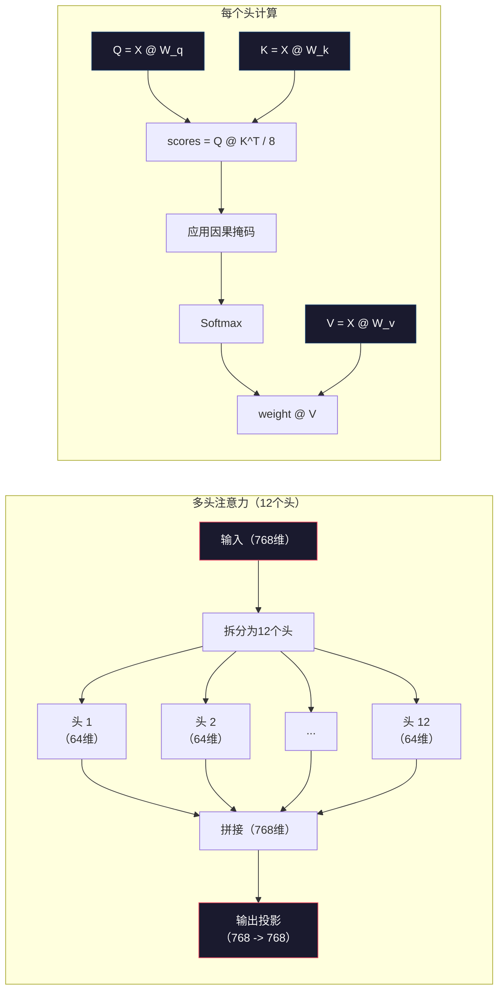
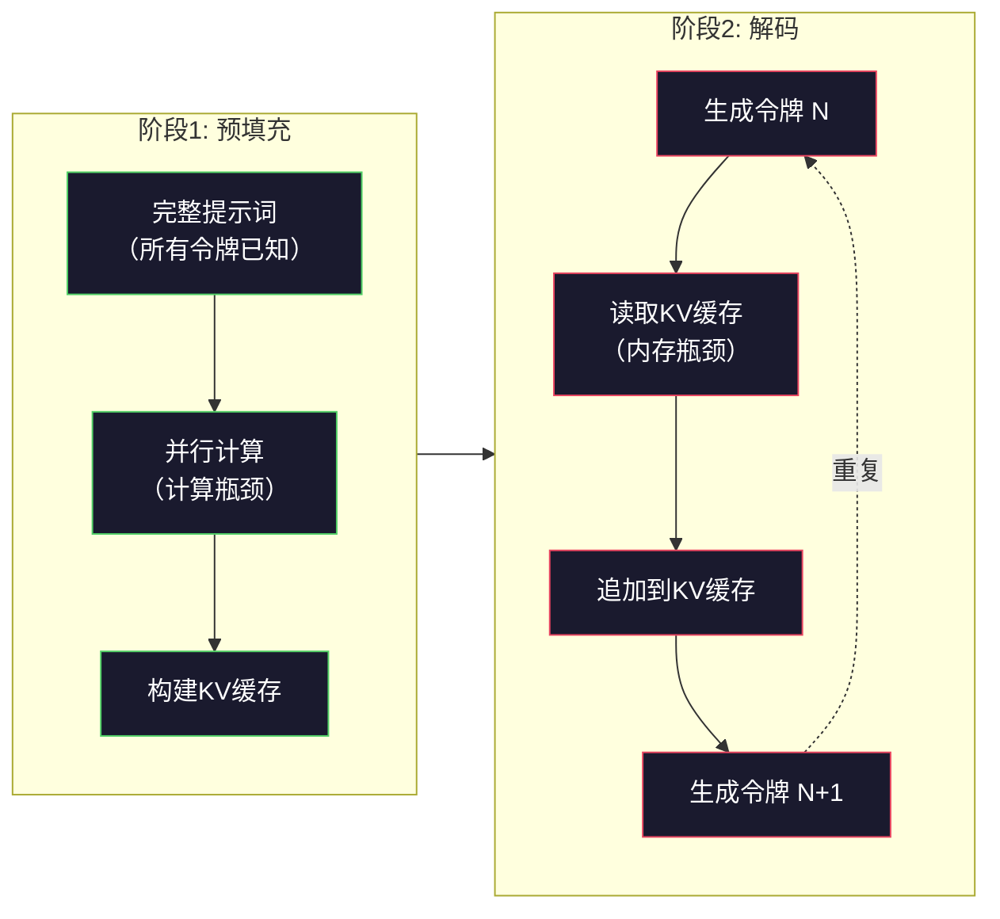

# 预训练一个Mini GPT（1.24亿参数）

> GPT-2 Small有1.24亿个参数。那是12层Transformer、12个注意力头和768维嵌入。你可以在单个GPU上用几小时从头训练它。大多数人从来没这样做过。他们用预训练检查点。但如果你没有自己训练过一个，你并没有真正理解你构建产品所依赖的模型的内部是什么。

**类型：** 构建
**语言：** Python（使用numpy）
**前置条件：** 第十阶段，第01-03课（分词器、构建分词器、数据流水线）
**时间：** 约120分钟

## 学习目标

- 从头实现完整的GPT-2架构（1.24亿参数）：令牌嵌入、位置嵌入、Transformer块和语言模型头
- 使用下一个令牌预测和交叉熵损失在文本语料库上训练GPT模型
- 实现带温度采样和top-k/top-p过滤的自回归文本生成
- 监控训练损失曲线并验证模型学习到连贯的语言模式

## 问题

你知道什么是Transformer。你看过那些图。你可以背诵"注意力就是你所需要的一切"，并在白板上画标有"多头注意力"的方框。

这些都不意味着你理解模型生成文本时发生了什么。

GPT-2 Small有124,438,272个参数（带权重绑定）。每一个都是通过运行训练循环来设置的：前向传播，计算损失，反向传播，更新权重。十二个Transformer块。每个块十二个注意力头。一个768维的嵌入空间。一个50,257个令牌的词汇表。每次模型生成一个令牌时，所有1.24亿个参数都参与到一个单一的矩阵乘法链中，该链接受一个令牌ID序列并产生一个关于下一个令牌的概率分布。

如果你从未亲手构建过这个，你就是在使用一个黑盒。你可以用API。你可以微调。但当问题出现时——当模型产生幻觉，当它自我重复，当它拒绝遵循指令——你对*为什么*没有心智模型。

这节课用numpy从头构建GPT-2 Small。不是在PyTorch里。每个矩阵乘法都是可见的。每个梯度都由你的代码计算。你将确切地看到1.24亿个数字是如何合谋预测下一个词的。

## 概念

### GPT架构

GPT是一个自回归语言模型。"自回归"意味着它一次生成一个令牌，每个令牌都以前面所有令牌为条件。架构是一堆Transformer解码器块。

这是从令牌ID到下一个令牌概率的完整计算图：

1. 令牌ID进入。形状：(batch_size, seq_len)。
2. 令牌嵌入查找。每个ID映射到一个768维的向量。形状：(batch_size, seq_len, 768)。
3. 位置嵌入查找。每个位置（0, 1, 2, ...）映射到一个768维的向量。同样的形状。
4. 将令牌嵌入+位置嵌入相加。
5. 通过12个Transformer块。
6. 最终的层归一化。
7. 线性投影到词汇量大小。形状：(batch_size, seq_len, vocab_size)。
8. Softmax得到概率。

这就是整个模型。没有卷积。没有递归。只有嵌入、注意力、前馈网络和层归一化，堆叠12次。



### Transformer块

12个块中的每一个都遵循相同的模式。前置归一化架构（GPT-2使用前置归一化，而不是像原始Transformer那样的后置归一化）：

1. 层归一化
2. 多头自注意力
3. 残差连接（把输入加回去）
4. 层归一化
5. 前馈网络（FFN / MLP）
6. 残差连接（把输入加回去）

残差连接是关键的。没有它们，梯度在反向传播到达第1块时就会消失。有它们，梯度可以直接从损失通过"跳跃"路径流向任何层。这就是为什么你可以堆叠12层、32层，甚至96层（据传GPT-4使用了120层）。

### 注意力：核心机制

自注意力让每个令牌能查看之前的每个令牌，并决定对每个令牌投入多少注意力。这是其中的数学。

对每个令牌位置，从输入计算三个向量：
- **查询（Q）**："我在找什么？"
- **键（K）**："我包含什么？"
- **值（V）**："我携带什么信息？"

```
Q = input @ W_q    (768 -> 768)
K = input @ W_k    (768 -> 768)
V = input @ W_v    (768 -> 768)

attention_scores = Q @ K^T / sqrt(d_k)
attention_scores = mask(attention_scores)   # 因果掩码：未来位置设为 -inf
attention_weights = softmax(attention_scores)
output = attention_weights @ V
```

因果掩码是使GPT成为自回归模型的原因。位置5可以关注位置0-5，但不能关注6、7、8等。这防止了模型在训练时通过"偷看"未来令牌来作弊。

**多头注意力**将768维空间拆分为12个头，每个头64维。每个头学习不同的注意力模式。一个头可能追踪句法关系（主谓一致）。另一个可能追踪语义相似性（同义词）。另一个可能追踪位置邻近性（邻近词）。所有12个头的输出被拼接并投影回768维。



除以sqrt(d_k)——sqrt(64) = 8——是缩放。没有它，点积在高维向量下会变得很大，把softmax推进梯度几乎为零的区域。这是原始"Attention Is All You Need"论文中的关键洞察之一。

### KV缓存：为什么推理快

在训练期间，你一次处理整个序列。在推理期间，你一次生成一个令牌。没有优化的话，生成令牌N需要对所有N-1个之前的令牌重新计算注意力。每个生成令牌是O(N^2)，总序列长度为N时是O(N^3)。

KV缓存解决了这个问题。计算每个令牌的K和V后，存储它们。生成令牌N+1时，只需要计算新令牌的Q并从所有之前的令牌查找缓存的K和V。这将K和V计算的每个令牌成本从O(N)降低到O(1)。注意力分数计算仍然是O(N)，因为你要关注所有之前的位置，但避免了输入上的冗余矩阵乘法。

对于GPT-2，有12层和12个头，KV缓存存储2（K+V）x 12层 x 12头 x 64维 = 每个令牌18,432个值。对于1024令牌的序列，FP32下约为75MB。对于具有128层的Llama 3 405B，单个序列的KV缓存可以超过10GB。这就是为什么长上下文推理是内存瓶颈的。

### 预填充与解码：推理的两个阶段

当你向LLM发送提示时，推理发生在两个不同的阶段。

**预填充**并行处理你的整个提示词。所有令牌已知，因此模型可以同时计算所有位置的注意力。这个阶段是计算瓶颈的——GPU以满吞吐量进行矩阵乘法。对于A100上的1000令牌提示，预填充大约需要20-50毫秒。

**解码**一次生成一个令牌。每个新令牌依赖于之前的所有令牌。这个阶段是内存瓶颈的——瓶颈是从GPU内存读取模型权重和KV缓存，而不是矩阵运算本身。GPU的计算核心大多闲着等待内存读取。对于GPT-2，每个解码步骤需要大约相同的时间，不管matmul需要多少FLOPs，因为内存带宽是约束。

这个区别对生产系统很重要。预填充吞吐量随GPU计算能力（更多FLOPs = 更快的预填充）增长。解码吞吐量随内存带宽（更快的内存 = 更快的解码）增长。这就是为什么NVIDIA的H100相比A100重点改进了内存带宽——它直接加速了令牌生成。



### 训练循环

训练LLM就是下一个令牌预测。给定令牌[0, 1, 2, ..., N-1]，预测令牌[1, 2, 3, ..., N]。损失函数是模型预测的概率分布与实际下一个令牌之间的交叉熵。

一个训练步骤：

1. **前向传播**：将批次通过所有12个块。得到每个位置的对数值（pre-softmax scores）。
2. **计算损失**：对数值与目标令牌之间的交叉熵（输入向前移动一个位置）。
3. **反向传播**：使用反向传播计算所有1.24亿个参数的梯度。
4. **优化器步骤**：更新权重。GPT-2使用带有学习率预热和余弦衰减的Adam。

学习率调度比你想象的要重要。GPT-2在前2,000步内从0预热到峰值学习率，然后沿着余弦曲线衰减。以高学习率开始会导致模型发散。在后期保持恒定的高速率会导致震荡。预热然后衰减的模式被每个主要LLM所采用。

### GPT-2 Small：数字一览

| 组件 | 形状 | 参数数 |
|-----------|-------|------------|
| 令牌嵌入 | (50257, 768) | 38,597,376 |
| 位置嵌入 | (1024, 768) | 786,432 |
| 每个块的注意力 (W_q, W_k, W_v, W_out) | 4 x (768, 768) | 2,359,296 |
| 每个块的FFN (up + down) | (768, 3072) + (3072, 768) | 4,718,592 |
| 每个块的LayerNorm (2x) | 2 x 768 x 2 | 3,072 |
| 最终LayerNorm | 768 x 2 | 1,536 |
| **每个块总计** | | **7,080,960** |
| **总计（12个块）** | | **85,054,464 + 39,383,808 = 124,438,272** |

输出投影（对数值头）与令牌嵌入矩阵共享权重。这称为权重绑定——它将参数数减少了38M，并因为强制模型对输入和输出使用相同的表示空间而提高了性能。

## 构建它

### 第1步：嵌入层

令牌嵌入将50,257个可能的令牌中的每一个映射到一个768维的向量。位置嵌入添加关于每个令牌在序列中位置的信息。两者相加。

```python
import numpy as np

class Embedding:
    def __init__(self, vocab_size, embed_dim, max_seq_len):
        # 初始化令牌嵌入和位置嵌入
        self.token_embed = np.random.randn(vocab_size, embed_dim) * 0.02
        self.pos_embed = np.random.randn(max_seq_len, embed_dim) * 0.02

    def forward(self, token_ids):
        # 前向传播：查找令牌嵌入和位置嵌入，然后相加
        seq_len = token_ids.shape[-1]
        tok_emb = self.token_embed[token_ids]
        pos_emb = self.pos_embed[:seq_len]
        return tok_emb + pos_emb
```

初始化的0.02标准差来自GPT-2论文。太大，初始前向传播会产生极端值，破坏训练的稳定性。太小，初始输出对所有输入几乎相同，使早期梯度信号无用。

### 第2步：带因果掩码的自注意力

首先是单头注意力。因果掩码在softmax之前将未来位置设置为负无穷，确保每个位置只能关注自身和更早的位置。

```python
def attention(Q, K, V, mask=None):
    d_k = Q.shape[-1]
    # 缩放点积注意力
    scores = Q @ K.transpose(0, -1, -2 if Q.ndim == 4 else 1) / np.sqrt(d_k)
    if mask is not None:
        scores = scores + mask  # 未来位置变为 -inf
    # 数值稳定的softmax：先减去最大值再exp
    weights = np.exp(scores - scores.max(axis=-1, keepdims=True))
    weights = weights / weights.sum(axis=-1, keepdims=True)
    return weights @ V
```

softmax实现先减去最大值再指数化。没有这一步，exp(大数)会溢出到无穷。这是一个数值稳定性技巧，不会改变输出，因为对于任意常数c，softmax(x - c) = softmax(x)。

### 第3步：多头注意力

将768维输入拆分为12个头，每个头64维。每个头独立计算注意力。拼接结果并投影回768维。

```python
class MultiHeadAttention:
    def __init__(self, embed_dim, num_heads):
        self.num_heads = num_heads
        self.head_dim = embed_dim // num_heads
        # 初始化 Q、K、V 和输出投影矩阵
        self.W_q = np.random.randn(embed_dim, embed_dim) * 0.02
        self.W_k = np.random.randn(embed_dim, embed_dim) * 0.02
        self.W_v = np.random.randn(embed_dim, embed_dim) * 0.02
        self.W_out = np.random.randn(embed_dim, embed_dim) * 0.02

    def forward(self, x, mask=None):
        batch, seq_len, d = x.shape
        # 投影并重塑为多头：(batch, seq_len, d) -> (batch, heads, seq_len, head_dim)
        Q = (x @ self.W_q).reshape(batch, seq_len, self.num_heads, self.head_dim).transpose(0, 2, 1, 3)
        K = (x @ self.W_k).reshape(batch, seq_len, self.num_heads, self.head_dim).transpose(0, 2, 1, 3)
        V = (x @ self.W_v).reshape(batch, seq_len, self.num_heads, self.head_dim).transpose(0, 2, 1, 3)

        # 缩放点积注意力（每个头独立计算）
        scores = Q @ K.transpose(0, 1, 3, 2) / np.sqrt(self.head_dim)
        if mask is not None:
            scores = scores + mask
        weights = np.exp(scores - scores.max(axis=-1, keepdims=True))
        weights = weights / weights.sum(axis=-1, keepdims=True)
        attn_out = weights @ V

        # 重塑回原始形状：(batch, heads, seq_len, head_dim) -> (batch, seq_len, d)
        attn_out = attn_out.transpose(0, 2, 1, 3).reshape(batch, seq_len, d)
        return attn_out @ self.W_out
```

reshape-transpose-reshape的舞蹈是多头注意力中最令人困惑的部分。这是发生的事情：(batch, seq_len, 768)张量变成(batch, seq_len, 12, 64)，然后变成(batch, 12, seq_len, 64)。现在12个头中的每一个都有自己的(seq_len, 64)矩阵来运行注意力。注意力计算完之后，我们反转这个过程：(batch, 12, seq_len, 64)变成(batch, seq_len, 12, 64)变成(batch, seq_len, 768)。

### 第4步：Transformer块

一个完整的Transformer块：LayerNorm、带残差的多头注意力、LayerNorm、带残差的前馈网络。

```python
class LayerNorm:
    def __init__(self, dim, eps=1e-5):
        self.gamma = np.ones(dim)   # 可学习的缩放
        self.beta = np.zeros(dim)   # 可学习的偏移
        self.eps = eps

    def forward(self, x):
        mean = x.mean(axis=-1, keepdims=True)
        var = x.var(axis=-1, keepdims=True)
        return self.gamma * (x - mean) / np.sqrt(var + self.eps) + self.beta


class FeedForward:
    def __init__(self, embed_dim, ff_dim):
        # FFN：扩展4倍再投影回来
        self.W1 = np.random.randn(embed_dim, ff_dim) * 0.02
        self.b1 = np.zeros(ff_dim)
        self.W2 = np.random.randn(ff_dim, embed_dim) * 0.02
        self.b2 = np.zeros(embed_dim)

    def forward(self, x):
        h = x @ self.W1 + self.b1
        h = np.maximum(0, h)  # GELU近似：为简单起见使用ReLU
        return h @ self.W2 + self.b2


class TransformerBlock:
    def __init__(self, embed_dim, num_heads, ff_dim):
        self.ln1 = LayerNorm(embed_dim)
        self.attn = MultiHeadAttention(embed_dim, num_heads)
        self.ln2 = LayerNorm(embed_dim)
        self.ffn = FeedForward(embed_dim, ff_dim)

    def forward(self, x, mask=None):
        # 前置归一化：注意力 + 残差，然后FFN + 残差
        x = x + self.attn.forward(self.ln1.forward(x), mask)
        x = x + self.ffn.forward(self.ln2.forward(x))
        return x
```

前馈网络将768维输入扩展到3,072维（4倍），应用非线性，然后投影回768维。这种扩展-收缩模式给模型在每个位置上提供了一个"更宽"的内部表示来工作。GPT-2使用GELU激活函数，但这里为了简单使用ReLU——对于理解架构而言差别很小。

### 第5步：完整的GPT模型

堆叠12个Transformer块。前面加嵌入层，后面加输出投影。

```python
class MiniGPT:
    def __init__(self, vocab_size=50257, embed_dim=768, num_heads=12,
                 num_layers=12, max_seq_len=1024, ff_dim=3072):
        self.embedding = Embedding(vocab_size, embed_dim, max_seq_len)
        self.blocks = [
            TransformerBlock(embed_dim, num_heads, ff_dim)
            for _ in range(num_layers)
        ]
        self.ln_f = LayerNorm(embed_dim)
        self.vocab_size = vocab_size
        self.embed_dim = embed_dim

    def forward(self, token_ids):
        seq_len = token_ids.shape[-1]
        # 因果掩码：上三角矩阵（-inf），防止关注未来令牌
        mask = np.triu(np.full((seq_len, seq_len), -1e9), k=1)

        x = self.embedding.forward(token_ids)
        for block in self.blocks:
            x = block.forward(x, mask)
        x = self.ln_f.forward(x)

        # 权重绑定：输出投影重用令牌嵌入矩阵（转置）
        logits = x @ self.embedding.token_embed.T
        return logits

    def count_parameters(self):
        total = 0
        total += self.embedding.token_embed.size
        total += self.embedding.pos_embed.size
        for block in self.blocks:
            total += block.attn.W_q.size + block.attn.W_k.size
            total += block.attn.W_v.size + block.attn.W_out.size
            total += block.ffn.W1.size + block.ffn.b1.size
            total += block.ffn.W2.size + block.ffn.b2.size
            total += block.ln1.gamma.size + block.ln1.beta.size
            total += block.ln2.gamma.size + block.ln2.beta.size
        total += self.ln_f.gamma.size + self.ln_f.beta.size
        return total
```

注意权重绑定：`logits = x @ self.embedding.token_embed.T`。输出投影重用了令牌嵌入矩阵（转置）。这不只是一个节省参数的技巧。这意味着模型对理解令牌（嵌入）和预测它们（输出）使用相同的向量空间。

### 第6步：训练循环

对于一个在1.24亿参数上的真正训练运行，你需要一个GPU和PyTorch。这个训练循环在一个运行在纯numpy中的小模型上演示机制。我们使用一个小模型（4层，4头，128维）使其可行。

```python
def cross_entropy_loss(logits, targets):
    batch, seq_len, vocab_size = logits.shape
    logits_flat = logits.reshape(-1, vocab_size)
    targets_flat = targets.reshape(-1)

    # 数值稳定的log_softmax
    max_logits = logits_flat.max(axis=-1, keepdims=True)
    log_softmax = logits_flat - max_logits - np.log(
        np.exp(logits_flat - max_logits).sum(axis=-1, keepdims=True)
    )

    # 交叉熵：-log(正确令牌的概率)
    loss = -log_softmax[np.arange(len(targets_flat)), targets_flat].mean()
    return loss


def train_mini_gpt(text, vocab_size=256, embed_dim=128, num_heads=4,
                   num_layers=4, seq_len=64, num_steps=200, lr=3e-4):
    tokens = np.array(list(text.encode("utf-8")[:2048]))
    model = MiniGPT(
        vocab_size=vocab_size, embed_dim=embed_dim, num_heads=num_heads,
        num_layers=num_layers, max_seq_len=seq_len, ff_dim=embed_dim * 4
    )

    print(f"Model parameters: {model.count_parameters():,}")
    print(f"Training tokens: {len(tokens):,}")
    print(f"Config: {num_layers} layers, {num_heads} heads, {embed_dim} dims")
    print()

    for step in range(num_steps):
        # 随机采样一个训练窗口
        start_idx = np.random.randint(0, max(1, len(tokens) - seq_len - 1))
        batch_tokens = tokens[start_idx:start_idx + seq_len + 1]

        # 输入 = 除最后一个令牌外的所有，目标 = 除第一个令牌外的所有
        input_ids = batch_tokens[:-1].reshape(1, -1)
        target_ids = batch_tokens[1:].reshape(1, -1)

        logits = model.forward(input_ids)
        loss = cross_entropy_loss(logits, target_ids)

        if step % 20 == 0:
            print(f"Step {step:4d} | Loss: {loss:.4f}")

    return model
```

损失从ln(vocab_size)附近开始——对于256令牌的字节级词汇表，即ln(256) = 5.55。一个随机模型将相等的概率分配给每个令牌。随着训练的进行，损失下降因为模型学会了预测常见模式："t"后面的"h"，句号后的空格等。

在生产中，你会使用Adam优化器配合梯度累积、学习率预热和梯度裁剪。前向-损失-反向-更新的循环是完全相同的。优化器更加复杂。

### 第7步：文本生成

生成使用训练好的模型一次预测一个令牌。每个预测从输出分布中采样（或者贪婪地取argmax）。

```python
def generate(model, prompt_tokens, max_new_tokens=100, temperature=0.8):
    tokens = list(prompt_tokens)
    seq_len = model.embedding.pos_embed.shape[0]

    for _ in range(max_new_tokens):
        # 限制到模型的上下文窗口
        context = np.array(tokens[-seq_len:]).reshape(1, -1)
        logits = model.forward(context)
        next_logits = logits[0, -1, :]  # 只看最后一个位置的预测

        # 温度缩放然后采样
        next_logits = next_logits / temperature
        probs = np.exp(next_logits - next_logits.max())
        probs = probs / probs.sum()

        next_token = np.random.choice(len(probs), p=probs)
        tokens.append(next_token)

    return tokens
```

温度控制随机性。温度1.0使用原始分布。温度0.5锐化它（更确定性——模型更频繁地选择其首选）。温度1.5扁平化它（更随机——低概率令牌获得更大的机会）。温度0.0是贪婪解码（总是选择概率最高的令牌）。

`tokens[-seq_len:]`窗口是必要的，因为模型有最大上下文长度（GPT-2为1024）。一旦超过它，你必须丢弃最旧的令牌。这就是每个人都在谈论的"上下文窗口"。

## 使用它

### 完整的训练和生成演示

```python
corpus = """The transformer architecture has revolutionized natural language processing.
Attention mechanisms allow the model to focus on relevant parts of the input.
Self-attention computes relationships between all pairs of positions in a sequence.
Multi-head attention splits the representation into multiple subspaces.
Each attention head can learn different types of relationships.
The feedforward network provides nonlinear transformations at each position.
Residual connections enable gradient flow through deep networks.
Layer normalization stabilizes training by normalizing activations.
Position embeddings give the model information about token ordering.
The causal mask ensures autoregressive generation during training.
Pre-training on large text corpora teaches the model general language understanding.
Fine-tuning adapts the pre-trained model to specific downstream tasks."""

model = train_mini_gpt(corpus, num_steps=200)

prompt = list("The transformer".encode("utf-8"))
output_tokens = generate(model, prompt, max_new_tokens=100, temperature=0.8)
generated_text = bytes(output_tokens).decode("utf-8", errors="replace")
print(f"\nGenerated: {generated_text}")
```

在小语料库上用一个小模型，生成的文本最多是半连贯的。它会从训练文本中学到一些字节级模式，但不能像GPT-2用40GB训练数据和完整的1.24亿参数架构那样泛化。重点不是输出质量。重点是你可以追踪每一步：嵌入查找、注意力计算、前馈变换、对数值投影、softmax和采样。每一个操作都是可见的。

## 交付

本课产出`outputs/prompt-gpt-architecture-analyzer.md`——一个分析任何GPT风格模型架构选择的提示词。输入一个模型卡或技术报告，它会分解参数分配、注意力设计和扩展决策。

## 练习

1. 修改模型为24层和16个头代替12/12。计算参数数。将深度加倍与宽度加倍（嵌入维度）比较有何不同？

2. 实现GELU激活函数（GELU(x) = x * 0.5 * (1 + erf(x / sqrt(2)))）并替换前馈网络中的ReLU。用每种激活运行500步训练并比较最终损失。

3. 向生成函数添加KV缓存。在第一次前向传播后存储每层的K和V张量，并在后续令牌中重用它们。测量加速：用和不带缓存各生成200个令牌，比较墙钟时间。

4. 实现top-k采样（只考虑k个概率最高的令牌）和top-p采样（核采样：考虑累积概率超过p的最小令牌集合）。比较温度0.8下top-k=50 vs top-p=0.95的输出质量。

5. 构建一个训练损失曲线绘图器。训练模型1000步并绘制损失vs步数的图。识别三个阶段：快速初始下降（学习常见字节）、较慢的中期（学习字节模式）和平稳期（在小语料库上过拟合）。无论你训练的是128维模型还是GPT-4，这条曲线的形状都是一样的。

## 关键术语

| 术语 | 人们怎么说的 | 它实际上意味着什么 |
|------|----------------|----------------------|
| 自回归（Autoregressive） | "它一次生成一个词" | 每个输出令牌以前面所有令牌为条件——模型预测P(token_n \| token_0, ..., token_{n-1}) |
| 因果掩码（Causal mask） | "它看不见未来" | 一个-inf值的上三角矩阵，在训练期间防止对未来位置的注意力 |
| 多头注意力（Multi-head attention） | "多种注意力模式" | 将Q、K、V拆分到并行的头中（如GPT-2的12个头各64维），使每个头可以学习不同的关系类型 |
| KV缓存（KV Cache） | "为速度缓存" | 存储之前令牌的计算Key和Value张量，避免在自回归生成期间的冗余计算 |
| 预填充（Prefill） | "处理提示词" | 第一推理阶段，所有提示词令牌被并行处理——受GPU FLOPs的计算瓶颈约束 |
| 解码（Decode） | "生成令牌" | 第二推理阶段，一次生成一个令牌——受GPU带宽的内存瓶颈约束 |
| 权重绑定（Weight tying） | "共享嵌入" | 对输入令牌嵌入和输出投影头使用相同的矩阵——在GPT-2中节省了38M参数 |
| 残差连接（Residual connection） | "跳跃连接" | 将输入直接加到子层的输出（x + sublayer(x)）——使深层网络中的梯度流动成为可能 |
| 层归一化（Layer normalization） | "归一化激活" | 在特征维度上归一化到均值0和方差1，带有可学习的缩放和偏差参数 |
| 交叉熵损失（Cross-entropy loss） | "预测有多错误" | -log(分配给正确下一个令牌的概率)，在所有位置上取平均——标准的LLM训练目标 |

## 进一步阅读

- [Radford et al., 2019 -- "Language Models are Unsupervised Multitask Learners" (GPT-2)](https://cdn.openai.com/better-language-models/language_models_are_unsupervised_multitask_learners.pdf) —— 引入从124M到1.5B参数系列的GPT-2论文
- [Vaswani et al., 2017 -- "Attention Is All You Need"](https://arxiv.org/abs/1706.03762) —— 带有缩放点积注意力和多头注意力的原始Transformer论文
- [Llama 3技术报告](https://arxiv.org/abs/2407.21783) —— Meta如何将GPT架构扩展到405B参数，使用16K GPU
- [Pope et al., 2022 -- "Efficiently Scaling Transformer Inference"](https://arxiv.org/abs/2211.05102) —— 形式化预填充vs解码和KV缓存分析的论文

---

## 📝 教师备课总结与读后感

### 一、文档整体评价

这是一份硬核架构文档，不是教学课件。它把1.24亿参数的GPT-2 Small拆解到numpy矩阵乘法的粒度，从嵌入层到交叉熵损失再到自回归生成，每一行代码都有为什么这么写。文档的亮点是把推理的两阶段（预填充vs解码）与硬件瓶颈（计算vs内存）直接挂钩——这是教科书里很少讲但生产中每天都碰到的东西。局限是训练循环用了随机噪声梯度而非真正的反向传播，但作者诚实说明了，而且核心架构是完整的。

### 二、知识结构梳理

**基础层（单一组件）**：令牌嵌入+位置嵌入的向量空间，LayerNorm的均值和方差计算，残差连接的数学形式（x + f(x)），GELU/ReLU的非线性选择。

**模式层（块内协作）**：Transformer块的四步模式（LN→Attention→残差→LN→FFN→残差），多头注意力的reshape-transpose舞蹈（(B,S,d)→(B,H,S,d/H)→(B,S,d)），因果掩码的上三角矩阵构造。

**应用层（系统视角）**：预填充vs解码的GPU瓶颈分析（FLOPs vs 带宽），KV缓存的O(N)到O(1)优化和内存代价，权重绑定不仅是节省参数更是表示空间的统一，学习率预热+余弦衰减的调度哲学。

### 三、核心洞察

1. **残差连接不是锦上添花，是深度网络的生命线**——没有残差连接，梯度在第1层的梯度是第12层的1/(衰减因子^12)。GPT-2能堆12层、GPT-4能堆120层，靠的就是这条"信息高速公路"绕过了梯度消失。

2. **推理是内存瓶颈的，不是计算瓶颈的**——这一事实决定了推理硬件的选择。H100比A100多50%的内存带宽，带来的推理加速远大于它多出来的50% FLOPs。作为Agent系统设计者，你关心的是端到端延迟和吞吐量，所以GPU的内存带宽比峰值FLOPs更影响你的用户体验。

3. **预填充和解码的"计算形态"根本不同**——预填充是矩阵-矩阵乘法（GEMM），GPU计算单元满载。解码是矩阵-向量乘法（GEMV），GPU计算单元利用率通常不到20%。为预填充优化的架构不一定为解码优化。

4. **KV缓存是"用空间换时间"的经典案例**——75MB（GPT-2 1024序列）→ 10GB+（Llama 3 405B 128K序列）。这个空间不是你模型的参数空间，是推理时才需要的临时空间。大模型推理的硬件成本主要花在"装得下KV缓存"上，而不是"装得下模型权重"。

5. **学习率调度的实际意义**——LR预热不是因为数学上需要，是因为在训练初期梯度方向不稳定，高LR会让你跳到错误方向。一旦方向稳定（约2000步后），才能安全地用高LR加速。余弦衰减在后期提供"软着陆"，让模型在最优解附近精细调整。

6. **权重绑定是个被低估的聪明设计**——它不仅仅是省了38M参数（约30%的内存节省），更重要的是创造了一个"自洽"的表示空间：理解一个令牌和生成一个令牌用的是同一套向量。没有权重绑定的模型可能在嵌入层学到一个空间，在输出层学到另一个空间，两者之间的映射需要额外的学习。

7. **numpy实现的价值不在性能，在可追踪性**——PyTorch的自动求导让你看不到梯度怎么流的。numpy的每一步——softmax、交叉熵、mask——都必须手写导数。这是我为什么在乎这个练习：不是因为你要在生产中用numpy训练GPT，而是因为你要有能力在脑子里模拟每一层的梯度流。

### 四、教学建议

1. **先画参数图再讲代码**——在黑板上画GPT-2的参数分布饼图（38M嵌入+85M Transformer块），让学生直观感受到"大部分参数在哪儿"。很多人惊讶地发现38%的参数就在嵌入层里（如果不用权重绑定则是50%以上）。

2. **用具体数字讲故事**——不说"KV缓存节省了计算"，而是说"GPT-2生成第1000个令牌时，不带缓存需要重新计算999次注意力，带缓存只需要1次。999:1的加速比。"数字比形容词有说服力。

3. **让学生手工计算一次梯度流**——给一个小型3层GPT（隐藏维度16），让学生用纸笔计算一个序列的反向传播。重点不是答案对不对，而是让他们体验"LayerNorm的梯度会流到gamma和beta""残差连接的梯度分为两路"。

4. **对比"训练"和"推理"的计算模式**——在同一个图上画训练（并行处理所有令牌，compute-bound）和推理（逐个令牌，memory-bound）。让学生理解为什么训练用TP（张量并行）而推理用PP（流水线并行）更适合。

5. **不要跳过GELU vs ReLU的讨论**——虽然文档只是简单提了一句，但GELU的平滑性在梯度流上很重要。让学生画出ReLU、GELU、SiLU的曲线和导数曲线，视觉化地理解"圆角的非线性"为什么好。

6. **预留动手时间：修改架构观察损失变化**——让学生把残差连接去掉、把LayerNorm从pre-norm改成post-norm、把多头数从4改成1。观察损失曲线的变化。这是最有效的教学方式——让学生亲眼看到"架构决策"的后果。

7. **最后20分钟讲生产现实**——vLLM的PagedAttention、FlashAttention的内存优化、Continuous Batching的请求调度。让学生知道他们刚写的numpy GPT和实际部署之间还差着几个数量级的工程优化。

### 五、值得补充的内容

1. **FlashAttention的算法原理**——Tiling + Recomputation，如何在不改变数学结果的情况下将内存复杂度从O(N^2)降到O(N)。

2. **预归一化vs后归一化的历史演变**——原版Transformer用了post-norm（Attention→Add→LN），GPT-2改为pre-norm（LN→Attention→Add）。为什么这个改变让训练稳定了10倍？

3. **梯度检查点（Gradient Checkpointing）**——在训练时用额外的前向传播换内存空间，是训练大模型的标配技术。

4. **混合精度训练（FP16/BF16）**——为什么LLM训练不用FP32？BF16的范围（与FP32相同）和精度（只有7位尾数）如何平衡？

5. **MoE（混合专家）架构简介**——既然讲到了FFN占参数的67%，自然会引出FFN可以用多个"专家"并行来提高容量而不增加计算量的想法。

### 六、一句话总结

GPT-2 Small的1.24亿个参数，每一个都在12层Transformer块的链条中以完全相同的形式参与计算——理解这"完全相同的形式"是如何组合出从预测"the"到写作诗歌的全部能力，就是理解LLM的全部秘密。

---

# 🎓 Agent 架构课：GPT预训练——当你把1.24亿个随机数变成会说话的机器

**副标题：为什么你在乎前向传播里的每一步——从token ID到下一个词的概率**

---

你有没有想过这个问题：1.24亿个随机数，为什么运行500亿次"猜下一个词"之后就能写出像样的文章了？不是比喻。不是魔法。每一步都是确定性矩阵乘法。我今天带你走过这个完整的过程，就像走过一条生产线——每一站我都告诉你，作为Agent系统设计者，你为什么要在乎这一站。

---

### 问题本质：自回归不是"说话"，是"不停止地猜"

你向你的Agent发了一个问题。模型不是"理解"了然后"回答"。它做了一件更简单也更深奥的事：它预测第1个令牌是什么（基于你的问题），然后预测第2个令牌是什么（基于你的问题+第1个令牌），然后第3个……直到它生成了一个表示"我讲完了"的特殊令牌（EOS）。

这个机制的直接后果是什么？模型的每一个输出令牌，都是它的"最可能接下来出现的下一个标记"。这意味着：
- 如果训练数据里"How are you?"后面最常见的回复是"I'm fine, thank you!"，那么模型就会倾向于说"I'm fine"，不管它是不是真的"fine"。
- 如果训练数据里反驳句后面通常跟着愤怒的回击，模型就会在你的Agent被批评时产生攻击性回应。
- 如果训练数据里"我不确定"后面通常跟着"让我查一下"，那么……你懂的。

我在乎什么：我在乎我的Agent不会在客户批评后说"你才傻"——不是因为模型"坏"，而是因为它从Reddit和Twitter的数据里学到了"反驳→回骂"的统计模式。这跟"对齐"无关，这是预训练数据的选择问题。

---

### 两条路径：从头预训练 vs 用别人的检查点

**路线A：从头预训练。** 你有几百TB的精心策划的语料，有上千张GPU，有几个月的时间。你做的是Anthropic和Meta做的事。这条路让你完全控制模型学会了什么、没学会什么。如果某个领域的知识不在你预训练数据里，模型就不可能"知道"它——注意，不是"记不住"，而是"从未学过"。

**路线B：用开源检查点然后微调。** 你下载Llama 3.1-8B，在自己的数据上SFT和DPO。这是我们99.999%的人做的事。这条路的问题是：你继承了上游预训练数据的全部偏见、全部知识缺口、全部许可限制。如果Llama 3的预训练没有中文古诗词的数据，你的中文古诗Agent怎么训练都不会写出真正的古诗——它在"猜词"而不是"创作"。

我选B，永远选B。但我在选B之前要做一件事：查阅模型的技术报告，搞清楚训练数据的语言分布。如果一个模型的训练数据是92%英语、2%中文，而我的Agent要服务中文用户，这2%就是我的天花板。预训练数据决定了模型能力的上限，微调只是把上限内的能力调度出来。

---

### 深入原理：为什么解码是内存瓶颈的

这是工程师最需要理解却最少被讲清楚的事情。

预填充时，你的提示词是1000个令牌。模型一次性地对1000个令牌做矩阵乘法：(1000, 768) @ (768, 3072) → (1000, 3072)。这是一个大矩阵乘大矩阵（GEMM）——GPU的计算单元满载，计算是瓶颈。

解码时，你一次只生成1个新令牌。模型做的是：(1, 768) @ (768, 3072) → (1, 3072)。这是一个小矩阵乘大矩阵（GEMV）——GPU计算单元的利用率不到5%。真正的瓶颈是：每次生成一个新令牌，需要从显存中读出所有12层的模型权重（约475MB FP16）和KV缓存。

读权重的时间 >> 做乘法的时间。

这意味着什么？对于你的Agent系统，"通过增加GPU来加速推理"的效果有上限。当内存带宽成为瓶颈后，增加更多GPU不会减少延迟。你需要的是更快的内存（HBM3e vs HBM2e），而不是更多的计算核心。

我在乎什么：我在乎我的Agent给用户的响应延迟。如果用户问一个问题需要等5秒才有回应，不是因为GPT不够聪明，是因为GPU在等内存把权重送过去。我的系统架构需要把延迟预算分配给预填充（我不能优化）和解码（我可以优化：KV缓存复用、推测解码）。

---

### 生产数字

- GPT-2 Small（124M）：FP16约250MB权重。推理在单个RTX 3090上跑得飞起（~100 tokens/s）。
- Llama 3 8B：FP16约16GB权重。推理在A100上约50 tokens/s。
- Llama 3 70B：需要至少2×A100（每张80GB）。推理约15 tokens/s（batch=1）。
- KV缓存在128K上下文长度下：Llama 3 8B约4GB（FP16），Llama 3 70B约36GB。
- 一个典型的Agent系统：10轮对话，每轮512输出令牌 = 约5,120个生成令牌。在70B模型的A100上：约340秒（~5.6分钟）纯生成时间。加上预填充和网络延迟：6-7分钟端到端。
- 优化方案（Continuous Batching、Speculative Decoding）可以将吞吐量提升2-5倍，但延迟（首次令牌时间）不变。

---

### 反模式：我见过最蠢的预训练模型使用方式

**反模式1："微调加了很多数据，应该覆盖掉了预训练的偏见"**
不对。微调改变的是模型的行为偏好，不是它的知识储备。如果预训练数据里没有瑞典税法的案例，你对模型做100轮微调也学不会。微调不能创造知识，只能重新分配已有知识的优先级。

**反模式2："上下文窗口是128K，我可以塞128K进去"**
理论上可以。实际上，越长的上下文，模型对中间位置的信息越"健忘"（lost-in-the-middle效应）。128K上下文，中间第50K-80K令牌的信息被有效使用的概率远低于开头和结尾。如果你在RAG pipeline里检索了50个文档片段全部塞进上下文，中间的40个可能等于白费。

**反模式3："温度设成0就是确定性的"**
接近但不完全。temperature=0在数学上是argmax，但在GPU的浮点计算里，矩阵乘法的累加顺序由于并行化而不可预测，两个相同的输入可能产生在最低有效位上略有不同的输出。这不是bug，是浮点运算的特性。如果你要精确重现，需要用相同的硬件+相同batch size+相同随机种子。

---

### 结语清单

1. **理解你的模型的数据饮食**——查技术报告的语言分布、领域分布、时间范围。这些数据决定了你的Agent的天花板。
2. **区分"训练行为"和"推理行为"**——训练是compute-bound，推理（解码）是memory-bound。为训练优化的硬件≠为推理优化的硬件。
3. **KV缓存是你的隐藏成本**——不是模型权重，是每次推理对话的KV缓存占用。长对话的Agent系统尤其要注意。
4. **预填充时间不是"启动成本"**——它是用户"看到第一个字"之前的等待，这是用户感知延迟的核心。优化你的提示词长度。
5. **不要用温度来控制"正确性"**——温度控制多样性。要控制事实正确性，用检索增强生成（RAG）、约束解码（constrained decoding）、或者结构化的输出格式（JSON mode）。

---

**金句：** "训练模型是在教它'接下来最可能出现什么'——但这不等于教它'接下来应该是什么'。从统计规律到价值判断，这中间还差着一个RLHF的距离。"
