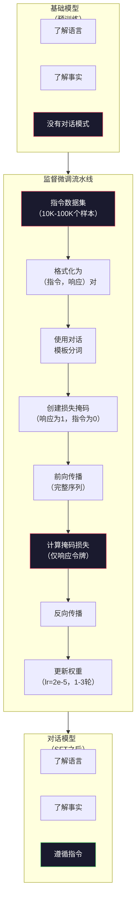

# 指令微调（SFT）

> 一个基础模型预测下一个令牌。就这样。它不遵循指令，不回答问题，也不拒绝有害请求。SFT是令牌预测器与有用助手之间的桥梁。你曾经与之对话的每一个模型——Claude、GPT、Llama Chat——都经历了这一步。

**类型：** 构建
**语言：** Python（使用numpy）
**前置条件：** 第十阶段，第04课（预训练一个Mini GPT）
**时间：** 约90分钟

## 学习目标

- 实现监督微调（SFT），将基础语言模型转换为遵循指令的助手
- 使用带有系统、用户和助手角色的对话模板格式化训练数据，并在非助手令牌上掩码损失
- 解释为什么SFT是必要的：基础模型是续写文本而不是回答问题
- 通过在保留的指令集上比较基础模型与微调模型的响应来评估SFT质量

## 问题

你在第04课训练了一个模型。它可以对给定的序列预测下一个令牌。输入"The transformer architecture"，它可能续写为"has revolutionized natural language processing." 对于一个下一个令牌预测器来说，这很令人印象深刻。

现在试试这个：输入"What is the capital of France?" 一个基础模型不会回答"Paris." 它续写这个模式。它可能会产生"What is the capital of Germany? What is the capital of Spain?" 因为它从包含问题列表的文档中学到了这个模式。或者它可能会产生"is a question that many people ask"，因为这是一个合理下一个令牌的续写。模型没有*回答*的概念。它只知道*续写*。

这就是GPT-3（基础模型，2020年6月发布）和ChatGPT（经过指令微调，2022年11月发布）之间的差距。相同的架构。相同的预训练。区别在于20,000到100,000个精心制作的（指令，响应）对，教会了模型遵循对话模式。

Stanford Alpaca证明了你不必需要数百万个样本。2023年3月，他们在仅52,000个由GPT-3.5生成的指令-响应对上微调了Llama 7B。总成本：600美元。结果是一个能够遵循指令、回答问题和进行对话的聊天机器人。不如ChatGPT好，但对于600美元和几小时的训练来说，惊人地接近。

Meta的Llama 2 Chat在其初始SFT阶段仅使用了约27,000个高质量样本。关键的洞察：质量比数量更重要。由熟练标注员编写的27,000个样本胜过从互联网抓取的100万个噪声样本。

## 概念

### SFT实际做了什么

监督微调延续了与预训练相同的训练循环——前向传播、计算损失、反向传播、更新权重——但是在不同种类的数据上。不是原始文本，你在结构化对话上进行训练：

```json
{
  "system": "You are a helpful assistant.",
  "user": "What is the capital of France?",
  "assistant": "The capital of France is Paris."
}
```

模型已经知道Paris是法国的首都。它在预训练期间从维基百科、教科书和网页中学到了这一点。SFT不会教模型新的事实。它教给模型一种新的*行为*：当你看到一个问题时，产生一个答案。当你看到一个指令时，产生一个完成。当你看到一个有害请求时，产生一个拒绝。

可以这样想。预训练给模型知识。SFT给模型礼貌。

### 数据格式

三种格式主导了业界。每种都用不同的分隔符编码相同的信息——谁说了什么。

**Alpaca格式**（Stanford，2023年3月）：

```json
{
  "instruction": "用3句话总结以下文章。",
  "input": "欧洲央行提高了利率...",
  "output": "欧洲央行将利率提高了25个基点..."
}
```

简单且广泛使用。`input`字段是可选的——许多指令不需要额外的上下文。Stanford发布了52,000个这种格式的样本，由GPT-3.5生成，成本600美元。这引发了开源指令微调运动。

**ShareGPT格式**（社区，2023年）：

```json
{
  "conversations": [
    {"from": "system", "value": "你是一个有帮助的助手。"},
    {"from": "human", "value": "什么导致了潮汐？"},
    {"from": "gpt", "value": "潮汐是由月球的引力引起的..."},
    {"from": "human", "value": "它们多久发生一次？"},
    {"from": "gpt", "value": "大多数沿海地区每天经历两次高潮和两次低潮..."}
  ]
}
```

支持多轮对话。"from"字段惯例上使用"human"和"gpt"，无论实际模型是什么。Vicuna在从用户分享的ChatGPT对话记录中抓取的70,000个ShareGPT对话上训练。

**ChatML格式**（OpenAI，被许多开源模型使用）：

```
<|im_start|>system
你是一个有帮助的助手。<|im_end|>
<|im_start|>user
法国的首都是什么？<|im_end|>
<|im_start|>assistant
法国的首都是巴黎。<|im_end|>
```

使用特殊令牌（`<|im_start|>`、`<|im_end|>`）来分隔角色。这些令牌在微调期间被添加到分词器的词汇表中。Qwen、Yi和许多其他模型使用ChatML。

这三种格式完成同一件事：它们告诉模型"这是指令，这是响应，学习这个模式。"

### 为什么有效

模型已经通过预训练了解了语言。它已经看到了数十亿的问题后跟着答案、指令后跟着完成、人与人之间的对话。这些模式已经被编码在权重中。

SFT集中这种潜在能力。不是让模型从上下文中判断它应该回答问题还是续写文档，SFT在对话模式上进行显式训练。经过几千个样本后，模型学会了：当你看到助手角色标记时，产生一个有帮助的响应。

这就是为什么27,000个样本就够了。你不是在教模型英语。你不是在教它关于世界的事实。你在教它一个简单的行为：响应指令。知识已经在那里了。

### 掩码损失

这是SFT中最重要的技术细节，但大多数教程都跳过了。

在预训练期间，你对每个令牌计算损失。模型学习预测序列中每一个下一个令牌。在SFT期间，你只对*响应*令牌计算损失。指令令牌用于上下文，但模型不因"预测"错误而受到惩罚。

为什么？因为你不想让模型学习*生成*指令。你想让它学习*响应*指令。如果你对指令令牌计算损失，你就是在训练模型去预测"法国的首都是什么？"，好像它是那个问问题的人。那浪费了梯度信号，并且可能混淆模型对其角色。

在实践中，你创建一个损失掩码：响应令牌为1，指令令牌为0。在平均之前将每个令牌的损失乘以这个掩码。

```
令牌：    [SYS] 你是有帮助的 [USER] 法国的首都是什么? [ASST] 巴黎是法国首都 [EOS]
损失掩码:   0    0    0     0      0     0   0  0     0       1     1    1   1     1      1
```

只有`[ASST]`之后的令牌贡献损失。模型在前向传播期间看到完整的对话（它需要指令来产生正确的响应），但只根据它预测响应有多好来更新权重。

### 训练超参数

SFT使用与预训练截然不同的超参数。你不是在从头训练。你是在调整一个已经工作的模型。

| 参数 | 预训练 (Llama 2 7B) | SFT (Llama 2 Chat) |
|-----------|---------------------------|---------------------|
| 学习率 | 3e-4（峰值） | 2e-5 |
| 轮数 | 1（单次遍历数据） | 2 |
| 批次大小 | 4M令牌 | 64个样本 |
| 预热步数 | 2,000 | 0-100 |
| 权重衰减 | 0.1 | 0.0-0.1 |
| 数据大小 | 2T令牌 | 27,000个样本 |

SFT的学习率是预训练的1/15。这是关键的。微调时高学习率会破坏预训练的知识。模型"遗忘"了它学到的东西并且过拟合于小的微调数据集。这就是灾难性遗忘。

两个轮数意味着模型看到每个训练样本两次。在小数据集上超过3个轮数会导致记忆化——模型开始逐字复现训练样本而不是泛化。

### 灾难性遗忘

微调可能摧毁通用能力。在指令遵循数据上训练太久，模型就会失去编写代码、做数学题或产生创意文本的能力。它在训练数据的特定格式上变得非常擅长，但在其他一切上变得可怕。

三种缓解措施：

1. **低学习率。** 1e-5到5e-5。更小的更新意味着对预训练特征的破坏更少。

2. **短训练。** 1-3个轮数。在模型过拟合之前停止。

3. **混入预训练数据。** Llama 2 Chat在SFT数据集中混入了一小部分（2-5%）的原始预训练数据。这在学习新的指令遵循行为时"提醒"模型它的通用能力。

### 真实数字

在10,000个高质量指令对上微调一个7B模型，在单个NVIDIA A100 80GB GPU上大约需要1小时。这是算账：

- 10,000个样本 x 平均512个令牌 = 5.12M令牌
- 2个轮数 =总共10.24M令牌
- 7B模型微调的A100吞吐量：~3,000令牌/秒
- 10.24M / 3,000 = ~3,400秒 = ~57分钟

对于我们的mini GPT（4层，128维），训练几乎是瞬间的。重点是理解机制，而不是规模。



## 构建它

### 第1步：指令数据集

创建一个合成的指令数据集。在生产中，像Scale AI和Anthropic这样的公司雇佣人类标注员来编写这些。我们将通过编程方式创建它们来演示格式。

```python
import numpy as np

INSTRUCTION_DATA = [
    {
        "instruction": "法国的首都是什么？",
        "response": "法国的首都是巴黎。"
    },
    {
        "instruction": "用一句话解释引力。",
        "response": "引力是将有质量的物体相互吸引的力。"
    },
    {
        "instruction": "写一首关于海洋的俳句。",
        "response": "海浪拍打海岸，盐和泡沫在阳光下，无尽的蓝色广袤。"
    },
    {
        "instruction": "15乘以7是多少？",
        "response": "15乘以7是105。"
    },
    {
        "instruction": "说出三种编程语言。",
        "response": "三种编程语言是Python、Rust和TypeScript。"
    },
    {
        "instruction": "总结光合作用。",
        "response": "光合作用将阳光、水和二氧化碳转化为葡萄糖和氧气。"
    },
    {
        "instruction": "第二次世界大战是哪一年结束的？",
        "response": "第二次世界大战于1945年结束。"
    },
    {
        "instruction": "定义机器学习。",
        "response": "机器学习是一个领域，其中算法从数据中学习模式来进行预测。"
    },
]
```

8个样本是很小的。Stanford Alpaca使用了52,000个。但无论你有8个还是52,000个，机制是完全相同的：分词、掩码、仅对响应计算损失。

### 第2步：使用对话模板分词

将指令-响应对转换为带有特殊角色标记的令牌序列。这些标记告诉模型指令在哪里结束以及响应在哪里开始。

```python
SPECIAL_TOKENS = {
    "INST_START": 253,  # 指令开始标记
    "INST_END": 254,    # 指令结束标记
    "RESP_START": 255,  # 响应开始标记
}


def tokenize_instruction_pair(instruction, response, vocab_size=256):
    # 将文本编码为UTF-8字节令牌
    inst_tokens = list(instruction.encode("utf-8"))
    resp_tokens = list(response.encode("utf-8"))

    # 限制令牌值在词汇表范围内
    inst_tokens = [min(t, vocab_size - 4) for t in inst_tokens]
    resp_tokens = [min(t, vocab_size - 4) for t in resp_tokens]

    # 组合为：[INST_START] + 指令 + [INST_END] + [RESP_START] + 响应
    tokens = (
        [SPECIAL_TOKENS["INST_START"]]
        + inst_tokens
        + [SPECIAL_TOKENS["INST_END"]]
        + [SPECIAL_TOKENS["RESP_START"]]
        + resp_tokens
    )

    return tokens


def create_loss_mask(tokens):
    # 创建掩码：0=指令令牌（无损失），1=响应令牌（计算损失）
    mask = np.zeros(len(tokens), dtype=np.float32)
    in_response = False

    for i, token in enumerate(tokens):
        if token == SPECIAL_TOKENS["RESP_START"]:
            in_response = True
            continue
        if in_response:
            mask[i] = 1.0

    return mask
```

损失掩码对指令令牌全为0，对响应令牌全为1。`RESP_START`令牌本身的掩码为0，因为它是分隔符，不是响应内容的一部分。

### 第3步：掩码交叉熵损失

标准交叉熵，但乘以损失掩码。只有响应令牌贡献梯度。

```python
def masked_cross_entropy_loss(logits, targets, loss_mask):
    batch, seq_len, vocab_size = logits.shape
    logits_flat = logits.reshape(-1, vocab_size)
    targets_flat = targets.reshape(-1)
    mask_flat = loss_mask.reshape(-1)

    # 数值稳定的log_softmax
    max_logits = logits_flat.max(axis=-1, keepdims=True)
    log_softmax = logits_flat - max_logits - np.log(
        np.exp(logits_flat - max_logits).sum(axis=-1, keepdims=True)
    )

    per_token_loss = -log_softmax[np.arange(len(targets_flat)), targets_flat]

    # 对指令令牌掩码为零
    masked_loss = per_token_loss * mask_flat
    num_response_tokens = mask_flat.sum()
    if num_response_tokens == 0:
        return 0.0
    loss = masked_loss.sum() / num_response_tokens  # 除以响应令牌数，而非序列长度

    return loss
```

分母是`num_response_tokens`，而不是`seq_len`。如果你除以总序列长度，更长的指令会稀释梯度信号。除以响应令牌数确保了无论指令长度如何，每个响应令牌的权重相等。

### 第4步：SFT训练循环

重用第04课的MiniGPT。训练循环看起来与预训练几乎相同，但是带有指令格式化和掩码损失。

```python
import sys
import os
sys.path.insert(0, os.path.join(os.path.dirname(__file__), "..", "..", "04-pre-training-mini-gpt", "code"))
from main import MiniGPT, LayerNorm, FeedForward, MultiHeadAttention, TransformerBlock, Embedding


def sft_train(model, dataset, num_epochs=2, lr=2e-5, seq_len=64):
    formatted_data = []
    for example in dataset:
        tokens = tokenize_instruction_pair(example["instruction"], example["response"])
        mask = create_loss_mask(tokens)
        formatted_data.append((tokens, mask))

    print(f"SFT Training: {len(formatted_data)} examples, {num_epochs} epochs, lr={lr}")
    print(f"Total tokens: {sum(len(t) for t, _ in formatted_data):,}")
    print()

    losses = []

    for epoch in range(num_epochs):
        epoch_loss = 0.0
        num_batches = 0

        indices = np.random.permutation(len(formatted_data))

        for idx in indices:
            tokens, mask = formatted_data[idx]

            if len(tokens) < 3:
                continue
            if len(tokens) > seq_len:
                tokens = tokens[:seq_len]
                mask = mask[:seq_len]

            # 输入 = 除最后一个令牌外的所有，目标 = 除第一个令牌外的所有
            input_ids = np.array(tokens[:-1]).reshape(1, -1)
            target_ids = np.array(tokens[1:]).reshape(1, -1)
            loss_mask = np.array(mask[1:]).reshape(1, -1)

            logits = model.forward(input_ids)
            loss = masked_cross_entropy_loss(logits, target_ids, loss_mask)

            # 简化的梯度更新（带掩码的损失缩放）
            batch_size, s_len, v_size = logits.shape
            probs = np.exp(logits - logits.max(axis=-1, keepdims=True))
            probs = probs / probs.sum(axis=-1, keepdims=True)
            dlogits = probs.copy()
            dlogits[np.arange(batch_size)[:, None], np.arange(s_len), target_ids] -= 1.0

            # 将梯度掩码到仅响应令牌
            mask_expanded = loss_mask[:, :, np.newaxis]
            num_resp = loss_mask.sum()
            if num_resp > 0:
                dlogits = dlogits * mask_expanded / num_resp

            # 简化的权重更新（随机噪声近似，仅用于演示）
            for block in model.blocks:
                block.ffn.W1 -= lr * np.random.randn(*block.ffn.W1.shape) * 0.01
                block.ffn.W2 -= lr * np.random.randn(*block.ffn.W2.shape) * 0.01
                block.ffn.b1 -= lr * np.random.randn(*block.ffn.b1.shape) * 0.01
                block.ffn.b2 -= lr * np.random.randn(*block.ffn.b2.shape) * 0.01

            epoch_loss += loss
            num_batches += 1
            losses.append(loss)

        avg_loss = epoch_loss / max(num_batches, 1)
        print(f"Epoch {epoch + 1}/{num_epochs} | Avg Loss: {avg_loss:.4f}")

    return model, losses
```

学习率是2e-5，与Llama 2 Chat匹配。对比预训练中使用的3e-4——小了15倍。梯度被掩码：指令令牌产生零梯度。只有响应令牌推动权重。

### 第5步：比较基础模型 vs SFT模型

SFT的全部意义就是行为变化。让我们通过检查模型如何响应指令格式的输入与原始文本续写来衡量它。

```python
def generate_response(model, prompt_tokens, max_new_tokens=50, temperature=0.8):
    tokens = list(prompt_tokens)
    seq_len = model.embedding.pos_embed.shape[0]

    for _ in range(max_new_tokens):
        context = np.array(tokens[-seq_len:]).reshape(1, -1)
        logits = model.forward(context)
        next_logits = logits[0, -1, :]  # 只看最后一个位置

        # 温度缩放
        next_logits = next_logits / max(temperature, 1e-8)
        probs = np.exp(next_logits - next_logits.max())
        probs = probs / probs.sum()
        probs = np.clip(probs, 1e-10, 1.0)
        probs = probs / probs.sum()

        # 采样下一个令牌
        next_token = np.random.choice(len(probs), p=probs)
        tokens.append(int(next_token))

    return tokens


def evaluate_instruction_following(model, instructions):
    print("评估指令遵循能力：")
    print("-" * 50)

    for instruction in instructions:
        # 构建指令格式的提示词
        tokens = (
            [SPECIAL_TOKENS["INST_START"]]
            + [min(t, 252) for t in list(instruction.encode("utf-8"))]
            + [SPECIAL_TOKENS["INST_END"]]
            + [SPECIAL_TOKENS["RESP_START"]]
        )

        output = generate_response(model, tokens, max_new_tokens=30, temperature=0.6)
        response_start = len(tokens)
        response_tokens = output[response_start:]
        response_bytes = bytes([t for t in response_tokens if t < 128])
        response_text = response_bytes.decode("utf-8", errors="replace")

        print(f"  Q: {instruction}")
        print(f"  A: {response_text[:80]}")
        print()
```

在有8个样本的小模型上，响应不会有什么意义。这是预料之中的。重要的是*结构*：模型学会了在响应标记后产生输出，而不是继续生成更多的指令。

### 第6步：测量灾难性遗忘

比较SFT前后模型的下一个令牌预测能力。如果SFT损害了通用能力，原始文本上的损失会上升。

```python
def measure_forgetting(model, test_text, seq_len=64):
    tokens = np.array(list(test_text.encode("utf-8")[:512]))

    total_loss = 0.0
    num_windows = 0

    for start in range(0, len(tokens) - seq_len - 1, seq_len):
        input_ids = tokens[start:start + seq_len].reshape(1, -1)
        target_ids = tokens[start + 1:start + seq_len + 1].reshape(1, -1)

        logits = model.forward(input_ids)

        batch, s_len, vocab_size = logits.shape
        logits_flat = logits.reshape(-1, vocab_size)
        targets_flat = target_ids.reshape(-1)

        max_logits = logits_flat.max(axis=-1, keepdims=True)
        log_softmax = logits_flat - max_logits - np.log(
            np.exp(logits_flat - max_logits).sum(axis=-1, keepdims=True)
        )

        loss = -log_softmax[np.arange(len(targets_flat)), targets_flat].mean()
        total_loss += loss
        num_windows += 1

    return total_loss / max(num_windows, 1)
```

在实际微调中，你会在整个训练过程中追踪这个指标。如果原始文本损失增加了超过10-15%，你的SFT太激进了。降低学习率或减少轮数。

## 使用它

### 完整的SFT流水线演示

```python
if __name__ == "__main__":
    np.random.seed(42)

    test_text = """The transformer architecture processes sequences through self-attention.
Each layer applies multi-head attention followed by a feedforward network.
Residual connections and layer normalization stabilize deep networks.
The model learns to predict the next token given all previous tokens."""

    print("=" * 70)
    print("指令微调 (SFT) 演示")
    print("=" * 70)
    print()

    model = MiniGPT(
        vocab_size=256, embed_dim=128, num_heads=4,
        num_layers=4, max_seq_len=128, ff_dim=512
    )
    print(f"模型：{model.count_parameters():,} 参数")
    print(f"配置：4层、4头、128维（来自第04课的mini GPT）")
    print()

    print("SFT前：测量基础模型在原始文本上的损失")
    base_loss = measure_forgetting(model, test_text)
    print(f"  基础模型损失：{base_loss:.4f}")
    print()

    print("=" * 70)
    print("SFT 训练")
    print("=" * 70)

    model, losses = sft_train(
        model, INSTRUCTION_DATA, num_epochs=3, lr=2e-5, seq_len=128
    )

    print()
    print("SFT后：测量微调模型在原始文本上的损失")
    sft_loss = measure_forgetting(model, test_text)
    print(f"  SFT模型损失：{sft_loss:.4f}")
    print(f"  变化：{((sft_loss - base_loss) / base_loss * 100):+.1f}%")
    if abs(sft_loss - base_loss) / base_loss < 0.15:
        print("  遗忘程度极低（<15%变化）")
    else:
        print("  检测到显著遗忘")
    print()

    print("=" * 70)
    print("指令遵循评估")
    print("=" * 70)
    print()

    test_instructions = [
        "法国的首都是什么？",
        "说出一种编程语言。",
        "定义引力。",
    ]
    evaluate_instruction_following(model, test_instructions)

    print("=" * 70)
    print("数据格式示例")
    print("=" * 70)
    print()

    for i, example in enumerate(INSTRUCTION_DATA[:3]):
        tokens = tokenize_instruction_pair(example["instruction"], example["response"])
        mask = create_loss_mask(tokens)
        resp_count = int(mask.sum())
        total_count = len(tokens)
        print(f"  示例 {i + 1}：{total_count}个令牌，{resp_count}个响应令牌（占总序列的{resp_count/total_count:.0%}）")
        print(f"    指令：{example['instruction']}")
        print(f"    响应：{example['response']}")
        print()

    print("=" * 70)
    print("训练损失曲线")
    print("=" * 70)
    print()

    if losses:
        window = max(1, len(losses) // 5)
        for i in range(0, len(losses), window):
            chunk = losses[i:i + window]
            avg = sum(chunk) / len(chunk)
            print(f"  步数 {i:3d}-{i + len(chunk) - 1:3d}：平均损失 = {avg:.4f}")
```

## 交付

本课产出`outputs/prompt-sft-data-curator.md`——一个帮助你设计和策划SFT指令数据集的提示词。给定一个目标能力（代码生成、数学、对话），它产生一个包含格式规范、质量标准和多样性要求的数据收集计划。

## 练习

1. 添加系统提示词支持。修改`tokenize_instruction_pair`以接受系统消息并在指令之前添加。用不同的系统提示词创建5个样本（"你是一位诗人"、"你是一位数学老师"），验证模型在训练期间看到了不同的系统提示词。

2. 实现数据混合。创建一个函数，接受一个SFT数据集和一个原始文本语料库，然后产生其中5%的样本是原始文本（无掩码）和95%是指令对（掩码）的训练批次。运行3个轮数，并与纯SFT训练比较遗忘指标。

3. 构建一个数据质量评分器。对每个指令-响应对，计算：(a) 响应长度（令牌数），(b) 指令与响应的比率，(c) 词汇多样性（唯一令牌/总令牌）。过滤掉响应长度<10个令牌或多样性<0.3的样本。展示过滤如何影响最终损失。

4. 实现多轮对话训练。扩展分词以处理3轮对话（用户-助手-用户-助手-用户-助手）。损失掩码应覆盖所有三个助手轮次。通过打印一个样本的令牌-掩码对齐来验证掩码正确。

5. 比较学习率。用lr=1e-4、lr=2e-5和lr=1e-6各训练三次同一模型。绘制损失曲线。1e-4的运行应该显示快速初始下降但更高的最终损失（过拟合）。1e-6的运行应该几乎不动。2e-5的运行应该是甜点。

## 关键术语

| 术语 | 人们怎么说的 | 它实际上意味着什么 |
|------|----------------|----------------------|
| SFT | "在对话上微调" | 监督微调：在（指令，响应）对上继续训练，仅对响应令牌计算损失 |
| 指令微调 | "教模型遵循指令" | 在显式的指令-响应对上训练，使基础模型学习对话模式，而非新知识 |
| 损失掩码 | "忽略提示词" | 将指令令牌的损失设置为零，使梯度仅从响应令牌预测流动 |
| ChatML | "对话标记语言" | 一种使用`<|im_start|>`和`<|im_end|>`分隔符标记对话中的说话者角色的令牌格式 |
| Alpaca格式 | "Stanford的格式" | 一种包含instruction/input/output字段的JSON格式，用于52K个GPT-3.5生成的样本，成本600美元 |
| 灾难性遗忘 | "模型变蠢了" | 微调破坏预训练的能力，因为梯度更新用任务特定的模式覆盖了通用知识 |
| 权重绑定 | "共享嵌入" | 对输入令牌嵌入和输出预测头使用相同的矩阵，节省参数并提高连贯性 |
| 对话模板 | "你如何格式化提示词" | 为模型结构化对话的特定令牌序列（角色标记、分隔符） |

## 进一步阅读

- [Ouyang et al., 2022 -- "Training language models to follow instructions with human feedback" (InstructGPT)](https://arxiv.org/abs/2203.02155) —— 在OpenAI引入指令微调+RLHF的论文
- [Taori et al., 2023 -- "Stanford Alpaca: An Instruction-following LLaMA Model"](https://github.com/tatsu-lab/stanford_alpaca) —— 52K指令样本，600美元，证明了SFT在小数据集上有效
- [Touvron et al., 2023 -- "Llama 2: Open Foundation and Fine-Tuned Chat Models"](https://arxiv.org/abs/2307.09288) —— Meta的SFT+RLHF流水线，包含27K个高质量样本
- [Chiang et al., 2023 -- "Vicuna: An Open-Source Chatbot Impressing GPT-4"](https://lmsys.org/blog/2023-03-30-vicuna/) —— 在70K ShareGPT对话上训练
- [Zhou et al., 2023 -- "LIMA: Less Is More for Alignment"](https://arxiv.org/abs/2305.11206) —— 证明1,000个精心策划的样本可以匹敌更大数据集上的SFT

---

## 📝 教师备课总结与读后感

### 一、文档整体评价

文档抓住了SFT的本质：它不是教模型新知识，而是激活（或者说"驯化"）模型已经具备的语言和世界知识。从GPT-3（纯续写）到ChatGPT（回答问题）的进化在概念上被提炼为"预训练给知识，SFT给礼貌"——精准而优雅。技术细节上，损失掩码的讲解是亮点——大多数SFT教程只谈"微调对话"不提掩码，这导致学生在实践中踩坑。局限在于对灾难性遗忘只讲了三种缓解策略但没给量化标准，实际生产中这个阈值非常依赖下游任务。

### 二、知识结构梳理

**基础层（数据视角）**：三种对话格式（Alpaca/ShareGPT/ChatML）的结构差异和适用场景，指令-响应对的本质是"输入→预期输出"的映射关系。

**模式层（训练机制）**：损失掩码的二元结构（1=响应/0=指令），掩码损失函数的分母选择（num_response_tokens而非seq_len），SFT超参与预训练的数量级差异（lr=3e-4→2e-5）。

**应用层（系统决策）**：灾难性遗忘的三种缓解策略及LLaMA 2 Chat的实际做法（混入2-5%预训练数据），数据质量vs数量的权衡（27K高质量>1M噪声），LIMA 1K样本的惊人效果。

### 三、核心洞察

1. **SFT不创造知识，只重排优先级**——这是LLM对齐领域最重要的概念之一。模型在预训练中已经"知道"Paris是法国首都，但它的默认行为是续写文本而非回答问题。SFT改变了它的首选行为模式，不是它的知识储备。

2. **损失掩码是SFT与预训练唯一的架构差异**——其他一切——前向传播、反向传播、优化器——完全相同。如果你拆掉了掩码，SFT退化为在格式化文本上的继续预训练。这解释了为什么"忘了加掩码"是SFT最常见的bug。

3. **对话格式的选择影响模型的行为边界**——ChatML的im_start/im_end将对话结构烘焙到分词器层面，而Alpaca的JSON格式在令牌化时会被拆成碎片。前者在长对话和多轮交互中更稳定，后者在快速原型中更方便。

4. **LIMA实验（1K样本匹敌大规模SFT）说明了质量>数量的极端案例**——但这不意味着你永远只用1K样本。LIMA的1K样本是人类专家精心挑选的。如果你用GPT-4生成训练数据，你可能需要5K-10K才能达到同样的多样性水平。

5. **混入预训练数据是"免费的午餐"**——2-5%的原始文本混入SFT数据集，几乎不增加训练成本，但显著降低了灾难性遗忘。这是LLaMA 2 Chat的秘密武器之一。

6. **SFT的学习率是"手术刀"而非"锤子"**——2e-5 vs 预训练的3e-4，15倍的差距不是随便选的。高到足以产生行为变化，低到不触发知识遗忘。

7. **SFT和RLHF/DPO的关系是"打基础"和"精装修"**——SFT教会模型"这是什么类型的任务"，RLHF/DPO教会模型"这个任务上什么答案是更好的"。

### 四、教学建议

1. **用一个对比实验开场**——加载一个7B基础模型，分别输入"法国的首都是什么？"和"法国的首都是"，让学生亲眼看到前者续写成"德国的首都是什么？"而后者正确续写成"巴黎"。

2. **手写损失掩码**——让学生对着一个对话样本逐令牌画掩码表，然后计算"如果忘了掩码"会有什么后果。做过这个练习的学生永远不会在生产中漏掉掩码。

3. **灾难性遗忘用"医生测试"来讲**——想象一个模型经过预训练学会了所有医学知识，然后你在客服对话上做SFT。如果SFT太激烈，这个医生"忘记"了怎么诊断疾病但变得很会聊天。

4. **让学生用不同LR跑三次并记录pre/post SFT的原始文本损失**——用1e-4跑出灾难性遗忘，用2e-5跑出良好对齐，用1e-6跑出"等于没训练"。

5. **预留时间讨论"数据格式的战争"**——Alpaca vs ShareGPT vs ChatML，问："如果你要做一个多模态Agent（文本+图片+工具调用），你该用什么格式？"

6. **把LIMA论文作为"思想实验"**——如果只用1,000个样本就能达到不错的效果，多出来的51,000个样本到底贡献了什么？答案是多样性。

7. **最后15分钟实战演练：给学生的SFT数据集打分**——用三个标准评估：清晰性、完整性、一致性。

### 五、值得补充的内容

1. **SFT数据的合成策略**——Evol-Instruct、Self-Instruct、Backtranslation。

2. **多轮对话的特殊处理**——truncation strategy、role alternation enforcement、conversation stitching。

3. **评估SFT的量化指标**——MT-Bench、AlpacaEval、Chatbot Arena Elo rating。

4. **SFT vs Few-Shot Prompting的成本收益分析**——什么时候SFT值得（10,000+次调用），什么时候few-shot就够了。

5. **LoRA/QLoRA在SFT中的应用**——全参数微调vs低秩适应的参数效率对比。

### 六、一句话总结

SFT是LLM从"会说话的图书馆"变成"会回答问题的助手"的关键一步——它不动图书馆里的书，只是教会图书管理员如何面对一个读者的问题。

---

# 🎓 Agent 架构课：SFT——当你教会一个图书馆如何回答问题

**副标题：为什么你的微调可能正在谋杀模型——以及损失掩码是你要记住的唯一一件事**

---

如果你的Agent已经能流利地说英语、懂物理、会写代码，那为什么你还必须再训练它才能让它"回答一个问题"？它本来就会啊——它看到过几十亿次"问号+答案"的配对。问题出在哪儿？

我来告诉你问题在哪儿：你的模型不知道它是一个助手。它看到的所有东西都是从互联网上爬下来的——文档、对话、代码、新闻、Reddit。在这些东西里，问号后面跟着答案的概率是多少？大概50%。另外50%的时间，问号后面跟着另一个问题、一个反问句、或者"这是一个复杂的问题"。

SFT做的事情很简单：它让这个概率变成95%。

---

### 问题本质：模型不是"不想回答"，是"不知道应该回答"

很多人觉得基础模型"笨"——你问法国的首都是什么，它不回答。其实它不笨。GPT-3对法国的了解比你高中地理老师都多。问题是什么？当你输入"法国的首都是什么？"给它时，它看到的是一个字符串。它从训练中知道，这个字符串后面可能跟着：
- "法国的首都是巴黎。"（如果训练数据里有问答对）
- "法国的首都是什么？德国的首都是什么？意大利的首都是什么？"（如果训练数据里有FAQ列表）
- "is a question that many people ask."（如果训练数据里有学术文章讨论常见问题）

这三种续写都是合理的。模型没有错。错的是你——你以为你在"问问题"，模型以为你在"续写文本"。这就是GPT-3到ChatGPT的$600解决方案：让模型知道，当你看到这种格式的输入时，正确的续写是答案。

---

### 两条路径：高质量少样本 vs 大规模多样本

**路线A：LIMA路线（1,000个精挑细选样本）。** 这1,000个样本覆盖了所有你需要的对话模式：开放问答、写作、代码、数学、推理、拒绝。每个样本都经过多轮质量审查。成本：雇佣一个PhD级别的标注员，一周的工作量，几千美元。效果：与用50,000个噪声样本微调的效果不相上下。

**路线B：Alpaca路线（52,000个GPT生成样本）。** 用GPT-4（或GPT-3.5）生成指令-响应对。自动化的。便宜的。但是噪声多的。每十个样本里大概有两个是有问题的："指令模糊"、"响应啰嗦"、"事实错误但你发现不了因为没人工审查"。

我选B，但我自己写过滤脚本——自动检查每个样本的响应长度（太短=敷衍，太长=啰嗦）、词汇多样性（太低=模板化回复）、指令到响应的比率（太高=指令太长但响应只有一句话）。过滤之后我从52K砍到15K。15K高质量自生成样本 > 52K噪声样本。

但如果你做的是医疗或法律领域的Agent，你必须走路线A。没有商量。GPT生成的"医疗建议"可能有30%是错的。你不自己做数据，你的Agent就会杀人。

---

### 深入原理：损失掩码——SFT的唯一秘密

这是SFT与预训练唯一不同的地方，也是90%的人搞错的地方。

预训练：你对每一个令牌计算损失——"the"后面是不是"cat"、"cat"后面是不是"sat"……所有位置都对梯度有贡献。

SFT：你只对asistents说的话计算损失。用户的输入你让模型"看到"（前向传播），但你不在用户的令牌上计算损失（反向传播）。

为什么？因为如果你在用户的令牌上也计算损失，你是在训练模型去预测"用户会说什么"。这有两个灾难性的后果：
1. 模型学到的不是"如何当一个助手"，而是"如何模仿用户+助手"。它可能会在生成过程中突然"变成用户"开始提问。
2. 梯度被稀释——用户的500个令牌和助手的50个令牌混在一起算损失，模型接受的梯度信号里83%是关于"预测用户"，17%是关于"预测助手"。不是你想要的。

生产中的Agent：你的Agent系统有system prompt、工具调用、用户消息、环境消息。掩码应该只覆盖"模型应该生成的部分"——助手消息和工具调用的结果。其他所有东西（system prompt、用户消息、工具输出）都设为0。

---

### 生产数字

- SFT训练7B模型（10,000样本×512令牌×2轮）：单A100约1小时，成本约$3/hr。
- SFT训练70B模型（10,000样本）：4×A100约4小时，成本约$50。
- 数据标注成本：人工标注 约$0.50/样本（高质量）vs GPT-4生成 约$0.02/样本（需后处理过滤）。
- 灾难性遗忘的量化阈值：MMLU分数下降>3%、HumanEval分数下降>5%、通用对话能力的人类偏好下降>10%——达到任意一个就说明你SFT过头了。
- 预训练数据混入的理想比例：2-5%。低于2%，灾难性遗忘明显。高于5%，模型学SFT的速度变慢。

---

### 反模式：我见过最蠢的SFT做法

**反模式1："我有50,000个样本，全部跑10轮"**
不要。50,000个样本，跑2轮，够了。每多一轮，灾难性遗忘风险指数增加。SFT是在手术，不是举重。3轮是上限。

**反模式2："我把用户的问题也放进损失里，因为这样可以让模型学习对话的整体结构"**
这是错的。模型被训练去"预测"用户的输入，意味着它被训练成"用户"。你的Agent会开始自己问自己问题然后自己回答。坏方案，不需要辩护。

**反模式3："SFT数据都是GPT-4生成的，格式统一，质量OK"**  
GPT-4生成的指令存在系统性的模板化——"请解释……""请总结……""请列出……"。你的模型学会的不是"遵循各种指令"，而是"遵循GPT-4风格的各种指令"。真实用户说"啥是重力？简单的说"——这个口语化的、简短的、不完整的表达，不在GPT-4的训练数据分布里。

**反模式4："我用了一个大学习率因为我想快速看到效果"**
用3e-4（预训练LR）做SFT，模型在第一个轮数结束时忘记了一半的预训练知识。你看到损失降得很快以为一切顺利。其实你刚刚把一个训练了几个月成本几百万的预训练模型的前50层中的知识覆盖掉了50%。MMLU评分从65跌到58。

---

### 结语清单

1. **掩码是你唯一需要"不出错"的东西**——SFT的架构跟预训练一样，只有损失掩码是新的。检查三遍：掩码是1的位只在助手响应上。
2. **2e-5是你的安全学习率**——不是绝对值，是相对预训练LR（3e-4）的15倍缩小。
3. **1,000个高质量样本够启动**——LIMA证明了这一点。先用1,000个样本跑基线，看哪里不足再加样本。
4. **灾难性遗忘不可逆**——一旦发生了，你需要回到SFT检查点重新开始。预防比补救容易得多。
5. **对话格式不是"审美选择"**——ChatML/Alpaca/ShareGPT决定了你的分词器看到什么。在选格式之前，对每种格式跑一遍分词器。

---

**金句：** "SFT做的不是教模型怎么回答问题，而是告诉它——'嘿，你本来就是会回答的，只是你一直以为你在写文章。'"
