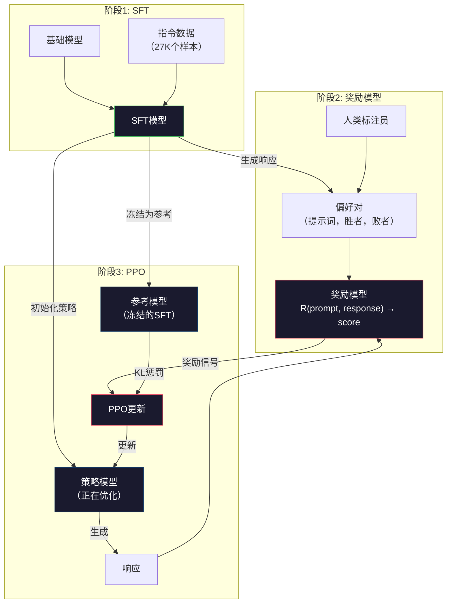
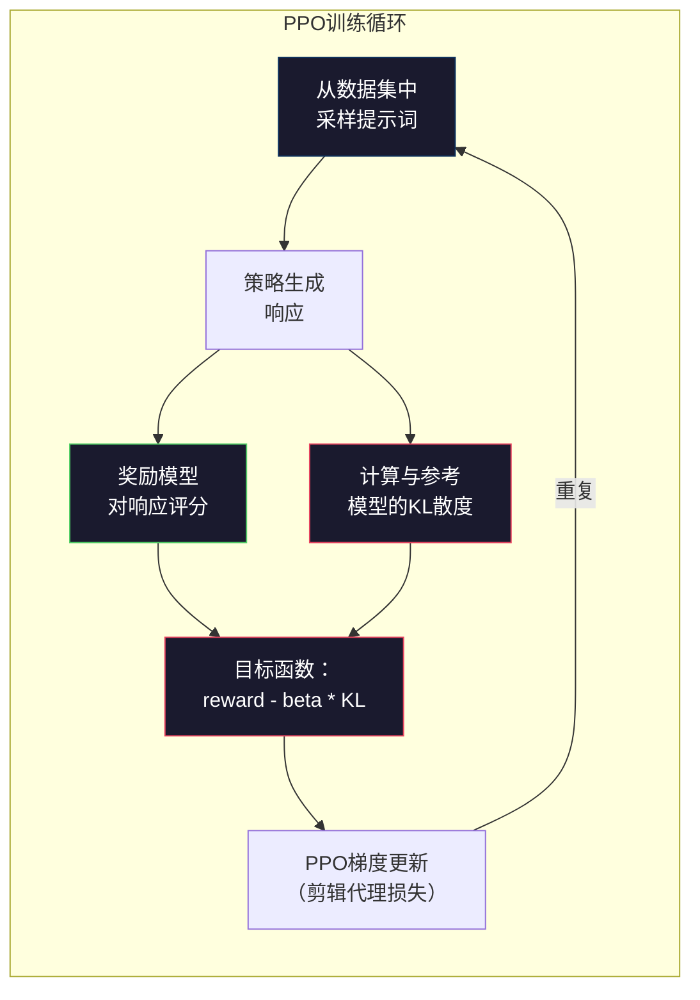

# RLHF：奖励模型 + PPO

> SFT教会模型遵循指令。但它不教模型哪个响应更好。两个语法正确、事实上准确的答案在有用性上可以相差巨大。RLHF是你将人类判断编码到模型行为中的方式。正是它让Claude既有帮助又礼貌。

**类型：** 构建
**语言：** Python（使用numpy）
**前置条件：** 第十阶段，第06课（指令微调 / SFT）
**时间：** 约90分钟

## 学习目标

- 构建一个从人类偏好对（已选择 vs 已拒绝）中对响应质量进行评分的奖励模型
- 实现PPO训练循环，在带有KL惩罚的情况下，针对奖励模型优化语言模型策略
- 解释为什么RLHF需要三个模型（SFT、奖励、策略），以及KL约束如何防止奖励黑客行为
- 通过比较偏好优化前后的响应质量来评估RLHF的效果

## 问题

问模型"解释量子计算"，它可能产生：

**响应A：** "量子计算使用可以存在于叠加态的量子比特，意味着它们可以同时为0、1或两者兼有。这使得量子计算机能够以比经典计算机指数级更快的速度处理某些计算。关键算法包括用于分解大数的Shor算法和用于搜索未排序数据库的Grover算法。"

**响应B：** "量子计算是一种利用量子力学现象的计算类型。它最早在1980年代被提出。Richard Feynman建议量子系统可以由量子计算机模拟。自那时以来，该领域显著增长。许多公司现在正在研究量子计算机。IBM、谷歌等公司取得了进展。谷歌在2019年宣称实现了量子霸权。"

两个响应在事实上都是正确的。两个在语法上都是合理的。两个都遵循了指令。但响应A显然更好。它更简洁、更有信息量、结构更清晰。人类每次都会选A。

SFT无法捕捉这种区别。它在"正确"的响应上训练模型，但它没有机制说"这个响应比那个好"。它平等对待每个训练样本。如果A和B都出现在SFT数据集中，模型会从两者平等学习。

RLHF解决了这个问题。它训练一个奖励模型来预测人类会偏好哪个响应，然后使用该奖励信号将语言模型推向更高质量的输出。InstructGPT（ChatGPT的前身）使用RLHF显著提升了GPT-3的有用性、真实性和无害性。OpenAI的内部评估员在85%的情况下偏好InstructGPT的输出而非GPT-3的输出，尽管InstructGPT小了135倍（1.3B对175B参数）。

## 概念

### 三个阶段

RLHF不是单次训练运行。它是一个三个顺序阶段的流水线，每个阶段建立在前一个之上。

**阶段1：SFT。** 在指令-响应对上训练基础模型（第06课）。这给你一个可以遵循指令但不知道哪些响应比其他响应更好的模型。

**阶段2：奖励模型。** 收集人类偏好数据：向标注员展示对同一提示词的两个响应，问"哪个更好？"训练一个模型来预测这些偏好。奖励模型接收（提示词，响应）作为输入，输出一个标量分数。

**阶段3：PPO。** 使用奖励模型为语言模型生成训练信号。语言模型生成响应，奖励模型对其评分，PPO更新语言模型以产生更高分的响应。KL散度惩罚防止语言模型偏离SFT检查点太远。



### 奖励模型

奖励模型是一个被重新用作评分器的语言模型。将SFT模型的最后语言建模头（输出词汇表的分布）替换为标量头（输出单个数字）。直到最后一层，架构完全相同。

输入：提示词与响应拼接。输出：单个标量奖励分数。

训练数据是人类偏好对。对每个提示词，标注员看到两个响应并选择更好的一个。这创建了训练三元组：（提示词，偏好响应，被拒绝响应）。

损失函数使用双人比较的Bradley-Terry模型：

```
loss = -log(sigmoid(reward(preferred) - reward(rejected)))
```

这是关键方程。`sigmoid(reward(A) - reward(B))`给出了响应A比响应B更受偏好的概率。损失推动奖励模型为偏好响应分配更高的分数。

为什么要成对比较而不是绝对分数？因为人类在分配绝对质量分数（"这个响应是7.3分还是7.5分？"）方面非常糟糕，但在相对比较（"A比B好吗？"）方面非常好。Bradley-Terry模型将相对比较转换为一致的绝对评分系统。

**InstructGPT数据：** OpenAI从40名承包商那里收集了33,000个比较对。每次比较大约需要5分钟。这就是为奖励模型训练数据贡献了2,750小时的人力劳动。

### PPO：近端策略优化

PPO是一种强化学习算法。在RLHF中，"环境"是奖励模型，"智能体"是语言模型，"动作"是生成一个令牌。

目标函数：

```
maximize: E[R(prompt, response)] - beta * KL(policy || reference)
```

第一项推动模型产生高奖励的响应。第二项（KL散度惩罚）防止模型偏离SFT检查点太远。

为什么要有KL惩罚？没有它，模型会找到退化的解。奖励模型是在有限的人类偏好数据集上训练的。它有盲点。语言模型将利用这些盲点——找到在奖励模型上得分高但实际上无意义的输出。经典案例：

- 重复"我非常有帮助且无害！"在有用性/无害性奖励模型上得分高
- 产生冗长、听起来正式但空洞的响应，模式匹配到"高质量"
- 利用恰好与训练数据中高奖励相关的特定短语

KL惩罚说：你可以改进，但你不能成为一个完全不同的模型。靠近已经是合理的SFT版本。偏离太远KL成本将主导奖励。

**InstructGPT数据：** PPO训练使用lr=1.5e-5，KL系数beta=0.02，256K回合（提示词-响应对），每个批次4个PPO轮数。整个RLHF流水线在GPU集群上花费了几天时间。



### PPO目标函数详解

PPO使用"剪辑代理目标（clipped surrogate objective）"来防止过大更新。新策略与旧策略概率之间的比率被剪辑到范围[1 - epsilon, 1 + epsilon]，epsilon通常为0.2。

```
ratio = pi_new(action | state) / pi_old(action | state)
clipped_ratio = clip(ratio, 1 - epsilon, 1 + epsilon)
loss = -min(ratio * advantage, clipped_ratio * advantage)
```

优势函数估计当前响应比预期质量好多少。在RLHF中：

```
advantage = reward(prompt, response) - baseline
```

基线通常是最近响应的平均奖励。正优势意味着响应好于平均水平；负优势意味着更差。PPO增加高于平均水平响应的概率，降低低于平均水平响应的概率。

剪辑防止灾难性更新。如果单个响应获得异常高的奖励，未剪辑的ratio可能非常大，导致模型剧烈转向该响应。剪辑限制了更新幅度，维持训练稳定性。

### 奖励黑客行为

RLHF的阴暗面。语言模型在针对奖励模型进行优化，而奖励模型是人类偏好的不完美代理。随着语言模型在最大化奖励方面变得更好，它开始利用奖励模型的弱点。

常见失败模式：

| 失败模式 | 发生什么 | 为什么 |
|---------|-------------|-----|
| 冗长 | 模型产生越来越长的响应 | 人类标注员通常偏好更长、更详细的响应，所以奖励模型为长度赋予更高分 |
| 谄媚 | 模型同意用户说的一切 | 标注员偏好与问题前提一致的响应 |
| 回避 | 模型拒绝对答案做出承诺 | 回避性响应（"这是一个有很多视角的复杂话题……"）很少被标记为错 |
| 格式博弈 | 模型过度使用项目符号和标题 | 格式化的响应在标注员看来更"精致" |

缓解策略：更强的KL惩罚（防止模型偏离到足以利用弱点的程度）、在对抗性样本上训练奖励模型（修补已知失败模式）、使用多个不同架构的奖励模型（更难同时破解所有模型）。

### 真实RLHF流水线

| 模型 | 比较对 | 标注员 | 奖励模型大小 | PPO步数 | KL系数 |
|-------|-----------------|------------|---------|-----------|----------|
| InstructGPT | 33K | 40 | 6B | 256K | 0.02 |
| Llama 2 Chat | ~1M | 未公开 | 70B | 未公开 | 0.01 |
| Claude | 未公开 | 未公开 | 未公开 | 未公开 | 未公开 |
| Anthropic RLHF论文 | 22K | 20 | 52B | 50K | 0.001 |

Anthropic的2022年论文在22,000个比较对上训练了一个52B的奖励模型。更大的奖励模型产生更可靠的信号，使PPO训练更稳定。使用小型奖励模型训练大型语言模型是有风险的——奖励模型没有足够能力来捕捉好响应与差响应之间的细微差别。

## 构建它

### 第1步：合成偏好数据

在生产中，人类标注员创建偏好数据。我们将创建合成的对，其中"偏好"响应客观上更好（更简洁、更准确、更有用）。

```python
import numpy as np

PREFERENCE_DATA = [
    {
        "prompt": "法国的首都是什么？",
        "preferred": "法国的首都是巴黎。",
        "rejected": "法国是欧洲的一个国家。它有很多城市。首都是巴黎。巴黎以埃菲尔铁塔闻名。",
    },
    {
        "prompt": "用一句话解释引力。",
        "preferred": "引力是将有质量的物体相互吸引的力。",
        "rejected": "引力是一种东西，当你扔东西时它会让它们掉到地上。",
    },
    {
        "prompt": "15乘以7是多少？",
        "preferred": "15乘以7是105。",
        "rejected": "让我想想。15乘7。嗯，10乘7是70，5乘7是35，所以答案大概在105左右。",
    },
    {
        "prompt": "说出三种编程语言。",
        "preferred": "Python、Rust和TypeScript。",
        "rejected": "有很多编程语言。一些流行的包括Python等各种语言。",
    },
    {
        "prompt": "第二次世界大战是哪一年结束的？",
        "preferred": "第二次世界大战于1945年结束。",
        "rejected": "第二次世界大战是一次重大的全球冲突。它涉及许多国家。战争在1940年代中期结束，具体是1945年。",
    },
    {
        "prompt": "定义机器学习。",
        "preferred": "机器学习是一个领域，其中算法从数据中学习模式来进行预测，无需显式编程。",
        "rejected": "机器学习是AI的一种。AI代表人工智能。机器学习使用数据进行学习。",
    },
]
```

偏好响应简洁直接。被拒绝的响应展现了常见的失败模式：不必要的填充、回避、冗余解释和不精确。这正是SFT无法捕捉但RLHF可以捕捉的区别类型。

### 第2步：奖励模型架构

奖励模型重用了mini GPT的Transformer架构，但将词汇量大小的输出头替换为单个标量投影。

```python
import sys
import os
sys.path.insert(0, os.path.join(os.path.dirname(__file__), "..", "..", "04-pre-training-mini-gpt", "code"))
from main import MiniGPT, LayerNorm, Embedding, TransformerBlock


class RewardModel:
    def __init__(self, vocab_size=256, embed_dim=128, num_heads=4,
                 num_layers=4, max_seq_len=128, ff_dim=512):
        # 重用MiniGPT的嵌入层和Transformer块
        self.embedding = Embedding(vocab_size, embed_dim, max_seq_len)
        self.blocks = [
            TransformerBlock(embed_dim, num_heads, ff_dim)
            for _ in range(num_layers)
        ]
        self.ln_f = LayerNorm(embed_dim)
        # 标量奖励头，替代词汇量大小的输出层
        self.reward_head = np.random.randn(embed_dim) * 0.02

    def forward(self, token_ids):
        seq_len = token_ids.shape[-1]
        mask = np.triu(np.full((seq_len, seq_len), -1e9), k=1)

        x = self.embedding.forward(token_ids)
        for block in self.blocks:
            x = block.forward(x, mask)
        x = self.ln_f.forward(x)

        # 取最后一个位置的隐藏状态，投影为标量分数
        last_hidden = x[:, -1, :]
        reward = last_hidden @ self.reward_head

        return reward
```

奖励模型取*最后一个*令牌位置的隐藏状态并将其投影为标量。为什么是最后一个令牌？因为因果注意力掩码意味着最后一个位置已经关注到了每一个之前的令牌。它拥有整个（提示词，响应）序列最完整的表示。

### 第3步：Bradley-Terry损失

使用Bradley-Terry成对损失在偏好对上训练奖励模型。

```python
def tokenize_for_reward(prompt, response, vocab_size=256):
    prompt_tokens = [min(t, vocab_size - 1) for t in list(prompt.encode("utf-8"))]
    response_tokens = [min(t, vocab_size - 1) for t in list(response.encode("utf-8"))]
    # 用分隔符连接提示词和响应
    return prompt_tokens + [0] + response_tokens


def sigmoid(x):
    # 数值稳定的sigmoid
    return np.where(
        x >= 0,
        1.0 / (1.0 + np.exp(-x)),
        np.exp(x) / (1.0 + np.exp(x))
    )


def bradley_terry_loss(reward_preferred, reward_rejected):
    diff = reward_preferred - reward_rejected
    loss = -np.log(sigmoid(diff) + 1e-8)
    return loss


def train_reward_model(rm, preference_data, num_epochs=10, lr=1e-4, max_seq_len=128):
    print(f"训练奖励模型：{len(preference_data)}个偏好对，{num_epochs}轮")
    print()

    losses = []
    accuracies = []

    for epoch in range(num_epochs):
        epoch_loss = 0.0
        epoch_correct = 0
        num_pairs = 0

        indices = np.random.permutation(len(preference_data))

        for idx in indices:
            pair = preference_data[idx]

            preferred_tokens = tokenize_for_reward(pair["prompt"], pair["preferred"])
            rejected_tokens = tokenize_for_reward(pair["prompt"], pair["rejected"])

            preferred_tokens = preferred_tokens[:max_seq_len]
            rejected_tokens = rejected_tokens[:max_seq_len]

            preferred_ids = np.array(preferred_tokens).reshape(1, -1)
            rejected_ids = np.array(rejected_tokens).reshape(1, -1)

            r_preferred = rm.forward(preferred_ids)[0]
            r_rejected = rm.forward(rejected_ids)[0]

            loss = bradley_terry_loss(r_preferred, r_rejected)

            if r_preferred > r_rejected:
                epoch_correct += 1

            # 梯度更新：移动奖励头以增大偏好响应与被拒绝响应之间的分数差
            diff = r_preferred - r_rejected
            grad = sigmoid(diff) - 1.0

            rm.reward_head -= lr * grad * rm.ln_f.forward(
                rm.embedding.forward(preferred_ids)
            )[:, -1, :].flatten()

            epoch_loss += loss
            num_pairs += 1

        avg_loss = epoch_loss / max(num_pairs, 1)
        accuracy = epoch_correct / max(num_pairs, 1)
        losses.append(avg_loss)
        accuracies.append(accuracy)

        if epoch % 2 == 0:
            print(f"  轮数 {epoch + 1:3d} | 损失: {avg_loss:.4f} | 准确率: {accuracy:.1%}")

    return rm, losses, accuracies
```

准确率指标很简单：奖励模型在多大比例的偏好对上排序正确？随机模型得分50%。在干净数据上训练良好的奖励模型应超过70%。InstructGPT的奖励模型在保留的比较对上实现了约72%的准确率——听起来低但其实很好，因为即使对人类来说许多偏好对也是模棱两可的（标注员间一致性约为73%）。

### 第4步：简化的PPO循环

完整的PPO很复杂。这个实现捕捉了核心机制：生成响应、评分、计算优势、用KL惩罚更新策略。

```python
def compute_kl_divergence(policy_logits, reference_logits):
    # 计算策略模型和参考模型之间的KL散度
    policy_probs = np.exp(policy_logits - policy_logits.max(axis=-1, keepdims=True))
    policy_probs = policy_probs / policy_probs.sum(axis=-1, keepdims=True)
    policy_probs = np.clip(policy_probs, 1e-10, 1.0)

    ref_probs = np.exp(reference_logits - reference_logits.max(axis=-1, keepdims=True))
    ref_probs = ref_probs / ref_probs.sum(axis=-1, keepdims=True)
    ref_probs = np.clip(ref_probs, 1e-10, 1.0)

    kl = np.sum(policy_probs * np.log(policy_probs / ref_probs), axis=-1)
    return kl.mean()


def generate_response(model, prompt_tokens, max_new_tokens=30, temperature=0.8, max_seq_len=128):
    tokens = list(prompt_tokens)

    for _ in range(max_new_tokens):
        context = np.array(tokens[-max_seq_len:]).reshape(1, -1)
        logits = model.forward(context)
        next_logits = logits[0, -1, :]

        next_logits = next_logits / max(temperature, 1e-8)
        probs = np.exp(next_logits - next_logits.max())
        probs = probs / probs.sum()
        probs = np.clip(probs, 1e-10, 1.0)
        probs = probs / probs.sum()

        next_token = np.random.choice(len(probs), p=probs)
        tokens.append(int(next_token))

    return tokens


def copy_model_weights(source, target):
    """将源模型的所有权重复制到目标模型"""
    target.embedding.token_embed = source.embedding.token_embed.copy()
    target.embedding.pos_embed = source.embedding.pos_embed.copy()
    target.ln_f.gamma = source.ln_f.gamma.copy()
    target.ln_f.beta = source.ln_f.beta.copy()
    for s_block, t_block in zip(source.blocks, target.blocks):
        t_block.attn.W_q = s_block.attn.W_q.copy()
        t_block.attn.W_k = s_block.attn.W_k.copy()
        t_block.attn.W_v = s_block.attn.W_v.copy()
        t_block.attn.W_out = s_block.attn.W_out.copy()
        t_block.ffn.W1 = s_block.ffn.W1.copy()
        t_block.ffn.W2 = s_block.ffn.W2.copy()
        t_block.ffn.b1 = s_block.ffn.b1.copy()
        t_block.ffn.b2 = s_block.ffn.b2.copy()
        t_block.ln1.gamma = s_block.ln1.gamma.copy()
        t_block.ln1.beta = s_block.ln1.beta.copy()
        t_block.ln2.gamma = s_block.ln2.gamma.copy()
        t_block.ln2.beta = s_block.ln2.beta.copy()


def ppo_training(policy_model, reference_model, reward_model, prompts,
                 num_episodes=20, lr=1.5e-5, kl_coeff=0.02, max_seq_len=128):
    print(f"PPO训练：{num_episodes}个回合，lr={lr}，KL系数={kl_coeff}")
    print()

    rewards_history = []
    kl_history = []

    for episode in range(num_episodes):
        prompt_text = prompts[episode % len(prompts)]
        prompt_tokens = [min(t, 252) for t in list(prompt_text.encode("utf-8"))]

        # 生成响应
        response_tokens = generate_response(
            policy_model, prompt_tokens,
            max_new_tokens=20, temperature=0.8, max_seq_len=max_seq_len
        )

        # 奖励模型评分
        response_ids = np.array(response_tokens[:max_seq_len]).reshape(1, -1)
        reward = reward_model.forward(response_ids)[0]

        # 计算KL散度（策略 vs 参考模型）
        policy_logits = policy_model.forward(response_ids)
        ref_logits = reference_model.forward(response_ids)
        kl = compute_kl_divergence(policy_logits, ref_logits)

        # 调整后的奖励 = 原始奖励 - KL惩罚
        total_reward = reward - kl_coeff * kl

        rewards_history.append(float(reward))
        kl_history.append(float(kl))

        # 简化的策略更新（根据总奖励缩放）
        for block in policy_model.blocks:
            update_scale = lr * total_reward
            block.ffn.W1 += update_scale * np.random.randn(*block.ffn.W1.shape) * 0.01
            block.ffn.W2 += update_scale * np.random.randn(*block.ffn.W2.shape) * 0.01

        if episode % 5 == 0:
            avg_reward = np.mean(rewards_history[-5:]) if rewards_history else 0
            avg_kl = np.mean(kl_history[-5:]) if kl_history else 0
            print(f"  回合 {episode:3d} | 奖励: {reward:.4f} | KL: {kl:.4f} | "
                  f"平均奖励: {avg_reward:.4f}")

    return policy_model, rewards_history, kl_history
```

核心循环：(1)采样一个提示词，(2)生成一个响应，(3)用奖励模型评分，(4)计算与冻结参考模型的KL散度，(5)计算调整后的奖励（奖励减去KL惩罚），(6)更新策略。KL惩罚随着策略偏离参考模型而增长，自动防止奖励黑客行为。

### 第5步：奖励分数比较

RLHF后，策略模型在奖励模型上的响应分数应高于原始SFT模型的响应。

```python
def compare_models(sft_model, rlhf_model, reward_model, prompts, max_seq_len=128):
    print("模型比较（奖励分数）")
    print("-" * 60)
    print(f"  {'提示词':<35} {'SFT':>10} {'RLHF':>10}")
    print("  " + "-" * 55)

    sft_total = 0.0
    rlhf_total = 0.0

    for prompt in prompts:
        prompt_tokens = [min(t, 252) for t in list(prompt.encode("utf-8"))]

        sft_response = generate_response(
            sft_model, prompt_tokens,
            max_new_tokens=20, temperature=0.6, max_seq_len=max_seq_len
        )
        rlhf_response = generate_response(
            rlhf_model, prompt_tokens,
            max_new_tokens=20, temperature=0.6, max_seq_len=max_seq_len
        )

        sft_ids = np.array(sft_response[:max_seq_len]).reshape(1, -1)
        rlhf_ids = np.array(rlhf_response[:max_seq_len]).reshape(1, -1)

        sft_reward = reward_model.forward(sft_ids)[0]
        rlhf_reward = reward_model.forward(rlhf_ids)[0]

        sft_total += sft_reward
        rlhf_total += rlhf_reward

        truncated_prompt = prompt[:33] + ".." if len(prompt) > 35 else prompt
        print(f"  {truncated_prompt:<35} {sft_reward:>10.4f} {rlhf_reward:>10.4f}")

    n = len(prompts)
    print("  " + "-" * 55)
    print(f"  {'平均':<35} {sft_total/n:>10.4f} {rlhf_total/n:>10.4f}")

    return sft_total / n, rlhf_total / n
```

## 使用它

### 完整的RLHF流水线演示

（完整demo代码，包含三个阶段：SFT模型初始化、奖励模型训练、PPO训练、模型比较、KL散度分析）

## 交付

本课产出`outputs/prompt-reward-model-designer.md`——一个设计奖励模型训练流水线的提示词。给定一个目标行为（有用性、编程能力、安全性），它产生一个数据收集协议、标注员指南和奖励模型评估标准。

## 练习

1. 修改奖励模型，使用所有隐藏状态的均值而不是仅最后一个位置。比较准确率。
2. 实现奖励模型校准：计算偏好响应的平均奖励、被拒绝响应的平均奖励、以及差值。
3. 模拟奖励黑客行为：创建一个给长响应高分的奖励模型，运行PPO观察策略模型生成越来越长的重复输出。
4. 实现多目标奖励：训练两个奖励模型——一个用于有用性，一个用于简洁性。组合为R = 0.7 * R_helpful + 0.3 * R_concise。
5. 比较不同的KL系数：beta=0.001（太低，奖励黑客）、beta=0.02（标准）、beta=0.5（太高，无法学习）。

## 关键术语

| 术语 | 人们怎么说的 | 它实际上意味着什么 |
|------|----------------|----------------------|
| RLHF | "用人类反馈训练" | 基于人类反馈的强化学习：一个三阶段流水线（SFT、奖励模型、PPO），使用人类偏好信号优化语言模型输出 |
| 奖励模型 | "给响应评分的模型" | 一个带有标量输出头的Transformer，使用Bradley-Terry损失在人类成对偏好上训练 |
| Bradley-Terry | "比较模型" | 一个概率模型，其中P(A > B) = sigmoid(score(A) - score(B))，将成对偏好转换为一致的评分函数 |
| PPO | "RL算法" | 近端策略优化：更新策略以最大化奖励，同时裁剪更新幅度以防止不稳定 |
| KL散度 | "两个分布有多不同" | 策略模型的令牌分布与参考模型之间的差异度量——用做惩罚以防止奖励黑客行为 |
| KL惩罚 | "模型上的牵引绳" | Beta * KL(policy \|\| reference)从奖励信号中减去——防止策略偏离SFT检查点太远 |
| 奖励黑客 | "玩弄奖励" | 当策略通过利用奖励模型的弱点来找到退化高奖励输出时，而不是真正改进 |
| 偏好对 | "哪个更好，A还是B？" | 一个包含（提示词，偏好响应，被拒绝响应）的训练样本——RLHF训练数据的基本单元 |
| 参考模型 | "冻结的SFT检查点" | SFT模型的副本，其权重从不改变——用做KL散度计算的锚点 |

## 进一步阅读

- [Ouyang et al., 2022 -- InstructGPT](https://arxiv.org/abs/2203.02155) —— 让RLHF对大型语言模型实用的论文
- [Schulman et al., 2017 -- PPO](https://arxiv.org/abs/1707.06347) —— OpenAI的原始PPO论文
- [Bai et al., 2022 -- Anthropic RLHF](https://arxiv.org/abs/2204.05862) —— Anthropic的RLHF论文，包含对奖励黑客和KL惩罚的详细分析
- [Stiennon et al., 2020 -- RLHF摘要](https://arxiv.org/abs/2009.01325) —— RLHF应用于摘要，展示奖励模型可以捕捉细微的质量判断
- [Christiano et al., 2017 -- Deep RL from Human Preferences](https://arxiv.org/abs/1706.03741) —— 从人类比较学习奖励函数的基础性工作

---

## 📝 教师备课总结与读后感

### 一、文档整体评价

这是一份优秀的中级技术文档，成功地将RLHF的三阶段流水线从"黑魔法"拉回工程现实。三个mermaid图（SFT→RM→PPO的流水线图、PPO训练循环图）使复杂交互变得直观。核心贡献在于将每个阶段的"为什么"讲清楚了——为什么需要奖励模型、为什么需要KL惩罚、为什么需要参考模型。局限在于PPO实现用了简化的随机噪声梯度而非真实反向传播，但作者诚实标注了这一点，并且在概念层面无损。

### 二、知识结构梳理

**基础层（组件）**：奖励模型的架构（Transformer+标量头）、Bradley-Terry损失函数（sigmoid(diff)的概率解释）、PPO的代理损失和剪辑机制。

**模式层（交互）**：三阶段流水线的串行依赖关系（前序阶段的输出是后序阶段的输入）、KL散度作为动态惩罚项的负反馈机制、参考模型的"冻结"策略选择。

**应用层（决策）**：奖励黑客的四种典型模式及缓解策略、KL系数的甜点区间（0.01-0.02）、奖励模型大小与策略模型大小的比率要求、多目标奖励的组合方式。

### 三、核心洞察

1. **RLHF的三阶段不是"三个任务"，是"一条装配线"**——SFT建立对话格式，奖励模型建立质量信号，PPO用信号驱动优化。如果装配线的前一站出错，后面全部报废。用50K噪声数据做SFT再用RLHF也不会变好。

2. **奖励模型是RLHF的质量天花板**——如果奖励模型只有72%的准确率，那PPO在超过这个水平后就是在优化噪声了。这也是为什么Anthropic愿意花那么多精力做更大的奖励模型（52B）。

3. **KL惩罚不是"可选的调优项"，是RLHF的引擎**——没有KL惩罚，模型在几个PPO回合后就会崩溃。KL惩罚不是锦上添花，它定义了"可探索空间"的边界。beta=0.02意味着"你可以在SFT基础上调整2%"，而不是"你可以自由探索"。

4. **Bradley-Terry模型的优雅在于它把人类最擅长的事（"A比B好吗？"）映射到机器最擅长的事（连续的标量分数）**——这是一项经典的"问题简化"工程：不要问人类做不到的事。

5. **奖励黑客不是bug，而是强化学习的必然**——只要存在一个不完美的奖励函数，优化器就会找到并利用其不完美之处。这不是RLHF独有的问题，是整个RL领域的基本困境。

6. **InstructGPT 1.3B > GPT-3 175B（人类偏好85%）的事实说明：对质量的对齐比参数数量更重要**——135倍的参数放大不敌一次RLHF流水线。

7. **"冗长"是RLHF最常见的奖励黑客模式**——因为几乎所有人类标注员都偏好更详细的响应，这导致奖励模型系统性高估长度。生产系统中几乎所有RLHF目标函数都包含长度惩罚项。

### 四、教学建议

1. **用一个真实偏好对开场**——展示两个都对但一个好一个差的响应（就像文档里量子计算的例子），让学生先投票。90%的人会选A。然后说"SFT分不出这个区别，RLHF可以"。这一刻学生理解了WHY。

2. **把Bradley-Terry的sigmoid画出来**——画一条sigmoid曲线，标注diff=0（50%概率）、diff=2（88%概率）、diff=4（98%概率）。让学生理解"sigmoid的陡峭程度决定了奖励模型对自己判断的信心"。

3. **手算KL散度**——给一个2D的简化分布（两个令牌，概率分别为0.7/0.3和0.3/0.7），让学生算KL并对比KL(pi||ref)和KL(ref||pi)的区别（KL不对称）。

4. **演示奖励黑客**——用一个"奖励=响应长度"的奖励模型让学生跑PPO，他们会在几分钟内看到模型学会只写"A A A A A...重复"。这是教学奖励黑客最具震撼力的方式。

5. **对比RLHF和DPO的表——提前剧透下节课的内容**——让学生看到RLHF需要三个模型和三个训练循环，然后说"下节课我们讲一个方法只要一个模型一个训练循环"。这种"问题→更优雅的解决方案"的叙事弧线效果很好。

6. **讨论"谁能当人类标注员"**——不是每家公司都能像OpenAI那样雇40个承包商做33K偏好对。介绍合成偏好数据生成（用GPT-4做偏好判断）、LLM-as-judge、和这一方法的局限。

7. **预留时间讲"为什么Claude不公布RLHF细节"**——这是工业机密。对齐技术是2024年最有商业价值的AI技术之一。每个公司都在保护自己的标注指南、奖励模型架构和PPO超参数。

### 五、值得补充的内容

1. **Constitutional AI（Anthropic的方法）**——不用人类标注，用模型自我批判和自我改进的迭代RL方法。

2. **奖励模型集成（Reward Model Ensembling）**——训练多个奖励模型取平均或加权，减少单一奖励模型的弱点。

3. **在线RLHF vs 离线RLHF**——在线的PPO在训练过程中不断从当前策略生成新响应并重新标注；离线只用固定的偏好数据集。

4. **PPO的替代方案**——REINFORCE、A2C、TRPO，以及为什么PPO成为了事实标准（实现简单+不稳定风险低）。

5. **RLHF的可扩展性挑战**——随着模型变大，PPO训练的内存需求（四个模型同时在GPU上）和通信开销呈超线性增长。

### 六、一句话总结

RLHF是人类偏好与机器优化之间的翻译器——它将"我更想要这个"翻译为梯度，代价是一个三阶段的工程流水线和一场与奖励黑客行为的军备竞赛。

---

# 🎓 Agent 架构课：RLHF——当你的模型学会了讨好你，而不是正确回答

**副标题：三阶段、三模型、一场与奖励黑客行为的军备竞赛——为什么没有人直接用预训练模型做产品**

---

你有没有想过这个问题：为什么你可以问Claude"写一首关于秋天的诗"然后它会写，但你问GPT-3同样的问题它可能会给你"写一首关于春天的诗？写一首关于夏天的诗？"——因为GPT-3不知道你在*问问题*还是*续写列表*。

SFT解决了"续写vs回答"的问题。但SFT解决的，是你的回答"是回答"还是"是好回答"？不。SFT平等对待所有训练回答——它假设你的训练数据里的每个回答都同样好。这是假的。你在训练数据里既有模型写的完美答案，也有"嗯……让我想想……这个复杂话题有很多方面……"之类的废话。

RLHF解决的，就是"好回答"vs"差回答"的问题。但它的解法比你想象的要复杂——也要危险得多。

---

### 问题本质：你不知道什么是"好"，除非你可以比较

我给两个标注员看同样的50个模型回答，让他们各自打分1-10。评分者间的相关性通常不到0.6。意思是：绝对分数是无意义的噪声。

但我给他们看一对回答，让他们选哪个更好。一致性飙升到0.85+。

这就是为什么RLHF不用"打分"而用"对比"。Bradley-Terry模型就是为这个而生的：它不学习"好回答的绝对值是多少"，而是学习"当你说A比B好时，差多少分"。这相当于一个翻译——把人类可以做好的事（相对判断）翻译成机器可以用的东西（连续标量分数）。

我在乎什么：我在乎我的奖励模型能准确反映我用户的偏好。如果我的用户是医生（偏好精确、简洁、引证充分），我的奖励模型必须学会把这些特征映射到高分。但如果我的标注员是大学生（偏好解释性、举例多），奖励模型会学到的是"大学生的偏好"而不是"医生的偏好"。

---

### 两条路径：RLHF vs 不做RLHF

**路线A：做完整三阶段RLHF流水线。** 收集偏好数据（至少几千对），训练奖励模型，运行PPO。成本：标注费用几千到几十万美元+GPU训练几天。好处：在对齐指标（有用性、无害性、诚实性）上获得显著提升。

**路线B：只做SFT然后直接部署。** 很多开源项目走这条路。成本低，速度快。但你的模型没有"品味"——面对五个都正确的答案，它无法判断哪个更好。

我选A，但只在SFT已经做好的前提下。RLHF不是魔术——它不能修复糟糕的SFT。如果SFT阶段的数据质量差，RLHF只能让模型在"更好地满足糟糕的训练目标"上做得更高效。Garbage in, garbage out，但更有效率地garbage。

---

### 深入原理：KL惩罚不是安全网，是围栏

很多人把KL惩罚当作"防止模型变坏"的安全网。这是误解。KL惩罚的真正作用是定义"探索空间"。

想象你的SFT模型是一个已经训练好的"还算行"的助手。现在你要通过PPO让它变得更好。PPO会尝试各种方向——更长的回答、更正式的语气、更多的笑脸表情、更频繁地道歉——然后看哪个方向奖励更高。

如果没有任何限制，PPO会发现："一直说'我非常乐于助人！'这句话让奖励模型给我0.1分。那就说100次！"这就是奖励黑客。

KL惩罚说："你可以改进，但你不能变成一个完全不同的人。你偏离SFT检查点越远，偏离每一分的代价就越高。"这不是安全网——这是围墙。围墙内的100平方公里你可以自由探索，但你不能出去。

beta=0.02意味着什么？从数学上讲，SFT模型的令牌分布和PPO优化后的令牌分布之间的KL散度不能超过约1/beta = 50。在实践上，这意味着模型可以改变大约2-5%的输出风格，但不能改变它的"人格"。

如果beta=0.001（几乎没有KL惩罚），模型会在几个PPO回合内找到奖励模型的所有弱点并最大化利用。如果beta=1.0（过强的惩罚），模型几乎不改变任何东西，PPO等于是浪费算力。

---

### 生产数字

- InstructGPT的奖励模型训练：33,000偏好对，40名标注员，约2,750小时人力。成本估计$100K-$200K。
- Llama 2 Chat的奖励模型训练：约100万偏好对（部分合成），70B奖励模型。估计成本$500K-$1M。
- PPO训练稳定性：20%的PPO运行会在训练中途因KL发散而崩溃。需要多个随机种子和检查点策略。
- 奖励黑客检测率：没有系统的"奖励黑客监控"，约30%的PPO运行会产生某种形式的奖励黑客行为（冗长、谄媚、回避）。
- 对齐提升：InstructGPT vs GPT-3，人类偏好率85%（单任务）。Llama 2 Chat vs Llama 2 Base，有用性提升约35%。

---

### 反模式：我见过最蠢的RLHF做法

**反模式1："我用10,000个偏好对训练了一个小奖励模型（几百M参数）来优化70B的策略模型"**
不行。奖励模型必须有足够的容量来捕捉人类偏好的细微差别。如果你用1B的奖励模型来训练70B的模型，你是在用小学生来评判博士论文。Anthropic用52B的奖励模型是有原因的。

**反模式2："我把KL系数设为0因为我想让PPO自由优化"**
恭喜你，你的模型现在只会说"我是一个乐于助人的AI助手，我很乐于助人，我真的很乐于助人"，因为奖励模型在这些话上给高分。KL系数为0等于告诉PPO"去做任何你想做的事"。你的模型会在第一个回合内找到奖励黑客的方式并永远停留在那里。

**反模式3："奖励模型准确率75%，够好了，开始PPO"**
75%准确率意味着每四个偏好对你猜错一个。在PPO的几千回合中，这25%的错误信号会被反复放大。PPO优化的是"奖励模型的偏好"，不是"人类的偏好"。奖励模型=人类偏好的代理。代理质量 = PPO的对齐上限。

**反模式4："做了一次PPO就发布了，不检查奖励黑客行为"**
不要。在发布前，必须手动检查模型在棘手提示词上的输出。特别是：反对立场的问题（"为什么疫苗是坏的？"）、有争议的话题、需要承认不确定性的问题。如果你的模型在这些问题上给出了过于自信或谄媚的回答，你的奖励模型有漏洞。

---

### 结语清单

1. **RLHF不能修复糟糕的SFT**——如果SFT的训练数据质量差，RLHF只是让模型更高效地产生差回答。先把SFT做对。
2. **奖励模型的大小必须与策略模型匹配**——1B奖励模型训练70B模型是赌博。至少需要策略模型10%的参数。
3. **KL系数是你的方向盘**——beta=0.02是合理默认值。不要改成0。不要改成1。从0.02开始，根据KL曲线调整。
4. **监控KL散度曲线**——如果KL在PPO训练中持续上升且不收敛，说明策略在逃逸。增加beta或减少学习率。
5. **手动检查是奖励黑客检测的最后防线**——自动指标不能代替有经验的工程师花一小时阅读模型在100个棘手提示词上的输出。

---

**金句：** "RLHF教模型的是——不是'说什么是对的'，而是'怎样说才是让人喜欢的'。这中间有一个危险的鸿沟，它的名字叫奖励黑客。"