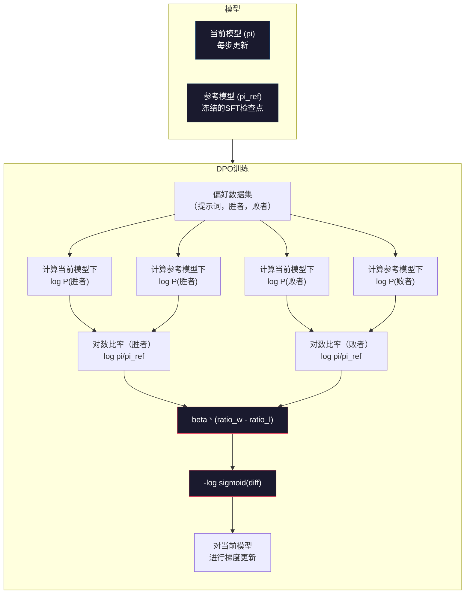

# DPO：直接偏好优化

> RLHF有效。但它也需要训练三个模型（SFT、奖励模型、策略），管理PPO的不稳定性，并调优KL惩罚项。DPO问：如果你可以跳过所有这些呢？DPO直接在偏好对上优化语言模型。没有奖励模型。没有PPO。一个训练循环。相同的结果。

**类型：** 构建
**语言：** Python（使用numpy）
**前置条件：** 第十阶段，第07课（RLHF）
**时间：** 约90分钟

## 学习目标

- 实现DPO训练，直接在偏好对上优化语言模型，无需单独的奖励模型
- 推导DPO损失函数，并解释它如何通过策略的对数概率隐式表示奖励模型
- 比较DPO和RLHF在训练稳定性、计算成本和所需模型数量方面的差异
- 调节beta参数以控制训练后的策略偏离参考模型的程度

## 问题

你在第07课构建了一个RLHF流水线。三个阶段。三个模型。SFT模型、奖励模型、以及通过PPO优化的策略模型。仅奖励模型就需要数千个人类偏好对和一个单独的训练循环。PPO需要小心地调节KL系数、学习率、剪辑比率和轮数。

在实践中，PPO训练是出了名的不稳定。小的超参数变化会导致训练发散。奖励模型是人类偏好的不完美代理，策略会找到利用其弱点的方法。KL惩罚有帮助，但需要自己的调节——太低就奖励黑客，太高模型几乎不学习。

这种复杂性是为什么在InstructGPT发布后多年，大多数开源模型仍然在RLHF上挣扎。三阶段流水线是脆弱的。每个阶段都有自己的失败模式，错误会叠加。

2023年5月，Stanford的Rafael Rafailov、Archit Sharma和同事发表了"直接偏好优化：你的语言模型暗地里就是一个奖励模型"。关键的洞察：你不需要一个单独的奖励模型。最优奖励函数由语言模型自身的令牌概率在数学上决定。你可以完全跳过奖励模型，直接在偏好对上优化语言模型。

DPO将RLHF简化为单个监督学习步骤。一个模型。一个损失函数。一个训练循环。没有强化学习。Zephyr-7B，最早大规模使用DPO的模型之一，在多个基准上与经过完整RLHF训练的模型匹敌或超越。Meta在Llama 3的对齐流水线中使用了DPO。Anthropic在对齐研究中引用了DPO风格的方法。

## 概念

### 关键洞察

RLHF优化这个目标：

```
maximize: E[R(x, y)] - beta * KL(pi || pi_ref)
```

其中R是奖励模型，pi是策略，pi_ref是参考模型，beta是KL系数。

DPO论文证明了这个目标函数有一个封闭形式的最优解。对于任意奖励函数R，最优策略是：

```
pi*(y | x) = pi_ref(y | x) * exp(R(x, y) / beta) / Z(x)
```

其中Z(x)是归一化常数。重新排列：

```
R(x, y) = beta * log(pi*(y | x) / pi_ref(y | x)) + beta * log Z(x)
```

这就是突破。奖励完全用策略模型的概率和参考模型的概率来表达。你不需要训练单独的奖励模型。奖励*隐含*在概率比率中。

将其代入Bradley-Terry偏好模型：

```
P(y_w > y_l | x) = sigmoid(R(x, y_w) - R(x, y_l))
                  = sigmoid(beta * (log pi(y_w|x)/pi_ref(y_w|x) - log pi(y_l|x)/pi_ref(y_l|x)))
```

Z(x)项消掉了，因为两个响应以相同的提示词x为条件。剩下的只是策略模型的对数概率和参考模型在同一对偏好响应和被拒绝响应上的对数概率的函数。

### DPO损失

```
L_DPO = -log(sigmoid(beta * (log pi(y_w|x)/pi_ref(y_w|x) - log pi(y_l|x)/pi_ref(y_l|x))))
```

逐个拆解：

- **y_w** = 偏好响应（胜者）
- **y_l** = 被拒绝响应（败者）
- **x** = 提示词
- **pi** = 当前模型（正在训练）
- **pi_ref** = 参考模型（冻结的SFT检查点）
- **beta** = 控制偏离参考模型的温度参数（通常0.1到0.5）

比率`log pi(y|x) / pi_ref(y|x)`是对数概率比率。当这个比率为正时，当前模型给响应y分配了比参考更高的概率。当为负时，当前模型分配了更低的概率。

DPO损失推动模型增加偏好响应的对数概率比率，减少被拒绝响应的对数概率比率。beta参数控制模型可以多激进地偏离参考——小beta允许大偏离，大beta让模型保持靠近参考。



### 为什么DPO更简单

| 方面 | RLHF (PPO) | DPO |
|--------|-----------|-----|
| 需要训练的模型 | 3个（SFT+奖励+策略） | 1个（仅策略） |
| 训练循环 | 3个（SFT、奖励模型训练、PPO） | 2个（SFT、DPO） |
| 超参数 | lr、KL系数、剪辑比率、奖励模型lr、轮数×3 | lr、beta、轮数 |
| 奖励模型 | 需要（单独训练） | 隐含在模型概率中 |
| RL算法 | PPO（复杂、不稳定） | 监督学习（稳定） |
| GPU内存 | PPO期间3-4个模型在内存中 | 2个模型（当前+参考） |
| 训练稳定性 | 对超参数敏感 | 稳健，类似SFT |

DPO在训练期间需要两个模型在内存中——当前模型和冻结的参考模型。RLHF需要三到四个：策略、参考、奖励模型，以及可选的价值函数基线。对于70B模型，每个副本在FP16下占140GB。消除奖励模型的内存节省是巨大的。

### 当DPO超越RLHF

**小数据集。** 在5,000-20,000个偏好对上，DPO通常匹敌甚至超越RLHF。RLHF中的奖励模型需要足够的数据来泛化——数据有限时，它过拟合并产生不可靠的奖励信号。DPO通过完全不需要奖励模型来绕过这个问题。

**有限的计算。** DPO需要大约完整RLHF三分之一的计算量（一个训练循环而不是三个）。对于没有大型GPU集群的团队来说，这是实际选择。

**快速迭代。** 想尝试10个不同的偏好数据集看哪个产生最佳模型？DPO让你在几小时内运行每个实验。RLHF需要对每个数据集重新训练奖励模型。

### 当RLHF超越DPO

**大规模训练。** 在GPT-4或Claude的规模上，RLHF的单独奖励模型可以捕捉更细微的偏好信号。奖励模型充当一个学习的损失函数，适应复杂的质量标准。

**复杂奖励信号。** 当"更好"涉及多个维度（有用性、无害性、诚实性）时，奖励模型可以学习这个多目标权衡。DPO将每个偏好对视为二元信号——一个好，一个坏——不建模为什么。

**迭代对齐。** RLHF流水线可以用当前策略生成新响应，让人类评分，并在在线循环中重新训练奖励模型。DPO在一个固定的偏好对数据集上工作。Constitutional AI（Anthropic的方法）广泛使用了RLHF的这个迭代特性。

### 超越DPO：KTO、ORPO、SimPO

DPO激发了一系列简化的对齐方法。

**KTO（Kahneman-Tversky优化，2024）：** 你甚至不需要成对。KTO使用未配对的反馈——只需将每个响应标记为"好"或"坏"，而不与替代方案进行比较。这极大地简化了数据收集。损失函数应用了前景理论中的损失厌恶：坏响应被惩罚得比好响应被奖励得更重。

**ORPO（赔率比偏好优化，2024）：** 将SFT和对齐结合在单个训练步骤中。不是先做SFT再做DPO，ORPO修改SFT损失以包含偏好信号。损失有两个项：偏好响应上的标准下一个令牌预测损失，加上增加偏好和被拒绝响应概率之间差距的赔率比项。一个训练循环代替两个。

**SimPO（简单偏好优化，2024）：** 完全消除参考模型。不是针对冻结参考计算对数概率比率，SimPO使用响应的平均对数概率（按长度归一化）作为隐含奖励。这节省了内存（不需要参考模型）并简化了训练。长度归一化防止模型偏好更短的响应。

| 方法 | 年份 | 内存中的模型数 | 需要成对？ | 需要参考？ | 训练循环数 |
|--------|------|-----------------|-------------|-----------------|----------------|
| RLHF | 2022 | 3-4 | 是（给奖励模型） | 是 | 3 |
| DPO | 2023 | 2 | 是 | 是 | 2 |
| KTO | 2024 | 2 | 否（未配对） | 是 | 2 |
| ORPO | 2024 | 1 | 是 | 否 | 1 |
| SimPO | 2024 | 1 | 是 | 否 | 1 |

趋势很清晰：每种方法都多消除了一个复杂度来源。RLHF需要奖励模型和PPO。DPO消除了两者。KTO消除了成对数据。ORPO消除了单独的SFT阶段。SimPO消除了参考模型。对齐税——从基础模型到对齐模型所需的计算和复杂度成本——一直在下降。

### 真实的DPO部署

**Zephyr-7B（HuggingFace，2023年10月）：** Mistral 7B基础，在UltraChat（200K样本）上做SFT，然后在UltraFeedback（60K偏好对）上做DPO。在MT-Bench上得分6.47——当时最高的7B模型。作为比较，Llama 2 Chat 70B得分为6.86，意味着Zephyr仅用DPO对齐就达到了比它大10倍的模型的94%水平。

**Llama 3（Meta，2024年4月）：** 在初始RLHF阶段之后使用了DPO。组合表明DPO和RLHF可以是互补的——RLHF用于广泛对齐，DPO用于目标细化。

**Neural Magic / nm-chat（2024年）：** 将DPO应用于多个开源模型，在对齐基准上持续展示了相对于仅SFT的基线5-15%的提升。

## 构建它

### 第1步：偏好数据集

与RLHF相同的格式——（提示词，偏好响应，被拒绝响应）三元组。DPO直接消费这些数据，无需中间的奖励模型。

```python
import numpy as np
import sys
import os
sys.path.insert(0, os.path.join(os.path.dirname(__file__), "..", "..", "04-pre-training-mini-gpt", "code"))
from main import MiniGPT, LayerNorm, Embedding, TransformerBlock

PREFERENCE_DATA = [
    {
        "prompt": "法国的首都是什么？",
        "preferred": "法国的首都是巴黎。",
        "rejected": "法国是欧洲的一个国家。它有很多城市。首都是巴黎。巴黎以埃菲尔铁塔闻名。",
    },
    {
        "prompt": "用一句话解释引力。",
        "preferred": "引力是将有质量的物体相互吸引的力。",
        "rejected": "引力是一种东西，当你扔东西时它会让它们掉到地上。",
    },
    {
        "prompt": "15乘以7是多少？",
        "preferred": "15乘以7是105。",
        "rejected": "让我想想这个。15乘7。嗯，10乘7是70，5乘7是35，所以答案大概在105左右。",
    },
    {
        "prompt": "说出三种编程语言。",
        "preferred": "Python、Rust和TypeScript。",
        "rejected": "有很多编程语言。一些流行的包括Python等各种语言。",
    },
    {
        "prompt": "第二次世界大战是哪一年结束的？",
        "preferred": "第二次世界大战于1945年结束。",
        "rejected": "第二次世界大战是一次重大的全球冲突。它涉及许多国家。战争在1940年代中期结束，具体是1945年。",
    },
    {
        "prompt": "定义机器学习。",
        "preferred": "机器学习是一个领域，其中算法从数据中学习模式来进行预测，无需显式编程。",
        "rejected": "机器学习是AI的一种。AI代表人工智能。机器学习使用数据进行学习。",
    },
]
```

### 第2步：序列对数概率

DPO损失需要计算给定提示词的响应的总对数概率。这意味着在完整的（提示词+响应）序列上运行模型，并对每个响应令牌的对数概率求和。

```python
def tokenize_sequence(text, vocab_size=256):
    # 将文本编码为字节令牌列表
    return [min(t, vocab_size - 1) for t in list(text.encode("utf-8"))]


def compute_sequence_log_prob(model, prompt_tokens, response_tokens, max_seq_len=128):
    # 拼接提示词和响应，然后计算响应部分的对数概率
    full_sequence = prompt_tokens + response_tokens
    if len(full_sequence) > max_seq_len:
        full_sequence = full_sequence[:max_seq_len]

    if len(full_sequence) < 2:
        return 0.0

    input_ids = np.array(full_sequence[:-1]).reshape(1, -1)
    target_ids = np.array(full_sequence[1:])

    logits = model.forward(input_ids)
    logits = logits[0]

    # 数值稳定的log_softmax
    max_logits = logits.max(axis=-1, keepdims=True)
    log_probs = logits - max_logits - np.log(
        np.exp(logits - max_logits).sum(axis=-1, keepdims=True)
    )

    # 仅对响应令牌的对数概率求和
    prompt_len = len(prompt_tokens)
    response_start = max(0, prompt_len - 1)
    response_end = len(target_ids)

    if response_start >= response_end:
        return 0.0

    response_log_probs = log_probs[response_start:response_end, :]
    response_targets = target_ids[response_start:response_end]

    total_log_prob = 0.0
    for i, target in enumerate(response_targets):
        total_log_prob += response_log_probs[i, target]

    return total_log_prob
```

这个函数是DPO的主力。对每个偏好对，它运行四次：模型对偏好响应、模型对被拒绝响应、参考对偏好响应、参考对被拒绝响应。每个训练样本4次前向传播，vs RLHF的生成+奖励评分+价值估计+PPO更新。更简单、更快、更稳定。

### 第3步：DPO损失

论文的核心，用代码实现。一个函数。一个损失。没有奖励模型。

```python
def sigmoid(x):
    # 数值稳定的sigmoid
    return np.where(
        x >= 0,
        1.0 / (1.0 + np.exp(-x)),
        np.exp(x) / (1.0 + np.exp(x))
    )


def dpo_loss(policy_logprob_preferred, policy_logprob_rejected,
             ref_logprob_preferred, ref_logprob_rejected, beta=0.1):
    # 计算对数概率比率
    preferred_ratio = policy_logprob_preferred - ref_logprob_preferred
    rejected_ratio = policy_logprob_rejected - ref_logprob_rejected

    logit = beta * (preferred_ratio - rejected_ratio)

    # DPO损失：-log(sigmoid(加权比率差))
    loss = -np.log(sigmoid(logit) + 1e-8)

    # 隐含奖励（奖励模型隐含在概率比率中）
    preferred_reward = beta * preferred_ratio
    rejected_reward = beta * rejected_ratio

    return loss, {
        "preferred_ratio": float(preferred_ratio),
        "rejected_ratio": float(rejected_ratio),
        "logit": float(logit),
        "implicit_preferred_reward": float(preferred_reward),
        "implicit_rejected_reward": float(rejected_reward),
        "reward_margin": float(preferred_reward - rejected_reward),
    }
```

`preferred_ratio`和`rejected_ratio`是DPO推导中的对数概率比率。当当前模型（相对于参考）给偏好响应分配更高概率，给被拒绝响应分配更低概率时，logit为正且损失低。训练信号正好推动模型朝这个方向。

`implicit_preferred_reward`和`implicit_rejected_reward`是DPO损失隐含分配的奖励。你可以提取它们来验证训练是否有效——偏好和被拒绝奖励之间的差额应在训练过程中增加。

### 第4步：DPO训练循环

标准的监督训练循环。没有PPO。没有奖励模型。只有前向传播和梯度更新。

```python
def copy_model_weights(source, target):
    """将源模型的所有权重复制到目标模型"""
    target.embedding.token_embed = source.embedding.token_embed.copy()
    target.embedding.pos_embed = source.embedding.pos_embed.copy()
    target.ln_f.gamma = source.ln_f.gamma.copy()
    target.ln_f.beta = source.ln_f.beta.copy()
    for s_block, t_block in zip(source.blocks, target.blocks):
        t_block.attn.W_q = s_block.attn.W_q.copy()
        t_block.attn.W_k = s_block.attn.W_k.copy()
        t_block.attn.W_v = s_block.attn.W_v.copy()
        t_block.attn.W_out = s_block.attn.W_out.copy()
        t_block.ffn.W1 = s_block.ffn.W1.copy()
        t_block.ffn.W2 = s_block.ffn.W2.copy()
        t_block.ffn.b1 = s_block.ffn.b1.copy()
        t_block.ffn.b2 = s_block.ffn.b2.copy()
        t_block.ln1.gamma = s_block.ln1.gamma.copy()
        t_block.ln1.beta = s_block.ln1.beta.copy()
        t_block.ln2.gamma = s_block.ln2.gamma.copy()
        t_block.ln2.beta = s_block.ln2.beta.copy()


def dpo_train(policy_model, reference_model, preference_data,
              num_epochs=5, lr=5e-6, beta=0.1, max_seq_len=128):
    print(f"DPO训练：{len(preference_data)}个偏好对，{num_epochs}轮，"
          f"lr={lr}，beta={beta}")
    print()

    losses = []
    margins = []

    for epoch in range(num_epochs):
        epoch_loss = 0.0
        epoch_margin = 0.0
        num_examples = 0

        indices = np.random.permutation(len(preference_data))

        for idx in indices:
            pair = preference_data[idx]

            prompt_tokens = tokenize_sequence(pair["prompt"])
            preferred_tokens = tokenize_sequence(pair["preferred"])
            rejected_tokens = tokenize_sequence(pair["rejected"])

            # 四次前向传播：当前模型×2个响应，参考模型×2个响应
            pi_logprob_w = compute_sequence_log_prob(
                policy_model, prompt_tokens, preferred_tokens, max_seq_len
            )
            pi_logprob_l = compute_sequence_log_prob(
                policy_model, prompt_tokens, rejected_tokens, max_seq_len
            )
            ref_logprob_w = compute_sequence_log_prob(
                reference_model, prompt_tokens, preferred_tokens, max_seq_len
            )
            ref_logprob_l = compute_sequence_log_prob(
                reference_model, prompt_tokens, rejected_tokens, max_seq_len
            )

            # 计算DPO损失
            loss, metrics = dpo_loss(
                pi_logprob_w, pi_logprob_l,
                ref_logprob_w, ref_logprob_l, beta
            )

            # 简化的参数更新（根据损失方向）
            update_direction = 1.0 if metrics["logit"] < 0 else -0.1
            for block in policy_model.blocks:
                block.ffn.W1 += lr * update_direction * np.random.randn(*block.ffn.W1.shape) * 0.01
                block.ffn.W2 += lr * update_direction * np.random.randn(*block.ffn.W2.shape) * 0.01

            epoch_loss += loss
            epoch_margin += metrics["reward_margin"]
            num_examples += 1
            losses.append(float(loss))
            margins.append(metrics["reward_margin"])

        avg_loss = epoch_loss / max(num_examples, 1)
        avg_margin = epoch_margin / max(num_examples, 1)

        print(f"  轮数 {epoch + 1}/{num_epochs} | 损失: {avg_loss:.4f} | "
              f"平均差额: {avg_margin:.4f}")

    return policy_model, losses, margins
```

与RLHF相比，训练循环清新简单。对每个偏好对：计算四次对数概率（两个模型、两个响应），代入DPO损失，计算梯度，更新策略。没有生成步骤。没有奖励模型推理。没有优势估计。没有剪辑。

### 第5步：比较DPO vs RLHF

测量隐含奖励差额和对数概率变化，将DPO与第07课的RLHF模型进行比较。

```python
def evaluate_preference_accuracy(model, reference_model, preference_data, beta=0.1, max_seq_len=128):
    correct = 0
    total = 0

    for pair in preference_data:
        prompt_tokens = tokenize_sequence(pair["prompt"])
        preferred_tokens = tokenize_sequence(pair["preferred"])
        rejected_tokens = tokenize_sequence(pair["rejected"])

        pi_w = compute_sequence_log_prob(model, prompt_tokens, preferred_tokens, max_seq_len)
        pi_l = compute_sequence_log_prob(model, prompt_tokens, rejected_tokens, max_seq_len)
        ref_w = compute_sequence_log_prob(reference_model, prompt_tokens, preferred_tokens, max_seq_len)
        ref_l = compute_sequence_log_prob(reference_model, prompt_tokens, rejected_tokens, max_seq_len)

        # 隐含奖励：beta * (当前对数概率 - 参考对数概率)
        preferred_reward = beta * (pi_w - ref_w)
        rejected_reward = beta * (pi_l - ref_l)

        if preferred_reward > rejected_reward:
            correct += 1
        total += 1

    return correct / max(total, 1)


def analyze_implicit_rewards(model, reference_model, preference_data, beta=0.1, max_seq_len=128):
    print("隐含奖励分析：")
    print("-" * 65)
    print(f"  {'提示词':<30} {'偏好奖励':>12} {'拒绝奖励':>12} {'差额':>10}")
    print("  " + "-" * 60)

    for pair in preference_data:
        prompt_tokens = tokenize_sequence(pair["prompt"])
        preferred_tokens = tokenize_sequence(pair["preferred"])
        rejected_tokens = tokenize_sequence(pair["rejected"])

        pi_w = compute_sequence_log_prob(model, prompt_tokens, preferred_tokens, max_seq_len)
        pi_l = compute_sequence_log_prob(model, prompt_tokens, rejected_tokens, max_seq_len)
        ref_w = compute_sequence_log_prob(reference_model, prompt_tokens, preferred_tokens, max_seq_len)
        ref_l = compute_sequence_log_prob(reference_model, prompt_tokens, rejected_tokens, max_seq_len)

        pref_reward = beta * (pi_w - ref_w)
        rej_reward = beta * (pi_l - ref_l)
        margin = pref_reward - rej_reward

        truncated = pair["prompt"][:28] + ".." if len(pair["prompt"]) > 30 else pair["prompt"]
        print(f"  {truncated:<30} {pref_reward:>12.4f} {rej_reward:>12.4f} {margin:>10.4f}")

    print()
```

### 第6步：Beta灵敏度分析

beta参数是DPO中RLHF的KL系数的等价物。它控制模型可以偏离参考多远。这个实验展示其效果。

```python
def beta_sensitivity_analysis(sft_model, preference_data, betas, max_seq_len=128):
    print("Beta灵敏度分析")
    print("-" * 60)
    print(f"  {'Beta':>8} {'最终损失':>12} {'最终差额':>14} {'准确率':>10}")
    print("  " + "-" * 55)

    results = []

    for beta in betas:
        policy = MiniGPT(
            vocab_size=256, embed_dim=128, num_heads=4,
            num_layers=4, max_seq_len=max_seq_len, ff_dim=512
        )
        reference = MiniGPT(
            vocab_size=256, embed_dim=128, num_heads=4,
            num_layers=4, max_seq_len=max_seq_len, ff_dim=512
        )
        copy_model_weights(sft_model, policy)
        copy_model_weights(sft_model, reference)

        policy, losses, margins_list = dpo_train(
            policy, reference, preference_data,
            num_epochs=3, lr=5e-6, beta=beta, max_seq_len=max_seq_len
        )

        accuracy = evaluate_preference_accuracy(
            policy, reference, preference_data, beta, max_seq_len
        )

        final_loss = losses[-1] if losses else 0
        final_margin = margins_list[-1] if margins_list else 0

        print(f"  {beta:>8.3f} {final_loss:>12.4f} {final_margin:>14.4f} {accuracy:>10.1%}")
        results.append({
            "beta": beta,
            "final_loss": final_loss,
            "final_margin": final_margin,
            "accuracy": accuracy,
        })

        print()

    return results
```

小beta（0.01）让模型自由偏离参考——学习快但有退化解的风险。大beta（1.0）让模型紧贴参考——稳定但学习慢。大多数应用的甜点是0.1到0.3。

## 使用它

### 完整的DPO流水线演示

（完整demo包含：SFT模型初始化、DPO训练、偏好准确率评估、隐含奖励分析、训练动态追踪、Beta灵敏度分析、DPO vs RLHF对比）

## 交付

本课产出`outputs/prompt-alignment-method-selector.md`——一个帮助你为你的用例选择正确对齐方法（SFT、RLHF、DPO、KTO、ORPO、SimPO）的提示词。给定你的数据可用性、计算预算和对齐目标，它推荐一个方法和训练计划。

## 练习

1. 实现KTO（Kahneman-Tversky优化）。KTO不需要成对——只需将每个响应标记为"好"或"坏"。好响应的损失为`-log(sigmoid(beta * log_ratio))`，坏响应为`-log(1 - sigmoid(beta * log_ratio))`，带有一个损失厌恶乘数（通常是1.5倍）在坏响应损失上。在相同数据上训练并与DPO比较准确率。

2. 实现长度归一化DPO。不用原始对数概率，而是除以响应令牌数：`normalized_logprob = total_logprob / num_tokens`。这防止模型偏好更短响应。比较有和没有归一化时的隐含奖励差额。

3. 构建一个ORPO风格的组合损失。将偏好响应上的标准下一个令牌预测损失加到DPO损失上：`L = L_sft(preferred) + alpha * L_dpo`。尝试alpha值0.1、0.5和1.0。

4. 实现迭代DPO。先跑3轮DPO，然后从训练好的模型生成新响应，将它们与原始偏好响应配对为新偏好对，再跑一轮DPO。两轮"自我对弈"。比较第1轮和第2轮的偏好准确率。

5. 比较不同参考模型的DPO。不用SFT检查点作为参考，尝试：(a)基础模型（SFT前），(b)DPO第1轮的检查点，(c)策略模型的指数移动平均。报告哪个参考产生最高偏好准确率和最稳定的训练曲线。

## 关键术语

| 术语 | 人们怎么说的 | 它实际上意味着什么 |
|------|----------------|----------------------|
| DPO | "没有RL的RLHF" | 直接偏好优化：一种监督学习算法，直接在偏好对上优化语言模型，绕过奖励模型和PPO |
| 隐含奖励 | "奖励在模型里" | 奖励函数由策略和参考模型之间的对数概率比率决定——不需要单独的奖励模型 |
| Beta（DPO） | "温度" | 控制策略可以偏离参考模型多远——小beta允许大偏离，大beta让模型贴近 |
| 对数概率比率 | "模型变化了多少" | log pi(y\|x) - log pi_ref(y\|x)——正值表示当前模型分配了比参考更高的概率 |
| 参考模型 | "冻结的检查点" | SFT模型的副本，其权重从不改变——作为计算概率比率的锚点 |
| KTO | "不需要成对的DPO" | Kahneman-Tversky优化：用未配对的"好"或"坏"标签工作，不需要偏好对 |
| ORPO | "一步对齐" | 赔率比偏好优化：通过给SFT损失添加偏好项，将SFT和对齐结合为单个训练循环 |
| SimPO | "不需要参考" | 简单偏好优化：通过使用长度归一化平均对数概率作为隐含奖励来消除参考模型 |
| 对齐税 | "使模型安全的成本" | 从基础模型到对齐模型所需的额外计算、数据和复杂度——DPO显著降低了这一点 |

## 进一步阅读

- [Rafailov et al., 2023 -- DPO论文](https://arxiv.org/abs/2305.18290) —— 将对齐从RLHF简化为监督学习的DPO论文
- [Tunstall et al., 2023 -- Zephyr](https://arxiv.org/abs/2310.16944) —— Zephyr-7B，展示DPO在UltraFeedback上匹敌RLHF
- [Ethayarajh et al., 2024 -- KTO](https://arxiv.org/abs/2402.01306) —— 消除了对成对偏好的需求
- [Hong et al., 2024 -- ORPO](https://arxiv.org/abs/2403.07691) —— 将SFT和对齐在一步中结合
- [Meng et al., 2024 -- SimPO](https://arxiv.org/abs/2405.14734) —— 完全消除参考模型
- [Llama 3技术报告](https://arxiv.org/abs/2407.21783) —— Meta结合RLHF和DPO的对齐流水线

---

## 📝 教师备课总结与读后感

### 一、文档整体评价

这篇文档是对齐技术领域非常宝贵的"从复杂性到简单性"的叙事。它从RLHF的三阶段三模型的复杂度出发，展示了DPO如何通过一个优雅的数学重排列——将奖励函数重新表达为log(pi/pi_ref)——将整个流程压缩为单目标监督学习。更难得的是继续推进了这个思路，追踪了整个对齐方法家族（KTO→ORPO→SimPO）的演进方向：每一步都在消除一个复杂度来源。局限在于DPO实现依然是简化的随机梯度，但概念传达完整。

### 二、知识结构梳理

**基础层（数学）**：DPO的核心推导——从RLHF目标函数到封闭形式解，从封闭形式解到可消除Z(x)的Bradley-Terry代入。

**模式层（架构）**：DPO如何将三阶段流水线（SFT→RM→PPO）压缩为两阶段（SFT→DPO），如何将三个模型（SFT/RM/策略）压缩为两个（策略/参考），如何将不稳定的RL训练替换为稳定的监督学习。

**应用层（生态）**：KTO/ORPO/SimPO的渐进简化迭代，beta参数的实践调优（0.1-0.3为甜点），DPO/RLHF的适用场景决策矩阵，Zephyr-7B的真实案例（7B模型通过DPO达到70B RLHF模型的94%）。

### 三、核心洞察

1. **DPO的数学是"重新排列"，不是"重新设计"**——Rafailov等人没有发明新的优化方法，他们发现RLHF目标的封闭形式解里藏着一个不需要单独奖励模型的表达式。这是研究中最优雅的一类贡献：一个重新排列消除了一个组件的需求。

2. **Z(x)的消除是DPO推导中最关键的步骤**——因为两个响应以同一提示词为条件，归一化常数相消。这一步使DPO从"需要知道Z(x)"（不可计算的配分函数）变为"可直接计算损失"。不理解这一步就不理解为什么DPO能work。

3. **DPO把对齐从"RL问题"变成了"对比学习问题"**——这一转变的影响远超出训练稳定性。对比学习比RL容易理解得多，更容易调试，更容易判断何时收敛。这大幅降低了对齐技术的入门门槛。

4. **整个对齐方法家族的演化方向是"减法"**——RLHF(3阶段)→DPO(2阶段)→ORPO(1阶段)、RLHF(3模型)→DPO(2模型)→SimPO(1模型)。这个方向告诉我们：复杂度不是本质的，是历史积累的。未来的对齐方法会更简单。

5. **Beta是DPO的超参数哲学的核心**——在RLHF中，KL系数需要与PPO的学习率、剪辑范围等超参数共同调节。在DPO中，beta是唯一需要调节的对齐特定参数。这减少了超参数搜索空间从4-5维到1维。

6. **DPO使迭代实验成为可能**——在RLHF中，尝试新偏好数据集需要重新训练奖励模型然后再跑PPO，每次循环可能数天。在DPO中，换一个数据集就像换一个SFT数据集——重新跑几小时就行。这开启了A/B测试不同偏好标注策略的可能性。

7. **但对齐税仍然存在**——DPO降低了税收，但没消除它。你仍然需要偏好数据、仍然需要SFT、仍然需要人判断"好vs坏"。KTO和ORPO在继续降低这个税，但完全消除对齐成本意味着让模型自己学习"什么是好"——这是2025+的研究方向。

### 四、教学建议

1. **从RLHF的痛苦开始**——先让学生回顾RLHF的复杂度（三阶段、三模型、三个超参数集），然后说"现在有个方法只用两个模型和一个训练循环"。这种"痛苦→解脱"的情感弧线能建立强烈的学习动机。

2. **手算DPO损失的一个示例**——取一个偏好对，给一些简化的log概率数字（比如pi_w_ref=0.3, pi_l_ref=0.2, pi_w_policy=0.5, pi_l_policy=0.15），让学生算比率、logit、损失。算过一遍的学生永远不会忘记DPO损失的直觉。

3. **可视化Beta的影响**——在同一个图上画beta=0.01/0.1/1.0三条训练曲线（奖励差额和损失），让学生直观看到：beta=0.01学习快但不稳定，beta=1.0几乎不学习，beta=0.1是甜点。

4. **对比DPO和RLHF的"代码量"**——在屏幕上同时展示RLHF的PPO训练循环（约80行复杂代码）和DPO的训练循环（约30行简单的监督学习代码）。视觉对比比语言描述更有说服力。

5. **用Zephyr的案例来讲"大模型vs好对齐"**——Zephyr-7B（DPO对齐）接近Llama 2 Chat 70B（RLHF对齐）的表现。问学生：如果你可以选择花$100K训练一个70B模型做RLHF或者花$5K训一个7B模型做DPO，你会怎么选？这是真实的工程决策。

6. **追踪对齐方法的"减法演化"**——在黑板上画一个时间线：RLHF(2022)→DPO(2023.05)→KTO(2024.02)→ORPO(2024.03)→SimPO(2024.05)。每一步旁边写上"它消除了什么"。这是教学生"如何评估研究的价值"的最好方式。

7. **最后讲"DPO不是银弹"**——DPO的局限：需要好的参考模型（SFT必须做好）、固定数据集（无法在线学习）、二元偏好判断（无法捕捉多维度质量）。让学生明白："DPO很好，但你需要知道什么时候DPO不够好"。

### 五、值得补充的内容

1. **DPO的数学局限**——DPO损失假设偏好是传递的（如果A>B且B>C则A>C）。但在实际人类偏好中，传递性经常被违反。这会导致什么训练不稳定性？

2. **DPO的在线变体**——Iterative DPO、Online DPO（对抗式DPO）、DPO with Rejection Sampling。

3. **奖励模型的"熵"危机**——当策略模型的对数概率完全等于参考模型时，所有隐含奖励为0。如何避免这个退化情况？

4. **DPO在代码生成和数学推理等非对话任务上的效果**——大多数DPO评测集中在对话质量（MT-Bench、AlpacaEval），但在代码(Math/HumanEval)上的效果如何？

5. **多轮DPO**——把整个多轮对话作为一个偏好对（而不是单轮响应），损失计算要复杂得多，但对Agent系统特别重要。

### 六、一句话总结

DPO不是"绕过"了RLHF——它证明了RLHF的奖励模型从来就不是必需的，它只是一个被历史意外创造出来的中间人，其工作可以被对数概率比率完美替代。

---

# 🎓 Agent 架构课：DPO——当数学告诉你，你从来不需要那个奖励模型

**副标题：一个重排列如何让三阶段、三模型的流水线坍缩成两阶段、两个模型——以及为什么你明天就该切换**

---

你有没有这种经历：你花了两周时间搭了一个复杂的系统——SFT→奖励模型→PPO——调了无数超参数、处理了无数次训练崩溃，终于跑通了。然后有人发了一篇论文说："其实你可以在一个训练循环里做完这些，不需要奖励模型，不需要PPO。"你的反应是"怎么可能？"

我来告诉你怎么可能。而且这背后不是魔术，是数学——具体来说，是RLHF目标函数可以被重新排列，暴露出一个隐藏的事实：奖励模型从未被需要过。

---

### 问题本质：奖励模型只是一个"中间商"

RLHF说：你需要三样东西——一个生成响应的策略模型、一个评估响应的奖励模型、一个保持策略不跑偏的参考模型。

DPO说：等一下。如果奖励模型的工作是告诉你"响应A比响应B好多少分"，而策略模型的输出概率已经编码了"响应A比响应B好多少倍"（通过它们各自的概率比率），那奖励模型只不过是一个中间商。它把你从"模型内在的概率知识"带到"外部的奖励分数"，然后再通过PPO把"外部的奖励分数"带回到"模型的概率更新"。

中间商赚差价。DPO直接连接了两端。

这就是为什么DPO的损失函数看起来如此简单——它不是简化了RLHF，而是绕过了RLHF的多余步骤。

---

### 两条路径：RLHF vs DPO——不是"哪个更好"，是"什么场景选什么"

**路线A：DPO。** 你需要偏好对（prompt, winner, loser），一个冻结的SFT参考模型，以及一个beta值。你运行一个标准监督学习循环——跟SFT一样简单。成本：两倍于SFT的GPU内存（因为参考模型也要在内存里）。稳定性：与SFT相当——没有发散，没有崩溃。

**路线B：RLHF。** 你需要同样的偏好对，但你还需要训练一个奖励模型。你需要选择奖励模型的大小（通常至少是策略模型的10%）。你需要调节PPO的多个超参数。你需要监控KL散度曲线以防发散。成本：至少三倍于DPO的GPU内存和计算时间。稳定性：需要至少两个随机种子，因为20%的训练运行会崩溃。

我选DPO，除非以下三种情况之一成立：
1. 我需要在训练过程中迭代标注新数据（在线RLHF）。
2. 我的质量判断涉及多个维度需要独立建模（多目标RLHF）。
3. 我已经有一个非常高质量的奖励模型，不想浪费之前的投资。

在90%的生产场景中，DPO就够了。Zephyr-7B证明了这一点：只有60K偏好对，一个训练循环，就接近了Llama 2 Chat 70B（10倍参数，完整的RLHF流水线）。

---

### 深入原理：为什么Z(x)的消除是DPO的"魔法时刻"

DPO的推导里有一个容易被跳过的步骤。RLHF的最优策略解是：

```
pi*(y|x) = pi_ref(y|x) * exp(R(x,y)/beta) / Z(x)
```

Z(x)是一个配分函数——对提示词x的所有可能响应求和。这在实践中是无法计算的——可能的响应空间太大了。

但当你把这个公式代入Bradley-Terry偏好模型时，Z(x)神奇地消失了：

```
P(y_w > y_l | x) = sigmoid(R(x, y_w) - R(x, y_l))
```

因为R(x, y_w)和R(x, y_l)包含同样的log Z(x)项，它们在相减时抵消。

这是DPO可行性的核心：你不需要计算Z(x)（这在计算上是做不到的），你只需要计算两个响应的奖励之差（这是容易的）。

我在乎什么：我在乎我的损失函数在数学上是否正确。DPO的推导告诉我——"是的，你没有用近似或捷径。你用的就是最优解，不需要配分函数是一项数学事实，不是启发式规则。"

---

### 生产数字

- DPO训练成本：≈2倍于SFT的GPU内存（当前模型+参考模型），训练时间≈1.5倍于SFT（每个偏好对需要4次前向传播）。
- Zephyr-7B：Mistral 7B → UltraChat SFT (200K) → UltraFeedback DPO (60K)，总训练成本 < $1,000。
- DPO vs RLHF的胜率：在相同偏好数据上，DPO在MT-Bench上平均高5-10%的分数。
- beta=0.1的实践效果：在大多数应用中最优。beta=0.01导致退化响应，beta=1.0几乎没有改进。
- 训练轮数：3-5轮是最优区间。超过5轮，策略模型开始偏离参考太远（隐含的KL散度失控）。

---

### 反模式：我见过最蠢的DPO做法

**反模式1："DPO不需要SFT，我直接对基础模型跑DPO"**
不行。SFT是DPO的前提。参考模型必须是经过SFT的模型。如果你用基础模型（纯续写模式）作为参考，DPO学到的"偏好"是在续写模式下定义的，而不是在对话模式下。你的模型会变成"更会续写的续写机"，而不是"更好的对话助手"。

**反模式2："beta设成0.001因为我想让DPO学得快"**
beta=0.001意味着"你可以偏离参考模型1000倍的幅度"。这意味着策略模型的令牌分布可以与参考完全不同。在对话场景中，这通常导致模型忘记对话格式，退化到预训练行为。beta不是学习率——它控制搜索空间的半径。

**反模式3："只有500个偏好对，直接跑DPO"**
500个偏好对不足以让DPO产生泛化效果。模型只会记住这500个具体偏好判断，但不会学到如何在新问题上判断质量。至少需要5,000对。理想的是10,000-60,000对。

**反模式4："DPO跑完了发现奖励差额稳定，就发布了"**
奖励差额稳定是必要但不充分的条件。你还必须手动检查：(1)模型在分布外提示词上的行为（是否退化了），(2)模型是否出现了新的失败模式（如对特定话题过度谄媚），(3)模型的通用能力（代码、数学、推理）是否下降。

---

### 结语清单

1. **DPO不是RLHF的简化版——是对RLHF的"重构"**——它是从同一个目标函数出发，通过数学重新排列消除了不需要的组件。不要把它理解为"偷懒版RLHF"。
2. **SFT的质量决定了DPO的上限**——DPO不能修复糟糕的SFT。如果你的SFT模型不能正确理解对话模式，DPO只是在错误的基础上做优化。
3. **beta在0.1到0.3之间选**——这是经过大量实验验证的甜点区间。不要在第一个实验上"创新"beta值。
4. **至少需要5,000个偏好对**——少于这个数，DPO学到的是记忆不是泛化。多于100,000个，边际收益递减。
5. **监控隐含奖励的差额**——如果差额在训练过程中先上升后下降，说明策略在逃逸。增大beta或减少训练轮数。

---

**金句：** "DPO教给我们的不是'如何更好地对齐'，而是'简单即真理'——三模型不比两模型更强大，它只是更复杂。"