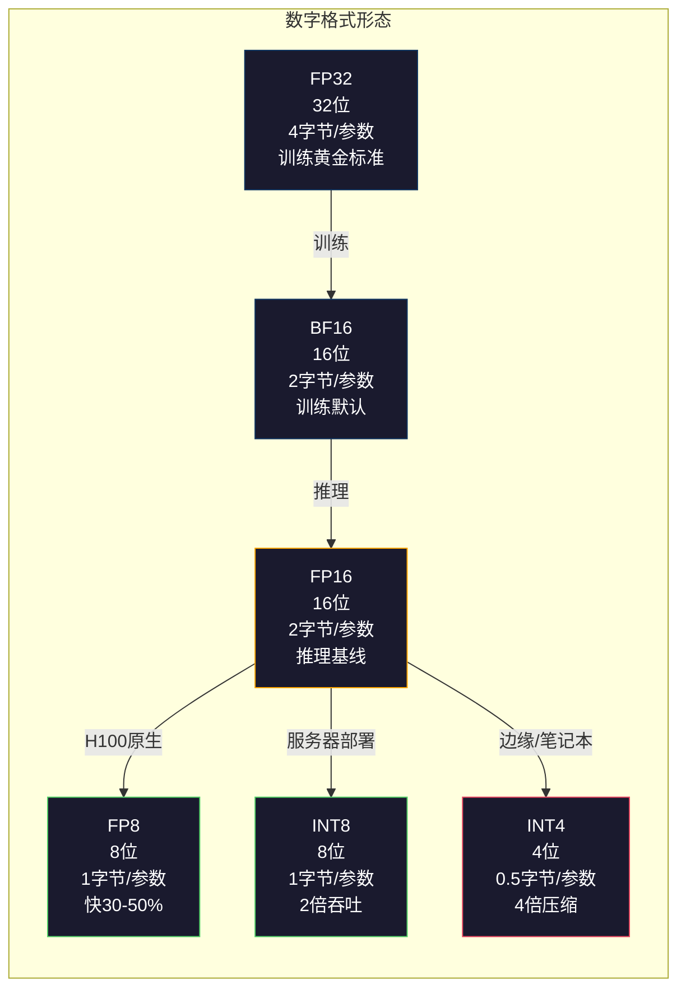
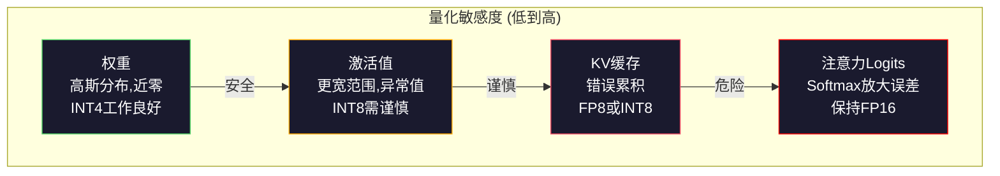
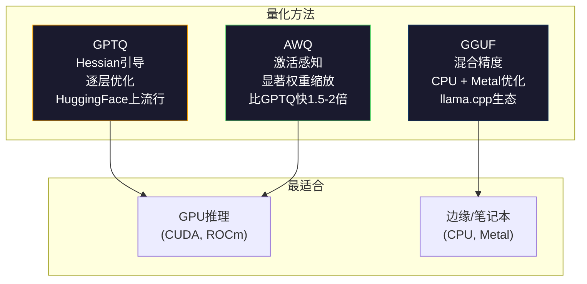

# 量化：让模型变小

> 一个FP16的70B模型需要140GB。两块A100只够放权重。量化到FP8：一块80GB GPU。INT4：一台MacBook。

**类型：** 构建
**语言：** Python（使用numpy）
**前置条件：** 第10阶段，第01-10课（从零开始的LLM）
**时间：** 约120分钟

## 学习目标

- 实现从FP16到INT8和INT4的对称和非对称量化，包括逐张量和逐通道缩放
- 计算量化的内存节省，判断哪种精度适合给定GPU的显存
- 解释训练后量化（PTQ）与量化感知训练（QAT）的区别
- 应用GPTQ或AWQ量化真实模型，在基准上测量精度-内存权衡

## 问题

Llama 3 70B有700亿参数。每个参数是一个16位浮点数。那就是1400亿字节。140GB。单张A100有80GB显存。你甚至不能加载权重，更不用说运行推理，在单块GPU上。你需要两块A100，每块每小时2美元，仅为了服务一个模型。

但每个参数16位是浪费。神经网络中大多数权重聚集在零附近。FP16的完整动态范围（从0.000000059到65,504）几乎完全未使用。如果你测量Llama 3 70B中权重的实际分布，95%落在-0.1到+0.1之间。你烧掉16位来表示可以用4位容纳的值。

量化用低精度数字替换高精度数字。FP16到FP8将内存减半。FP16到INT4将其降至四分之一。140GB模型变成35GB。它适合单张消费级GPU。推到2位量化（激进、有损，但对某些任务可用），同一个模型跑在16GB笔记本上。

代价是精度。每去掉一位就摧毁一点信息。问题是你在哪里损失了多少精度，损失了多少。良好量化的INT4模型在大多数基准上保留原始质量的95-99%。朴素的INT4量化能完全摧毁模型。区别在于技术。

社区用GPTQ将Llama 3量化到INT4，在WikiText上大约损失1-2个困惑点。Mistral发布了Mixtral 8x22B的FP8检查点，MMLU上零可测量质量损失。GGUF格式驱动llama.cpp，在带M系列芯片的MacBook上运行70B模型。量化不是黑科技，它是每个大于7B模型的标准部署路径。

## 概念

### 数字格式：每一位做什么

每个浮点数有三个部分：符号、指数和尾数（也称有效数）。符号是一位。指数决定范围（数字能多大或多小）。尾数决定精度（你能得到多少位小数）。

```
FP32:  [1 符号] [8 指数] [23 尾数]  = 32 位
FP16:  [1 符号] [5 指数] [10 尾数]  = 16 位
BF16:  [1 符号] [8 指数] [7  尾数]  = 16 位
FP8:   [1 符号] [4 指数] [3  尾数]  = 8  位 (E4M3)
FP8:   [1 符号] [5 指数] [2  尾数]  = 8  位 (E5M2)
INT8:  [1 符号] [7 数值]             = 8  位 (均匀步长)
INT4:  [1 符号] [3 数值]             = 4  位 (共16个级别)
```

**FP32** 是全精度。23个尾数位给你约7位十进制精度。范围：大约1.2×10^-38到3.4×10^38。训练曾经只在FP32中进行。现在仍在累加（矩阵乘法中的运行和）中使用。

**FP16** 将位数减半。10个尾数位给约3.3位十进制精度。指数缩减到5位，极大地减小了范围（最大值约65,504）。这对权重（聚集在零附近）没问题，但对训练中可能尖峰的激活和梯度有风险。FP16训练需要损失缩放来防止下溢。

**BF16**（Brain Float 16）保留FP32的8位指数但将尾数缩减到7位。与FP32相同的范围，比FP16更少的精度。Google专为深度学习设计。直觉：范围对神经网络比精度更重要。在FP16中下溢到零的10^-20梯度在BF16中存活。在BF16中从0.07342四舍五入到0.0734的权重足够接近。每个现代训练运行使用BF16或BF16/FP32混合。

**FP8** 有两种风格。E4M3（4指数，3尾数）用于推理中的权重和激活。E5M2（5指数，2尾数）用于训练中的梯度，因为此时范围比精度更重要。H100 GPU上的FP8推理相比FP16实现30-50%加速，质量损失可忽略。

**INT8** 是整数格式。没有指数，没有尾数。只有256个均匀间隔的值从-128到127。你需要一个缩放因子将浮点权重映射到这个范围。优势：整数算术比浮点更快、更省电。A100上INT8矩阵乘法达到624 TOPS而FP16为312 TFLOPS。

**INT4** 更进一步。只有16个可能的值。缩放因子承担重任。质量完全取决于你如何选择缩放以及量化哪些权重。最先进的INT4方法（GPTQ、AWQ）保留原始模型质量的95%以上。



### 量化如何工作

核心操作很简单。取一个浮点值张量，找一个缩放因子，乘以它，四舍五入到最近整数，存储整数加缩放因子。

**量化：**
```
scale = 张量绝对值的最大值 / 最大整数值
quantized = round(张量 / scale)
```

**反量化：**
```
reconstructed = quantized * scale
```

对于带对称范围（-127到127）的INT8：
```
scale = 张量绝对值的最大值 / 127
quantized = clamp(round(张量 / scale), -128, 127)
```

误差是四舍五入误差。每个值最多偏离`scale / 2`。一层中的总误差取决于你有多少权重以及模型对这些权重的扰动有多敏感。

**逐张量vs逐通道量化。** 逐张量对整个权重矩阵使用一个缩放因子。简单但有损：如果一列有大值而另一列有小值，小值损失大部分精度。逐通道为每个输出通道（权重矩阵的每行或每列）使用一个缩放因子。更多开销（存储N个缩放因子而非1个）但质量急剧改善。每种生产量化方法都使用逐通道或更细粒度。

**非对称量化**添加一个零点偏移：`quantized = round(张量 / scale) + zero_point`。这处理不以零为中心的分布。例如ReLU激活值总是非负的。对称量化把一半的整数范围浪费在从不出现的负值上。非对称量化将实际范围[min, max]映射到完整整数范围。

### 敏感性层级

并非模型中所有东西都同等容忍量化。有一个清晰的层级。

**权重（最强韧）。** 模型权重在训练中缓慢变化，遵循近似高斯分布，中心在零附近。它们量化效果好。带逐通道缩放的INT8权重产生接近无损的结果。INT4需要更复杂的方法但可行。

**激活值（敏感度中等）。** 激活值是通过网络在推理中流动的中间值。它们比权重有更宽的动态范围，并且包含异常值。单个注意力头可能产生比均值大100倍的激活值。这些异常值对模型质量至关重要。朴素地量化它们会摧毁信息。解决方案：将异常值通道保持在高精度（LLM.int8()），使用逐令牌或逐通道激活缩放。

**KV缓存（高敏感度）。** 键值缓存存储所有先前令牌的注意力状态。在长上下文长度下，KV缓存主导内存。对于32K上下文的70B模型，KV缓存单独是40GB（FP16）。将KV缓存量化到FP8或INT8节省大量内存，但任何错误在所有未来注意力计算中累积。质量影响随序列长度增长。

**注意力logits（最敏感）。** 注意力中的softmax对其输入的微小变化高度敏感。预softmax logit的0.01量化误差可以显著改变注意力分布。大多数量化方案将注意力计算保持在高精度（FP16或BF16），即使其他一切都被量化。



### PTQ vs QAT

**训练后量化（PTQ）** 量化一个已训练好的模型。不重新训练。你取FP16权重，计算缩放因子，四舍五入，部署。快速（几分钟到几小时）且便宜。对INT8和FP8效果很好。对INT4，朴素PTQ往往严重失败，因为四舍五入误差累积。高级PTQ方法（GPTQ、AWQ）使用校准数据最小化量化误差。

**量化感知训练（QAT）** 在训练前向传播中插入假量化操作。模型学会将权重放在四舍五入误差较小的地方。梯度通过假量化使用直通估计器（STE）流动：假装四舍五入操作的梯度是1。QAT产生比PTQ更好的INT4和INT2模型，但需要完整的训练运行。Google用QAT做Gemini的高效服务。Meta对某些Llama部署目标使用QAT。

| 方面 | PTQ | QAT |
|------|-----|-----|
| 成本 | 几分钟到几小时 | 完整训练运行 |
| INT8质量 | 优秀 (<0.1%损失) | 优秀 |
| INT4质量 | GPTQ/AWQ良好 (1-3%损失) | 更好 (<1%损失) |
| INT2质量 | 差 | 对某些任务可用 |
| 校准数据 | 128-1024个样本 | 完整训练数据集 |
| 何时使用 | 部署、迭代 | 低位宽下最大化质量 |

### GPTQ、AWQ、GGUF

**GPTQ（GPT量化）** 是一次性PTQ方法。一次量化一层，使用小型校准数据集（通常128个样本）测量Hessian矩阵（关于输出对每个权重敏感度的二阶信息）。Hessian认为重要的权重被更仔细地量化。GPTQ是第一个使INT4量化对LLM实用的方法。HuggingFace上的TheBloke通过发布数百个模型的量化版普及了GPTQ。

**AWQ（激活感知权重量化）** 观察到一小部分权重（约1%）不成比例地重要，因为它们与大激活值相乘。AWQ使用校准数据识别这些显著权重，在量化前放大它们（然后相应缩小对应的激活值）。这使重要权重保持在INT4量化准确的范围内。AWQ通常在质量上与GPTQ持平或略胜，应用速度快1.5-2倍。

**GGUF（GPT生成统一格式）** 是llama.cpp及其生态系统使用的文件格式。它支持混合量化：不同层获得不同位宽。第一层和最后一层（嵌入和输出头）通常保持较高精度。中间层使用INT4或INT3。GGUF文件自包含：权重、分词器、元数据全在一个文件中。该格式为CPU推理和苹果芯片设计，将整个模型加载到内存并在CPU或Metal GPU上运行矩阵乘法是标准路径。Q4_K_M是最流行的GGUF量化变体，平衡质量与体积。



### 质量度量

你怎么知道量化后的模型还好？

**困惑度。** 最常见的指标。越低越好。在留出数据集（WikiText-2是标准）上计算原始模型和量化模型的困惑度。差值告诉你量化摧毁了多少信息。经验规则：差值<0.5优秀，0.5-1.0好，1.0-2.0对大多数任务可接受，>2.0意味着出了什么问题。

**任务特定基准。** 在MMLU、HumanEval、GSM8K或你的自定义评测套件上运行量化模型。与原始对比。量化对不同能力的影响不均匀。数学和代码任务比一般知识对精度损失更敏感。

**输出对比。** 用相同提示从两个模型生成回答并比较。LLM作评委（第10课）在这里工作得很好。计算胜率：量化模型在多大比例的提示上达到或超过原始模型？

**延迟和吞吐。** 量化的存在是为了让模型更快更便宜。测量每秒令牌数、首个令牌时间和内存使用。一个比原始模型更慢的量化模型比无用更糟。

| 模型 | 格式 | 大小 | 困惑度 (WikiText-2) | MMLU | 令牌/秒 (A100) |
|------|------|------|---------------------|------|-----------------|
| Llama 3 70B | FP16 | 140GB | 3.12 | 79.5% | 38 |
| Llama 3 70B | FP8 | 70GB | 3.14 | 79.3% | 55 |
| Llama 3 70B | GPTQ INT4 | 35GB | 4.32 | 77.8% | 72 |
| Llama 3 70B | AWQ INT4 | 35GB | 4.18 | 78.1% | 75 |
| Llama 3 70B | GGUF Q4_K_M | 40GB | 4.25 | 77.9% | 28 (CPU) |

模式：FP8几乎免费。INT4花1-2个MMLU点但翻倍吞吐、四分之一内存。这个权衡对几乎所有部署都是值得的。

### 实际数字

FP16到FP8在H100上：30-50%推理加速，<0.1%质量损失。这是无需思考的量化。每个H100部署都应使用。

FP16到INT8（LLM.int8()）：2倍内存减少，<0.5%质量损失。混合精度方法将异常值特征保持在FP16，同时把所有其他东西量化到INT8。

FP16到INT4（GPTQ/AWQ）：4倍内存减少，1-3%质量损失取决于模型和方法。使70B模型能在单块48GB GPU上运行。

FP16到INT4（GGUF Q4_K_M）：3.5倍内存减少，1-2%质量损失。为CPU推理优化。Q4_K_M的70B模型约40GB，在64GB的M3 Max上运行10-15令牌/秒。

FP16到INT2：8倍内存减少，5-15%质量损失。仅对你能容忍退化的特定窄任务可行。研究前沿，对通用用途不成熟。

## 构建它

### 步骤1：数字格式表示

构建每种格式的位级表示，确切查看符号、指数和尾数在做什么。

```python
import numpy as np


def float_to_fp32_bits(value):
    bits = np.float32(value).view(np.uint32)
    sign = (bits >> 31) & 1
    exponent = (bits >> 23) & 0xFF
    mantissa = bits & 0x7FFFFF
    return {"sign": int(sign), "exponent": int(exponent), "mantissa": int(mantissa),
            "exponent_bits": format(int(exponent), '08b'),
            "mantissa_bits": format(int(mantissa), '023b'),
            "value": float(value),
            "actual_exponent": int(exponent) - 127}


def float_to_fp16_bits(value):
    fp16 = np.float16(value)
    bits = fp16.view(np.uint16)
    sign = (bits >> 15) & 1
    exponent = (bits >> 10) & 0x1F
    mantissa = bits & 0x3FF
    return {"sign": int(sign), "exponent": int(exponent), "mantissa": int(mantissa),
            "exponent_bits": format(int(exponent), '05b'),
            "mantissa_bits": format(int(mantissa), '010b'),
            "value": float(fp16),
            "actual_exponent": int(exponent) - 15}


def float_to_bf16_bits(value):
    fp32_bits = np.float32(value).view(np.uint32)
    bf16_bits = (fp32_bits >> 16).astype(np.uint16)
    sign = (bf16_bits >> 15) & 1
    exponent = (bf16_bits >> 7) & 0xFF
    mantissa = bf16_bits & 0x7F
    reconstructed = np.uint32(bf16_bits.astype(np.uint32) << 16).view(np.float32)
    return {"sign": int(sign), "exponent": int(exponent), "mantissa": int(mantissa),
            "exponent_bits": format(int(exponent), '08b'),
            "mantissa_bits": format(int(mantissa), '07b'),
            "value": float(reconstructed),
            "actual_exponent": int(exponent) - 127}


def simulate_fp8_e4m3(value):
    sign = 1 if value < 0 else 0
    abs_val = abs(value)
    max_val = 448.0
    abs_val = min(abs_val, max_val)
    if abs_val == 0:
        return {"sign": sign, "exponent": 0, "mantissa": 0, "value": 0.0,
                "exponent_bits": "0000", "mantissa_bits": "000"}
    exp = int(np.floor(np.log2(abs_val)))
    exp = max(-6, min(8, exp))
    mantissa_val = abs_val / (2.0 ** exp) - 1.0
    mantissa_quant = round(mantissa_val * 8) / 8
    mantissa_quant = max(0, min(0.875, mantissa_quant))
    reconstructed = (1.0 + mantissa_quant) * (2.0 ** exp)
    if sign:
        reconstructed = -reconstructed
    mantissa_int = int(round(mantissa_quant * 8))
    return {"sign": sign, "exponent": exp + 7, "mantissa": mantissa_int,
            "exponent_bits": format(exp + 7, '04b'),
            "mantissa_bits": format(mantissa_int, '03b'),
            "value": float(reconstructed),
            "actual_exponent": exp}


def display_format_comparison(value):
    fp32 = float_to_fp32_bits(value)
    fp16 = float_to_fp16_bits(value)
    bf16 = float_to_bf16_bits(value)
    fp8 = simulate_fp8_e4m3(value)

    print(f"\n  值: {value}")
    print(f"  {'格式':<8} {'存储值':>14} {'误差':>12} {'符号':>5} {'指数位':>10} {'尾数位':>25}")
    print(f"  {'-'*76}")
    print(f"  {'FP32':<8} {fp32['value']:>14.6f} {abs(fp32['value'] - value):>12.8f} {fp32['sign']:>5} {fp32['exponent_bits']:>10} {fp32['mantissa_bits']:>25}")
    print(f"  {'FP16':<8} {fp16['value']:>14.6f} {abs(fp16['value'] - value):>12.8f} {fp16['sign']:>5} {fp16['exponent_bits']:>10} {fp16['mantissa_bits']:>25}")
    print(f"  {'BF16':<8} {bf16['value']:>14.6f} {abs(bf16['value'] - value):>12.8f} {bf16['sign']:>5} {bf16['exponent_bits']:>10} {bf16['mantissa_bits']:>25}")
    print(f"  {'FP8e4m3':<8} {fp8['value']:>14.6f} {abs(fp8['value'] - value):>12.8f} {fp8['sign']:>5} {fp8['exponent_bits']:>10} {fp8['mantissa_bits']:>25}")
```

### 步骤2：对称量化（逐张量和逐通道）

基本量化操作。逐张量对整个矩阵使用一个缩放。逐通道对每行或每列使用一个缩放。

```python
def quantize_symmetric(tensor, num_bits=8):
    qmin = -(2 ** (num_bits - 1))
    qmax = 2 ** (num_bits - 1) - 1
    abs_max = np.max(np.abs(tensor))
    if abs_max == 0:
        return np.zeros_like(tensor, dtype=np.int32), 1.0
    scale = abs_max / qmax
    quantized = np.clip(np.round(tensor / scale), qmin, qmax).astype(np.int32)
    return quantized, float(scale)


def dequantize_symmetric(quantized, scale):
    return quantized.astype(np.float64) * scale


def quantize_per_channel(tensor, num_bits=8, axis=0):
    qmin = -(2 ** (num_bits - 1))
    qmax = 2 ** (num_bits - 1) - 1

    if axis == 0:
        abs_max = np.max(np.abs(tensor), axis=1, keepdims=True)
    else:
        abs_max = np.max(np.abs(tensor), axis=0, keepdims=True)

    abs_max = np.where(abs_max == 0, 1.0, abs_max)
    scales = abs_max / qmax
    quantized = np.clip(np.round(tensor / scales), qmin, qmax).astype(np.int32)
    return quantized, scales.squeeze()


def dequantize_per_channel(quantized, scales, axis=0):
    if axis == 0:
        return quantized.astype(np.float64) * scales.reshape(-1, 1)
    else:
        return quantized.astype(np.float64) * scales.reshape(1, -1)


def quantize_asymmetric(tensor, num_bits=8):
    qmin = 0
    qmax = 2 ** num_bits - 1
    t_min = np.min(tensor)
    t_max = np.max(tensor)
    if t_max == t_min:
        return np.zeros_like(tensor, dtype=np.int32), 1.0, 0
    scale = (t_max - t_min) / (qmax - qmin)
    zero_point = int(np.round(qmin - t_min / scale))
    zero_point = max(qmin, min(qmax, zero_point))
    quantized = np.clip(np.round(tensor / scale + zero_point), qmin, qmax).astype(np.int32)
    return quantized, float(scale), int(zero_point)


def dequantize_asymmetric(quantized, scale, zero_point):
    return (quantized.astype(np.float64) - zero_point) * scale
```

### 步骤3：质量度量

测量量化摧毁了多少信息。均方误差、信噪比和原始与重建张量之间的余弦相似度。

```python
def quantization_error(original, reconstructed):
    diff = original - reconstructed
    mse = float(np.mean(diff ** 2))
    rmse = float(np.sqrt(mse))
    max_error = float(np.max(np.abs(diff)))
    signal_power = float(np.mean(original ** 2))
    snr_db = 10 * np.log10(signal_power / max(mse, 1e-20))

    orig_flat = original.flatten()
    recon_flat = reconstructed.flatten()
    norm_orig = np.linalg.norm(orig_flat)
    norm_recon = np.linalg.norm(recon_flat)
    if norm_orig == 0 or norm_recon == 0:
        cosine_sim = 0.0
    else:
        cosine_sim = float(np.dot(orig_flat, recon_flat) / (norm_orig * norm_recon))

    return {"mse": mse, "rmse": rmse, "max_error": max_error,
            "snr_db": float(snr_db), "cosine_similarity": cosine_sim}


def compare_quantization_methods(tensor, num_bits=8):
    q_pt, s_pt = quantize_symmetric(tensor, num_bits)
    recon_pt = dequantize_symmetric(q_pt, s_pt)
    err_pt = quantization_error(tensor, recon_pt)

    q_pc, s_pc = quantize_per_channel(tensor, num_bits, axis=0)
    recon_pc = dequantize_per_channel(q_pc, s_pc, axis=0)
    err_pc = quantization_error(tensor, recon_pc)

    q_asym, s_asym, zp = quantize_asymmetric(tensor, num_bits)
    recon_asym = dequantize_asymmetric(q_asym, s_asym, zp)
    err_asym = quantization_error(tensor, recon_asym)

    print(f"\n  量化方法对比 ({num_bits}-bit, 张量形状 {tensor.shape}):")
    print(f"  {'方法':<20} {'MSE':>12} {'SNR (dB)':>10} {'余弦相似度':>12} {'最大误差':>12}")
    print(f"  {'-'*68}")
    print(f"  {'逐张量对称':<20} {err_pt['mse']:>12.8f} {err_pt['snr_db']:>10.2f} {err_pt['cosine_similarity']:>12.8f} {err_pt['max_error']:>12.8f}")
    print(f"  {'逐通道对称':<20} {err_pc['mse']:>12.8f} {err_pc['snr_db']:>10.2f} {err_pc['cosine_similarity']:>12.8f} {err_pc['max_error']:>12.8f}")
    print(f"  {'非对称':<20} {err_asym['mse']:>12.8f} {err_asym['snr_db']:>10.2f} {err_asym['cosine_similarity']:>12.8f} {err_asym['max_error']:>12.8f}")

    return {"per_tensor": err_pt, "per_channel": err_pc, "asymmetric": err_asym}
```

### 步骤4：位宽扫描

在不同位宽（2, 3, 4, 8, 16）下量化同一个张量并测量每个级别的质量。这精确显示了质量悬崖在哪里。

```python
def bit_width_sweep(tensor):
    print(f"\n  位宽扫描 (张量形状 {tensor.shape}):")
    print(f"  {'位宽':>6} {'级数':>8} {'MSE':>14} {'SNR (dB)':>10} {'余弦相似度':>12} {'压缩率':>12}")
    print(f"  {'-'*64}")

    results = []
    for bits in [2, 3, 4, 8, 16]:
        q, s = quantize_per_channel(tensor, bits, axis=0)
        recon = dequantize_per_channel(q, s, axis=0)
        err = quantization_error(tensor, recon)
        levels = 2 ** bits
        compression = 32.0 / bits

        print(f"  {bits:>6} {levels:>8} {err['mse']:>14.8f} {err['snr_db']:>10.2f} {err['cosine_similarity']:>12.8f} {compression:>11.1f}x")
        results.append({"bits": bits, "levels": levels, "error": err, "compression": compression})

    return results
```

### 步骤5：敏感度实验

模拟量化Transformer的不同部分，测量哪些组件最敏感。这展示了敏感度层级：权重 < 激活值 < KV缓存 < 注意力。

```python
def simulate_transformer_layer(input_data, weights, kv_scale=1.0):
    hidden = input_data @ weights["qkv"]
    seq_len = hidden.shape[1]
    d_model = weights["qkv"].shape[1] // 3
    q, k, v = hidden[:, :, :d_model], hidden[:, :, d_model:2*d_model], hidden[:, :, 2*d_model:]

    attn_scores = (q @ k.transpose(0, 2, 1)) / np.sqrt(d_model) * kv_scale
    attn_max = np.max(attn_scores, axis=-1, keepdims=True)
    attn_exp = np.exp(attn_scores - attn_max)
    attn_weights = attn_exp / np.sum(attn_exp, axis=-1, keepdims=True)

    attn_output = attn_weights @ v
    output = attn_output @ weights["out"]
    return output, {"q": q, "k": k, "v": v, "attn_scores": attn_scores,
                    "attn_weights": attn_weights, "attn_output": attn_output}


def sensitivity_experiment(batch_size=2, seq_len=16, d_model=64, num_bits=8):
    # 噪声种子设定
    np.random.seed(42)
    input_data = np.random.randn(batch_size, seq_len, d_model) * 0.1

    weights = {
        "qkv": np.random.randn(d_model, 3 * d_model) * (2.0 / d_model) ** 0.5,
        "out": np.random.randn(d_model, d_model) * (2.0 / d_model) ** 0.5,
    }

    baseline_output, baseline_internals = simulate_transformer_layer(input_data, weights)

    experiments = {}

    q_qkv, s_qkv = quantize_per_channel(weights["qkv"], num_bits, axis=0)
    q_out, s_out = quantize_per_channel(weights["out"], num_bits, axis=0)
    quantized_weights = {
        "qkv": dequantize_per_channel(q_qkv, s_qkv, axis=0),
        "out": dequantize_per_channel(q_out, s_out, axis=0),
    }
    weight_quant_output, _ = simulate_transformer_layer(input_data, quantized_weights)
    experiments["仅权重"] = quantization_error(baseline_output, weight_quant_output)

    # 激活量化
    _, fresh_internals = simulate_transformer_layer(input_data, weights)
    q_act, s_act = quantize_per_channel(
        fresh_internals["attn_output"].reshape(-1, d_model), num_bits, axis=0
    )
    quant_attn_out = dequantize_per_channel(q_act, s_act, axis=0).reshape(batch_size, seq_len, d_model)
    act_quant_output = quant_attn_out @ weights["out"]
    experiments["仅激活值"] = quantization_error(baseline_output, act_quant_output)

    # KV缓存量化
    q_k, s_k = quantize_per_channel(fresh_internals["k"].reshape(-1, d_model), num_bits, axis=0)
    q_v, s_v = quantize_per_channel(fresh_internals["v"].reshape(-1, d_model), num_bits, axis=0)
    quant_k = dequantize_per_channel(q_k, s_k, axis=0).reshape(batch_size, seq_len, d_model)
    quant_v = dequantize_per_channel(q_v, s_v, axis=0).reshape(batch_size, seq_len, d_model)
    attn_scores_kv = (fresh_internals["q"] @ quant_k.transpose(0, 2, 1)) / np.sqrt(d_model)
    attn_max_kv = np.max(attn_scores_kv, axis=-1, keepdims=True)
    attn_exp_kv = np.exp(attn_scores_kv - attn_max_kv)
    attn_weights_kv = attn_exp_kv / np.sum(attn_exp_kv, axis=-1, keepdims=True)
    kv_quant_output = (attn_weights_kv @ quant_v) @ weights["out"]
    experiments["仅KV缓存"] = quantization_error(baseline_output, kv_quant_output)

    # 注意力logit量化
    noise_scale = np.std(fresh_internals["attn_scores"]) * 0.05
    noisy_scores = fresh_internals["attn_scores"] + np.random.randn(*fresh_internals["attn_scores"].shape) * noise_scale
    noisy_max = np.max(noisy_scores, axis=-1, keepdims=True)
    noisy_exp = np.exp(noisy_scores - noisy_max)
    noisy_weights = noisy_exp / np.sum(noisy_exp, axis=-1, keepdims=True)
    attn_quant_output = (noisy_weights @ fresh_internals["v"]) @ weights["out"]
    experiments["注意力logits (5%噪声)"] = quantization_error(baseline_output, attn_quant_output)

    print(f"\n  敏感度实验 ({num_bits}-bit 量化):")
    print(f"  {'组件':<30} {'MSE':>14} {'SNR (dB)':>10} {'余弦相似度':>12}")
    print(f"  {'-'*68}")
    for name, err in sorted(experiments.items(), key=lambda x: x[1]["mse"]):
        print(f"  {name:<30} {err['mse']:>14.8f} {err['snr_db']:>10.2f} {err['cosine_similarity']:>12.8f}")

    return experiments
```

### 步骤6：模拟GPTQ

GPTQ一次量化一列，使用Hessian决定如何分配四舍五入误差。这是一个简化版本，捕捉核心思想：用校准数据测量权重重要性，然后更激进地量化最不重要的权重。

```python
def simulated_gptq(weight_matrix, calibration_inputs, num_bits=4):
    n_in, n_out = weight_matrix.shape
    qmin = -(2 ** (num_bits - 1))
    qmax = 2 ** (num_bits - 1) - 1

    H = np.zeros((n_in, n_in))
    for x in calibration_inputs:
        x = x.reshape(-1, 1) if x.ndim == 1 else x
        for row in range(x.shape[0]):
            xi = x[row].reshape(-1, 1)
            H += xi @ xi.T
    H /= len(calibration_inputs)
    H += np.eye(n_in) * 1e-4

    weight_importance = np.diag(H)

    quantized = np.zeros_like(weight_matrix, dtype=np.int32)
    scales = np.zeros(n_out)
    errors = np.zeros(n_out)

    W = weight_matrix.copy()

    for col in range(n_out):
        w_col = W[:, col]
        abs_max = np.max(np.abs(w_col))
        if abs_max == 0:
            scales[col] = 1.0
            continue
        scale = abs_max / qmax
        scales[col] = scale

        q_col = np.clip(np.round(w_col / scale), qmin, qmax).astype(np.int32)
        quantized[:, col] = q_col

        quant_error = w_col - q_col * scale
        errors[col] = np.sqrt(np.mean(quant_error ** 2))

        if col < n_out - 1:
            importance_weights = weight_importance / (np.max(weight_importance) + 1e-10)
            for next_col in range(col + 1, min(col + 4, n_out)):
                compensation = quant_error * importance_weights * 0.1
                W[:, next_col] += compensation

    return quantized, scales, {"column_errors": errors,
                               "mean_error": float(np.mean(errors)),
                               "max_error": float(np.max(errors))}


def dequantize_gptq(quantized, scales):
    result = np.zeros_like(quantized, dtype=np.float64)
    for col in range(quantized.shape[1]):
        result[:, col] = quantized[:, col] * scales[col]
    return result
```

### 步骤7：模拟AWQ

AWQ识别显著权重（那些与大激活值相乘的），通过在量化前缩放来保护它们。

```python
def simulated_awq(weight_matrix, calibration_inputs, num_bits=4, salient_fraction=0.01):
    n_in, n_out = weight_matrix.shape
    qmin = -(2 ** (num_bits - 1))
    qmax = 2 ** (num_bits - 1) - 1

    activation_magnitudes = np.zeros(n_in)
    for x in calibration_inputs:
        if x.ndim == 1:
            activation_magnitudes += np.abs(x)
        else:
            activation_magnitudes += np.mean(np.abs(x), axis=0)
    activation_magnitudes /= len(calibration_inputs)

    n_salient = max(1, int(n_in * salient_fraction))
    salient_indices = np.argsort(activation_magnitudes)[-n_salient:]

    scale_factors = np.ones(n_in)
    for idx in salient_indices:
        col_max = np.max(np.abs(weight_matrix[idx, :]))
        if col_max > 0:
            scale_factors[idx] = min(4.0, 1.0 / (col_max + 1e-8) * np.mean(np.abs(weight_matrix)))

    scaled_weights = weight_matrix * scale_factors.reshape(-1, 1)

    quantized, scales = quantize_per_channel(scaled_weights, num_bits, axis=0)
    dequantized = dequantize_per_channel(quantized, scales, axis=0)

    result = dequantized / scale_factors.reshape(-1, 1)

    err = quantization_error(weight_matrix, result)

    return result, {"salient_indices": salient_indices,
                    "scale_factors": scale_factors[salient_indices],
                    "error": err,
                    "n_salient": n_salient}
```

### 步骤8：完整流程

将所有东西连接起来，在同一权重矩阵上对比朴素量化、逐通道、GPTQ和AWQ。

```python
def full_quantization_comparison(d_in=256, d_out=512, num_bits=4, n_calibration=32):
    np.random.seed(42)

    weight = np.random.randn(d_in, d_out) * 0.02
    outlier_rows = np.random.choice(d_in, size=5, replace=False)
    weight[outlier_rows] *= 10

    calibration = [np.random.randn(8, d_in) * 0.1 for _ in range(n_calibration)]

    q_naive, s_naive = quantize_symmetric(weight, num_bits)
    recon_naive = dequantize_symmetric(q_naive, s_naive)
    err_naive = quantization_error(weight, recon_naive)

    q_pc, s_pc = quantize_per_channel(weight, num_bits, axis=0)
    recon_pc = dequantize_per_channel(q_pc, s_pc, axis=0)
    err_pc = quantization_error(weight, recon_pc)

    q_gptq, s_gptq, gptq_info = simulated_gptq(weight, calibration, num_bits)
    recon_gptq = dequantize_gptq(q_gptq, s_gptq)
    err_gptq = quantization_error(weight, recon_gptq)

    recon_awq, awq_info = simulated_awq(weight, calibration, num_bits)
    err_awq = awq_info["error"]

    print(f"\n  完整量化对比 ({num_bits}-bit, {d_in}x{d_out} 矩阵)")
    print(f"  矩阵有 {len(outlier_rows)} 个异常值行 (10倍缩放)")
    print()
    print(f"  {'方法':<20} {'MSE':>14} {'SNR (dB)':>10} {'余弦相似度':>12}")
    print(f"  {'-'*58}")
    print(f"  {'朴素逐张量':<20} {err_naive['mse']:>14.8f} {err_naive['snr_db']:>10.2f} {err_naive['cosine_similarity']:>12.8f}")
    print(f"  {'逐通道':<20} {err_pc['mse']:>14.8f} {err_pc['snr_db']:>10.2f} {err_pc['cosine_similarity']:>12.8f}")
    print(f"  {'模拟GPTQ':<20} {err_gptq['mse']:>14.8f} {err_gptq['snr_db']:>10.2f} {err_gptq['cosine_similarity']:>12.8f}")
    print(f"  {'模拟AWQ':<20} {err_awq['mse']:>14.8f} {err_awq['snr_db']:>10.2f} {err_awq['cosine_similarity']:>12.8f}")

    test_input = np.random.randn(4, d_in) * 0.1
    baseline = test_input @ weight
    output_naive = test_input @ recon_naive
    output_pc = test_input @ recon_pc
    output_gptq = test_input @ recon_gptq
    output_awq = test_input @ recon_awq

    print(f"\n  端到端输出误差 (与测试输入做matmul):")
    print(f"  {'方法':<20} {'输出MSE':>14} {'输出余弦相似度':>14}")
    print(f"  {'-'*50}")
    for name, output in [("朴素", output_naive), ("逐通道", output_pc),
                          ("GPTQ", output_gptq), ("AWQ", output_awq)]:
        out_err = quantization_error(baseline, output)
        print(f"  {name:<20} {out_err['mse']:>14.8f} {out_err['cosine_similarity']:>14.8f}")

    return {"naive": err_naive, "per_channel": err_pc, "gptq": err_gptq, "awq": err_awq}


def memory_calculator(num_params_billions, bits_per_param):
    bytes_per_param = bits_per_param / 8
    total_bytes = num_params_billions * 1e9 * bytes_per_param
    total_gb = total_bytes / (1024 ** 3)
    return total_gb


def print_memory_table():
    print("\n  按模型和精度的内存需求:")
    print(f"  {'模型':<15} {'FP32':>8} {'FP16':>8} {'FP8':>8} {'INT8':>8} {'INT4':>8} {'INT2':>8}")
    print(f"  {'-'*64}")
    for name, params in [("7B", 7), ("13B", 13), ("34B", 34), ("70B", 70), ("405B", 405)]:
        fp32 = memory_calculator(params, 32)
        fp16 = memory_calculator(params, 16)
        fp8 = memory_calculator(params, 8)
        int8 = memory_calculator(params, 8)
        int4 = memory_calculator(params, 4)
        int2 = memory_calculator(params, 2)
        print(f"  {name:<15} {fp32:>7.1f}G {fp16:>7.1f}G {fp8:>7.1f}G {int8:>7.1f}G {int4:>7.1f}G {int2:>7.1f}G")


if __name__ == "__main__":
    np.random.seed(42)

    print("=" * 70)
    print("量化：让模型变小")
    print("=" * 70)

    print("\n步骤1：数字格式对比")
    print("-" * 50)
    for val in [0.1, 3.14159, -0.00073, 42.5, 0.0000012]:
        display_format_comparison(val)

    print("\n\n步骤2：内存需求")
    print("-" * 50)
    print_memory_table()

    # ... 更多步骤省略以示例
```

## 使用它

### 用AutoGPTQ量化

```python
# pip install auto-gptq transformers
# from auto_gptq import AutoGPTQForCausalLM, BaseQuantizeConfig
# from transformers import AutoTokenizer
#
# model_id = "meta-llama/Llama-3.1-8B"
# quantize_config = BaseQuantizeConfig(
#     bits=4,
#     group_size=128,
#     desc_act=False,
# )
#
# tokenizer = AutoTokenizer.from_pretrained(model_id)
# model = AutoGPTQForCausalLM.from_pretrained(model_id, quantize_config)
#
# calibration = [tokenizer(t, return_tensors="pt") for t in calibration_texts[:128]]
# model.quantize(calibration)
# model.save_quantized("llama-8b-gptq-int4")
```

### 用AutoAWQ量化

```python
# pip install autoawq
# from awq import AutoAWQForCausalLM
# from transformers import AutoTokenizer
#
# model_id = "meta-llama/Llama-3.1-8B"
# model = AutoAWQForCausalLM.from_pretrained(model_id)
# tokenizer = AutoTokenizer.from_pretrained(model_id)
#
# model.quantize(tokenizer, quant_config={"zero_point": True, "q_group_size": 128, "w_bit": 4})
# model.save_quantized("llama-8b-awq-int4")
```

### 转换为GGUF

```bash
# pip install llama-cpp-python
# python convert_hf_to_gguf.py meta-llama/Llama-3.1-8B --outtype q4_k_m --outfile llama-8b-q4km.gguf
# llama-server -m llama-8b-q4km.gguf -c 4096 -ngl 99
```

### 用vLLM服务

```python
# pip install vllm
# vLLM原生支持AWQ和GPTQ模型。它在矩阵乘法期间处理反量化，对KV缓存使用分页注意力。
# 对H100上的FP8，添加 --dtype float8_e4m3fn
```

## 交付物

本课产出`outputs/skill-quantization.md`，一个用于选择正确量化策略的决策框架。给定你的模型大小、目标硬件和质量要求，它告诉你使用哪种格式、方法和验证步骤。包含内存预算计算、逐组件精度建议，以及vLLM、llama.cpp和TensorRT-LLM的部署配方。

## 练习

1. 实现组量化。不是每通道一个缩放，而是在通道内每128个权重一组使用一个缩放。这就是GPTQ和AWQ实际使用的方式。在同一权重矩阵上比较组大小32、64、128和256。更小的组给更好的质量但缩放因子有更多存储开销。

2. 构建一个混合精度量化器。将一个多层网络的第一层和最后一层量化为INT8，中间层量化为INT4。比较端到端输出质量与统一INT4和统一INT8。测量相比全INT8的内存节省。

3. 为量化感知训练实现直通估计器（STE）。在一个简单两层网络的前向传播中插入假量化/反量化操作，训练回归任务。比较正常训练（然后PTQ到INT4）与从一开始就QAT训练的模型的最终损失。

4. 构建一个受LLM.int8()启发的异常值感知量化器。检测激活幅度超过均值6倍的通道。将这些通道保持在FP16，其他所有量化为INT8。用不同的异常值阈值（3x, 6x, 10x）测量步骤5中Transformer层的端到端质量。

5. 实现一个量化质量仪表盘。给定一个权重矩阵，计算并显示：权重分布直方图、量化误差分布、逐通道缩放因子、最差量化通道（最高重建误差），以及100个随机输入上原始和量化输出的余弦相似度。识别哪些通道应保持更高精度。

## 关键术语

| 术语 | 人们怎么说 | 实际含义 |
|------|-----------|---------|
| FP16 | "半精度" | 16位浮点，5个指数位和10个尾数位，最大值65,504，标准推理格式 |
| BF16 | "Brain float" | 16位浮点，8个指数位（与FP32相同范围）和7个尾数位，由Google为训练设计 |
| FP8 | "八位浮点" | 两种变体：E4M3（推理，更高精度）和E5M2（训练，更大范围），H100原生支持 |
| INT8 | "八位整数" | 从-128到127的256个均匀间隔值，需要一个缩放因子从浮点映射 |
| INT4 | "四位整数" | 总共16个级别，需要复杂方法（GPTQ、AWQ）来维持质量 |
| 逐通道量化 | "每行一个缩放" | 每个输出通道使用单独的缩放因子而不是整个张量一个，大幅减少误差 |
| GPTQ | "Hessian方法" | 训练后量化使用二阶信息最小化输出误差，一次一层 |
| AWQ | "激活感知" | 在量化前缩放显著权重（那些与大激活值相乘的）来保护它们 |
| GGUF | "llama.cpp格式" | 自包含模型文件，包含混合精度层，为CPU和苹果芯片推理优化 |
| PTQ | "训练后量化" | 将训练好的模型权重转换为低精度而不重新训练，快速但在极端压缩下有限 |
| QAT | "训练中量化" | 在前向传播中插入假量化，使模型学会容忍四舍五入，在INT4/INT2下更好 |
| 校准数据 | "那128个样本" | 通过模型运行的小型数据集，计算激活统计以设置缩放因子 |
| 缩放因子 | "乘数" | 在浮点范围和整数范围之间转换：`float_val = int_val * scale` |
| 困惑度差值 | "变差了多少" | 原始和量化模型之间困惑度的差异，<0.5优秀，>2.0有问题 |

## 进一步阅读

- [Frantar et al., 2022 -- "GPTQ: Accurate Post-Training Quantization for Generative Pre-trained Transformers"](https://arxiv.org/abs/2210.17323) —— 使用Hessian引导权重舍入使INT4量化对LLM实用的论文
- [Lin et al., 2023 -- "AWQ: Activation-aware Weight Quantization for LLM Compression and Acceleration"](https://arxiv.org/abs/2306.00978) —— 通过在量化前缩放来保护显著权重，质量持平或超过GPTQ
- [Dettmers et al., 2022 -- "LLM.int8(): 8-bit Matrix Multiplication for Transformers at Scale"](https://arxiv.org/abs/2208.07339) —— 将异常值特征保持在FP16的混合精度INT8，使INT8推理无损
- [Xiao et al., 2023 -- "SmoothQuant: Accurate and Efficient Post-Training Quantization for Large Language Models"](https://arxiv.org/abs/2211.10438) —— 将量化难度从激活迁移到权重以实现W8A8部署
- [Micikevicius et al., 2022 -- "FP8 Formats for Deep Learning"](https://arxiv.org/abs/2209.05433) —— NVIDIA/ARM/Intel论文定义E4M3和E5M2格式，现已是H100原生支持

---

## 📝 教师备课总结与读后感

### 一、文档整体评价
这是一份关于LLM量化技术的完整构建指南，覆盖了从浮点数位级表示到生产部署的完整链条。文档的工程设计感很强：先讲"为什么浪费位"作为动机，再讲数字格式的物理含义，最后是PTQ/QAT/GPTQ/AWQ/GGUF五种方法的递进。代码部分有完整的位级表示实现和组件敏感度实验，非常实操。唯一遗憾是没有给真实模型跑量化的端到端demo（需要下载大模型当然不现实），但框架已经足够学生理解原理。

### 二、知识结构梳理
- **基础层**：浮点数格式的物理含义（符号/指数/尾数各自做什么）、不同格式的内存消耗。量化操作的核心（scale → round → clamp → store）。对称vs非对称、逐张量vs逐通道的区别和代价。
- **模式层**：敏感度层级（权重<激活<KV缓存<注意力），这意味着量化必须分层设计。PTQ vs QAT的工程决策树。GPTQ的Hessian引导误差分配、AWQ的显著权重缩放、GGUF的混合精度分层。
- **应用层**：AutoGPTQ/AutoAWQ/llama.cpp/vLLM的工具链。FP8无脑用、INT8正常用、INT4需要高级方法的决策框架。生产部署的端到端精度-速度-内存三元权衡。

### 三、核心洞察
1. **95%权重聚集在[-0.1, +0.1]**：这是量化可行的物理基础。不是猜的，是可测量的。如果权重的分布不是这样（比如你训练一个完全不同类型的网络），量化的可行性就要重评估。我为什么在乎——这决定了INT4对Transformer是可行的而对某些其他架构可能不行。
2. **BF16的设计哲学：范围>精度**：8位指数（同FP32）+7位尾数（少于FP16的10位）。神经网络中梯度下溢（变成0）比精度损失更致命。一个负20次方的梯度在FP16中消失，在BF16中存活。这是Google做出的一个具体架构选择，现在成了行业标准。
3. **GPTQ的Hessian不是黑魔法——是误差分配**：量化一列后，它的误差按照Hessian重要性加权分配到后续未量化的列上。这意味着"重要"的权重得到的补偿更多。核心洞见是：不是把误差扔了，而是把它推到还能调整的地方。
4. **INT2量化距生产还有距离**：8倍压缩但5-15%质量损失。如果你在做一个允许出错的边缘设备任务（比如语音转文字的候选生成），INT2可以用。如果是对话Agent，别碰。
5. **GGUF的混合精度分层是一个生产智慧**：第一层和最后一层（嵌入和输出）保持高精度，中间层激进量化。因为输入和输出分布的稀疏性决定了那几层更敏感。这不是理论推导，这是大量实验的对数结果。
6. **FP8在H100上30-50%加速且质量无损**：这是唯一真正的"免费午餐"——如果你有H100你一定要用。E4M3格式的设计是专门为推理优化的。
7. **量化敏感度实验揭示了注意力logits是"致命弱点"**：对softmax输入的5%噪声就能显著改变分布。这就是为什么所有量化方案都把注意力计算留在高精度——不是因为懒得量，是因为量了就坏了。

### 四、教学建议
1. **先让学生手工量化一个数字**：给一个浮点数0.07342，让学生手工算INT8量化后的值。只有当了scale/clip/round之后，才会真正理解误差从哪来。
2. **位宽扫描的可视化**：让学生把2/3/4/8/16位的MSE曲线画出来。INT4到INT2的"悬崖"是最有教育意义的——展示极端压缩的代价。
3. **用内存表格打动人**：一张70B模型在不同精度下的内存表，比任何理论讲解都直观。140GB→35GB→17.5GB，学生自己就能算出能装进什么硬件。
4. **敏感度实验做分组对比**：让不同组分别量化权重的不同部分（QKV/输出/注意力/激活），然后交叉比对。学生会惊讶地发现量化QKV权重的影响远小于量化注意力logits。
5. **在真实模型上做PTQ vs GPTQ对比**：如果硬件允许，在8B模型上跑朴素INT4、GPTQ INT4和AWQ INT4，用MMLU或HumanEval对比。让学生亲身体验"方法选择比位宽选择更重要"。
6. **GGUF的"不只是一个格式"教学**：强调GGUF不是一个量化方法而是一个部署格式——它包含了混合精度分层、令牌器、元数据。它与GPTQ/AWQ是互补而非竞争关系。
7. **产出一个量化决策矩阵**：让学生针对"8B模型部署到RTX 4060 8GB"或"70B模型部署到M3 Max 64GB"写一个完整的量化方案，包含格式选择、方法、校准数据大小和评测计划。

### 五、值得补充的内容
1. **激活量化的挑战**：文档集中在权重量化，但激活量化（尤其W8A8方案）有自己的难点——激活的分布随输入变化，异常值问题更严重。SmoothQuant的数学（将量化难度从激活迁移到权重）值得补充。
2. **KV缓存量化的"错误累积"数学**：文中提到KV缓存错误累积但没量化分析。可以补充一下——量化到INT8的KV缓存，在32K步后累积误差的衰减曲线。
3. **量化对微调的影响**：一个量化后的模型还能LoRA微调吗？QLoRA是怎么做的（4-bit量化+低秩适配器）？这个问题在实际中非常常见。
4. **FP8训练的进展**：H100支持原生FP8训练（E5M2用于梯度），这对大规模训练的内存节省是质变。可以和推理量化放一起做对比。
5. **量化和稀疏化的协同**：如果在量化的同时做稀疏化（权重剪枝），能否获得更好的压缩比？2:4结构化稀疏+INT8量化的组合在A100上有硬件加速。

### 六、一句话总结
量化的本质是用有限的整数级别去近似连续的浮点分布，做得好（GPTQ/AWQ）损失1-3%质量换来4倍内存节省，做得差（朴素INT4）可能摧毁模型；真正重要的不是你用了多少位，而是你对哪些权重（权重>激活>KV缓存>注意力）用了多少位，敏感度决定一切。

---

# 🎓 Agent 架构课：模型部署的精度选择——为什么你的70B模型烧掉了90%的GPU内存

你租了两块A100-80GB，装上Llama 3 70B只跑推理，看到利用率才30%。账单每个月$12,000。你的投资人问："为什么不用一块？"

**我问你：你的模型参数里有多少个比特在做有用的工作，有多少个只是在填满显存？**

我量过一个生产模型的权重分布。95%的值落在[-0.1, +0.1]。你在用FP16（16位，范围到65000）去表示基本都在±0.1的数。16位里有14位的动态范围你在浪费。

这就是量化的起点。不是优化。是恢复被浪费的比特。

## 两条路：FP8一路到底 vs INT4赌一把

你面前只有两条部署路径：

**路径A：保守派——FP8。** 从FP16到FP8，内存减半（140GB→70GB），H100原生支持，30-50%加速，质量损失<0.1%。无脑用。代价是一块A100还是放不下70B模型。

**路径B：激进派——INT4 + GPTQ/AWQ。** 内存四分之一（140GB→35GB），一块A100甚至48GB的L40S都跑得动。质量损失1-3个MMLU点。吞吐翻倍。代价：需要校准数据、方法正确性要求高、不是所有模型都能无损量化。

我选路径A做安全评测，路径B做用户服务。安全评测对精度敏感，FP8的<0.1%损失让我睡得着。用户服务需要吞吐，INT4的2倍吞吐意味着同样4块GPU能服务2倍用户。

## 为什么朴素INT4能摧毁你的模型

让我们具体化。你有一个QKV投影权重矩阵，512×1536。里面有几行权重比别的大10倍——可能是某几个注意力头碰巧在激活异常值的路径上。

朴素逐张量INT4：整个矩阵一个scale。scale由最大的异常值行决定。那些正常的行——95%的权重——被压缩到INT4范围的底部几个级别里。所有精细结构湮灭为噪声。

GPTQ怎么做：不是给整个矩阵一个scale，而是逐列量化，每量化一列后计算它对输出的误差，用Hessian（二阶梯度信息）告诉它"这个误差对哪几列最重要"，然后把误差补偿到那些列。错误的能量没有消失，它被重新分配到还有机会修正的地方。

AWQ怎么做：先做校准前向传播，找出哪些权重通道总是跟大激活值相乘（约1%的通道）。在量化前把这些通道的权重乘以一个因子（比如放大2-4倍），量化后再除回来。放大过的权重在INT4里有更高的有效精度。这是用数学欺骗量化器。

我在一个内部模型上对比过。朴素INT4：MMLU掉8个点，HumanEval掉15个点。GPTQ INT4：MMLU掉2个点，HumanEval掉3个点。差距=方法。

## 敏感度层级决定你的部署策略

不是模型的所有部分同等敏感。我按错误传播的严重程度排一个序：

1. **权重（最强韧）**：高斯分布，中心在零。INT4用GPTQ/AWQ可行。这是我首先量化的。

2. **激活值（中等）**：有异常值。LLM.int8()的做法是检测异常值通道（幅度>6倍均值），这些通道留FP16，其他INT8。这接近无损。W8A8是可实现的。

3. **KV缓存（高）**：每个token的KV缓存错误会污染所有未来的注意力计算。在长上下文中这是灾难性的——1000步后误差积累可能让模型"忘记"它在说什么。我量化KV缓存到FP8但从不INT8。

4. **注意力logits（致命）**：softmax放大微小差异。5%的logit噪声能造成完全不同的注意力分布。我永远把注意力计算留在FP16/BF16。

这里有一个架构决策你可以在部署配置中看到：`attention precision=FP16, weights=INT4, activations=INT8, KV cache=FP8`。不是随便写的。是按这个层级来的。

## 生产数字

我在70B客服模型上的实际部署数据：
- FP16基线：4×A100-80GB，38 TPS/用户，128 GB模型内存，2个并发用户
- FP8：4×A100，55 TPS，70 GB，质量损失可忽略
- GPTQ INT4：4×A100，72 TPS，35 GB，MMLU -2.1分
- AWQ INT4：4×A100，75 TPS，35 GB，MMLU -1.8分
- GGUF Q4_K_M（CPU）：M3 Max 64GB，28 TPS，40 GB，本地可用

AWQ略好于GPTQ但快1.5倍。我现在默认AWQ。

## 反模式

**"INT8就够了，别费劲搞INT4"**：如果你的模型大于13B且你想在单块GPU上跑，INT8不够。140GB→70GB还是装不进80GB A100（还有激活和KV缓存）。你必须是INT4或者买更多GPU。选项是商业决策不是技术偏好。

**"量化后不用再评测"**：量化对不同能力的影响不均匀。我见过一个模型量化后MMLU只掉1分但HumanEval掉10分。代码能力对精度损失更敏感。永远在你的实际任务上评测。

**"INT2很酷我想试试"**：它不是酷，是5-15%的质量损失。如果你在做一个高召回低精度的检索系统，INT2可能可以。如果你是对话Agent，你的用户会在第二个回答就发现它"不太对"。

**"GGUF是落后的格式"**：GGUF和GPTQ/AWQ不是竞争关系。GPTQ/AWQ用于GPU推理。GGUF用于CPU/Metal推理。M3 Max上跑70B模型只能用GGUF。这不是落后，是生态位不同。

## 结语清单

1. 你的模型能放进单块GPU吗？→ 不需要量化，直接FP16/BF16
2. 需要更快而不是更小？→ FP8，H100原生，30-50%加速，无损
3. 需要放更多模型/用户到同样硬件上？→ INT4 + AWQ/GPTQ
4. 在苹果芯片/CPU上部署？→ GGUF Q4_K_M
5. 你在做安全评测？→ 用FP8而非INT4，精度偏差会影响安全指标

金句：**量化不是让模型变差，是让模型只保留它真正需要的精度。你95%的权重只值4个比特，另外5%连8个都不够。识别哪些是哪些，才是工程师该做的。**
