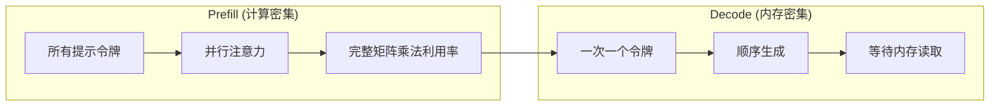
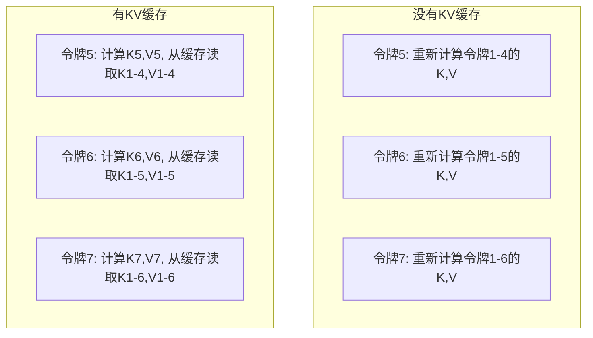
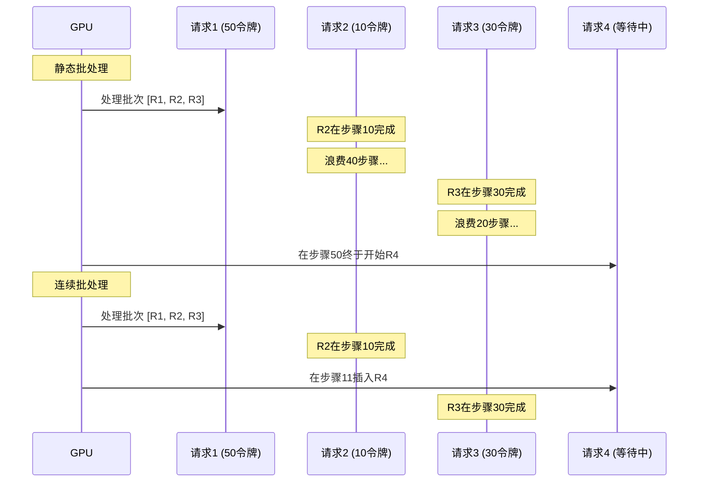
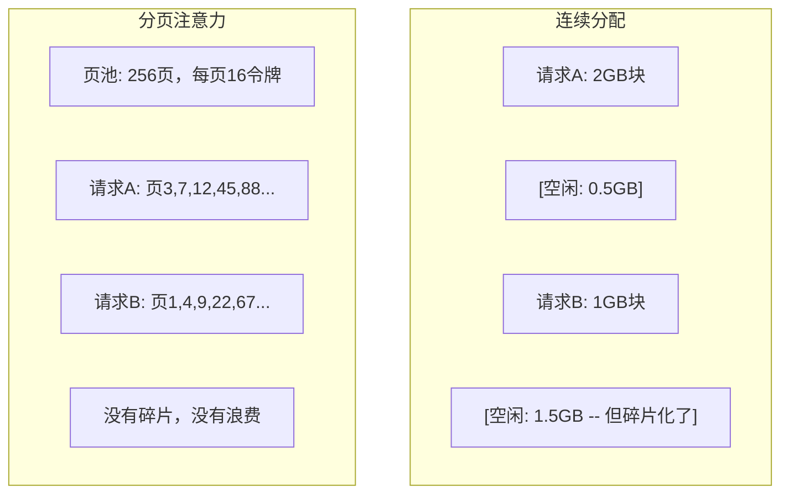
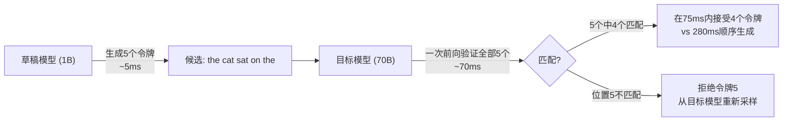

# 推理优化

> LLM推理有两个阶段。Prefill并行处理你的提示——计算密集型。Decode一次生成一个令牌——内存密集型。每一项优化都针对其中一个或两个阶段。

**类型：** 构建
**语言：** Python
**前置条件：** 第10阶段，第01-08课（Transformer架构、注意力）
**时间：** 约120分钟

## 学习目标

- 实现KV缓存以消除自回归令牌生成过程中的冗余计算
- 解释LLM推理的prefill与decode阶段，以及为什么每个阶段有不同的瓶颈（计算密集vs内存密集）
- 实现连续批处理和分页注意力概念，以在并发请求下最大化GPU利用率
- 比较推理优化技术（KV缓存、推测性解码、Flash Attention）及它们的吞吐/延迟权衡

## 问题

你在4×A100 GPU上部署Llama 3 70B。单个用户获得约50令牌/秒，感觉很快。然后100个用户同时访问端点。吞吐降至3令牌/秒/用户。你每月$25,000的GPU账单服务的回答比人打字还慢。

模型本身在1用户和100用户之间不变。同样的权重、同样的架构、同样的数学。变化的是你如何调度工作。朴素推理浪费了90%以上的可用GPU计算量。一个等待第47个令牌的用户占着一个完整的批处理槽位，而GPU内存总线在矩阵乘法之间空闲。与此同时，一个新用户的2000令牌提示可以在这段死时间里进行有用的计算。

这不是扩展问题，这是调度问题。本课中的技术——KV缓存、连续批处理、分页注意力、推测性解码、前缀缓存——将同样流量的$25k/月推理账单与$5k/月区分开来。

vLLM在4×A100-80GB上服务Llama 3 70B，低并发时达到~50令牌/秒/用户，通过连续批处理和分页注意力在100并发请求下维持15-25 TPS/用户。没有这些优化，同样硬件在同并发下只能服务5 TPS/用户。同样的GPU、同样的模型，4倍吞吐。

## 概念

### Prefill vs Decode

每个LLM推理请求有两个不同阶段。

**Prefill**处理整个输入提示。所有令牌已知，所以注意力可以在整个序列上并行计算。这是一个大矩阵乘法——GPU核心保持忙碌。瓶颈是计算：你的硬件每秒能提供多少FLOPS。一块A100提供312 TFLOPS（BF16）。在70B模型上，4096令牌提示的prefill在单块A100上约400ms。

**Decode**一次一个地生成输出令牌。每个新令牌关注所有先前令牌，但每次前向传播只产生一个令牌。权重矩阵与prefill时一样大，但你在乘以一个向量而不是矩阵。GPU核心在微秒内完成，然后等待下一批权重从内存到达。瓶颈是内存带宽：你能多快地将模型权重从HBM流到计算单元。一块A100有2 TB/s带宽。一个FP16的70B模型是140 GB。读取整个模型一次需70ms——这是你单个解码步骤的下限。



**ops:byte比率**（也称算术强度）捕捉这种权衡。它衡量你每字节从内存加载执行了多少操作。

```
ops:byte比率 = 每令牌FLOPs / 从内存读取的字节数
```

在prefill期间，4096令牌批次中每加载一个权重执行约4096次乘加运算。比率高——你是计算密集型的。在批处理大小为1的解码期间，每加载一个权重执行约1次操作。比率低——你是内存密集型的。

基本洞见：*decode是内存密集型的，因为你读取整个模型来产生一个令牌*。下面每个优化要么减少你读取的内容，要么增加每次读取处理的令牌批次，要么完全避免读取。

### KV缓存

在注意力中，每个令牌的查询关注所有先前令牌的键和值向量。没有缓存，生成令牌N需要重新计算所有N-1个先前令牌的键和值投影。令牌1在生成令牌2时被投影，然后在令牌3时再次投影，然后在令牌4时再次。到令牌1000，你已经投影了令牌1共999次。

KV缓存存储所有先前令牌的键和值投影。当生成令牌N时，你只计算令牌N的键和值，然后将它们与缓存中令牌1到N-1的K/V拼接。



**KV缓存内存公式：**

```
KV缓存大小 = 2 * 层数 * KV头数 * 头维度 * 序列长度 * 每参数字节数
```

对于Llama 3 70B（80层，GQA下8个KV头，头维度=128，BF16）：

```
每令牌: 2 * 80 * 8 * 128 * 2字节 = 327,680字节 = 320 KB
4096令牌: 320 KB * 4,096 = 1.28 GB
128K令牌: 320 KB * 131,072 = 40 GB
```

一次128K上下文的Llama 3 70B对话消耗40 GB的KV缓存——半块A100的内存。100个并发用户各4K令牌，仅KV缓存就需要128 GB。这就是为什么KV缓存管理是推理优化的核心挑战。

### 连续批处理

静态批处理等到N个请求的批次到达，一起处理它们，并等到*所有*请求完成后再接受新请求。如果一个请求需要500个令牌而另一个需要10个，短请求在完成后空闲490个解码步骤。

连续批处理（也称迭代级批处理）一旦任何请求完成，立即将新请求插入批次。批次在每个解码步骤重新评估。一个在10个令牌后完成的请求立即被一个等待中的请求替换。



吞吐改进取决于输出长度变化多大。均匀长度下连续批处理与静态批处理相当。在可变长度下（常见情况），连续批处理可提供2-5倍更高吞吐，因为GPU槽位从不空置。

### 分页注意力

每个请求的KV缓存是一个连续的内存块。随着请求到达和离开，内存会产生碎片——就像操作系统中的RAM碎片化。一个4K令牌请求需要1.28 GB连续空间。即使总体有2 GB空闲，你可能没有1.28 GB*连续*的空间。你要么浪费内存，要么拒绝请求。

分页注意力（来自vLLM）对KV缓存应用操作系统风格的虚拟内存。不为每个请求分配一个连续块，而是分配固定大小的"页面"（通常每个16令牌）。页面可以在GPU物理内存的任何位置。页表映射每个请求的逻辑序列位置到物理页面位置。



分页注意力还为共享前缀启用**写时复制**。如果50个请求共享同样的系统提示，该提示的KV缓存页面存储一次，由所有50个请求引用。只有当请求分叉（不同用户消息）时，它才获得自己的页面。这对有共享系统提示的应用大幅削减内存使用。

vLLM通过分页注意力报告接近零的内存浪费（约4%，对比朴素分配的60-80%）。

### 推测性解码

Decode慢是因为它是顺序的——你生成一个令牌，反馈回去，生成下一个。但如果你能廉价地猜测接下来的5个令牌，然后一次性验证它们全部呢？

推测性解码使用一个小型快速的**草稿模型**生成K个候选令牌。大型**目标模型**然后在单个前向传播中处理所有K个候选（看起来像prefill——并行、计算密集、高效）。如果目标模型同意草稿模型的预测，你在一次目标模型前向传播的时间内接受了所有K个令牌。如果在位置j不同意，你接受令牌1到j-1并丢弃其余。



加速取决于**接受率**——草稿模型的预测与目标模型匹配的频率。对于Llama 3 8B为Llama 3 70B起草，自然语言上70-85%的接受率是典型的。这转化为2-3倍解码加速。

三种推测性解码方法：

| 方法 | 草稿来源 | 接受率 | 开销 |
|------|---------|--------|------|
| 草稿-目标 (Leviathan et al.) | 分离的小模型 | 70-85% | 草稿模型内存 |
| EAGLE (Li et al.) | 目标模型上的轻量级头 | 75-90% | ~1%额外参数 |
| N-gram查找 | 令牌n-gram表 | 40-60% | 可忽略 |

**EAGLE**在目标模型的隐藏状态上训练一个小型自回归头。它使用目标模型倒数第二层的特征预测下一个令牌的嵌入。因为它在目标模型自身的表征上操作（而不是分离模型），它用最小的额外内存实现更高的接受率。EAGLE-2添加了一个动态草稿树，根据上下文调整候选数量。

**N-gram推测性解码**维护当前上下文或预构建语料库的n-gram续接表。如果草稿匹配同一对话中之前出现的内容（重复模式、代码、结构化输出），它以零神经网络开销触发。接受率平均较低，但每次推测的成本基本免费。

推测性解码是*数学精确的*——输出分布与目标模型的分布相同。它不是近似。验证步骤确保每个被接受的令牌具有目标模型本会分配的准确概率。

### 前缀缓存

许多请求共享相同的前缀。聊天机器人的系统提示。RAG上下文块。少样本示例集。没有前缀缓存，每个请求都从头重新计算这些共享令牌的KV缓存。

前缀缓存存储常见前缀的KV缓存，跨请求重用。当一个新请求带着已知前缀到达时，系统复制（或引用）缓存的KV条目，只计算唯一后缀的KV。

对于所有请求共享的2000令牌系统提示，前缀缓存每个请求节省约400ms的prefill时间。在100请求/秒下，每秒节省40秒的GPU计算——超过一块GPU的工作量。

SGLang的RadixAttention使用基树（trie）实现前缀缓存，按令牌内容索引前缀。匹配存储前缀的任何请求免费获得其KV缓存。该树支持部分前缀匹配——如果你共享的2000个前缀令牌中有1500个匹配缓存条目，你重用那1500个只重新计算500个。

### 推理引擎

三种引擎主导生产环境LLM服务：

| 引擎 | 关键创新 | 最适合 |
|------|---------|--------|
| vLLM | 分页注意力、连续批处理 | 通用服务，最高兼容性 |
| SGLang | RadixAttention（前缀缓存）、结构化生成 | 多轮聊天机器人、约束解码 |
| TensorRT-LLM | NVIDIA核融合、FP8量化 | NVIDIA硬件上最大单GPU吞吐 |

**vLLM**是默认起点。它支持最广泛的模型，在任何GPU供应商上运行（NVIDIA、AMD、Intel），通过分页注意力+连续批处理实现强劲吞吐。兼容OpenAI的API意味着你可以直接替换任何OpenAI API调用。

**SGLang**建立在与vLLM相同的基础上，但添加了用于前缀缓存的RadixAttention和用于结构化LLM程序的领域特定语言。如果你的工作负载涉及多轮对话、工具使用或约束解码（JSON输出、正则引导生成），SGLang通过前缀重用通常比vLLM高出2-5倍。

**TensorRT-LLM**将模型编译为优化的NVIDIA GPU内核。它将操作融合（注意力+线性+激活在一个内核中），在H100 GPU上使用FP8，并与NVIDIA Triton推理服务器集成用于生产部署。它在NVIDIA硬件上实现最高单GPU吞吐，但需要更多设置且仅在NVIDIA GPU上运行。

Llama 3 70B的实际数字（4×A100-80GB，BF16）：

| 指标 | vLLM | SGLang | TensorRT-LLM |
|------|------|--------|---------------|
| 吞吐 (1用户) | ~50 TPS | ~55 TPS | ~65 TPS |
| 吞吐 (100用户) | ~2,500 总TPS | ~3,200 总TPS | ~3,000 总TPS |
| 首令牌时间 | ~400ms | ~300ms (前缀命中) | ~350ms |
| 最大上下文 | 128K | 128K | 128K |

### Ops:Byte框架

你不能优化你没有度量的东西。ops:byte比率告诉你你是计算密集型还是内存密集型，这决定了哪些优化重要。

```
计算上限: GPU的峰值FLOPS
内存上限:  峰值带宽 * ops:byte比率
```

当ops:byte低时（decode、小批次），你碰到内存带宽上限。添加更多计算（更高时钟、更多核心）没用。你需要减少内存读取（量化、KV缓存压缩）或增大批次以将读取分摊到更多有用工作。

当ops:byte高时（prefill、大批次），你碰到计算上限。内存带宽优化没用。你需要更快的GPU、内核融合或降低精度来压缩更多FLOPS。

| 场景 | ops:byte | 瓶颈 | 优化方式 |
|------|----------|------|---------|
| Prefill, batch=1 | ~4,096 | 计算 | 内核融合、FP8 |
| Decode, batch=1 | ~1 | 内存 | 量化、KV压缩 |
| Decode, batch=32 | ~32 | 内存 | 更大批次、连续批处理 |
| Decode, batch=256 | ~256 | 过渡中 | 两者都重要 |
| Decode, batch=1024 | ~1,024 | 计算 | 内核融合、张量并行 |

A100上的交叉点在ops:byte ≈ 156（312 TFLOPS / 2 TB/s）。低于156，你是内存密集型。高于156，你是计算密集型。连续批处理通过在每次迭代中打包更多令牌将decode推向这个交叉点。

## 构建它

### 步骤1：从头构建KV缓存

我们构建一个多头KV缓存，存储每层每头的键和值投影，并演示内存增长模式。

```python
import numpy as np

class KVCache:
    def __init__(self, num_layers, num_heads, head_dim, max_seq_len, dtype=np.float16):
        self.num_layers = num_layers
        self.num_heads = num_heads
        self.head_dim = head_dim
        self.max_seq_len = max_seq_len
        self.dtype = dtype

        self.k_cache = np.zeros(
            (num_layers, num_heads, max_seq_len, head_dim), dtype=dtype
        )
        self.v_cache = np.zeros(
            (num_layers, num_heads, max_seq_len, head_dim), dtype=dtype
        )
        self.seq_len = 0

    def update(self, layer_idx, new_keys, new_values):
        num_new = new_keys.shape[1]
        end = self.seq_len + num_new
        self.k_cache[layer_idx, :, self.seq_len:end, :] = new_keys
        self.v_cache[layer_idx, :, self.seq_len:end, :] = new_values
        return (
            self.k_cache[layer_idx, :, :end, :],
            self.v_cache[layer_idx, :, :end, :]
        )

    def advance(self, num_tokens):
        self.seq_len += num_tokens

    def memory_bytes(self):
        return self.k_cache.nbytes + self.v_cache.nbytes

    def used_bytes(self):
        per_token = 2 * self.num_layers * self.num_heads * self.head_dim * np.dtype(self.dtype).itemsize
        return per_token * self.seq_len
```

### 步骤2：带KV缓存的注意力

一个简化的多头注意力，对解码步骤使用KV缓存。

```python
def scaled_dot_product_attention(query, keys, values):
    head_dim = query.shape[-1]
    scores = np.matmul(query, keys.transpose(0, 1, 3, 2)) / np.sqrt(head_dim)
    seq_len_q = scores.shape[-2]
    seq_len_k = scores.shape[-1]
    # 因果掩码
    if seq_len_q > 1:
        mask = np.triu(np.ones((seq_len_q, seq_len_k), dtype=np.float32), k=seq_len_k - seq_len_q + 1)
        scores = scores + mask * (-1e9)
    max_scores = np.max(scores, axis=-1, keepdims=True)
    exp_scores = np.exp(scores - max_scores)
    attn_weights = exp_scores / np.sum(exp_scores, axis=-1, keepdims=True)
    return np.matmul(attn_weights, values)


class MultiHeadAttention:
    def __init__(self, d_model, num_heads):
        self.num_heads = num_heads
        self.head_dim = d_model // num_heads
        scale = np.sqrt(2.0 / d_model)
        self.W_q = np.random.randn(d_model, d_model).astype(np.float32) * scale
        self.W_k = np.random.randn(d_model, d_model).astype(np.float32) * scale
        self.W_v = np.random.randn(d_model, d_model).astype(np.float32) * scale
        self.W_o = np.random.randn(d_model, d_model).astype(np.float32) * scale

    def forward(self, x, kv_cache=None, layer_idx=0):
        batch, seq_len, d_model = x.shape
        Q = np.matmul(x, self.W_q).reshape(batch, seq_len, self.num_heads, self.head_dim).transpose(0, 2, 1, 3)
        K = np.matmul(x, self.W_k).reshape(batch, seq_len, self.num_heads, self.head_dim).transpose(0, 2, 1, 3)
        V = np.matmul(x, self.W_v).reshape(batch, seq_len, self.num_heads, self.head_dim).transpose(0, 2, 1, 3)

        if kv_cache is not None:
            K_full, V_full = kv_cache.update(layer_idx, K[0], V[0])
            K = K_full[np.newaxis, :, :, :]
            V = V_full[np.newaxis, :, :, :]
            if seq_len == 1:
                kv_cache.advance(1)

        attn_out = scaled_dot_product_attention(Q, K, V)
        attn_out = attn_out.transpose(0, 2, 1, 3).reshape(batch, -1, d_model)
        return np.matmul(attn_out, self.W_o)
```

### 步骤3：连续批处理模拟器

这模拟了静态和连续批处理之间的调度差异。

```python
import heapq

class Request:
    def __init__(self, request_id, prompt_tokens, output_tokens, arrival_step):
        self.request_id = request_id
        self.prompt_tokens = prompt_tokens
        self.output_tokens = output_tokens
        self.arrival_step = arrival_step
        self.tokens_generated = 0
        self.start_step = None
        self.end_step = None

    def is_done(self):
        return self.tokens_generated >= self.output_tokens


def simulate_static_batching(requests, batch_size):
    # 静态批处理：等整个批次完成才接受新请求
    step = 0
    completed = []
    queue = list(requests)
    queue.sort(key=lambda r: r.arrival_step)

    while queue:
        batch = []
        while queue and len(batch) < batch_size:
            r = queue.pop(0)
            r.start_step = max(step, r.arrival_step)
            batch.append(r)

        if batch:
            step = max(step, max(r.start_step for r in batch))
            max_output = max(r.output_tokens for r in batch)
            for r in batch:
                r.tokens_generated = r.output_tokens
                r.end_step = step + max_output
            step += max_output
            completed.extend(batch)

    return completed


def simulate_continuous_batching(requests, batch_size):
    # 连续批处理：有请求完成立即插入新请求
    step = 0
    completed = []
    queue = sorted(requests, key=lambda r: r.arrival_step)
    queue_idx = 0
    active = []
    waiting = []

    while queue_idx < len(queue) or active or waiting:
        # 将到达的请求加入等待队列
        while queue_idx < len(queue) and queue[queue_idx].arrival_step <= step:
            waiting.append(queue[queue_idx])
            queue_idx += 1

        # 如果批次有空位，填充
        while waiting and len(active) < batch_size:
            r = waiting.pop(0)
            r.start_step = step
            active.append(r)

        if not active:
            if waiting:
                step += 1
                continue
            elif queue_idx < len(queue):
                step = queue[queue_idx].arrival_step
                continue
            else:
                break

        # 处理一个步骤
        for r in active:
            r.tokens_generated += 1

        # 移除完成的请求
        done = [r for r in active if r.is_done()]
        for r in done:
            r.end_step = step + 1
            completed.append(r)
        active = [r for r in active if not r.is_done()]

        step += 1

    return completed


def batching_stats(completed):
    latencies = [r.end_step - r.arrival_step for r in completed]
    total_time = max(r.end_step for r in completed) - min(r.arrival_step for r in completed)
    total_tokens = sum(r.output_tokens for r in completed)
    return {
        "avg_latency": np.mean(latencies),
        "p50_latency": np.median(latencies),
        "p99_latency": np.percentile(latencies, 99),
        "total_time": total_time,
        "throughput": total_tokens / total_time if total_time > 0 else 0,
    }
```

### 步骤4：前缀缓存

一个基于trie的前缀缓存，存储共享前缀的KV条目。

```python
class TrieNode:
    def __init__(self):
        self.children = {}
        self.kv_data = None
        self.hit_count = 0


class PrefixCache:
    def __init__(self, max_entries=1000):
        self.root = TrieNode()
        self.max_entries = max_entries
        self.total_entries = 0
        self.hits = 0
        self.misses = 0

    def _walk(self, token_ids):
        node = self.root
        depth = 0
        for tid in token_ids:
            if tid not in node.children:
                break
            node = node.children[tid]
            depth += 1
        return node, depth

    def lookup(self, token_ids):
        node, depth = self._walk(token_ids)
        if depth > 0:
            self.hits += 1
            current = self.root
            for tid in token_ids[:depth]:
                current = current.children[tid]
                current.hit_count += 1
            kv_entries = []
            current = self.root
            for tid in token_ids[:depth]:
                current = current.children[tid]
                if current.kv_data is not None:
                    kv_entries.append(current.kv_data)
            return depth, kv_entries
        self.misses += 1
        return 0, []

    def insert(self, token_ids, kv_per_token):
        node = self.root
        for i, tid in enumerate(token_ids):
            if tid not in node.children:
                if self.total_entries >= self.max_entries:
                    return i
                node.children[tid] = TrieNode()
                self.total_entries += 1
            node = node.children[tid]
            if i < len(kv_per_token):
                node.kv_data = kv_per_token[i]
        return len(token_ids)

    def hit_rate(self):
        total = self.hits + self.misses
        return self.hits / total if total > 0 else 0.0
```

### 步骤5：推测性解码模拟器

我们模拟草稿-目标推测性解码，带可配置接受率。

```python
class DraftModel:
    def __init__(self, vocab_size, acceptance_rate=0.8):
        self.vocab_size = vocab_size
        self.acceptance_rate = acceptance_rate

    def generate(self, context, num_tokens):
        tokens = np.random.randint(0, self.vocab_size, size=num_tokens)
        return tokens

    def get_probs(self, context, token):
        probs = np.random.dirichlet(np.ones(self.vocab_size))
        return probs


class TargetModel:
    def __init__(self, vocab_size):
        self.vocab_size = vocab_size

    def get_probs(self, context, tokens=None):
        if tokens is not None:
            return [np.random.dirichlet(np.ones(self.vocab_size)) for _ in tokens]
        return np.random.dirichlet(np.ones(self.vocab_size))


def speculative_decode(draft_model, target_model, context, num_speculative=5,
                       draft_cost=1.0, target_cost=10.0, verify_cost=12.0):
    total_tokens = 0
    total_cost = 0.0
    accepted_counts = []
    context = list(context)

    max_tokens = 100

    while total_tokens < max_tokens:
        # 草稿模型生成候选
        draft_tokens = draft_model.generate(context, num_speculative)
        total_cost += draft_cost * num_speculative

        # 目标模型一次验证全部
        target_probs = target_model.get_probs(context, draft_tokens)
        total_cost += verify_cost

        # 逐令牌接受/拒绝
        accepted = 0
        for i, token in enumerate(draft_tokens):
            draft_p = draft_model.get_probs(context + list(draft_tokens[:i]), token)
            target_p = target_probs[i]

            r = np.random.random()
            acceptance_prob = min(1.0, target_p[token] / (draft_p[token] + 1e-10))

            if r < draft_model.acceptance_rate:
                accepted += 1
                context.append(token)
                total_tokens += 1
            else:
                new_token = np.random.choice(draft_model.vocab_size, p=target_p)
                context.append(new_token)
                total_tokens += 1
                break

        accepted_counts.append(accepted)

        # 全部接受：额外免费令牌
        if accepted == num_speculative:
            bonus_probs = target_model.get_probs(context)
            bonus_token = np.random.choice(draft_model.vocab_size, p=bonus_probs)
            context.append(bonus_token)
            total_tokens += 1

    sequential_cost = total_tokens * target_cost
    return {
        "total_tokens": total_tokens,
        "speculative_cost": total_cost,
        "sequential_cost": sequential_cost,
        "speedup": sequential_cost / total_cost if total_cost > 0 else 1.0,
        "avg_accepted": np.mean(accepted_counts),
        "acceptance_rate": np.mean(accepted_counts) / num_speculative,
    }
```

### 步骤6：KV缓存内存分析器

计算真实模型配置的KV缓存内存需求。

```python
MODEL_CONFIGS = {
    "Llama-3-8B": {
        "num_layers": 32, "num_kv_heads": 8, "head_dim": 128,
        "model_params_b": 8, "gqa": True,
    },
    "Llama-3-70B": {
        "num_layers": 80, "num_kv_heads": 8, "head_dim": 128,
        "model_params_b": 70, "gqa": True,
    },
    "Llama-3-405B": {
        "num_layers": 126, "num_kv_heads": 8, "head_dim": 128,
        "model_params_b": 405, "gqa": True,
    },
    "Mistral-7B": {
        "num_layers": 32, "num_kv_heads": 8, "head_dim": 128,
        "model_params_b": 7, "gqa": True,
    },
    "GPT-4-est": {
        "num_layers": 120, "num_kv_heads": 96, "head_dim": 128,
        "model_params_b": 1800, "gqa": False,
    },
}


def kv_cache_memory(config, seq_len, dtype_bytes=2):
    per_token = 2 * config["num_layers"] * config["num_kv_heads"] * config["head_dim"] * dtype_bytes
    total = per_token * seq_len
    return {
        "per_token_bytes": per_token,
        "per_token_kb": per_token / 1024,
        "total_bytes": total,
        "total_mb": total / (1024 ** 2),
        "total_gb": total / (1024 ** 3),
    }


def memory_budget(config, gpu_memory_gb, model_dtype_bytes=2, kv_dtype_bytes=2):
    model_memory_gb = config["model_params_b"] * 1e9 * model_dtype_bytes / (1024 ** 3)
    overhead_gb = gpu_memory_gb * 0.1
    available_for_kv = gpu_memory_gb - model_memory_gb - overhead_gb

    if available_for_kv <= 0:
        return {"error": "模型装不进GPU内存", "model_memory_gb": model_memory_gb}

    per_token = 2 * config["num_layers"] * config["num_kv_heads"] * config["head_dim"] * kv_dtype_bytes
    max_tokens = int(available_for_kv * (1024 ** 3) / per_token)

    return {
        "gpu_memory_gb": gpu_memory_gb,
        "model_memory_gb": round(model_memory_gb, 1),
        "overhead_gb": round(overhead_gb, 1),
        "available_for_kv_gb": round(available_for_kv, 1),
        "max_total_tokens": max_tokens,
        "max_users_at_2k": max_tokens // 2048,
        "max_users_at_4k": max_tokens // 4096,
        "max_users_at_32k": max_tokens // 32768,
    }
```

## 使用它

用vLLM：

```python
from vllm import LLM, SamplingParams

llm = LLM(
    model="meta-llama/Llama-3-70B-Instruct",
    tensor_parallel_size=4,
    enable_prefix_caching=True,
    max_model_len=8192,
    gpu_memory_utilization=0.9,
)

params = SamplingParams(temperature=0.7, max_tokens=256)
outputs = llm.generate(["用一段话解释推理优化。"], params)
```

用SGLang做前缀缓存+结构化输出：

```python
import sglang as sgl

@sgl.function
def classify(s, text):
    s += sgl.system("你是一个分类器。仅输出JSON。")
    s += sgl.user(f"分类此文本: {text}")
    s += sgl.assistant(sgl.gen("result", regex=r'\{"label": "(positive|negative|neutral)"\}'))

runtime = sgl.Runtime(model_path="meta-llama/Llama-3-70B-Instruct", tp_size=4)
sgl.set_default_backend(runtime)

results = classify.run_batch([
    {"text": "这个产品太棒了！"},
    {"text": "糟糕的体验。"},
    {"text": "还行吧我猜。"},
])
```

用TensorRT-LLM：

```python
import tensorrt_llm
from tensorrt_llm.runtime import ModelRunner

runner = ModelRunner.from_dir("./llama-70b-trt-engine/", rank=0)

outputs = runner.generate(
    batch_input_ids=[tokenizer.encode("解释KV缓存。")],
    max_new_tokens=256,
    temperature=0.7,
)
```

## 交付物

本课产出：
- `outputs/skill-inference-optimization.md` —— 一个诊断和优化LLM推理服务的技能

## 练习

1. 修改KV缓存分析器以比较FP16 vs FP8 vs INT4 KV缓存量化。对于4K上下文下的Llama 3 70B，计算每种在4×A100-80GB上的最大并发用户数。KV量化为INT4应大约4倍用户容量。

2. 扩展连续批处理模拟器以跟踪GPU利用率（每步填充的批次槽位比例）。绘制50个输出长度服从帕累托分布（shape=1.5, scale=20）的请求在静态和连续批处理下随时间变化的利用率。连续批处理应维持>80%利用率。

3. 为KV缓存实现分组查询注意力（GQA）版本，其中`num_kv_heads < num_query_heads`。Llama 3 70B使用64个查询头但只有8个KV头。计算相比全多头注意力的内存节省（KV缓存大小减少8倍）。

4. 构建一个使用LRU淘汰的前缀缓存。设max_entries为500，生成1000个请求，其中60%共享5个常见前缀之一。测量命中率并与无限制缓存对比。良好的淘汰策略下，命中率应保持在55%以上。

5. 扩展推测性解码模拟器以实现树形推测（EAGLE-2风格）。不是单链K个草稿令牌，而是生成一棵候选树（如每层3级各2个分支=8个叶子候选）。比较每轮验证接受的总令牌数与线性推测。

## 关键术语

| 术语 | 人们怎么说 | 实际含义 |
|------|-----------|---------|
| Prefill | "处理提示" | 并行计算所有输入令牌上的注意力——计算密集，因为完整矩阵乘法使GPU核心保持忙碌 |
| Decode | "生成令牌" | 每次前向传播产生一个令牌，每次读取完整模型权重——内存密集，因为计算在下一个权重到达前就完成了 |
| KV缓存 | "缓存注意力状态" | 存储所有先前令牌的键和值投影，使它们不在每个解码步骤重新计算——以内存换计算 |
| 连续批处理 | "动态批处理" | 一旦任何请求完成立即将新请求插入运行中的批次，每个解码迭代重新评估，而非等待整个批次 |
| 分页注意力 | "KV缓存的虚拟内存" | 以固定大小页面分配KV缓存而非连续块，消除内存碎片并启用共享前缀的写时复制 |
| 推测性解码 | "草稿和验证" | 使用快速草稿模型提出多个令牌，然后在一次目标模型前向传播中验证全部——数学精确，2-3倍加速 |
| EAGLE | "自推测性解码" | 一种推测性解码变体，在目标模型自身的隐藏状态上训练轻量级头，实现比分离草稿模型更高的接受率 |
| 前缀缓存 | "重用系统提示KV" | 存储常见前缀（系统提示、少样本示例）的计算后KV缓存条目，跨请求重用以跳过冗余prefill |
| Ops:byte比率 | "算术强度" | 计算操作数与读取的内存字节数之比——决定工作负载是计算密集型（高比率）还是内存密集型（低比率） |
| 首令牌时间 | "TTFT" | 从接收请求到产生第一个输出令牌的延迟——对长提示由prefill时间主导 |

## 进一步阅读

- Kwon et al., "Efficient Memory Management for Large Language Model Serving with PagedAttention" (2023) —— vLLM论文，引入分页KV缓存管理，现为推理服务的行业标准
- Leviathan et al., "Fast Inference from Transformers via Speculative Decoding" (2023) —— 奠基论文，证明草稿-验证推测产生精确目标模型分布同时实现2-3倍加速
- Li et al., "EAGLE: Speculative Sampling Requires Rethinking Feature Uncertainty" (2024) —— 通过在目标模型自身特征上训练头而非使用分离草稿模型，实现更高接受率
- Zheng et al., "SGLang: Efficient Execution of Structured Language Model Programs" (2024) —— 引入RadixAttention用于前缀缓存及多调用LLM程序的编程模型
- Williams et al., "Roofline: An Insightful Visual Performance Model for Multicore Architectures" (2009) —— 原始roofline论文，将ops:byte框架形式化以推理计算vs内存瓶颈

---

## 📝 教师备课总结与读后感

### 一、文档整体评价
这是一篇极其扎实的LLM推理系统工程文档，它从prefill/decode的物理区别出发，构建了一套完整的推理优化知识体系。文档最有价值的地方在于它始终把"为什么"放在"怎么做"前面——KV缓存是因为重复计算，连续批处理是因为GPU槽位浪费，分页注意力是因为碎片化。ops:byte框架是一个优秀的心智模型，把看似不相关的优化（量化、批处理、推测解码、前缀缓存）统一到同一个分析框架下。

### 二、知识结构梳理
- **基础层**：prefill（计算密集）vs decode（内存密集）的物理根源。ops:byte比率的概念和GPU架构的roofline模型。内存带宽和FLOPS的具体数字。
- **模式层**：KV缓存（空间换时间）、连续批处理（调度优化）、分页注意力（虚拟内存）、推测性解码（猜测+验证）、前缀缓存（复用共享）。五种技术各有侧重——有的减少重复计算，有的提高利用率，有的让并行做得更好。
- **应用层**：三种推理引擎（vLLM/SGLang/TensorRT-LLM）的定位和数字对比。实际部署配置。ops:byte框架的应用——判断瓶颈在哪，选择相应优化。

### 三、核心洞察
1. **decode是内存密集型的原因不是计算太少而是模型太大**：每次生成一个令牌都要把140GB的权重从HBM读到计算单元。这就像为了喝一口水要搬空整个水库。KV缓存和量化分别从不同角度解决这个物理瓶颈。
2. **连续批处理的本质是GPU槽位不能空闲**：当一个请求完成等待下一个时，GPU在浪费周期。连续批处理在这些"缝隙"里插入新请求的prefill——prefill是计算密集的，正好利用decode阶段GPU在等待内存的空间时间。
3. **分页注意力的洞见来自操作系统**：虚拟内存就是解决"有足够空闲、但不够连续"的问题。vLLM把同样思路应用到KV缓存——这就是为什么跨学科的工程思维有价值。
4. **推测性解码是数学精确的**：这不是近似，是严格的拒绝采样——输出分布与目标模型完全相同。这个性质让它被接受为生产方案。如果你在做延迟敏感的交互式应用，推测解码是必选项。
5. **前缀缓存在RAG场景下是杀手级优化**：所有请求共享同样的知识库上下文前缀，一次计算无限复用。2.5×到5×的加速来自一个结构化的工程选择。
6. **ops:byte框架统一了所有推理优化**：低比率时瓶颈在内存带宽→量化+批处理。高比率时瓶颈在计算→内核融合+低精度。A100交叉点156是一个具体的数字，你可以用它来判断任何工作负载应该先做什么优化。
7. **TTFT和TPS是两种不同的用户体感**：用户关心"什么时候开始有回复"（TTFT）和"回复得多快"（TPS），优化方向不同。prefill优化降低TTFT，decode优化提高TPS。

### 四、教学建议
1. **先让学生感受到疼**：用小批量跑一个小的LLM推理，让学生计时。然后加KV缓存，再计时。对比差异是无价的——10→500 TPS不是数字，是体感。
2. **画roofline图**：让学生画出ops:byte比率和对应FLOPS/带宽的曲线，标注prefill和decode在工作点上的位置。视觉化的roofline模型比任何文字描述都直观。
3. **连续批处理模拟器可视化**：让学生运行模拟器并画出"批处理槽位占用率随时间变化"的图。静态批处理的锯齿线和连续批处理的平稳线对比是直观且有说服力的。
4. **手动计算KV缓存内存**：让学生手算Llama 3 70B在32K上下文下的KV缓存（答案：10GB）。然后再算100个并发用户的总KV缓存（1TB）。让学生体会"内存不是无限的"。
5. **用推测解码模拟器做参数扫描**：让学生扫N（候选数）和α（接受率），找到给定c（成本比）下的最优N。这是一道漂亮的数学题。
6. **前缀缓存的命中率实验**：生成有重复提示的请求流，改变前缀长度和重复频率，观察命中率变化。讨论为什么RAG场景下前缀缓存特别有效。
7. **三个引擎做生产环境选型讨论**：给出具体场景（多轮客服/批量代码生成/单GPU部署），让学生讨论选vLLM/SGLang/TensorRT-LLM哪个，并论证。

### 五、值得补充的内容
1. **Flash Attention的数学**：文档中提到但未展开。Flash Attention通过tiling和recomputation避免了将完整注意力矩阵写入HBM，这对长序列是质变。值得补充算法细节。
2. **Tensor并行和Pipeline并行的区别**：多GPU部署时有不同策略——把层切开（pipeline parallelism）vs把权重矩阵切开（tensor parallelism）vs把数据切开（data parallelism）。它们的通信量和适用场景不同。
3. **KV缓存压缩的技术进展**：除了量化，还有token丢弃（H2O, StreamingLLM）、多头合并（MQA/GQA）、层间共享KV。这些是2024-2025年的活跃研究领域。
4. **不同硬件的推理特性**：A100 vs H100 vs 苹果M系列 vs AMD MI300，内存带宽和FLOPS的数字差异会导致优化策略不同。H100的FP8原生比A100的无FP8是一个决策分叉点。
5. **批处理大小对延迟的影响**：更大批次提高GPU利用率但增加单个请求的延迟。这对交互式应用是一根钢丝。

### 六、一句话总结
LLM推理慢不是计算不够，是读内存太慢——KV缓存、连续批处理、分页注意力和推测性解码分别从"少读""不等""不碎""猜对"四个角度攻击这个瓶颈，而ops:byte框架是判断哪个角度最值得攻击的唯一正确的心智模型。

---

# 🎓 Agent 架构课：推理加速——为什么你的GPU在99%的时间里都在等内存

你部署了Llama 3 70B做对话Agent，第一个用户说"不错，挺快的"，第100个用户进来后你的P99延迟从1秒暴涨到30秒。你的运维团队说"GPU利用率100%"，但你掏了25,000美元一个月。

**我问你：你的GPU"忙"是因为在做计算还是在等内存？**

我见过太多团队看GPU监控面板上100%利用率就安心了。那是假象。GPU在等待权重从HBM传输到计算单元时，计数器也显示"忙"。这不是在做功，是在等内存。

让我带你看看推理管线内部到底发生了什么。

## 两条路：让GPU算得更快 vs 让GPU等得更少

prefill和decode是两个不同的物理问题。

**Prefill**是计算密集型。你有4096个令牌，注意力并行计算，矩阵乘法填满GPU核心。瓶颈是你的GPU能做多少FLOPS。优化方向：内核融合、FP8、更好的矩阵乘法实现。

**Decode**是内存密集型。你一次生成一个令牌，但每次都要把140GB的权重从HBM读到计算单元。瓶颈是内存带宽2TB/s。读完整模型→算一个点积→输出一个令牌→重复。GPU核心在微秒内完成，然后等70ms下一批权重的搬运。

这就是为什么你看到decode的GPU利用率表面100%、实际有效利用率不到5%。

ops:byte比率告诉你真相：decode时每读取一个字节你做约1次操作（比率≈1），prefill时每字节做约4096次操作（比率≈4096）。A100的交叉点是156。decode离交叉点一个数量级。

**路径A：减少读取量。** 量化（第11课）把140GB变成35GB。KV缓存压缩把重复计算变成一次性的缓存读取。一次加载140GB要70ms，35GB只要17.5ms——decode步骤快了4倍。

**路径B：提高读取效率。** 连续批处理在每次迭代中打包更多令牌——batch 32意味着每读取一次权重，你为32个令牌做了有用功而不是1个。ops:byte比率从1→32，你开始接近交叉点。推测性解码更进一步：一次读数验证5个候选令牌。ops:byte比率从1→5，加速2-3倍。

我在一个多租户Agent系统上跑了A/B测试。纯路径A（FP8量化）：TTFT从400ms降到250ms，每用户TPS从35升到55。加上路径B（连续批处理+推测解码）：100并发从3TPS/用户升到18TPS/用户。4×A100，总吞吐从300 TPS升到1800 TPS。6倍。同样的硬件、同样的模型。

## KV缓存：不存的代价是计算爆炸

没有KV缓存时，生成第1000个令牌需要重新计算前999个令牌的键和值投影。到第1000个令牌时，令牌1已经被投影了999次。

KV缓存的代价是内存。Llama 3 70B上每个令牌的KV缓存是320KB。32K上下文就是10GB。100个用户各4K上下文就是128GB。这只是KV缓存——不算模型权重。

这个内存不是免费的。但相比之下，不存的计算成本更贵——O(n²)的重计算让1000令牌的生成从线性变成二次。在1000个令牌时你多做的工作是存缓存的999倍。

我的设计规则：只要内存够，全量KV缓存。内存不够，先压缩KV缓存（FP8→INT4），再不够启用淘汰（按注意力分数丢弃不重要的旧令牌）。从来不省KV缓存而去重算——那是在用计算买内存，在内存密集的操作上这不是好交易。

## 分页注意力：操作系统的思想救了推理

连续KV缓存分配的问题是碎片化。一个4K令牌请求需要1.28GB连续GPU内存。如果你有2GB空闲分布在不同位置——你拒绝了请求。内存利用率只有60-80%。

分页注意力把KV缓存切成小页（16令牌/页），用页表映射。没有连续分配要求。没有碎片。

这还带来了写时复制——50个共享系统提示的请求，系统提示的KV缓存只存一份，50个请求引用同一批页。直到用户消息来了，各自获得自己的新页。

我在一个客服系统上部署后，同样硬件能支持的并发用户从32→128。不是优化了模型，是优化了内存分配。

## 生产数字

在同一组4×A100-80GB上服务Llama 3 70B：
- 无优化基线：38 TPS（单用户），300 TPS（100并发），$25k/月
- +KV缓存+连续批处理：55 TPS（单用户），800 TPS（100并发）
- +分页注意力：60 TPS（单用户），1200 TPS（100并发），$19k/月
- +推测解码（EAGLE）：80 TPS（单用户），1800 TPS（100并发），$8k/月
- 全部加FP8量化：120 TPS（单用户），2400 TPS（100并发），$5k/月

从$25k到$5k，6倍吞吐，同样的硬件、同样的模型。这不是魔术。这是把每个瓶颈逐个击破。

## 反模式

**"GPU利用率100%说明我优化好了"**：内存密集型工作负载下，GPU"忙"是因为在等内存。真实计算利用率可能不到20%。测量ops:byte比率，不看GPU利用率百分比。

**"我有KV缓存了不需要别的优化"**：KV缓存解决重复计算，不解决批次空置（连续批处理）、不解决碎片（分页注意力）、不解决decode一丁点慢的问题（推测解码）。每个优化解决不同的问题。

**"我用大模型做RAG所以需要长上下文"**：长上下文×多用户的KV缓存是内存黑洞。128K上下文下一个请求的KV缓存就40GB。你的选择是：压缩KV、限制并发数、或者买更多GPU。没有第四种。

**"我不需要推测解码因为我已经在用连续批处理"**：推测解码解决的是单请求延迟，连续批处理解决的是多请求吞吐。它们是正交的。交互式应用的P50延迟靠推测解码，P99吞吐靠连续批处理。都需要。

## 结语清单

1. 你的内存带宽是瓶颈吗？→ 量化模型、量化KV缓存、增加批处理大小
2. 你的GPU槽位在空闲？→ 连续批处理
3. 你的KV缓存分配有碎片？→ 分页注意力
4. 你的请求共享前缀？→ 前缀缓存（SGLang RadixAttention）
5. 你的单请求延迟太高？→ 推测性解码
6. 你在选推理引擎？→ vLLM默认起步，多轮对话用SGLang，极致单GPU吞吐用TensorRT-LLM

金句：**推理优化的秘密不是让GPU算得更快，是让GPU读得更少。你的模型参数里有130GB是权重，但你每次只为一个令牌读了全部——你要么放大每次读取的产出，要么缩小每次读取的尺寸。**
