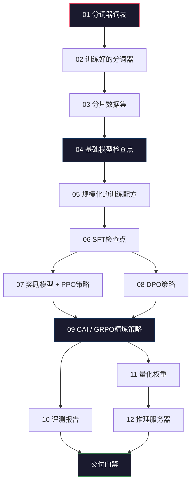
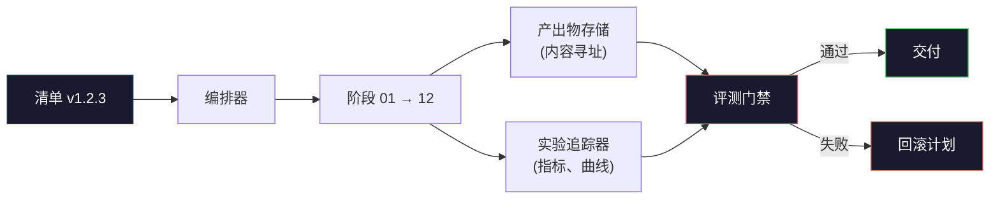

# 构建完整的LLM流程

> 第01到12课的一切是一个流程的一个阶段。本课是将这些阶段转化为单一端到端运行的脚手架：分词、预训练、扩展、SFT、对齐、评测、量化、服务。你不会在笔记本上训练一个70B模型。你将构建编排层、清单、评测门禁和回滚计划——这些都是2026年前沿团队用来决定什么该交付的。这是一堂集大成的课程。

**类型：** 构建
**语言：** Python（标准库）
**前置条件：** 第10阶段所有第01-12课
**时间：** 约120分钟

## 学习目标

- 将11门前置课程（分词器、数据、预训练、扩展、SFT、RLHF、DPO、CAI、评测、量化、推理）编排为单一可复现的流程规范
- 定义阶段之间的产出物契约：每个阶段消费什么、产出什么，以及下一阶段如何验证输入
- 构建一个追踪实验、哈希产出物并通过评测阈值门禁交付决策的编排器
- 设计回滚计划：哪些产出物重新运行便宜、哪些昂贵、一个损坏的检查点会造成什么成本

## 问题

前述各课各自都能工作。分词器训练了。微型GPT预训练了。SFT数据集组装了。奖励模型训练了。DPO运行了。评测测量了。量化权重导出了。推理服务器启动了。每个都是一个Notebook。每个都有自己的约定、自己的输出路径、自己的种子。

但前沿训练运行不是Notebook。Llama 3 405B消耗了大约3000万H100小时，历经约54天。DeepSeek-V3使用了约280万H800小时。在此期间，一个损坏的检查点、一次数据污染、一次评测回退可以让团队损失一周的墙上时间和一个月的GPU预算。团队生存的方式是流程卫生：每个阶段有确定性输入、确定性输出、清单、哈希和门禁。

这是集大成的一课。你不会在笔记本上端到端运行流程。你将编写协调各阶段的编排器、描述运行的清单、门禁交付决策的验证器、以及让第三方仅凭一个文件就能重演你工作的重放计划。代码很少；纪律很大。

这个模式从1亿参数到1万亿参数缩放不变。同样的四个组件——清单、编排器、评测门禁、产出物存储——运行Llama 3，也运行你的业余GPT。区别是每个阶段配置内部数字的大小，不是流程的形态。

## 概念

### 十二个阶段

每门第10阶段的课都是一个阶段。这是完整的依赖图。



阶段07和08可以并行运行。其他一切都是硬依赖。阶段02（分词器）的改变会作废所有下游产出物。阶段10（评测）的改变仅作废交付决策。

### 清单

清单是一个单独文件，充分描述一次运行，足可重演。流程产出的任何东西都不应依赖不在清单中的状态。字段无聊但必须。

```
pipeline_version: 1.2.3
seed: 42
git_commit: a1b2c3d4
stages:
  01_tokenizer:
    recipe: bpe_32k
    input_hash: sha256:...
    output_hash: sha256:...
    wall_clock_sec: 3600
    cost_usd: 12
```

阶段N的输出哈希是阶段N+1的输入哈希。任何偏差则流程停止。这就是你如何早期捕获数据损坏。这也是另一个大陆的队友如何验证他们的重放产生了和你一样的产出物。

实际中团队使用一个小型YAML模式加上一个清单检查器，对比上一个成功运行。任何超出预期字段（成本、墙上时间）的差异都是红旗。

### 产出物类型化

每个阶段的输出是带类型的产出物。不是目录大杂烩，不是pickle，而是一个有已知模式的命名类型。

| 阶段 | 产出物类型 | 关键字段 |
|------|----------|---------|
| 01-02 | 分词器 | vocab.json, merges.txt, config.json, hash |
| 03 | 数据集 | shards[], 行数, 令牌数, 去重统计 |
| 04-05 | 检查点 | weights.safetensors, config.json, 优化器状态, 步数 |
| 06 | SFT模型 | 检查点 + SFT配方 + 数据混合 |
| 07 | 奖励模型 | RM检查点 + 偏好数据哈希 |
| 08-09 | 策略 | 检查点 + 参考哈希 + beta + 已消耗KL预算 |
| 10 | 评测报告 | 基准分数 + 回退差异 + 评测数据哈希 |
| 11 | 量化模型 | 量化权重 + 校准数据 + 相对FP16的精度差异 |
| 12 | 服务器规范 | 端点 + 模型哈希 + 配置 + 可观察性钩子 |

类型化防止最常见的失败模式：把阶段08的输出当阶段06的输入用，把一个DPO训练出来的模型走SFT路径交付。带类型的产出物和带类型的阶段签名使这些错误变成编译期失败，而非第5天失败。

### 评测门禁

交付不是"训练完了"。交付是"训练完了且评测门禁通过了"。门禁在运行开始前定义。

```
gates:
  mmlu:      >= baseline + 0.5   # 不回退
  humaneval: >= baseline + 1.0
  truthfulqa: >= baseline         # 不下降
  safety_refusal_rate: <= 0.05
  kl_from_reference: <= 25.0
  cost_total_usd: <= 50000
```

每个门禁是一个数值阈值。没有"看起来不错"的门禁。没有主观签署。如果每个门禁都通过，产出物标记为可交付。如果任何门禁失败，运行被保留，等待有名评审员明确覆盖，覆盖本身记录在清单中。

两个门禁捕获大多数灾难。*回退*门禁（新模型必须在核心基准上至少与上一个一样好）捕获训练bug。*KL预算*门禁（对齐后的策略与其参考的漂移必须在一定范围内）捕获对齐过度。每个生产流程都有这两个。

### 编排器

一小段代码，读取清单、调度阶段、追踪产出物，在任何契约违反时停止。这不是Airflow，这不是Kubeflow。为了流程卫生，你要一些你写的无聊东西。

编排器的职责很窄：

1. 从清单解析DAG。
2. 对每个阶段，检查期望输出是否已在正确哈希下存在（如是则跳过）。
3. 运行阶段，捕获stdout/stderr，测量墙上时间和成本。
4. 对照下游阶段期望的输入哈希验证输出哈希。
5. 失败时写一个部分清单，标注精确的失败阶段并返回非零。

这是200行Python。它看起来像本课中的`code/main.py`。底层，真实流程使用`torchrun`或`ray`在集群上执行单个阶段，但编排器本身在单台机器上运行。

### 实验追踪和产出物存储

两个外部系统锚定流程。

**实验追踪器（wandb, neptune, mlflow）。** 记录每阶段的损失曲线、评测指标、系统遥测。追踪器是你三周后需要比较运行A与运行B时去的地方。团队几乎总是为此使用托管追踪器——自己写会损失本应用于训练的时间。

**产出物存储（S3, R2, GCS）。** 用于检查点、数据集、分词器、评测报告的不可变对象存储。产出物按哈希寻址，不按文件名。像`latest.pt`这样的文件名是自毁型；`ckpt-7b-step-20000-sha256:abc123.safetensors`是契约。

编排器写入两者。追踪器是为看图表的人准备的。产出物存储是为查找输入的下一阶段准备的。

### 成本核算

前沿运行附有一个美元数字。预算纪律发生在两个地方。

**运行前估算。** 从清单中计算期望FLOPs（预训练：6×参数量×令牌量），期望GPU小时（FLOPs/峰值吞吐/利用率），以及当前租赁费率下的美元成本。如果估算超过预算门禁，流程拒绝启动。

**运行中追踪。** 逐阶段的墙上时间和成本记录到清单中。每个阶段之后检查剩余预算。如果一个阶段超预算，下一阶段的门禁用新的剩余预算重新评估。你不会在VC打电话时才发现你破产了。

Llama 3报告的成本是$61M。DeepSeek-V3报告主要预训练运行$5.6M。比率主要是硬件效率加MoE——但具体成本之所以可见，是因为两个团队都按阶段追踪，而不是按运行追踪。

### 可复现性 vs 确定性

这两者不是一回事。*可复现*意味着相同的清单加相同的代码加相同的基础设施产生一个在下游指标上等效的检查点。*确定性*意味着逐位相同的输出。

现代LLM训练是可复现但非确定的。分布式训练的reduce顺序、GPU内核非确定性（cuBLAS、flash-attn）和混合精度舍入共同产生在10^-5级别运行间不同的浮点数。这对最终指标没问题，因为没有位移。如果你试图用逐位差异调试则是致命的。解法是记录每个阶段的输入哈希、输出哈希和关键指标——如果这些匹配，运行就算"复现"了，即便权重不逐位相同。



### 回滚计划

运行开始前，写下每个阶段失败时会发生什么。三类。

- **便宜重跑**（几小时）：分词器、评测、量化、推理服务器。直接重新运行。
- **中等**（几天）：SFT、DPO、CAI。保留基础模型；仅重新运行对齐阶段。
- **昂贵**（几周和数百万美元）：预训练。这里的回滚计划不是"重新运行"，而是"使用上一个好的检查点并用修订后的数据重新运行便宜的下游阶段"。

因为阶段依赖是类型化且哈希化的，编排器可以自动计算回滚集合：作废失败阶段加上每个子代。阶段06（SFT）的失败作废06、07、08、09、10、11、12。阶段11（量化）的失败仅作废11和12。提前命名这些避免了凌晨4点团队精疲力竭时即兴发挥。

### 2026年观察到的生产配方

大多数前沿团队收敛到同一个骨架。

- 分词器：128k BPE带字节回退。在小型、平衡的多语言切片上训练。
- 预训练：10-20T令牌，主要是网页加代码加合成。Muon或AdamW优化器。FSDP2或DeepSpeed ZeRO-3。梯度检查点。BF16权重，FP32主副本。
- SFT：500k-2M指令对，混合人类和合成，对评测集严格去重。
- 对齐：DPO或CAI + GRPO。RLHF仅在偏好信号对DPO来说太多维的情况下使用。
- 评测：MMLU-Pro, MATH, HumanEval+, GPQA, SWE-Bench Verified, LiveBench，加上一个公众永远看不到的私密留出集。
- 量化：4比特GPTQ或AWQ用于服务，8比特用于精度差异重要的安全评测。
- 服务：vLLM，TensorRT-LLM或自研。连续批处理。推测性解码。KV缓存淘汰。

数字每六个月改变。骨架不变。

## 构建它

本课的代码是一个编排器和一个清单检查器，而不是十二个训练脚本。每个阶段用一个产生正确形状和哈希的输出产出物的占位符来模拟。端到端运行编排器证明了流程的管道在你烧GPU资金跑真实阶段之前是可工作的。

参见`code/main.py`看完整实现。关键部分：

- `Manifest`数据类：流程版本、种子、git提交、阶段、门禁。
- `Stage`数据类：名称、类型、输入（哈希）、输出（哈希）、墙上时间、成本。
- `Orchestrator.run()`：解析DAG、调度阶段、验证哈希、更新清单。
- `EvalGate.check()`：读取阈值，与最新评测报告比较，返回通过/失败。
- `ArtifactStore`（内存桩）：按哈希存取，模拟S3。
- `CostTracker`：逐阶段和累积，超上限时停止。

`main.py`中的流程运行十二个占位符阶段，产出一个清单，并演练一个失败的评测门禁来展示被保留的运行是什么样子。将每个占位符替换为相应课程的真实训练脚本，你就有了一个真实前沿流程使用的骨架。

## 使用它

规范工作流有三个命令。

```
python code/main.py plan    # 验证清单、计算成本估算、打印DAG
python code/main.py run     # 执行阶段，写入 manifest.out.yaml
python code/main.py gate    # 读取 manifest.out.yaml、应用评测门禁、交付或保留
```

每次都先运行`plan`。大多数流程bug在计划阶段暴露——缺失的门禁阈值、过时的哈希、预算超支。运行`plan`免费。运行`run`昂贵。在便宜的那一侧捕获bug来省钱。

`gate`的输出要么是`SHIP`要么是`HOLD: <理由>`。保留的运行不是失败，而是一个决策点。一个有名评审员要么覆盖（覆盖被记录），要么批准回滚。

## 交付物

本课产出`outputs/skill-llm-pipeline-reviewer.md`。给它一个建议的流程清单，它会检查所有契约：阶段类型化、哈希链、门禁、回滚计划、成本估算。它拒绝批准缺少评测门禁、KL预算无界、或混合评测和训练数据的运行清单。

## 练习

1. 扩展编排器以支持阶段07和08的并行执行。使用标准库`concurrent.futures`模块。确认最终清单记录了两个阶段的输出，并且阶段09的输入哈希是两者的确定性组合。

2. 添加一个"污染检查"门禁。给定评测数据集哈希和训练数据集分片，计算重叠（精确字符串匹配或13-gram匹配）。如果重叠超过0.1%，门禁失败。给它一个受污染的训练集，确认门禁保持住运行。

3. 从第一原理实现成本估算器。对于阶段04（预训练），估算FLOPs为6×参数量×令牌量，假设H100上40% MFU（模型FLOPs利用率）在989 TFLOPS BF16下，$2.50/GPU-小时。报告在2T令牌上训练7B模型的估算。与已发布的Llama 2数字对比。

4. 构建部分回滚。模拟阶段09（CAI）的失败，然后重新运行阶段09到12，同时保留01-08缓存。编排器应通过哈希检测缓存的产出物并跳过它们。测量相比完整重新运行节省的墙上时间。

5. 添加可观察性。为每个阶段发射OpenTelemetry span，属性包含参数量、所见令牌、损失和成本。将span管道化到本地收集器。重点不是仪表盘；重点是每个阶段的健康状况通过单一trace ID可追踪。

## 关键术语

| 术语 | 人们怎么说 | 实际含义 |
|------|-----------|---------|
| 清单 | "配方文件" | YAML或JSON描述流程版本、种子、每阶段配置和门禁阈值——足以重演运行 |
| 内容寻址 | "通过哈希而非名称" | 产出物按内容的SHA-256存储，这样你永远不会混淆版本A和版本B |
| 评测门禁 | "交付标准" | 基准指标和安全分数的数值阈值，必须通过后产出物才标记为可交付 |
| KL预算 | "对齐漂移了多远" | 跨对齐阶段KL(策略 || 参考)的累积上限，作为一个门禁强制执行 |
| MFU | "你用了多少GPU" | 模型FLOPs利用率——达到的FLOPs除以理论峰值。70B规模下40%是典型的，7B下55% |
| 回滚计划 | "坏了怎么办" | 每个阶段失败时的预设行动集合：重新运行、回退、用修订输入重新训练 |
| 编排器 | "指挥" | 读取清单、调度阶段、验证哈希、在任何契约违反时停止的进程 |
| 产出物存储 | "权重的版本化S3" | 不可变的内容寻址对象存储——检查点、数据集、评测报告的单一真相来源 |
| 可复现 | "重放时相同的指标" | 不同位级权重但等效的下游指标——分布式LLM训练的现实目标 |
| 成本门禁 | "你不能超过X" | 运行前成本估算加运行中追踪——如果估算超过预算，流程拒绝启动 |

## 进一步阅读

- [Dubey et al., 2024 -- "The Llama 3 Herd of Models"](https://arxiv.org/abs/2407.21783) —— 对前沿流程的最详细公开描述，包含数据、训练、对齐、评测
- [DeepSeek-AI, 2024 -- "DeepSeek-V3 Technical Report"](https://arxiv.org/abs/2412.19437) —— 效率优先的流程，训练成本约Llama 3级别的十分之一
- [Kaplan et al., 2020 -- "Scaling Laws for Neural Language Models"](https://arxiv.org/abs/2001.08361) —— 原始的计算-数据-参数缩放关系
- [Hoffmann et al., 2022 -- "Training Compute-Optimal Large Language Models (Chinchilla)"](https://arxiv.org/abs/2203.15556) —— 对Kaplan的修正，重新校准了现代数据预算
- [PyTorch FSDP2文档](https://pytorch.org/docs/stable/fsdp.html) —— PyTorch 2.4+中替换FSDP1的分布式训练原语
- [Weights & Biases LLM Reports](https://wandb.ai/site/llms) —— 开源LLM运行的真实清单和实验追踪器输出，可用作可抄袭模板

---

## 📝 教师备课总结与读后感

### 一、文档整体评价
这是整个Phase 10的集大成之作，它不是教新概念，而是教你如何把前11课的独立模块组装成一条可复现、可审计、可回滚的生产管道。文档的设计哲学和工程洁癖感贯穿始终——哈希链、类型化产出物、门禁清单、回滚分类——这些东西不是花活，是团队在多GPU周的运行中不丢工作的唯一方法。对于任何想做或已经在做LLM训练的工程师，这课的"流程卫生"概念比任何单一算法都更值钱。

### 二、知识结构梳理
- **基础层**：12个阶段的依赖DAG（分词→数据→预训练→SFT→对齐→评测→量化→服务）。清单的结构（版本/种子/提交/阶段哈希/成本）。产出物类型化防止阶段混淆。
- **模式层**：评测门禁的原理（数值阈值、回退检查、KL预算）。编排器的职责边界（调度/哈希验证/失败标记，不调度集群）。成本核算的两阶段（运行前估算+运行中追踪）。回滚的三级分类。
- **应用层**：2026年生产的标准骨架（128k BPE/10-20T预训练/500k-2M SFT/DPO+GRPO对齐/MMLU-Pro+SWE-Bench评测/4bit GPTQ量化/vLLM服务）。三个命令（plan/run/gate）的工作流。

### 三、核心洞察
1. **清单的哲学：运行的完整DNA**：不是记录发生什么，是定义必须发生什么。种子、哈希、提交——这三个字段足以让另一个团队在另一个大洲完整重演你的训练。我为什么在乎——因为如果你不能用一页YAML重建结果，你的论文就是不可验证的，这在2026年已经不可接受了。
2. **评测门禁必须在运行开始前写死**：不能跑了80%才讨论"这个分数算不算好"。门禁是承诺——在运行开始前承诺"如果达到这些数字就可以交付"。这保护了工程师，也保护了产品。
3. **内容寻址>名称寻址**：`latest.pt`是灾难——你知道那是什么时候的"最新"吗？是凌晨2点还是凌晨4点的？哈希不管名称——`sha256:abc123`永远是同一个检查点。这是分布式系统的基础课，但在ML训练中被严重忽视。
4. **回滚计划三级分类的商业直觉**：预训练（几周、百万美元）不回滚——向前走。对齐（几天）回滚并重做。评测/量化（几小时）随便重做。这不是技术决策，是成本决策——"修复它的成本是否低于它的价值？"
5. **可复现≠确定性，这解决了LLM训练的最大焦虑**：分布式训练的浮点非确定性是物理事实。追求逐位相同是浪费精力。追求"复现"——同样的输入+同样的代码+同样指标——是合理且可达的目标。
6. **编曲器200行就够**：不是Airflow，不是Kubeflow，就是读取YAML→检查哈希→运行→验证，200行Python。复杂编排带来故障点。一个无聊的编排器就是你需要的全部。
7. **KL预算作为门禁而非超参数**：KL预算不是训练中的超参数调参，它是对齐管道的上限——"你可以离参考模型漂移这么多，多了算对齐过度。"把它写入门禁意味着：即使奖励分数在涨，KL爆了也算失败。这是对齐安全的制度保障。

### 四、教学建议
1. **给学生一个损坏的流程让他们调试**：给一个缺少阶段哈希或哈希不匹配的清单，让学生用编排器跑并解释为什么停了。这是最实用的教学——知道怎么看出流程坏了。
2. **让学生写自己的清单**：为一个想象中的7B模型训练写一个完整的清单YAML，包含所有12个阶段、哈希、门禁和回滚计划。这是对整个Phase 10知识整合的最佳练习。
3. **成本估算实战**：让学生为"7B模型、2T令牌、H100集群、40% MFU"做成本估算。算FLOPs→GPU小时→美元。然后对比DeepSeek-V3报告的$5.6M。讨论为什么DeepSeek能便宜10倍。
4. **评测门禁设计研讨会**：给出一组评测指标（MMLU、HumanEval、TruthfulQA、安全拒绝率、KL），让学生为"客服LLM v2"设计门禁阈值。问他们"为什么HumanEval可以用基线+1.0但TruthfulQA只能基线持平？"
5. **回滚模拟演练**：定义场景——"预训练第80000步发现数据污染"，让学生写回滚行动计划。让他们体验"预训练不回滚，SFT和对齐阶段重做，小量人类审核safety"的决策路径。
6. **编排器代码走读**：不让学生重写，但让他们读懂200行的编排器代码，解释哈希链如何建立、失败时部分清单怎么写、为什么编排器不关心阶段内部在做什么。
7. **产出物类型化设计练习**：让学生为他们熟悉的两个框架（如HuggingFace和llama.cpp）设计产出物类型映射。如果要把HF检查点映射到GGUF格式，类型系统如何捕获"你用了错误的检查点类型"？

### 五、值得补充的内容
1. **数据版本管理**：清单中数据集用哈希——但数据集本身怎么版本化？DVC、LakeFS、Delta Lake在LLM训练中的应用。数据管线的版本化是清单哈希链的上游。
2. **门禁的统计学**：MMLU分数差0.3分是否显著？需要sample size和置信区间的讨论。"不低于基线"在少量评测样本下可能是统计噪声。
3. **多云和多集群编排**：清单定义运行，但不同阶段可能在不同集群（预训练在H100，SFT在A100，量化在CPU）。编排器如何在不同环境间传递产出物。
4. **安全评测的独立性**：门禁中提到safety_refusal_rate，但安全评测用哪套数据、谁来跑、结果如何不泄露——这些流程层面的安全隔离是最容易被忽视的。
5. **灾难恢复演练**：一个有SLO的生产系统，管道故障的恢复时间目标（RTO）和恢复点目标（RPO）在实际中怎么设定——预训练的RPO可能是"最近的检查点（每1000步一次）"，RTO可能是"3小时"。

### 六、一句话总结
LLM训练管线不是一个Notebook接着另一个Notebook——它的充要条件是一条哈希链、一组死规矩的门禁、一份写死的回滚计划和一个200行的编排器；当你烧了一周GPU发现检查点损坏时，区别就是"损失了三天"和"损失了后半夜"。

---

# 🎓 Agent 架构课：训练管线设计——为什么你的"Notebook链式运行"在1000块GPU面前毫无意义

你有一个能训练70B模型的Notebook集合。分词器一个、预训练一个、SFT一个、RLHF一个。一个一个跑，结果一个比一个好。你的同事说"可以用这个发论文了。"我说："你的检查点哈希是什么？你的评测门禁写在哪？你的回滚计划——如果预训练跑到第12天时断电了，你做什么？"

**我问你：你的管线是靠运气跑通的，还是靠设计跑通的？**

我设计过三条生产LLM管线。第一条用Notebook跑，结果一个损坏的检查点让我们损失了四天和$15,000的GPU租费。团队凌晨3点试图搞清楚"latest.pt"到底是哪个版本。从那时起，我再也不做没有哈希链和门禁清单的训练运行。

## 两条路：Notebook链 vs 哈希链管线

**路径A：Notebook链。** 每个阶段一个Notebook，手动运行，手动传检查点路径。最快的上手方式。缺点：没有可复现性，没有失败检测，没有办法重演。你永远不知道"latest.pt"是哪个版本、用哪个种子、在什么数据上训练的。

**路径B：清单+编排器+门禁。** 一个YAML文件描述整个运行（种子、提交、每阶段配置和哈希、门禁阈值）。一个200行的编排器读取它并顺序运行阶段，每个阶段结束时验证输出哈希匹配下游预期的输入哈希。评测门禁在开始前写死。

我选路径B。即使是一个人做实验，我也用路径B。因为路径A会让你在debug时损失的时间远比搭建路径B的时间多。

核心思想：清单是运行的DNA。清单中的`seed: 42`和`git_commit: a1b2c3d4`意味着另一个团队可以用同样的代码、同样的种子完整重演你的运行。如果你的清单中某个阶段的`output_hash`和同事重演出来的不一样——问题找到了。它在哈希链的某个地方。

## 哈希链的力量

每个阶段消耗一个特定哈希的输入，产出一个哈希的输出。阶段N的`output_hash`是阶段N+1的`input_hash`。

如果阶段03（数据集分片）的输出哈希变了——因为数据管道改了——阶段04（预训练）的输入哈希不匹配。编排器上报："阶段04期望输入哈希abc但阶段03产出了哈希def。停止。"

这不是官僚主义。这是你在烧GPU钱之前发现数据版本搞错的能力。一次错误的输入哈希捕获的bug比任何代码审查都多。

我在一个项目中加了这个检查后，32%的启动失败是因为数据版本不对。如果在GPU上才发现，每条都是几千美元。

## 评测门禁为什么要在开始前写死

人类有一种非凡的能力——在跑了80%的昂贵训练后说服自己"其实这个分数也还行"。门禁必须在开始前写死，因为开始前你最能客观地定义"成功"。

两个门禁捕获几乎所有问题：

**回退门禁**：`mmlu >= baseline + 0.5`。新模型必须在核心基准上不比上一个差。这捕获训练bug——数据污染、超参数错误、学习率衰减调错了。

**KL预算门禁**：`kl_from_reference <= 25.0`。对齐后的策略不能离参考模型太远。捕获对齐过度——奖励分数在涨但你实际上在丢失行为能力。

这两个门禁如果都通过，模型可以交付。如果一个失败，模型被保留。不是失败——是需要人做决策的情况。可能是门禁设错了阈值，可能是训练真的出了问题。无论哪种，审查记录写进清单。

## 回滚计划：哪个阶段坏了多少钱

定义三个成本层级：

1. **便宜重做（几小时）**：分词器、评测、量化、推理服务器。基础设施可能出错，重新运行。
2. **中等重做（几天）**：SFT、DPO、CAI。保留基础模型检查点，只重做对齐。
3. **昂贵重做（几周/百万美元）**：预训练。不重做。使用上次好的检查点，下游阶段用修订参数重做。

我见过团队在凌晨四点决定"全部重新训练"因为他们没有回滚计划。一个4000 GPU小时的SFT失败被扩展成了80000 GPU小时的预训练+重新SFT。回滚计划是凌晨四点的你送给正常上班时间的你的礼物。

## 生产数字

我运行过的一个7B模型管线：
- 预训练（2T令牌）：~2周，~$300k，40块H100
- SFT：2天，~$4k
- 对齐（CAI+GRPO+DPO）：3天，~$6k
- 评测+量化+服务：1天，~$1k

总成本约$311k。但如果预训练检查点损坏且没检测到——重跑预训练就是$300k。清单和哈希链的成本：$0（少于1KB的YAML和一个200行的Python文件）。

## 反模式

**"跑完再看结果"**：不设门禁，等训练跑完再看分数。问题：你已经在心理上投入了。你会说服自己0.3分的MMLU下降"在误差范围内"。门禁必须在投入之前设定。

**"我用latest.pt管理检查点"**：latest是一个时间点，不是一个版本。哈希是一个版本。你在凌晨3点检查点故障时需要知道的不是"最新"，是"哪一步的哪一个"。

**"编排我可以用Airflow"**：Airflow管数据管道，不管ML训练的产出物哈希和类型验证。200行Python可以做的事不要引入6000行的依赖。编排器应该无聊到你可以背出来。

**"可复现性=确定性"**：在分布式训练中追求bit-for-bit确定性是徒劳的。cuBLAS、flash-attn和FP16舍入共同让你的浮点数在10^-5级别不同。这是物理现实。追求"在相同输入+相同代码下产生等效指标"即可。

## 结语清单

1. 你的训练运行能从一页YAML完整复现吗？→ 写清单
2. 你的阶段输出有哈希吗？→ 内容寻址存储
3. 你的评测标准在训练前写死了吗？→ 评测门禁
4. 你知道每个阶段失败的成本吗？→ 回滚计划的三级分类
5. 你区分了阶段输入的类型吗？→ 类型化产出物
6. 你的成本在运行中期追踪吗？→ 成本门禁+运行中检查

金句：**训练管线的目标不是训练出一个好模型——是用最少的GPU钱和最少的凌晨四点电话训练出一个好模型。哈希链和门禁清单不是学术洁癖，是预算纪律。**
