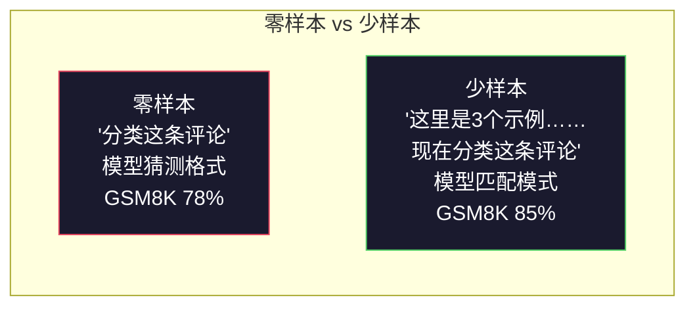
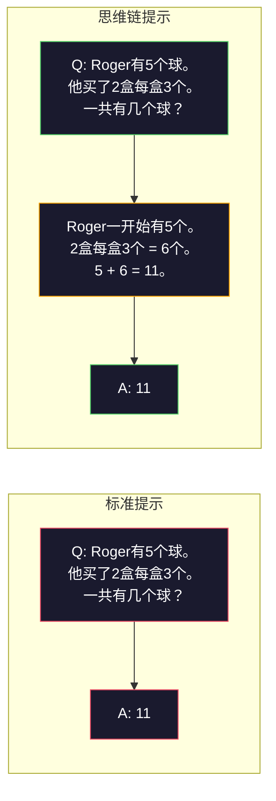
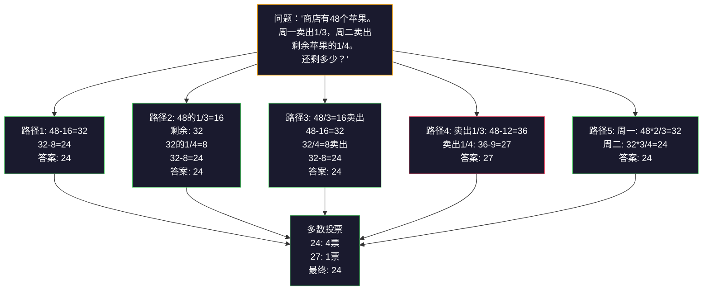
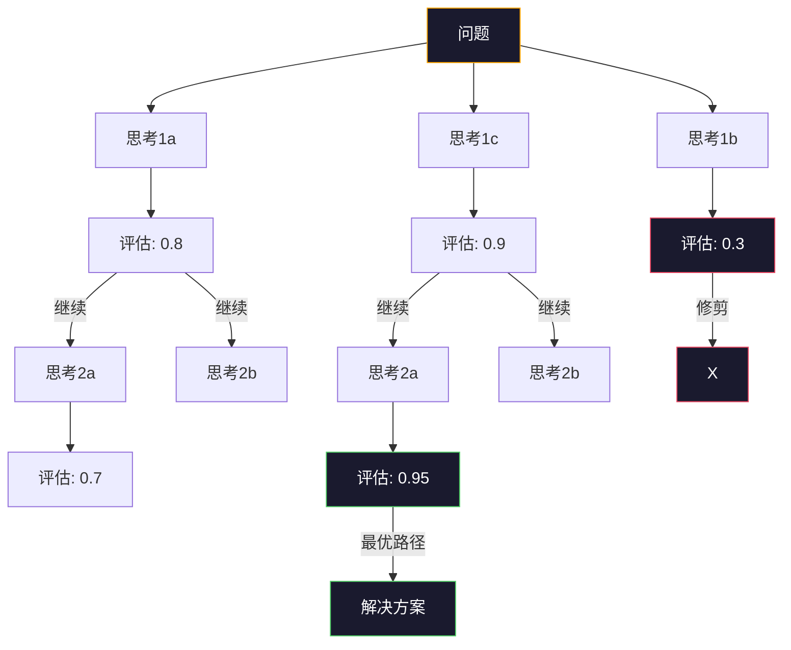
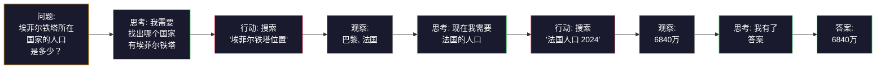

# 少样本、思维链、思维树

> 告诉模型该做什么是提示。告诉模型如何思考是工程。同一个模型、同一个任务、同一批数据上，78%到91%的准确率差距，不是更好的模型造成的，是更好的推理策略造成的。

**类型：** 构建
**语言：** Python
**前置要求：** Lesson 11.01（提示工程）
**时间：** 约45分钟

## 学习目标

- 通过选择和格式化最大化任务准确率的示例演示来实现少样本提示
- 应用思维链推理来提高多步骤问题（如数学应用题）的准确率
- 构建一个思维树提示，探索多条推理路径并选择最优路径
- 在标准基准上测量零样本 vs 少样本 vs CoT的准确率提升

## 问题

你构建了一个数学辅导应用。你的提示说："解这道应用题。"GPT-5在GSM8K（标准小学数学基准）上的正确率是94%。你以为已经到顶了。你还没到——思维链仍然能增加3-4个点。

加五个词——"让我们逐步思考"——准确率跳到91%。加几个完成的例子，达到95%。同一个模型，同一个Temperature，同样的API成本。唯一的区别是你给了模型草稿纸。

这不是取巧。这是推理的工作原理。人类不会在一次思维跳跃中解决多步骤问题。Transformer也不会。当你强制模型生成中间令牌时，这些令牌成为下一个令牌的上下文的一部分。每个推理步骤喂养下一个。模型实际上是在"计算"出答案。

但"逐步思考"是起点，不是终点。如果你采样五条推理路径并取多数票呢？如果你让模型探索一个可能性树，评估并修剪分支呢？如果你把推理与工具使用交织在一起呢？这些不是假设。它们是已发表的、有测量改进的技术，你在本课中将全部构建它们。

## 概念

### 零样本 vs 少样本：什么时候示例击败指令

零样本提示给模型一个任务，别无其他。少样本提示先给模型一些示例。

Wei等人（2022）在8个基准上对此进行了测量。对于简单任务如情感分类，零样本和少样本的表现在2%以内。对于复杂任务如多步骤算术和符号推理，少样本将准确率提高了10-25%。

直觉：示例是压缩的指令。你不是描述输出格式，而是展示它。你不是解释推理过程，而是演示它。模型在示例上的模式匹配比它解释抽象指令更可靠。



**少样本胜出的场景：** 格式敏感任务、分类、结构化提取、领域特定术语、任何模型需要匹配特定模式的任务。

**零样本胜出的场景：** 简单的事实性问题、示例会约束创造力的创意任务、找到好示例比写出好指令更难的任务。

### 示例选择：相似胜过随机

并非所有示例都一样。选择与目标输入相似的示例，在分类任务上比随机选择高出5-15%（Liu等人，2022）。三条原则：

1. **语义相似性**：在嵌入空间中挑选最接近输入的示例
2. **标签多样性**：在示例中覆盖所有输出类别
3. **难度匹配**：匹配目标问题的复杂程度

大多数任务的最优示例数量是3-5个。低于3个，模型没有足够信号来提取模式。超过5个，你遇到边际收益递减并浪费上下文窗口令牌。对于有许多标签的分类任务，每个标签使用一个示例。

### 思维链：给模型草稿纸

思维链（Chain-of-Thought，CoT）提示由Google Brain的Wei等人（2022）提出。这个想法很简单：不是只让模型给出答案，而是让它先展示推理步骤。



这在机制上为什么有效？Transformer生成的每个令牌都成为下一个令牌的上下文。没有CoT时，模型必须将所有推理压缩到单次前向传播的隐藏状态中。有了CoT，模型将中间计算外部化为了令牌。每个推理令牌扩展了有效的计算深度。

**GSM8K基准（小学数学，8500道题）：**

| 模型 | 零样本 | 零样本CoT | 少样本CoT |
|------|--------|-----------|-----------|
| GPT-4o | 78% | 91% | 95% |
| GPT-5 | 94% | 97% | 98% |
| o4-mini（推理） | 97% | — | — |
| Claude Opus 4.7 | 93% | 97% | 98% |
| Gemini 3 Pro | 92% | 96% | 98% |
| Llama 4 70B | 80% | 89% | 94% |
| DeepSeek-V3.1 | 89% | 94% | 96% |

**关于推理模型的说明。** OpenAI的o系列（o3、o4-mini）和DeepSeek-R1等模型在发出答案之前内部运行思维链。在推理模型中添加"让我们逐步思考"是多余的，有时甚至适得其反——它们已经做完了。

CoT的两种变体：

**零样本CoT**：在提示末尾追加"让我们逐步思考"。不需要示例。Kojima等人（2022）展示了这个单一句子在算术、常识和符号推理任务上提高了准确率。

**少样本CoT**：提供包含推理步骤的示例。比零样本CoT更有效，因为模型看到了你期望的确切推理格式。

**CoT有害的场景**：简单的事实回忆（"法国的首都是什么？"）、单步分类、速度比准确性更重要的任务。CoT每个查询增加50-200个推理开销令牌。对于高吞吐量、低复杂度的任务，那是浪费成本。

### 自洽性：多次采样，一次投票

Wang等人（2023）提出了自洽性（Self-Consistency）。洞察：单条CoT路径可能包含推理错误。但如果你采样N条独立的推理路径（使用temperature > 0）并对最终答案进行多数投票，错误会相互抵消。



在原始PaLM 540B实验中，自洽性将GSM8K准确率从56.5%（单CoT）提高到74.4%（N=40）。在GPT-5上提升很小（97%到98%），因为基准准确率已经饱和。该技术在CoT基准准确率在60-85%的模型上表现最好——这是单路径错误频繁但不系统化的甜点区域。对于推理模型（o系列、R1），自洽性被内置的内部采样所涵盖。

权衡：N个样本意味着N倍的API成本和延迟。在实际中，N=5能捕捉到大部分收益。N=3是有意义投票的最低要求。N>10对于大多数任务有边际收益递减。

### 思维树：分支探索

Yao等人（2023）提出了思维树（Tree-of-Thought，ToT）。CoT遵循一条线性推理路径，而ToT探索多个分支并在继续之前评估哪些最有前景。



ToT有三个组成部分：

1. **思考生成**：生成多个候选下一步
2. **状态评估**：评分每个候选（可以使用LLM本身作为评估器）
3. **搜索算法**：在树上进行BFS或DFS，修剪低分分支

在24点游戏任务上（用4个数字通过算术组合使结果为24），标准提示下GPT-4解决7.3%的问题。CoT是4.0%（CoT在这里实际上有害，因为搜索空间太广）。ToT是74%。

ToT很昂贵。树中的每个节点需要一次LLM调用。一个分支因子为3、深度为3的树最多需要39次LLM调用。只对那些搜索空间大但可评估的问题使用——规划、谜题求解、有约束的创意问题解决。

### ReAct：思考 + 行动

Yao等人（2022）将推理轨迹与行动结合起来。模型在思考（生成推理）和行动（调用工具、搜索、计算）之间交替。



ReAct在知识密集型任务上优于纯CoT，因为它可以将推理建立在真实数据上。在HotpotQA（多跳问答）上，ReAct配合GPT-4达到35.1%的精确匹配，而纯CoT为29.4%。真正的威力在于推理错误会被观察纠正——模型可以在执行过程中更新其计划。

ReAct是现代AI Agent的基础。每个Agent框架（LangChain、CrewAI、AutoGen）都实现了某种形式的"思考-行动-观察"循环变体。你将在Phase 14构建完整的Agent。本课涵盖提示模式。

### 结构化提示：XML标签、分隔符、标题

随着提示变复杂，结构化可以防止模型混淆不同部分。三种方法：

**XML标签**（Claude效果最好，但在所有模型上都很稳定）：
```
<context>
你正在审查一个拉取请求。
代码库使用TypeScript和React。
</context>

<task>
审查以下差异中的bug、安全问题和风格违规。
</task>

<diff>
{diff_content}
</diff>

<output_format>
列出每个问题，附：文件、行号、严重程度（critical/warning/info）、描述。
</output_format>
```

**Markdown标题**（通用）：
```
## 角色
某金融科技公司的资深安全工程师。

## 任务
分析此API端点的漏洞。

## 输入
{api_code}

## 规则
- 聚焦OWASP Top 10
- 对每个发现评级：critical、high、medium、low
- 包含修复步骤
```

**分隔符**（极简但有效）：
```
---输入开始---
{user_text}
---输入结束---

---指令---
用3个要点总结以上内容。
---指令结束---
```

### 提示链：顺序分解

某些任务对单个提示来说太复杂了。提示链将它们分解成步骤，其中每个提示的输出成为下一个提示的输入。


提示链优于单提示的三个原因：

1. **每个步骤更简单**：模型处理一个集中的任务，而不是同时处理所有事情
2. **中间输出可检查**：你可以在步骤之间验证和纠正
3. **不同步骤可以用不同模型**：用便宜模型做提取，用昂贵模型做推理

### 性能对比

| 技巧 | 最适合 | GSM8K准确率 (GPT-5) | API调用 | 令牌开销 | 复杂度 |
|------|--------|---------------------|---------|---------|--------|
| 零样本 | 简单任务 | 94% | 1 | 无 | 简单 |
| 少样本 | 格式匹配 | 96% | 1 | 200-500令牌 | 低 |
| 零样本CoT | 快速推理提升 | 97% | 1 | 50-200令牌 | 简单 |
| 少样本CoT | 单次调用最大准确率 | 98% | 1 | 300-600令牌 | 低 |
| 自洽性 (N=5) | 高利害推理 | 98.5% | 5 | 5倍令牌成本 | 中等 |
| 推理模型 (o4-mini) | 即插即用CoT替代 | 97% | 1 | 隐藏（内部2-10倍） | 简单 |
| 思维树 | 搜索/规划问题 | N/A（24点游戏74%） | 10-40+ | 10-40倍令牌成本 | 高 |
| ReAct | 知识基础的推理 | N/A（HotpotQA 35.1%） | 3-10+ | 可变 | 高 |
| 提示链 | 复杂多步骤任务 | 96%（管道） | 2-5 | 2-5倍令牌成本 | 中等 |

正确技巧取决于三个因素：准确率要求、延迟预算和成本容忍度。对于大多数生产系统，少样本CoT配合3样本自洽性回退覆盖了90%的使用场景。

## 构建

我们将构建一个数学问题求解器，将少样本提示、思维链推理和自洽性投票组合成一个管道。然后为难题添加思维树。

完整实现在`code/advanced_prompting.py`中。以下是关键组件。

### Step 1: 少样本示例存储

第一个组件管理少样本示例并为给定问题选择最相关的示例。

```python
# GSM8K示例：每个示例包含问题、推理链和最终答案
GSM8K_EXAMPLES = [
    {
        "question": "Janet的鸭子每天下16个蛋。她每天早上吃3个当早餐，每天用4个为朋友们烤松饼。她把剩下的蛋以每个2美元的价格在农贸市场出售。她在农贸市场每天赚多少钱？",
        "reasoning": "Janet的鸭子每天下16个蛋。她吃3个，烤4个，用了3 + 4 = 7个蛋。所以她有16 - 7 = 9个蛋剩余。每个卖2美元，所以她每天赚9 * 2 = 18美元。",
        "answer": "18"
    },
    # ... 更多示例
]
```

每个示例有三个部分：问题、推理链和最终答案。推理链是将常规少样本示例转变为CoT少样本示例的关键。

### Step 2: 思维链提示构建器

提示构建器将系统消息、带推理链的少样本示例和目标问题组合成一条提示。

```python
def build_cot_prompt(question, examples, num_examples=3):
    """构建少样本CoT提示"""
    system = (
        "你是一个数学问题求解器。"
        "对于每个问题，展示你的逐步推理，"
        "然后在最后一行以格式'The answer is [数字]'给出最终数值答案。"
    )

    # 组装示例
    example_text = ""
    for ex in examples[:num_examples]:
        example_text += f"Q: {ex['question']}\n"
        example_text += f"A: {ex['reasoning']} The answer is {ex['answer']}.\n\n"

    user = f"{example_text}Q: {question}\nA:"
    return system, user
```

格式约束（"The answer is [数字]"）至关重要。没有它，自洽性无法提取和比较各样本的答案。

### Step 3: 自洽性投票

采样N条推理路径并取多数答案。

```python
from collections import Counter

def self_consistency_solve(question, examples, client, model, n_samples=5):
    """采样N条推理路径并通过多数投票确定答案"""
    system, user = build_cot_prompt(question, examples)

    answers = []
    reasonings = []
    for _ in range(n_samples):
        response = client.chat.completions.create(
            model=model,
            messages=[
                {"role": "system", "content": system},
                {"role": "user", "content": user}
            ],
            temperature=0.7  # 非零temperature对于生成多样化路径至关重要
        )
        text = response.choices[0].message.content
        reasonings.append(text)
        answer = extract_answer(text)  # 从输出中提取数值答案
        if answer is not None:
            answers.append(answer)

    # 多数投票
    vote_counts = Counter(answers)
    best_answer = vote_counts.most_common(1)[0][0] if vote_counts else None
    confidence = vote_counts[best_answer] / len(answers) if best_answer else 0

    return best_answer, confidence, reasonings, vote_counts
```

Temperature 0.7很重要。在temperature 0.0下，所有N个样本都会相同，那就达不到目的。你需要足够的随机性来产生多样化的推理路径，但又不能多到让模型输出乱码。

### Step 4: 思维树求解器

对于线性推理失败的问题，ToT探索多种方法并评估哪个方向最有前景。

```python
def tree_of_thought_solve(question, client, model, breadth=3, depth=3):
    """使用思维树搜索解决难题"""
    # 生成初始思考
    thoughts = generate_initial_thoughts(question, client, model, breadth)
    # 评估每个思考
    scored = [(t, evaluate_thought(t, question, client, model)) for t in thoughts]
    scored.sort(key=lambda x: x[1], reverse=True)

    # 深度优先扩展最有前景的分支
    for current_depth in range(1, depth):
        next_thoughts = []
        for thought, score in scored[:2]:  # 保留前2个
            extensions = extend_thought(thought, question, client, model, breadth)
            for ext in extensions:
                ext_score = evaluate_thought(ext, question, client, model)
                next_thoughts.append((ext, ext_score))
        scored = sorted(next_thoughts, key=lambda x: x[1], reverse=True)

    best_thought = scored[0][0] if scored else ""
    return extract_answer(best_thought), best_thought
```

评估器本身就是一次LLM调用。你问模型："在0.0到1.0的范围内，这条推理路径对解决该问题的前景如何？"这是ToT的关键洞察——模型评估自己的部分解决方案。

### Step 5: 完整管道

管道将所有技巧与升级策略组合在一起。

```python
def solve_with_escalation(question, examples, client, model):
    """升级策略：先试试便宜的方法，只在必要时才升级"""
    # 第1层：单次CoT
    system, user = build_cot_prompt(question, examples)
    single_response = call_llm(client, model, system, user, temperature=0.0)
    single_answer = extract_answer(single_response)

    # 第2层：自洽性
    sc_answer, confidence, _, _ = self_consistency_solve(
        question, examples, client, model, n_samples=5
    )

    # 如果置信度高，就采用（5个样本中至少有4个一致）
    if confidence >= 0.8:
        return sc_answer, "self_consistency", confidence

    # 第3层：思维树（最后手段，最昂贵）
    tot_answer, _ = tree_of_thought_solve(question, client, model)
    return tot_answer, "tree_of_thought", None
```

升级逻辑：先尝试便宜的（单次CoT）。如果自洽性置信度低于0.8（5个样本中不到4个一致），升级到ToT。这平衡了成本和准确性——大多数问题用便宜方法解决，难题获得更多算力。

## 使用

### 使用LangChain

LangChain提供了对提示模板和输出解析的内置支持，简化了少样本和CoT模式：

```python
from langchain_core.prompts import FewShotPromptTemplate, PromptTemplate
from langchain_openai import ChatOpenAI

# 定义示例提示格式
example_prompt = PromptTemplate(
    input_variables=["question", "reasoning", "answer"],
    template="Q: {question}\nA: {reasoning} The answer is {answer}."
)

# 创建少样本提示模板
few_shot_prompt = FewShotPromptTemplate(
    examples=examples,
    example_prompt=example_prompt,
    suffix="Q: {input}\nA: Let's think step by step.",
    input_variables=["input"]
)

llm = ChatOpenAI(model="gpt-4o", temperature=0.7)
chain = few_shot_prompt | llm
result = chain.invoke({"input": "如果一列火车2小时行驶了120公里……"})
```

LangChain还有用于语义相似性选择的`ExampleSelector`类：

```python
from langchain_core.example_selectors import SemanticSimilarityExampleSelector
from langchain_openai import OpenAIEmbeddings

# 基于语义相似性选择最相关的k个示例
selector = SemanticSimilarityExampleSelector.from_examples(
    examples,
    OpenAIEmbeddings(),
    k=3
)
```

### 使用DSPy

DSPy将提示策略视为可优化的模块。不需要手工制作CoT提示，你定义一个签名让DSPy优化提示：

```python
import dspy

dspy.configure(lm=dspy.LM("openai/gpt-4o", temperature=0.7))

class MathSolver(dspy.Module):
    def __init__(self):
        # ChainOfThought自动添加推理轨迹
        self.solve = dspy.ChainOfThought("question -> answer")

    def forward(self, question):
        return self.solve(question=question)

solver = MathSolver()
result = solver(question="Janet的鸭子每天下16个蛋……")
```

DSPy的`ChainOfThought`自动添加推理轨迹。`dspy.majority`实现自洽性：

```python
# 运行5次并取多数答案
result = dspy.majority(
    [solver(question=q) for _ in range(5)],
    field="answer"
)
```

### 对比：从零开发 vs 框架

| 特性 | 从零开发（本课） | LangChain | DSPy |
|------|----------------|-----------|------|
| 对提示格式的控制 | 完整 | 基于模板 | 自动 |
| 自洽性 | 手动投票 | 手动 | 内置（`dspy.majority`） |
| 示例选择 | 自定义逻辑 | `ExampleSelector` | `dspy.BootstrapFewShot` |
| 思维树 | 自定义树搜索 | 社区链 | 不内置 |
| 提示优化 | 手动迭代 | 手动 | 自动编译 |
| 最适合 | 学习、自定义管道 | 标准工作流 | 研究、优化 |

## 交付

本课产出两个交付物。

**1. 推理链提示**（`outputs/prompt-reasoning-chain.md`）：一个用于少样本CoT加自洽性的生产就绪提示模板。插入你的示例和问题领域。

**2. CoT模式选择技能**（`outputs/skill-cot-patterns.md`）：基于任务类型、准确率要求和成本约束选择正确推理技巧的决策框架。

## 练习

1. **测量差距**：取10道GSM8K问题。分别用零样本、少样本、零样本CoT和少样本CoT求解。记录每种方法的准确率。哪种技巧在你的模型上提升最大？

2. **示例选择实验**：对同一组10道题，对比随机示例选择 vs 手工挑选的相似示例。测量准确率差异。在什么点上示例质量比示例数量更重要？

3. **自洽性成本曲线**：对20道GSM8K问题用N=1、3、5、7、10运行自洽性。绘制准确率 vs 成本（总令牌数）图。在你的模型上曲线的拐点在哪里？

4. **构建ReAct循环**：用计算器工具扩展管道。当模型生成数学表达式时，用Python的`eval()`（在沙箱中）执行并将结果反馈。测量工具基础的推理是否优于纯CoT。

5. **创意任务的ToT**：将思维树求解器适配到创意写作任务："写一个既好笑又伤感的6词故事。"使用LLM作为评估器。分支探索是否产出比单次生成更好的创意输出？

## 关键术语

| 术语 | 人们说的 | 它实际意味着 |
|------|---------|------------|
| 少样本提示 | "给它一些例子" | 在提示中包含输入-输出演示，以锚定模型的输出格式和行为 |
| 思维链 | "让它逐步思考" | 引出中间推理令牌，在生成最终答案之前扩展模型的有效计算 |
| 自洽性 | "多运行几次" | 在temperature>0时采样N条多样化的推理路径，通过多数投票选择最常见的最终答案 |
| 思维树 | "让它探索选项" | 对推理分支的结构化搜索，每个部分解决方案被评估，只有有前景的路径被扩展 |
| ReAct | "思考+工具使用" | 在思考-行动-观察循环中将推理轨迹与外部行动（搜索、计算、API调用）交织 |
| 提示链 | "把它分解成步骤" | 将复杂任务分解为顺序提示，每个输出馈入下一个输入 |
| 零样本CoT | "只需添加'逐步思考'" | 在提示后追加推理触发短语，不提供任何示例，依赖模型的潜在推理能力 |

## 扩展阅读

- [Chain-of-Thought Prompting Elicits Reasoning in Large Language Models](https://arxiv.org/abs/2201.11903) —— Wei等人2022。Google Brain的原始CoT论文。阅读第2-3节了解核心结果。
- [Self-Consistency Improves Chain of Thought Reasoning in Language Models](https://arxiv.org/abs/2203.11171) —— Wang等人2023。自洽性论文。表1包含了你需要的所有数字。
- [Tree of Thoughts: Deliberate Problem Solving with Large Language Models](https://arxiv.org/abs/2305.10601) —— Yao等人2023。ToT论文。第4节的24点游戏结果是亮点。
- [ReAct: Synergizing Reasoning and Acting in Language Models](https://arxiv.org/abs/2210.03629) —— Yao等人2022。现代AI Agent的基础。第3节解释了思考-行动-观察循环。
- [Large Language Models are Zero-Shot Reasoners](https://arxiv.org/abs/2205.11916) —— Kojima等人2022。"让我们逐步思考"论文。效果出奇地好，考虑到它有多简单。
- [DSPy: Compiling Declarative Language Model Calls into Self-Improving Pipelines](https://arxiv.org/abs/2310.03714) —— Khattab等人2023。将提示视为编译问题。如果你想超越手动提示工程，这值得一读。
- [OpenAI — 推理模型指南](https://platform.openai.com/docs/guides/reasoning) —— 供应商指南，关于思维链何时从提示级技巧变为内部化的、按令牌计费的"推理"模式。
- [Lightman等人, "Let's Verify Step by Step" (2023)](https://arxiv.org/abs/2305.20050) —— 过程奖励模型（PRM），对链的每一步进行评分；超越仅结果奖励的推理监督信号。
- [Snell等人, "Scaling LLM Test-Time Compute Optimally" (2024)](https://arxiv.org/abs/2408.03314) —— CoT长度、自洽性采样和MCTS的系统研究；当准确率比延迟更重要时，"逐步思考"的终点走向哪里。

---

## 📝 教师备课总结与读后感

### 一、文档整体评价

这篇文档将"提示策略"从散落的技巧提升为可测量的推理工程体系。它不是教你"怎么写得更好"，而是教你"为什么CoT提升13个百分点"——从Transformer的令牌生成机制出发，解释了每一步推理如何扩展计算深度。目标读者是已经理解LLM工作原理但还没将推理策略量化为工程决策的人。最大优势是用GSM8K的一致基准贯穿所有技巧，让零样本、少样本、CoT、自洽性、ToT成为同一个测量尺度上的可对比选择，而非各自独立的"最佳实践"。

### 二、知识结构梳理

- **认知基础**：Transformer的逐令牌生成机制（每个令牌成为下一个的上下文）→ CoT作为"外部化计算" → 少样本示例作为"压缩指令" → 示例选择的嵌入语义原理。这部分建立了从模型机制到推理策略的因果链，而非仅停留在现象层面。
- **工程模式**：四种推理策略按复杂度升序排列——单路径CoT → 多路径自洽性投票 → 树搜索ToT → 工具交织ReAct。每种策略有明确的性能数据、成本和适用边界。提示链和结构化提示是管道级和格式级的工程实践。
- **实际应用**：从零开发的管道实现（分层升级策略：单CoT→自洽性→ToT）→ LangChain/DSPy的框架化对比 → 选择框架的三维决策表（控制力 vs 模板化 vs 自动优化）。

### 三、核心洞察（备课时的关键理解）

1. **CoT不是哲学，是计算机制**：每个推理步骤的令牌成为后续令牌的上下文，Transformer借此将单次前向传播的计算预算扩展为多个"外化计算步骤"。这不是"模型在思考"，而是"模型把隐藏状态写出来接着用"。这个机制层直觉比所有"让AI思考"的修辞都精确。
2. **少数样本比多数指令更可移植**：指令依赖模型训练数据中的语义习惯（"输出JSON"在不同模型上解释不同），而少样本示例传递的是模式而非语义。这就是为什么2-3个示例跨模型比20条规则更好用——它不是修辞技巧，是信息论原理。
3. **自洽性的甜点区域在60-85%准确率**：当单路径准确率太低时（<40%），多路径采样只会放大噪音。当太高时（>95%），提升空间已饱和。60-85%是"个体会犯错但多数不会系统偏差"的统计窗口。N=5在大多数情况下已足够，N=40是学术场景。
4. **ToT的搜索空间决定其适用性**：ToT在24点游戏上从4%跳到74%是惊人的，但代价是39次LLM调用。这意味着它只适用于那些"搜索空间大、但每一步都可以用LLM评估"的问题。把它看作暴力搜索的有损替代品，而非推理增强器。
5. **ReAct是Agent的基础架构**：Thought-Action-Observation这个三元循环不是提示层面的技巧，而是一个完整的运行时架构——思考驱动行动，行动产生观察，观察修正思考。现代所有Agent框架都源于这个模式。理解了它，LangChain/CrewAI/AutoGen都是它的工程实现差异。
6. **推理模型（o系列）改变了策略选择**：当你用o4-mini时，不要在提示里写"逐步思考"——模型已经在内部做了。这对策略选择的影响是：以前你需要选择"加不加CoT"，现在你需要选择"用推理模型还是指令模型"。选择从提示层面升到了模型选择层面。
7. **提示链优于单提示的不是"质量"而是"可检查性"**：分解后每一步的中间输出可验证、可纠正、可以用不同模型（便宜的做提取，贵的做推理）。这是软件工程思维——把黑盒拆成可调试的步骤——而非"提示写得越好输出越好"。

### 四、教学建议

1. **从GSM8K的78%→91%的冲击开始**：不要讲定义，直接给学生看同一个模型同一个提示，加上"Let's think step by step"五个词后的准确率跳跃。让他们亲自在GPT-4o上复现这个差异。记住的不会是概念，是那个"卧槽"时刻。
2. **用"草稿纸"比喻而不是"推理"比喻**：CoT不是让模型"思考"，是给它"草稿纸"。这个比喻更准确：人类做复杂计算也需要在纸上写中间步骤，不是因为脑子不行，是因为工作记忆有限。Transformer的隐藏状态就是它的"工作记忆"——把中间结果写到令牌里就是给了它"无限草稿纸"。
3. **让学生手工做N=1 vs N=5的自洽性实验**：给10道GSM8K题，先单次运行，再5次取多数票。让他们自己看到：其中有1-2道题单次错了但多数票对了。这不是理论，是真实统计直觉。
4. **对比推理模型和非推理模型的策略差异**：用同一道题在GPT-4o和o4-mini上测试。加CoT在GPT-4o上提升明显，在o4-mini上可能反而降低（因为内部推理已被打乱）。这不只是知识，是对"模型架构决定提示策略"的直觉。
5. **框架选择做Panel讨论**：把从零开发、LangChain、DSPy三种方式放一起对比。让学生选一个场景（快速原型 vs 研究实验 vs 生产管道），让他们论证为什么选某个框架。框架不是"用哪个更好"，是"你支付什么换取什么"。
6. **升级策略是架构课，不是提示课**：`solve_with_escalation`的"便宜→中等→昂贵"三层架构不是一个实现细节，是一个系统设计模式。让学生解释为什么先试CoT、再试自洽性、最后才上ToT——这是延迟/成本/准确率的三维权衡。
7. **ReAct作为Agent概念的入口**：不是让学生背ReAct定义，是让他们写一个Thought-Action-Observation循环。当他们看到模型说"我需要搜索这个"然后真的调用了搜索API，最后得到正确答案时——这就是Agent的"Aha时刻"。

### 五、值得补充的内容

1. **CoT的"中间一致性"问题**：CoT可以提高最终答案的准确率，但中间推理步骤本身可能包含错误。"Let's Verify Step by Step"的过程奖励模型（PRM）应该被更深入介绍——它是CoT的监督升级。
2. **中文模型的CoT行为差异**：Qwen和DeepSeek在中文数学题上的CoT行为可能与GPT不同——中文数字的分词方式、中文数学表达的特殊性。对国内学生应该有专门的对比实验。
3. **成本模型的量化分析**：应该把"N=5的自洽性多花5倍钱但多对多少题"做成ROI表格。学生需要学会回答"多花2美分多对1题值不值"——这个商业决策比技术选择更决定实际采用。
4. **ToT的工程优化变体**：应该提一下Beam Search ToT（保持K个最优Live Path而非全部BFS/DFS）和蒙特卡洛树搜索ToT——两者在实际中比纯ToT更常用，因为纯ToT太贵。
5. **CoT + RAG的协同**：当推理需要外部知识时，CoT + RAG是一对天然的组合——CoT提供推理结构，RAG提供事实基础。应该在"什么时候用ReAct vs CoT+RAG"上有更清晰的决策指南。

### 六、一句话总结

**思维链不是在让模型"思考"，而是在让模型把隐藏状态外化——你花的是API调用费，买的是计算深度。**

---

# 🎓 Agent 架构课：推理即算力——思维链的工程意义

你还记得第一次看到"Let's think step by step"让准确率从78%跳到91%的那一刻吗？五年来，我们一直在说"更大的模型"，结果五个单词做到了十三个百分点。这不是魔法——这是一个几乎被所有人忽略的事实：**Transformer的每一步生成都是计算**。而"思考"这个词把这些计算包装成了某种类似人类推理的东西，骗过了所有人，包括我们自己。

我来告诉你什么是真正的"思考"。

你在做一个复杂计算，123×456。如果你有纸笔，你会写下中间结果：6×123=738，5×123=6150，4×123=49200，然后加起来。你不是在用脑子心算，你是在把工作记忆里的东西卸载到纸上，然后读回来继续算。Transformer也是一样。它的"工作记忆"就是隐藏状态——它不是无限的，它是固定的维度向量。当你让模型直接输出答案，你要求它把所有中间计算压缩到一个隐藏状态里。当你让它"逐步思考"，你允许它把每一步的中间结果写成令牌——这些令牌又成为后续令牌的上下文。**这就像给模型无限张草稿纸**。

这就是为什么CoT数字这么漂亮。它不是"让模型更聪明"，它是"给模型更长的算力跑道"。

## 问题的本质：单步推理是概率抽奖，多步推理是迭代收敛

让我用一个生产系统的真实案例。一个客户支持系统需要回答："如果客户在月中取消，应该退多少钱？退款政策是前7天全额退，之后按使用天数比例退。今天是第18天，月费49美元。"

如果你用零样本提示，模型得在单次前向传播中完成：（1）理解退款政策结构（2）计算使用天数（3）计算比例（4）乘以金额。四个步骤，一个隐藏状态。概率上讲，每一步都可能出错。如果第一步它误读了"前7天全额退"为"前14天全额退"，后面的计算再正确也是错的。而且你无法看到它哪一步错了。

CoT的解决方案不是"更好的隐藏状态"，是**让模型把每一步写下来然后读回来继续算**。就像你debug程序时加print语句——不是让程序变聪明，是让你能看到中间状态。

这就是为什么CoT比零样本好13个百分点：它不是每步更准，而是**每步更可纠正**。模型写了"Step 1: 前7天全额退款"——它接下来读到的上下文包含这行字。如果这行字有误，后续步骤在读到时会比隐藏状态里的错误更容易被"察觉"并修正。

## 两条路径，两种哲学

这里分叉出两条路。

**第一条路：推理模型。** OpenAI的o系列，DeepSeek的R1。模型在内部运行CoT——你看不到，按推理令牌收费，价格是正常令牌的2-10倍。你什么都不用做，输入问题，输出答案。但你付出了：更高的延迟（因为内部CoT很长），更高的成本（因为推理令牌按高价计费），而且丧失了可检查性（中间推理是隐藏的）。

**第二条路：外部CoT。** 你自己管推理——写少样本示例、控制采样temperature、做自洽性投票。成本低（标准令牌价格），可检查（每一步推理都在输出里），但速度慢（多次API调用）且需要你自己编写推理示例。

我见过太多人把推理模型当成"更好的GPT"来用。然后看着账单傻眼。一个推理模型的单次API调用可能烧掉正常模型5-10倍的令牌——那些内部推理令牌你看不到，但都计费。如果你只是做简单分类，用推理模型就是在用火箭筒打蚊子。

什么时候该用哪种？规则很简单：**如果你的任务单次推理复杂度小于3步，用指令模型+零样本CoT。如果3-10步，用指令模型+少样本CoT。如果超过10步且答案正确性极其关键，用推理模型。** 不是因为推理模型"更聪明"，是因为当推理步数超过10，你写CoT少样本示例和维护自洽性投票的成本超过了直接付推理令牌费。

## 深入原理：按推理策略流走

### 自洽性：为什么5次采样就够

自洽性的核心是统计直觉：如果每个推理路径有独立噪声，投5次票比1次更准。但这里面有个陷阱——N的选择不是"越多越好"。

N=1到N=3的增益最大（消除单路径的偶然错误）。N=3到N=5增益中等（消除偶尔的双路径错误）。N=5到N=10增益很小——如果真的需要10次投票才能消除的错误，大概率不是随机噪声而是系统性偏差（模型在训练数据中就没有正确的逻辑）。那种情况再多采样也没用。

Temperature=0.7是经验最优值。低于0.5，路径多样性不够，5次采样可能走出来4条相同的路径。高于0.9，噪声太大，推理质量下降。0.7是一个经验甜点——有足够随机性产生多样化路径，又不毁掉推理质量。

### 思维树：什么时候值得花39次API调用

用一个失败的ToT案例来说清楚。有人尝试用ToT写营销文案——让模型生成5个标题变体，评估每个，扩展最优的2个，再生成5个正文变体……结果是：39次API调用后产出的文案，和直接少样本CoT一次生成的差不多。

为什么？因为文案不是搜索问题。文案没有"正确答案"。每一步不可以通过"这个标题0.8分，那个0.3分"来筛选。LLM的评分不构成真正的目标函数。

ToT有用的前提是：**每一步都有一个可以被LLM可靠评估的"正确性"或"前景"度量。** 24点游戏有（24就是正确答案），数学证明有（最终应该推导出目标命题），代码生成有（代码应该通过测试）。在这些场景，LLM可以判断"这个方向看起来对吗？"并且大多数情况判断是对的。如果方向错误，修剪掉，算力花在正确的分支上——这就是ToT的价值。

没有可评估的目标函数，ToT只是昂贵的随机游走。

### ReAct：你的Agent系统的骨架

Thought-Action-Observation不是提示技巧——它是运行时架构。我见过所有好的Agent系统，从简单的客服机器人到复杂的代码生成Agent，都在这三个词上构建。

**Thought**是模型说"我需要X信息"的时刻。这是最重要的时刻——因为它决定了后续所有行动的方向。如果你的提示没有让模型清楚声明"我需要什么"，它可能会跳过这个步骤，直接猜答案。在RAG场景，没有Thought步骤的Agent就像一个没有WHERE子句的SQL查询——什么都检索，什么都可能乱入。

**Action**是真正的外部调用。搜索、计算、API调用、数据库查询。Action之后的**Observation**是系统的反馈——它可能告诉你检索结果是空的、计算结果是NaN、API返回了403。一个好的Agent不是"优雅地处理所有情况"——它是在Observation里看到异常后能够重新调整计划。

这三步循环的本质是什么？**是让模型有了一个你可以干预的运行时。** 没有ReAct，模型是一个黑盒：输入→输出。有了ReAct，模型是一个循环：思考→行动→观察→思考→行动→观察。在每一步，你可以注入矫正、补充信息或终止。

## 生产现实

- **CoT令牌开销**：每个CoT响应增加50-200个推理令牌。如果一天10万次查询，0.5-2M个额外令牌/天。按GPT-5定价$2.5/M输入令牌算，每天额外$5-20。
- **自洽性成本**：N=5 → 5倍API调用量和5倍令牌成本。不是5倍延迟（因为可以并行发5次调用），而是5倍账单。
- **ToT的不可预算性**：39次调用是乐观估计。如果树的深度和分支因子超标，很容易到100+次。ToT不适合有严格延迟SLA的生产系统。
- **推理模型的隐藏成本**：一个推理模型调用可能消耗10K内部推理令牌，按$15/M（o系列定价）计费。对比指令模型$2.5/M的输入令牌——同样的问题，差价6倍。
- **跨模型的CoT效果差异**：Claude的CoT提升最稳定（系统消息严格遵守下，推理格式不容易漂移），GPT-5在长CoT时有时会"跳过"步骤（模型越大越"自信"），Gemini在CoT下有时会过度展开（因为2M上下文窗口给了它太多"空间"）。

## 反模式 / 什么时候不该用这些技巧

**对推理模型使用CoT**。"o4-mini，让我们逐步思考这道题……"——你刚多花了15美元让模型已经做过的事情再做一次。

**对简单分类使用自洽性**。"这个评论是正面还是负面？运行5次然后投票。"——除非评论中80%都是"不是负面的负面"，否则这是烧钱。

**用ToT做创意任务**。"让我们探索这个故事的10种可能结局……"——你没有目标函数。这种探索应该在提示层面做（"给我5个结局选项"），不是在API调用搜索树上做。

**在提示里解决应该在API参数中解决的问题**。Temperature、max_tokens、stop——写在API参数里，不要写在提示里。

## 结语清单

作为Agent架构师，当你在设计推理策略时，check这7件事：

1. ☐ 这个任务的推理复杂度是多少步？<3步用零样本CoT，3-10步用少样本CoT，>10步才考虑推理模型。
2. ☐ 单路径准确率在60-85%的甜点区域吗？是的话加自洽性。低于60%的话先改善基础准确率。
3. ☐ 这个任务有没有可被LLM可靠评估的"正确性"度量？有的话才考虑ToT。
4. ☐ 是否需要外部信息？是的话用ReAct，不是的话CoT就够了——ReAct更慢更贵。
5. ☐ 推理模型 vs 指令模型：你是在付推理模型溢价换取方便，还是在用少样本CoT自己管理推理复杂度？
6. ☐ 升级策略（单CoT→自洽性→ToT）的切换阈值设置好了吗？不是"记得升级"，而是"一行代码自动升级"。
7. ☐ 这个推理策略的每次查询成本是多少？如果一天10万次调用，你能接受吗？

**一句金句：CoT不是给模型的"思考提示"，是给Transformer的"外挂工作内存"——你花的是延迟和令牌费，买的是计算深度。**
