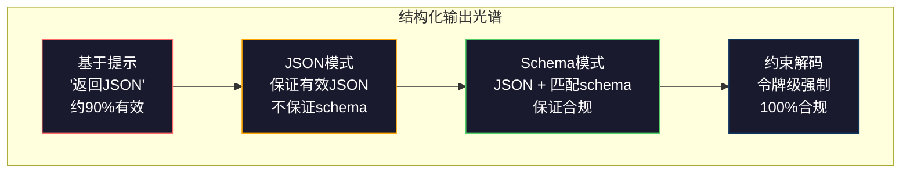
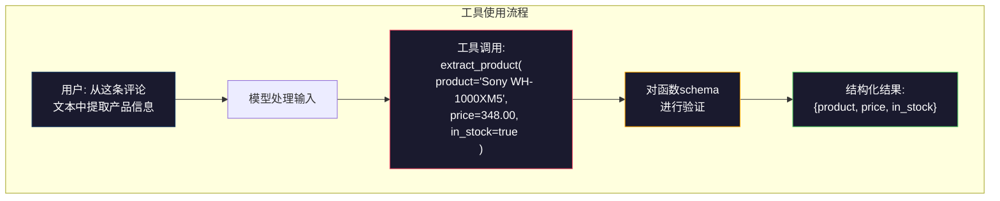

# 结构化输出：JSON、Schema验证、约束解码

> 你的LLM返回一个字符串。你的应用需要JSON。这个差距导致的系统崩溃比任何模型幻觉都要多。结构化输出是自然语言与类型化数据之间的桥梁。做对了，你的LLM就变成了一个可靠的API。做错了，你凌晨三点还在用正则表达式解析自由文本。

**类型：** 构建
**语言：** Python
**前置要求：** Phase 10，Lesson 01-05（从零开始的LLM）
**时间：** 约90分钟
**相关：** Phase 5 · 20（结构化输出与约束解码）涵盖解码器层面的理论（FSM/CFG logit处理器、Outlines、XGrammar）。本课聚焦于生产SDK层面（OpenAI `response_format`、Anthropic工具使用、Instructor）——如果你想理解API之下的实际运作，请先阅读Phase 5 · 20。

## 学习目标

- 使用OpenAI和Anthropic API参数实现JSON模式和schema约束的输出
- 构建一个Pydantic验证层，拒绝格式错误的LLM输出并用错误反馈进行重试
- 解释约束解码如何在令牌层面强制产生有效JSON，无需后处理
- 设计健壮的提取提示，可靠地将非结构化文本转换为类型化数据结构

## 问题

你让LLM："从这段文字中提取产品名称、价格和库存状态。"它回答：

```
该产品是Sony WH-1000XM5耳机，售价$348.00，目前有库存。
```

这个答案完全正确。但对你的应用来说完全没用。你的库存系统需要的是`{"product": "Sony WH-1000XM5", "price": 348.00, "in_stock": true}`。你需要的是一个具有特定键、特定类型和特定值约束的JSON对象。你不是需要一个句子。

朴素的解决方案：在提示里加"用JSON回答"。90%的情况下有效。另外10%的情况下，模型把JSON包在markdown代码块里，或者加了前言如"以下是JSON："，或者因为过早闭合括号而产生语法无效的JSON。你的JSON解析器崩溃了。你的管道中断了。你加了try/except和重试循环。重试有时产生不同的数据。现在你面临的是一个解析问题之上的另一个一致性问题。

这不是提示工程的问题，这是解码问题。模型从左到右生成令牌。在每个位置，它从一个10万+选项的词汇表中选择最可能的下一个令牌。在任何一个位置上，大多数选项都会产生无效JSON。如果模型刚刚发出了`{"price":`，下一个令牌必须是一个数字、引号（表示字符串）、`null`、`true`、`false`或负号。其他任何东西都会产生语法无效的JSON。没有约束，模型可能会选择一个逻辑上完全合理的英文单词，但在语法上是灾难性的错误。

## 概念

### 结构化输出光谱

结构化输出控制有四个级别，每个都比前一个更可靠。



**基于提示**（"用有效JSON回答"）：没有强制执行。模型通常会遵守但有时不行。可靠性：约90%。失败模式：markdown代码块、前言文字、截断输出、错误结构。

**JSON模式**：API保证输出是有效的JSON。OpenAI的`response_format: { type: "json_object" }`启用此模式。输出可以无错误地解析。但它可能不匹配你期望的schema——多余的键、错误的类型、缺失的字段。

**Schema模式**：API接受一个JSON Schema并保证输出匹配它。2026年每个主要提供商都原生支持此功能：OpenAI的`response_format: { type: "json_schema", json_schema: {...} }`（也可以通过`tool_choice="required"`实现），Anthropic的带有`input_schema`的工具使用，以及Gemini的`response_schema` + `response_mime_type: "application/json"`。输出有你指定的确切键、类型和约束。

**约束解码**：在生成过程中的每个令牌位置，解码器屏蔽掉所有会产生无效输出的令牌。如果schema要求一个数字而模型即将发出一个字母，该令牌的概率被设为零。模型只能产生通往有效输出的令牌。这是OpenAI结构化输出模式和Outlines、Guidance等库在底层实现的东西。

### JSON Schema：契约语言

JSON Schema是你告诉模型（或验证层）输出必须有什么形状的方式。每个主流结构化输出系统都使用它。

```json
{
  "type": "object",
  "properties": {
    "product": { "type": "string" },
    "price": { "type": "number", "minimum": 0 },
    "in_stock": { "type": "boolean" },
    "categories": {
      "type": "array",
      "items": { "type": "string" }
    }
  },
  "required": ["product", "price", "in_stock"]
}
```

这个schema说：输出必须是一个对象，包含字符串`product`、非负数`price`、布尔值`in_stock`和一个可选的字符串数组`categories`。任何不匹配的输出都会被拒绝。

Schema处理困难情况：嵌套对象、带类型项的数组、枚举（将字符串约束到特定值）、模式匹配（字符串的正则表达式）和组合器（oneOf、anyOf、allOf用于多态输出）。

### Pydantic模式

在Python中，你不需要手写JSON Schema。你定义一个Pydantic模型，它为你生成schema。

```python
from pydantic import BaseModel

class Product(BaseModel):
    product: str
    price: float
    in_stock: bool
    categories: list[str] = []
```

这产生和上面相同的JSON Schema。Instructor库（以及OpenAI的SDK）直接接受Pydantic模型：传入模型类，得到验证后的实例。如果LLM输出不匹配，Instructor自动重试。

### 函数调用 / 工具使用

同一问题的替代接口。你不是让模型直接生成JSON，而是定义带有类型参数的"工具"（函数）。模型输出一个带有结构化参数的函数调用。OpenAI称之为"函数调用"，Anthropic称之为"工具使用"。结果是相同的：结构化数据。



当模型需要选择调用哪个函数而非仅仅填充参数时，工具使用是更优选择。如果你有10个不同的提取schema，模型必须根据输入选择正确的那个，工具使用同时给你schema选择和结构化输出。

### 常见失败模式

即使有schema强制执行，结构化输出也可能以微妙的方式失败。

**幻觉值**：输出匹配schema但包含虚构数据。当文本说$348时，模型生成`{"price": 299.99}`。Schema验证无法捕捉这个——类型正确，值错误。

**枚举混淆**：你将字段约束为`["in_stock", "out_of_stock", "preorder"]`。模型输出`"available"`——语义上正确，但不在允许的集合中。良好的约束解码可以防止。基于提示的方法做不到。

**嵌套对象深度**：深层嵌套的schema（4层以上）产生更多错误。每一层嵌套都是模型可能丢失结构跟踪的又一个地方。

**数组长度**：模型可能在数组中产生过多或过少的项。Schema支持`minItems`和`maxItems`，但不是所有提供商都在解码层面强制执行。

**可选字段遗漏**：模型省略了在技术上是可选的但对你的用例语义上重要的字段。在schema中将它们设为必填，即使数据有时缺失——强制模型显式产生`null`。

## 构建

### Step 1: JSON Schema验证器

从零构建一个验证器，检查Python对象是否匹配JSON Schema。这是运行在输出侧验证合规性的东西。

```python
import json

def validate_schema(data, schema):
    """根据schema验证数据，返回错误列表"""
    errors = []
    _validate(data, schema, "", errors)
    return errors

def _validate(data, schema, path, errors):
    """递归schema验证"""
    schema_type = schema.get("type")

    if schema_type == "object":
        if not isinstance(data, dict):
            errors.append(f"{path}: 期望object，得到{type(data).__name__}")
            return
        # 检查必填字段
        for key in schema.get("required", []):
            if key not in data:
                errors.append(f"{path}.{key}: 必填字段缺失")
        # 验证每个属性
        properties = schema.get("properties", {})
        for key, value in data.items():
            if key in properties:
                _validate(value, properties[key], f"{path}.{key}", errors)

    elif schema_type == "array":
        if not isinstance(data, list):
            errors.append(f"{path}: 期望array，得到{type(data).__name__}")
            return
        min_items = schema.get("minItems", 0)
        max_items = schema.get("maxItems", float("inf"))
        if len(data) < min_items:
            errors.append(f"{path}: array有{len(data)}项，最小为{min_items}")
        if len(data) > max_items:
            errors.append(f"{path}: array有{len(data)}项，最大为{max_items}")
        # 验证每个数组项
        items_schema = schema.get("items", {})
        for i, item in enumerate(data):
            _validate(item, items_schema, f"{path}[{i}]", errors)

    elif schema_type == "string":
        if not isinstance(data, str):
            errors.append(f"{path}: 期望string，得到{type(data).__name__}")
            return
        # 检查枚举值
        enum_values = schema.get("enum")
        if enum_values and data not in enum_values:
            errors.append(f"{path}: '{data}'不在允许的值{enum_values}中")

    elif schema_type == "number":
        if not isinstance(data, (int, float)):
            errors.append(f"{path}: 期望number，得到{type(data).__name__}")
            return
        minimum = schema.get("minimum")
        maximum = schema.get("maximum")
        if minimum is not None and data < minimum:
            errors.append(f"{path}: {data}小于最小值{minimum}")
        if maximum is not None and data > maximum:
            errors.append(f"{path}: {data}大于最大值{maximum}")

    elif schema_type == "boolean":
        if not isinstance(data, bool):
            errors.append(f"{path}: 期望boolean，得到{type(data).__name__}")

    elif schema_type == "integer":
        # 注意：在Python中bool是int的子类
        if not isinstance(data, int) or isinstance(data, bool):
            errors.append(f"{path}: 期望integer，得到{type(data).__name__}")
```

### Step 2: Pydantic风格：模型到Schema

构建一个最简的类到schema转换器。定义一个Python类，自动生成其JSON Schema。

```python
class SchemaField:
    """表示schema中的单个字段，包含类型和验证约束"""
    def __init__(self, field_type, required=True, default=None, enum=None, minimum=None, maximum=None):
        self.field_type = field_type
        self.required = required
        self.default = default
        self.enum = enum
        self.minimum = minimum
        self.maximum = maximum

def python_type_to_schema(field):
    """将Python类型转换为JSON Schema类型定义"""
    type_map = {
        str: "string",
        int: "integer",
        float: "number",
        bool: "boolean",
    }

    schema = {}

    # 映射基本类型
    if field.field_type in type_map:
        schema["type"] = type_map[field.field_type]
    elif field.field_type == list:
        schema["type"] = "array"
        schema["items"] = {"type": "string"}
    elif isinstance(field.field_type, dict):
        # 允许直接传入字典格式的schema
        schema = field.field_type

    # 添加验证约束
    if field.enum:
        schema["enum"] = field.enum
    if field.minimum is not None:
        schema["minimum"] = field.minimum
    if field.maximum is not None:
        schema["maximum"] = field.maximum

    return schema

def model_to_schema(name, fields):
    """将字段定义字典转换为JSON Schema"""
    properties = {}
    required = []

    for field_name, field in fields.items():
        properties[field_name] = python_type_to_schema(field)
        if field.required:
            required.append(field_name)

    return {
        "type": "object",
        "properties": properties,
        "required": required,
    }
```

### Step 3: 约束令牌过滤

模拟约束解码。给定一个部分JSON字符串和一个schema，确定当前位置哪些令牌类别是有效的。

```python
def next_valid_tokens(partial_json, schema):
    """确定在部分JSON字符串的当前位置哪些令牌类别是有效的"""
    stripped = partial_json.strip()

    # 空字符串 → 需要一个开放的 {
    if not stripped:
        return ["{"]

    # 检查是否已经是完整有效的JSON
    try:
        json.loads(stripped)
        return ["<EOS>"]
    except json.JSONDecodeError:
        pass

    last_char = stripped[-1] if stripped else ""

    # 逐个字符的状态分析
    if last_char == "{":
        return ['"', "}"]  # 键或空对象
    elif last_char == '"':
        if stripped.endswith('":'):
            return ['"', "0-9", "true", "false", "null", "[", "{"]  # 值
        return ["a-z", '"']  # 延续键
    elif last_char == ":":
        return [" ", '"', "0-9", "true", "false", "null", "[", "{"]  # 在冒号后
    elif last_char == ",":
        return [" ", '"', "{", "["]  # 新键-值对
    elif last_char in "0123456789":
        return ["0-9", ".", ",", "}", "]"]  # 延续数字
    elif last_char == "}":
        return [",", "}", "]", "<EOS>"]  # 逗号或结束
    elif last_char == "]":
        return [",", "}", "<EOS>"]  # 逗号或结束
    elif last_char == "[":
        return ['"', "0-9", "true", "false", "null", "{", "[", "]"]  # 数组元素
    else:
        return ["any"]  # 默认允许


def demonstrate_constrained_decoding():
    """演示约束解码在各个部分JSON状态上的效果"""
    partial_states = [
        '',
        '{',
        '{"product"',
        '{"product":',
        '{"product": "Sony"',
        '{"product": "Sony",',
        '{"product": "Sony", "price":',
        '{"product": "Sony", "price": 348',
        '{"product": "Sony", "price": 348}',
    ]

    print(f"{'部分JSON':<45} {'有效下一个令牌'}")
    print("-" * 80)
    for state in partial_states:
        valid = next_valid_tokens(state, {})
        display = state if state else "(空)"
        print(f"{display:<45} {valid}")
```

### Step 4: 提取管道

将所有内容组合成一个提取管道：定义schema，模拟LLM生成结构化输出，验证输出，并处理重试。

```python
def simulate_llm_extraction(text, schema, attempt=0):
    """模拟LLM提取——第0次尝试可能故意失败以测试重试逻辑"""
    if "headphones" in text.lower() or "sony" in text.lower():
        if attempt == 0:
            # 第0次尝试：返回包含额外字段的数据（测试schema验证）
            return '{"product": "Sony WH-1000XM5", "price": 348.00, "in_stock": true, "categories": ["audio", "headphones"]}'
        # 后续尝试：返回正确的数据
        return '{"product": "Sony WH-1000XM5", "price": 348.00, "in_stock": true}'

    if "laptop" in text.lower():
        return '{"product": "MacBook Pro 16", "price": 2499.00, "in_stock": false, "categories": ["computers"]}'

    # 当没有产品信息时使用默认值
    return '{"product": "Unknown", "price": 0, "in_stock": false}'

def extract_with_retry(text, schema, max_retries=3):
    """提取管道：调用LLM → 解析JSON → 验证schema → 必要时重试"""
    for attempt in range(max_retries):
        # 获取原始输出
        raw = simulate_llm_extraction(text, schema, attempt)

        # 第1步：解析JSON
        try:
            data = json.loads(raw)
        except json.JSONDecodeError as e:
            print(f"  第{attempt + 1}次尝试: JSON解析错误 -- {e}")
            continue

        # 第2步：验证schema
        errors = validate_schema(data, schema)
        if not errors:
            return data

        # 第3步：报告验证错误，重试
        print(f"  第{attempt + 1}次尝试: Schema验证错误 -- {errors}")

    return None

# 产品schema定义
product_schema = {
    "type": "object",
    "properties": {
        "product": {"type": "string"},
        "price": {"type": "number", "minimum": 0},
        "in_stock": {"type": "boolean"},
        "categories": {"type": "array", "items": {"type": "string"}},
    },
    "required": ["product", "price", "in_stock"],
}
```

### Step 5: 运行完整管道

```python
def run_demo():
    print("=" * 60)
    print("  结构化输出管道演示")
    print("=" * 60)

    # Schema定义
    print("\n--- Schema定义 ---")
    product_fields = {
        "product": SchemaField(str),
        "price": SchemaField(float, minimum=0),
        "in_stock": SchemaField(bool),
        "categories": SchemaField(list, required=False),
    }
    generated_schema = model_to_schema("Product", product_fields)
    print(json.dumps(generated_schema, indent=2))

    # Schema验证演示
    print("\n--- Schema验证 ---")
    test_cases = [
        ({"product": "Test", "price": 10.0, "in_stock": True}, "有效对象"),
        ({"product": "Test", "price": -5.0, "in_stock": True}, "负价格"),
        ({"product": "Test", "in_stock": True}, "缺少price"),
        ({"product": "Test", "price": "ten", "in_stock": True}, "字符串作为price"),
        ("not an object", "字符串而不是对象"),
    ]

    for data, label in test_cases:
        errors = validate_schema(data, product_schema)
        status = "通过" if not errors else f"失败: {errors}"
        print(f"  {label}: {status}")

    # 约束解码模拟
    print("\n--- 约束解码模拟 ---")
    demonstrate_constrained_decoding()

    # 提取管道
    print("\n--- 提取管道 ---")
    texts = [
        "The Sony WH-1000XM5 headphones are priced at $348 and currently available.",
        "The new MacBook Pro 16-inch laptop costs $2499 but is sold out.",
        "This is a random sentence with no product info.",
    ]

    for text in texts:
        print(f"\n  输入: {text[:60]}...")
        result = extract_with_retry(text, product_schema)
        if result:
            print(f"  输出: {json.dumps(result)}")
        else:
            print(f"  输出: 重试后仍然失败")
```

## 使用

### OpenAI 结构化输出

```python
# from openai import OpenAI
# from pydantic import BaseModel
#
# client = OpenAI()
#
# class Product(BaseModel):
#     product: str
#     price: float
#     in_stock: bool
#
# response = client.beta.chat.completions.parse(
#     model="gpt-5-mini",
#     messages=[
#         {"role": "system", "content": "提取产品信息。"},
#         {"role": "user", "content": "Sony WH-1000XM5, $348, 有库存"},
#     ],
#     response_format=Product,  # 直接传入Pydantic模型
# )
#
# product = response.choices[0].message.parsed
# print(product.product, product.price, product.in_stock)
```

OpenAI的结构化输出模式在内部使用约束解码。模型生成的每个令牌都保证能产生匹配Pydantic schema的输出。无需重试，无需验证。约束被烘焙到解码过程中。

### Anthropic 工具使用

```python
# import anthropic
#
# client = anthropic.Anthropic()
#
# response = client.messages.create(
#     model="claude-opus-4-7",
#     max_tokens=1024,
#     tools=[{
#         "name": "extract_product",
#         "description": "从文本中提取产品信息",
#         "input_schema": {
#             "type": "object",
#             "properties": {
#                 "product": {"type": "string"},
#                 "price": {"type": "number"},
#                 "in_stock": {"type": "boolean"},
#             },
#             "required": ["product", "price", "in_stock"],
#         },
#     }],
#     messages=[{"role": "user", "content": "提取: Sony WH-1000XM5, $348, 有库存"}],
# )
```

Anthropic通过工具使用实现结构化输出。模型发出带有匹配input_schema的结构化参数的工具调用。相同的结果，不同的API接口。

### Instructor 库

```python
# pip install instructor
# import instructor
# from openai import OpenAI
# from pydantic import BaseModel
#
# client = instructor.from_openai(OpenAI())
#
# class Product(BaseModel):
#     product: str
#     price: float
#     in_stock: bool
#
# product = client.chat.completions.create(
#     model="gpt-5-mini",
#     response_model=Product,  # 指定期望的响应模型
#     messages=[{"role": "user", "content": "Sony WH-1000XM5, $348, 有库存"}],
# )
```

Instructor封装了任何LLM客户端，并添加了带验证的自动重试。如果第一次尝试验证失败，它会将错误作为上下文发送回模型，并要求它修复输出。这适用于所有提供商，不仅仅是OpenAI。

## 交付

本课产出`outputs/prompt-structured-extractor.md`——一个可重用的提示模板，可以根据给定的schema定义从任何文本中提取结构化数据。输入一个JSON Schema和非结构化文本，它返回经过验证的JSON。

它还产出`outputs/skill-structured-outputs.md`——基于你的提供商、可靠性要求和schema复杂度选择正确结构化输出策略的决策框架。

## 练习

1. 扩展schema验证器以支持`oneOf`（数据必须恰好匹配多个schema中的一个）。这处理多态输出——例如，一个字段可以是`Product`或具有不同形状的`Service`对象。

2. 构建一个"schema差异"工具，对比两个schema并识别破坏性变更（删除必填字段、更改类型）vs 非破坏性变更（添加可选字段、放宽约束）。这在生产中对版本化你的提取schema至关重要。

3. 实现一个更真实的约束解码模拟器。给定一个JSON Schema和一个包含100个令牌的词汇表（字母、数字、标点、关键词），逐步走一遍生成过程，在每个位置屏蔽无效令牌。测量每一步中有效词汇表占多少百分比。

4. 构建一个提取评估套件。创建50条产品描述并手工标注JSON输出。对所有50条运行你的提取管道，测量精确匹配、字段级准确率和类型合规性。识别哪些字段最难正确提取。

5. 向你的提取管道添加"置信度分数"。对于每个提取的字段，估计模型的置信度（基于令牌概率，或通过运行3次提取并测量一致性）。标记低置信度字段供人工审核。

## 关键术语

| 术语 | 人们说的 | 它实际意味着 |
|------|---------|------------|
| JSON模式 | "返回JSON" | API标志，保证语法有效的JSON输出，但不强制执行任何特定schema |
| 结构化输出 | "类型化JSON" | 匹配特定JSON Schema的输出，具有正确的键、类型和约束 |
| 约束解码 | "引导生成" | 在每个令牌位置屏蔽会产生无效输出的令牌——保证100% schema合规 |
| JSON Schema | "JSON模板" | 一种声明性语言，用于描述JSON数据的结构、类型和约束（被OpenAPI、JSON Forms等使用） |
| Pydantic | "Python数据类+" | 定义带有类型验证的数据模型的Python库，被FastAPI和Instructor用于生成JSON Schema |
| 函数调用 | "工具使用" | LLM输出一个结构化的函数调用（名称+类型化参数）而非自由文本——OpenAI和Anthropic都支持此功能 |
| Instructor | "用于LLM的Pydantic" | 封装LLM客户端以返回经过验证的Pydantic实例的Python库，在验证失败时自动重试 |
| 令牌屏蔽 | "过滤词汇表" | 在生成过程中将特定令牌概率设为零，使模型无法生成它们 |
| Schema合规 | "匹配形状" | 输出包含每个必填字段、正确的类型、在约束范围内的值，且没有不允许的额外字段 |
| 重试循环 | "重试直到成功" | 将验证错误发回模型并要求它修复输出——Instructor自动执行此操作，最多可配置的最大次数 |

## 扩展阅读

- [OpenAI 结构化输出指南](https://platform.openai.com/docs/guides/structured-outputs) —— OpenAI API中基于JSON Schema的约束解码的官方文档
- [Willard & Louf, 2023 —— "Efficient Guided Generation for Large Language Models"](https://arxiv.org/abs/2307.09702) —— Outlines论文，描述如何将JSON Schema编译为有限状态机以实现令牌级别的约束
- [Instructor 文档](https://python.useinstructor.com/) —— 从任何LLM获取结构化输出的标准库，具备Pydantic验证和重试
- [Anthropic 工具使用指南](https://docs.anthropic.com/en/docs/tool-use) —— Claude如何通过带有JSON Schema input_schema的工具使用实现结构化输出
- [JSON Schema 规范](https://json-schema.org/) —— 每个主流结构化输出系统使用的schema语言的完整规范
- [Outlines 库](https://github.com/outlines-dev/outlines) —— 使用正则表达式和编译为有限状态机的JSON Schema进行开源约束生成
- [Dong等, "XGrammar: Flexible and Efficient Structured Generation Engine for Large Language Models" (MLSys 2025)](https://arxiv.org/abs/2411.15100) —— 当前最先进的语法引擎；将schema编译为下推自动机，以约100纳秒/令牌的速度屏蔽令牌。
- [Beurer-Kellner等, "Prompting Is Programming: A Query Language for Large Language Models" (LMQL)](https://arxiv.org/abs/2212.06094) —— LMQL论文，将约束解码框架为带有类型和值约束的查询语言。
- [Microsoft Guidance (框架文档)](https://github.com/guidance-ai/guidance) —— 模板驱动的约束生成；与Outlines和XGrammar互补的供应商无关方案。

---

## 📝 教师备课总结与读后感

### 一、文档整体评价

这篇文档是对结构化输出问题的工程化全景扫描——从"在提示里写'返回JSON'"这种"裸奔"方案到约束解码的令牌级强制，四级递进清晰呈现了从不可靠到可靠的演进路径。目标读者是已经遭遇过JSON解析崩溃的工程师，所以文档以"你的LLM返回一个字符串，你的应用需要JSON"这个切肤之痛开头。最大优势是用一个贯穿始终的产品提取用例把所有概念串联起来：同一段文本，分别在提示级、JSON模式、Schema模式、约束解码下处理，展示每一步新增了什么保障、又放弃了什么。

### 二、知识结构梳理

- **认知基础**：LLM的逐令牌生成机制 → 为什么自由文本生成天然会产出无效JSON → JSON Schema作为类型契约 → Pydantic作为Python化的类型定义。这部分建立了"结构化输出不是后处理而是解码过程"的心智模型。
- **工程模式**：四级输出控制光谱（提示→JSON模式→Schema模式→约束解码）→ 函数调用/工具使用作为替代接口 → 验证+重试循环作为兜底方案。每一级都有明确的可靠性数字和失败边界。
- **实际应用**：从零构建schema验证器 → 模型到schema转换器 → 令牌过滤模拟器 → Instructor的实际使用。展示了从无框架到有框架的工程成熟度阶梯。

### 三、核心洞察（备课时的关键理解）

1. **结构化输出是解码问题而非提示问题**：10%的JSON失败不是因为模型"不听话"，是因为在特定令牌位置上，100K+词汇中90%都是无效选择。约束解码在生成时修正了这个不对称性——每个位置的候选令牌被过滤到只有有效的那些。这个直觉比"提示写得好就不会出错"深刻得多。
2. **四级光谱是可靠性vs控制力的权衡**：提示级（最小控制，最低可靠性）→ JSON模式（语法保证，无类型保证）→ Schema模式（类型保证）→ 约束解码（令牌级保证）。每一级都增加了可靠性但也增加了锁定（schema变了需要改代码）。
3. **工具使用是结构化输出的另一种语法**：它不是为了"让模型调用API"，而是另一种描述输出结构的方式。当你有多套schema需要模型自己选时，工具使用同时解决了schema选择和结构化输出的问题。
4. **约束解码的最简模拟只需一个状态机**：`next_valid_tokens`函数的核心就是逐字符追踪JSON状态——在`{`后该是什么，在`:`后该是什么。把这个逻辑放在解码器的logit后处理中，就是约束解码。不到100行代码就能让99%的人理解这个"神秘"技术的本质。
5. **Pydantic + Instructor是实际生产的选择**：手写JSON Schema容易出错，约束解码需要提供商级支持。Pydantic定义类型 → Instructor自动生成schema → 自动重试验证 → 返回类型化对象。这个"定义一次，到处使用"的模式让结构化输出从"高级功能"变成了"默认行为"。
6. **Schema差异工具是生产必备但常被忽略的**：版本化你的提取schema像版本化API一样重要。没做这个的团队最终会面对"旧版LLM调用产生新schema不接受的输出"或者更糟的"静默接受错误格式的数据"。
7. **幻觉值无法被结构性验证发现**：`{"price": 299.99}`类型正确、格式正确、约束满足——但它就是错的。结构化输出保证的是形式正确，不是内容正确。这是它与RAG或人工审核需要组合使用的地方。

### 四、教学建议

1. **从学生被JSON解析崩溃折磨的经历入手**：让每个人分享一次"凌晨3点修正则表达式解析LLM输出"的故事。让他们先感受痛苦，再展示约束解码如何消灭这个问题。没有先痛苦过的学生不会理解为什么"在提示里写返回JSON就行"不是答案。
2. **用`next_valid_tokens`函数现场演示**：在黑板上（或live coding）逐字符分析`{"product": "Sony"`的JSON状态转换。让学生在互动中自己说出"这里只可能是引号或逗号"——然后告诉他们这就是约束解码的底层逻辑。这个亲手体验胜过任何slides。
3. **四级递进实验**：给同一段产品评论文本，让学生分别用（a）提示"返回JSON"（b）JSON模式（c）Schema模式（d）如果他们能接入约束解码API则用API。统计每种方法的失败率和失败模式。数据会说话——从10%失败到0%失败的可视化跳跃是这节课最有力的部分。
4. **工具使用 vs 结构化输出应该做对比实验**：对同一个提取任务用两种方式实现。让学生体会到：单schema任务用结构化输出更简洁，多schema任务用工具使用更自然。这不是"哪个更好"，是"你的使用模式是什么"。
5. **强调"模拟LLM提取"的价值**：`simulate_llm_extraction`故意在第0次尝试返回不符合schema的数据。这个设计意图需要解释——不仅是测试代码，更是在提醒学生：永远不要假设第一次调用就会成功。重试逻辑是结构化输出的必需品，不是奢侈品。
6. **把Schema差异工具作为一个系统设计的练习**：让学生设计一个CI/CD管道：每次schema变更自动运行差异检测，如果发现破坏性变更则阻断部署。这是在教他们"结构化输出不是一次性配置，是需要像API一样管理的持续基础设施"。
7. **结构化输出 + 提示工程的交集**：虽然约束解码是机械化保证，但初始JSON仍然来自模型对文本的理解。好的提取提示（明确输出字段定义、给示例、说明边缘情况）仍然是必要的。这是"工程保证"和"语义理解"的分工。

### 五、值得补充的内容

1. **JSON Schema的`oneOf/anyOf/allOf`组合器深度讲解**：原文提到但未展开。多态输出（工单可以是Bug/Feature/Task，各有不同字段）是实际中非常常见的需求。`oneOf`的正确使用和常见陷阱值得专门一节。
2. **流式输出的结构化挑战**：当模型流式返回令牌时，约束解码的token-level masking依然有效吗？需要多少缓冲？哪些提供商支持流式+结构化输出？这是实时应用场景的核心问题。
3. **中文文本的结构化提取特殊性**：中文字符在JSON中作为字符串值时的token边界问题、中文文本的命名实体识别与提取、中文数字（三千四百八十元→3480）的转换挑战——对国内学生来说这是直接相关的实际问题。
4. **验证失败时的"智能重试"策略**：Instructor默认的重试是"把错误发回去让模型修复"，但更好的策略可能是（a）提供原始schema（b）给一个正确示例（c）高亮具体的错误位置。不同LLM对不同重试策略的响应差异值得量化。
5. **结构化输出的成本对比**：约束解码的额外计算成本 vs 重试循环的额外API成本。在一些边缘情况下（schema非常复杂，验证失败率很高），重试可能比约束解码更便宜。应该有量化分析。

### 六、一句话总结

**结构化输出不是在"让模型返回JSON"，而是在"让解码过程遵守类型契约"——它是从概率生成到确定性数据交换之间的桥梁，而不是一个提示写作技巧。**

---

# 🎓 Agent 架构课：输出即API——为什么你的LLM输出应该通过编译校验而非正则解析

我职业生涯中最痛苦的2小时是在凌晨3点，一个关键生产管道崩溃了。为什么？因为上游的LLM提取管道产出了一个JSON，第一个字符是`` ` ``。没错，markdown代码块的开头。模型在它"返回"的JSON前面套了一个`` ```json ``。

你是不是也经历过？我猜你经历过。因为每个做LLM应用的人都会经历。区别在于：有人修复了导致这个问题的底层原因，有人只是加了一层更厚的正则表达式。

我们现在来谈的不是"怎么写得更好"，而是**从根本上消灭"解析不确定性"这个物种**。

## 问题的本质：生成过程天然"反结构"

让我把LLM生成JSON的根本问题拆开给你看。

LLM从左到右生成令牌。每次它在100K+词汇中选择下一个。当它刚输出了`{"price":`时，接下来只有大约20个令牌能产生有效JSON——数字0-9、引号（表示字符串值）、`true`、`false`、`null`、`-`。其他99980个令牌都会产出语法垃圾。

问题是：**LLM不知道自己在"写JSON"。** 它只是在逐令牌生成文本，就像生成一篇散文。概率空间里"完美JSON"的区域只是整个输出空间中的一小片。模型经常漂移出这片区域——加个markdown代码块、加个解释性的前言、在数组结尾多写一个逗号。

这就是为什么"在提示里写'返回JSON'"不可靠。你在给模型一个**语义指令**（"用JSON格式输出"），但它需要的是一个**语法约束**（"下一个令牌只能是0-9之间的任意一个"）。语义和语法之间隔着一个词表大小的搜索空间。

## 两条路径，两种哲学

**第一条路：验证+重试。** 你让模型自由输出，然后写一个验证器检查输出。如果不对——重试。重试3次。重试时把错误信息发回去。"上次你输出了`true`作为price，我要的是数字，不是布尔值。"这在70%的情况下管用。另外30%？模型可能会改那个字段，但引入另一个新错误。

验证+重试是**覆盖**，不是**修复**。就像你把一辆车开到悬崖边然后猛打方向盘——有时候确实能拐回来，有时候直接翻下去。而且每次都消耗一次API调用（账单在燃烧）。

**第二条路：约束解码。** 你在生成时告诉模型："下一个令牌只能从这些选项里选。"在每个令牌位置，你拿掉所有会导致无效输出的令牌。如果在`123.`之后schema要求数字，模型不能选择逗号——它根本看不到逗号这个选项。

这是**预防**，不是**治疗**。它不增加额外的API调用，不依赖模型的理解能力，不靠运气。

选择很明确：如果你的提供商支持约束解码（OpenAI的`response_format`、Anthropic的tool use有schema），用约束解码。如果不支持（开源模型、本地部署），用验证+重试，但要配上好的失败处理——不是盲目重试3次，而是把schema、正确示例和错误位置一起送回给模型。

## 深入原理：按输出控制级别走

### 提示级：假装有结构

"返回JSON"——这四个字背后是什么？模型在训练数据里看了几十亿个JSON文本片段。它学会了某种格式模式。但"学会了模式"≠"能100%遵守"。就像人学会了打篮球但罚球命中率只有70%——不是不会，是做不到每次都标准。

你看到的问题：
- **Markdown包裹**（`` ```json ... ``` ``）：模型处理代码块太顺手了
- **前言**（"以下是提取结果：..."）：模型习惯了"先解释再给结果"
- **尾部逗号**（`{"a": 1,}`）：有些JSON解析器允许，你的不允许
- **截断**：模型达到max_tokens限制时刚好在JSON中间

修复这些的唯一办法是：别让它们可能出现。

### JSON模式：语法保证，没有语义保证

`response_format: { type: "json_object" }`——这是第一个真正的保证。它确保输出是可解析的JSON。但这是一个**语法保证**，不是**语义保证**。

模型可以返回`{"product": 12345}`——数字而非字符串，语法上有效的JSON，语义上完全错误。JSON模式防止了凌晨3点的正则解析噩梦，但没解决"这个字段的类型对不对"。

这是一个重要的中间状态。对内部工具来说足够了。对多团队共享的API来说不够。

### Schema模式：类型契约

`response_format: { type: "json_schema", json_schema: {...} }`——这才是真正的契约。你定义："product必须是string，price必须是number且≥0，in_stock必须是boolean。"模型理解这个约束，API强制执行它。

这里的关键不是"模型更听话了"，是**验证从运行时移到了API层**。你的代码不再需要`if not isinstance(data["price"], (int, float))`——API保证它已经是number。这节省的不是编码时间，是调试时间。

### 约束解码：令牌级强制

这是底层到底的解决方案。在解码器的logit处理器里，有一个状态机在运行。这个状态机用你的JSON Schema编译而成。在每个令牌位置，状态机知道当前允许什么类型的令牌，然后把其他所有令牌的概率归零。

"概率归零"这句话需要你真正理解。模型不是"倾向于选择有效令牌"——它根本**不能**选择无效令牌。那些令牌不存在于它的选择空间里。

这就是为什么约束解码是"100%合规"的。不是99.9%，是100%。因为数学上就不可能违反。

代价是什么？状态机的维护增加了大约10-15%的解码延迟。而且如果schema非常复杂（大量`oneOf`和深层嵌套），编译出的状态机会很大，内存占用可能翻倍。但对于绝大多数生产schema（少于100个字段、少于5层嵌套），这些开销可以忽略。

## 生产现实

- **验证+重试的隐藏成本**：每次重试烧掉所有已消耗令牌的成本。如果第一次尝试用了500个令牌失败，重试又烧了500个。3次重试就是1500个令牌，约束解码只需要一次500个令牌——3倍的成本差异。
- **Schema复杂度的实际上限**：字段数<100、嵌套深度<5——如果超过这个阈值，即使是约束解码也会开始不稳定。不是因为状态机崩溃，是因为模型本身就会在深层嵌套中迷航（注意力在长上下文中的稀释效应）。
- **Instructor的实际使用**：大部分生产环境中，Instructor配置的是max_retries=2。超过2次重试，同一模型的成功概率低于10%——不是模型突然变好了，是运气。
- **跨提供商的差异**：OpenAI的`response_format`有最成熟的约束解码实现。Anthropic的工具使用在schema复杂时偶尔会在参数中混入自由文本（需要后处理）。Gemini的`response_schema`对深层嵌套支持最好（因为2M上下文窗口给了更多结构化的"空间"）。
- **流式+结构化输出的陷阱**：当模型流式返回时，约束解码需要在每个令牌位置决策。如果你要求流式+JSON Schema，第一个输出块可能只是`{`——在完整JSON到达之前你什么都做不了。流式结构化输出适用于"渐进渲染UI"，不适用于"等完整结果再处理"。

## 反模式 / 什么时候不该用结构化输出

**把结构化输出当作API替代品**。"让LLM生成一个完整的API响应，我们直接返回给前端。"——不。LLM的输出不确定（即使有schema），API响应需要确定性。结构化输出适合"提取"和"分类"，不适合"生成可缓存的API响应"。

**Pydantic模型包含业务逻辑**。别在让LLM填充的Pydantic模型里写验证器。LLM输出不应该触发业务规则——业务规则应在上层独立执行。

**Schema过度设计**。"以防万一"加20个可选字段。每个额外字段都在消耗模型的注意力预算。schema够小够精确比"大而全"更可靠。

**重试不设置上限**。"重试到成功为止"——你刚设计了一个无限循环。如果你的验证失败率超过5%，说明你的schema或提示有问题，不是重试不够多。

## 结语清单

作为Agent架构师，当你设计结构化输出接口时，check这7件事：

1. ☐ 输出schema是必需的最小集合吗？每个字段都有不可替代的用途吗？
2. ☐ 是否在使用提供商的约束解码功能，而不是在提示里写"返回JSON"？
3. ☐ 验证重试是否设置了上限（max_retries=2或3），并记录了失败率？
4. ☐ Schema的变更是否有差异检测？破坏性变更是否有流程阻断？
5. ☐ 是否区分了"类型正确"和"内容正确"——类型靠schema保证，内容靠人工审核或他验证？
6. ☐ 流式输出场景是否需要结构化？如果不需要，关掉流式让约束解码发挥最大效果。
7. ☐ Pydantic模型的定义是否和业务逻辑解耦——让LLM填数据，不在数据模型上写验证器？

**一句金句：你的LLM输出不是一个有趣的对话——它是一个API响应。校验它，别解析它。**
