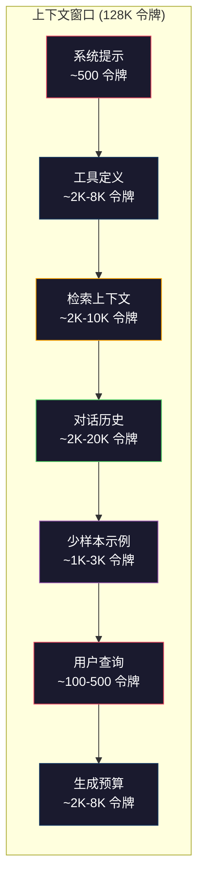
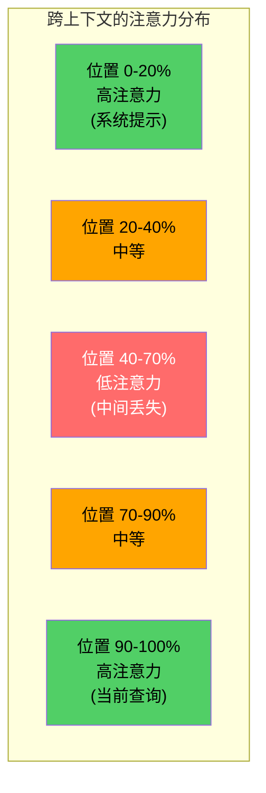
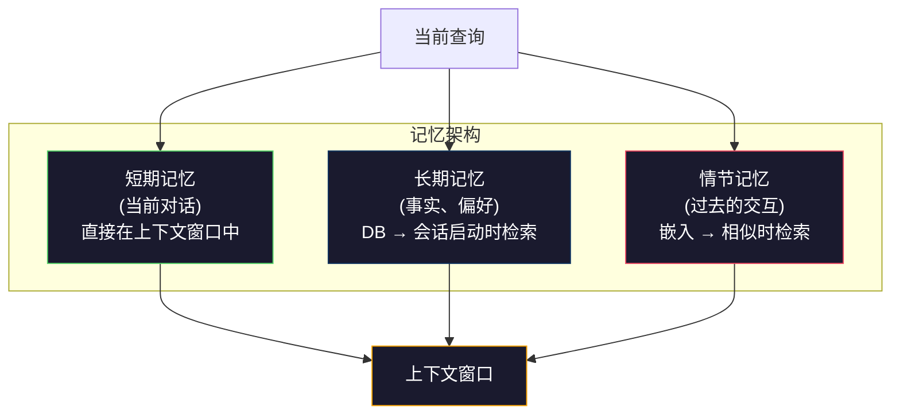

# 上下文工程：窗口、预算、记忆与检索

> 提示工程是一个子集。上下文工程是整盘棋。提示是你敲入的一个字符串。上下文是进入模型窗口的一切：系统指令、检索到的文档、工具定义、对话历史、少样本示例，以及提示本身。2026年最好的AI工程师是上下文工程师。他们决定什么进来、什么出去、以及以什么顺序。

**类型：** 构建
**语言：** Python
**前置要求：** Phase 10（从零开始的LLM），Phase 11 Lesson 01-02
**时间：** 约90分钟
**相关：** Phase 11 · 15（提示缓存）——缓存友好的布局是上下文工程的延伸。Phase 5 · 28（长上下文评估）——如何使用NIAH/RULER测量"中间丢失"效应。

## 学习目标

- 计算上下文窗口所有组件的令牌预算（系统提示、工具、历史、检索文档、生成空间）
- 实现上下文窗口管理策略：对话历史的截断、摘要和滑动窗口
- 对上下文组件进行优先级排序和排序，以最大化模型对最相关信息的注意力
- 构建一个上下文组装器，根据查询类型和可用窗口空间动态分配令牌

## 问题

Claude Opus 4.7有200K令牌窗口（beta版本1M）。GPT-5有400K。Gemini 3 Pro有2M。Llama 4号称10M。这些数字听起来巨大无比——直到你真正填满它们。

这是一个编程助手的实际分解。系统提示：500个令牌。50个工具的工具定义：8000个令牌。检索到的文档：4000个令牌。对话历史（10轮）：6000个令牌。当前用户查询：200个令牌。生成预算（最大输出）：4000个令牌。合计：22700个令牌。这仅仅是128K窗口的18%。

但注意力并不随上下文长度线性缩放。一个拥有128K令牌上下文的模型付出平方级的注意力成本（在原始Transformer中是O(n^2)，尽管大多数生产模型使用高效的注意力变体）。更重要的是，检索准确率会下降。"大海捞针"测试显示，模型很难在长上下文的中间位置找到信息。Liu等人（2023）的研究表明，LLM对上下文开头和结尾的信息检索准确率接近完美，但对放在中间位置的信息（上下文40-70%的位置）准确率下降10-20%。这种"中间丢失"效应因模型而异，但影响所有当前架构。

实践的教训：拥有200K令牌可用，并不意味着使用200K令牌是有效的。一个精心策划的10K令牌上下文往往优于一个随意倾倒的100K令牌上下文。上下文工程是一门最大化上下文窗口内信噪比的学科。

你放入窗口的每一个令牌都会挤掉一个可能携带更相关信息的令牌。每个不相关的工具定义、每轮陈旧的对话、每一个没有回答问题的检索文本块——每一个都让模型在任务上的表现稍微变差一点。

## 概念

### 上下文窗口是稀缺资源

把上下文窗口想象成RAM，而不是硬盘。它快速且可直接访问，但有限。你不能装下所有东西。你必须选择。



每个组件竞争空间。添加更多工具定义意味着对话历史的空间更少。添加更多检索上下文意味着少样本示例的空间更少。上下文工程是分配这个预算以最大化任务性能的艺术。

### "中间丢失"效应

上下文工程中最重要的实证发现。模型更关注上下文开头和结尾的信息。中间的信息获得更低的注意力分数，更可能被忽略。

Liu等人（2023）系统地测试了这一点。他们将一篇相关文档与20篇不相关文档放在不同的位置，并测量答案准确率。当相关文档在第一或最后时，准确率为85-90%。当它在中间时（20篇中的第10篇），准确率下降到60-70%。

这有直接的工程含义：

- 最重要的信息放在最前面（系统提示、关键指令）
- 当前查询和最相关的上下文放在最后（近因偏向有帮助）
- 将上下文中间视为最低优先级区域
- 如果必须在中间包含信息，在末尾重复关键要点



### 上下文组件

**系统提示**：设定人格、约束和行为规则。这放在最前面，跨轮次保持不变。Claude Code的系统提示大约使用6000个令牌，包括工具定义和行为指导。保持紧凑。系统提示中的每个词在每次API调用中都会被重复。

**工具定义**：每个工具增加50-200个令牌（名称、描述、参数schema）。50个工具，每个150个令牌，在开始任何对话之前就已经消耗了7500个令牌。动态工具选择——只包含与当前查询相关的工具——可以将此减少60-80%。

**检索上下文**：来自向量数据库的文档、搜索结果、文件内容。检索的质量直接决定了响应的质量。糟糕的检索比没有检索更糟——它用噪音填满窗口，并积极地误导模型。

**对话历史**：每一条之前的用户消息和助手响应。随对话长度线性增长。一个50轮的对话，每轮200个令牌，就是10000个令牌的历史。其中大部分与当前查询无关。

**少样本示例**：展示期望行为的输入/输出对。两到三个精心挑选的示例通常比数千个令牌的指令更能提高输出质量。但它们消耗空间。

**生成预算**：为模型响应保留的令牌。如果你将窗口填满到容量，模型就没有回答的空间。至少保留2000-4000个令牌用于生成。

### 上下文压缩策略

**历史摘要**：不再一字不差地保留所有之前的轮次，而是定期对对话进行摘要。用"我们讨论了X，决定了Y，用户想要Z"替换10轮消耗2000个令牌的对话，只需100个令牌。当历史超过阈值（例如5000个令牌）时运行摘要。

**相关性过滤**：对每个检索到的文档与当前查询进行评分，并丢弃低于阈值的文档。如果你检索了10个块但只有3个相关，丢弃另外7个。拥有3个高度相关的块比10个平庸的块更好。

**工具剪枝**：对用户查询意图进行分类，只包含与该意图相关的工具。代码问题不需要日历工具。日程安排问题不需要文件系统工具。这可以将工具定义从8000个令牌减少到1000个。

**递归摘要**：对于非常长的文档，分阶段进行摘要。首先摘要每个章节，然后摘要摘要。一个50页的文档变成了一个500个令牌的摘要，抓取了关键点。

### 记忆系统

上下文工程跨越三个时间范围。

**短期记忆**：当前对话。直接存储在上下文窗口中。随每轮增长。通过摘要和截断来管理。

**长期记忆**：在对话间持久化的偏好和事实。"用户偏好TypeScript。" "项目使用PostgreSQL。"存储在数据库中，在会话启动时检索。Claude Code将其存储在CLAUDE.md文件中。ChatGPT将其存储在其记忆功能中。

**情节记忆**：可能相关的特定过去交互。"上周二，我们在auth模块中调试了一个类似的问题。"存储为嵌入，在当前对话匹配过去的情节时检索。



### 动态上下文组装

关键洞察：不同的查询需要不同的上下文。静态的系统提示+静态的工具+静态的历史是浪费。最好的系统为每个查询动态组装上下文。

1. 分类查询意图
2. 选择相关工具（不是全部工具）
3. 检索相关文档（不是固定集合）
4. 包含相关历史轮次（不是全部历史）
5. 添加匹配任务类型的少样本示例
6. 按重要性排序：关键内容在最前，重要内容在最后，可选内容在中间

这是区分一个好的AI应用和一个伟大的AI应用的东西。模型是一样的。上下文是区分器。

## 构建

### Step 1: 令牌计数器

不能预算你不能度量的东西。构建一个简单的令牌计数器（使用空格分割的近似方法，因为确切计数取决于tokenizer）。

```python
import json
import numpy as np
from collections import OrderedDict

def count_tokens(text):
    """估算文本中的令牌数量（1个令牌≈0.75个英文单词）"""
    if not text:
        return 0
    return int(len(text.split()) * 1.3)

def count_tokens_json(obj):
    """估算JSON对象的令牌数量"""
    return count_tokens(json.dumps(obj))
```

### Step 2: 上下文预算管理器

核心抽象。预算管理器跟踪每个组件使用的令牌数量并强制执行限制。

```python
class ContextBudget:
    """管理上下文窗口的令牌预算分配"""
    def __init__(self, max_tokens=128000, generation_reserve=4000):
        self.max_tokens = max_tokens
        self.generation_reserve = generation_reserve
        self.available = max_tokens - generation_reserve
        self.allocations = OrderedDict()

    def allocate(self, component, content, max_tokens=None):
        """为上下文组件分配令牌预算"""
        # 估算令牌数
        tokens = count_tokens(content)

        # 如果超过该组件的最大限制则截断
        if max_tokens and tokens > max_tokens:
            words = content.split()
            target_words = int(max_tokens / 1.3)
            content = " ".join(words[:target_words])
            tokens = count_tokens(content)

        # 如果超过剩余预算则拒绝或截断
        used = sum(self.allocations.values())
        if used + tokens > self.available:
            allowed = self.available - used
            if allowed <= 0:
                return None, 0
            words = content.split()
            target_words = int(allowed / 1.3)
            content = " ".join(words[:target_words])
            tokens = count_tokens(content)

        self.allocations[component] = tokens
        return content, tokens

    def remaining(self):
        """返回剩余的令牌预算"""
        used = sum(self.allocations.values())
        return self.available - used

    def utilization(self):
        """返回窗口利用率（0.0到1.0）"""
        used = sum(self.allocations.values())
        return used / self.max_tokens

    def report(self):
        """生成一个人类可读的预算报告"""
        total_used = sum(self.allocations.values())
        lines = []
        lines.append(f"上下文预算报告 ({self.max_tokens:,} 令牌窗口)")
        lines.append("-" * 50)
        for component, tokens in self.allocations.items():
            pct = tokens / self.max_tokens * 100
            bar = "#" * int(pct / 2)
            lines.append(f"  {component:<25} {tokens:>6} 令牌 ({pct:>5.1f}%) {bar}")
        lines.append("-" * 50)
        lines.append(f"  {'已使用':<25} {total_used:>6} 令牌 ({total_used/self.max_tokens*100:.1f}%)")
        lines.append(f"  {'生成预留':<25} {self.generation_reserve:>6} 令牌")
        lines.append(f"  {'剩余':<25} {self.remaining():>6} 令牌")
        return "\n".join(lines)
```

### Step 3: "中间丢失"重排序

实现重排序策略：最重要的项放在最前和最后，最不重要的放在中间。

```python
def reorder_lost_in_middle(items, scores):
    """对上下文项按'开头和结尾最重要'的策略重排序"""
    # 按分数降序排列
    paired = sorted(zip(scores, items), reverse=True)
    sorted_items = [item for _, item in paired]

    if len(sorted_items) <= 2:
        return sorted_items

    # 交替分配：高分到开头和结尾，低分在中间
    first_half = sorted_items[::2]  # 0, 2, 4, ...
    second_half = sorted_items[1::2]  # 1, 3, 5, ...
    second_half.reverse()  # 次高分在最后

    return first_half + second_half  # 高-低-低-高分布

def score_relevance(query, documents):
    """按查询词重叠比例对文档评分"""
    query_words = set(query.lower().split())
    scores = []
    for doc in documents:
        doc_words = set(doc.lower().split())
        if not query_words:
            scores.append(0.0)
            continue
        # Jaccard风格的重叠计算
        overlap = len(query_words & doc_words) / len(query_words)
        scores.append(round(overlap, 3))
    return scores
```

### Step 4: 对话历史压缩器

摘要旧对话轮次以回收令牌预算。

```python
class ConversationManager:
    """管理对话历史，自动压缩以保持在令牌预算内"""
    def __init__(self, max_history_tokens=5000):
        self.turns = []  # 最近的对话轮次
        self.summaries = []  # 旧对话的摘要
        self.max_history_tokens = max_history_tokens

    def add_turn(self, role, content):
        """添加一轮对话，如果超过预算则自动压缩"""
        self.turns.append({"role": role, "content": content})
        self._compress_if_needed()

    def _compress_if_needed(self):
        """如果历史token数超过预算，将旧轮次移入摘要"""
        total = sum(count_tokens(t["content"]) for t in self.turns)
        if total <= self.max_history_tokens:
            return

        while total > self.max_history_tokens and len(self.turns) > 4:
            # 取出最旧的2轮
            old_turns = self.turns[:2]
            # 摘要它们
            summary = self._summarize_turns(old_turns)
            self.summaries.append(summary)
            # 从对话历史中移除
            self.turns = self.turns[2:]
            total = sum(count_tokens(t["content"]) for t in self.turns)

    def _summarize_turns(self, turns):
        """简单摘要：截断并拼接（在生产中应使用LLM摘要）"""
        parts = []
        for t in turns:
            content = t["content"]
            if len(content) > 100:
                content = content[:100] + "..."
            parts.append(f"{t['role']}: {content}")
        return "Previous: " + " | ".join(parts)

    def get_context(self):
        """返回对话历史的格式化上下文，摘要在前"""
        parts = []
        if self.summaries:
            parts.append("[对话摘要]")
            for s in self.summaries:
                parts.append(s)
        parts.append("[最近对话]")
        for t in self.turns:
            parts.append(f"{t['role']}: {t['content']}")
        return "\n".join(parts)

    def token_count(self):
        """返回当前总令牌数"""
        return count_tokens(self.get_context())
```

### Step 5: 动态工具选择器

只包含与当前查询相关的工具。分类意图，然后过滤。

```python
TOOL_REGISTRY = {
    "read_file": {
        "description": "读取文件内容",
        "tokens": 120,
        "categories": ["code", "files"],
    },
    "write_file": {
        "description": "将内容写入文件",
        "tokens": 150,
        "categories": ["code", "files"],
    },
    "search_code": {
        "description": "在代码库中搜索模式",
        "tokens": 130,
        "categories": ["code"],
    },
    "run_command": {
        "description": "执行shell命令",
        "tokens": 140,
        "categories": ["code", "system"],
    },
    "create_calendar_event": {
        "description": "创建新的日历事件",
        "tokens": 180,
        "categories": ["calendar"],
    },
    "list_emails": {
        "description": "列出最近邮件",
        "tokens": 160,
        "categories": ["email"],
    },
    "send_email": {
        "description": "发送邮件消息",
        "tokens": 200,
        "categories": ["email"],
    },
    "web_search": {
        "description": "在网络上搜索信息",
        "tokens": 140,
        "categories": ["research"],
    },
    "query_database": {
        "description": "在数据库上运行SQL查询",
        "tokens": 170,
        "categories": ["code", "data"],
    },
    "generate_chart": {
        "description": "从数据生成图表",
        "tokens": 190,
        "categories": ["data", "visualization"],
    },
}

def classify_intent(query):
    """使用关键词匹配对用户查询意图进行分类"""
    query_lower = query.lower()

    intent_keywords = {
        "code": ["code", "function", "bug", "error", "file", "implement", "refactor", "debug", "test"],
        "calendar": ["meeting", "schedule", "calendar", "appointment", "event"],
        "email": ["email", "mail", "send", "inbox", "message"],
        "research": ["search", "find", "what is", "how does", "explain", "look up"],
        "data": ["data", "query", "database", "chart", "graph", "analytics", "sql"],
    }

    scores = {}
    for intent, keywords in intent_keywords.items():
        score = sum(1 for kw in keywords if kw in query_lower)
        if score > 0:
            scores[intent] = score

    if not scores:
        return ["code"]  # 默认为代码意图

    # 返回所有接近最高分的意图
    max_score = max(scores.values())
    return [intent for intent, score in scores.items() if score >= max_score * 0.5]

def select_tools(query, token_budget=2000):
    """根据查询意图和预算选择相关工具"""
    intents = classify_intent(query)
    relevant = {}
    total_tokens = 0

    for name, tool in TOOL_REGISTRY.items():
        if any(cat in intents for cat in tool["categories"]):
            if total_tokens + tool["tokens"] <= token_budget:
                relevant[name] = tool
                total_tokens += tool["tokens"]

    return relevant, total_tokens
```

### Step 6: 完整上下文组装管道

将所有内容连接起来。给定一个查询，动态组装最优上下文。

```python
class ContextEngine:
    """完整的上下文组装引擎：预算 + 工具选择 + 历史 + 检索"""
    def __init__(self, max_tokens=128000, generation_reserve=4000):
        self.budget = ContextBudget(max_tokens, generation_reserve)
        self.conversation = ConversationManager(max_history_tokens=5000)
        self.system_prompt = (
            "你是一个有用的AI助手。你可以使用代码编辑、文件管理、"
            "网络搜索和数据分析的工具。对每个任务使用合适的工具。"
            "保持简洁和准确。"
        )
        # 模拟的知识库（在生产中这是向量数据库）
        self.knowledge_base = [
            "Python 3.12引入了使用方括号语法的泛型类类型参数语法。",
            "项目使用PostgreSQL 16配合pgvector进行嵌入存储。",
            "认证由Supabase Auth使用JWT令牌处理。",
            "前端使用Next.js 15和App Router构建。",
            "API速率限制为每用户每分钟100个请求。",
            "部署管道使用GitHub Actions和Docker多阶段构建。",
            "所有新模块的测试覆盖率必须超过80%。",
            "代码库遵循数据访问的仓库模式。",
        ]

    def assemble(self, query):
        """为给定查询动态组装上下文窗口"""
        # 重置预算
        self.budget = ContextBudget(self.budget.max_tokens, self.budget.generation_reserve)

        # 1. 系统提示（始终包含，限制在1000个令牌）
        system_content, _ = self.budget.allocate("system_prompt", self.system_prompt, max_tokens=1000)

        # 2. 仅相关的工具
        tools, tool_tokens = select_tools(query, token_budget=2000)
        tool_text = json.dumps(list(tools.keys()))
        tool_content, _ = self.budget.allocate("tools", tool_text, max_tokens=2000)

        # 3. 检索相关文档（使用相关性评分）
        relevance = score_relevance(query, self.knowledge_base)
        threshold = 0.1
        relevant_docs = [
            doc for doc, score in zip(self.knowledge_base, relevance)
            if score >= threshold
        ]

        if relevant_docs:
            # 应用"中间丢失"重排序
            doc_scores = [s for s in relevance if s >= threshold]
            reordered = reorder_lost_in_middle(relevant_docs, doc_scores)
            doc_text = "\n".join(reordered)
            doc_content, _ = self.budget.allocate("retrieved_context", doc_text, max_tokens=3000)

        # 4. 对话历史（自动压缩以适配预算）
        history_text = self.conversation.get_context()
        if history_text.strip():
            history_content, _ = self.budget.allocate("conversation_history", history_text, max_tokens=5000)

        # 5. 用户查询（始终最后，利用近因偏向）
        query_content, _ = self.budget.allocate("user_query", query, max_tokens=500)

        return self.budget

    def chat(self, query):
        """处理用户消息并返回预算报告"""
        self.conversation.add_turn("user", query)
        budget = self.assemble(query)
        # 模拟响应
        response = f"[对'{query[:50]}...'的响应]"
        self.conversation.add_turn("assistant", response)
        return budget


def run_demo():
    print("=" * 60)
    print("  上下文工程管道演示")
    print("=" * 60)

    engine = ContextEngine(max_tokens=128000, generation_reserve=4000)

    # 演示1：代码任务
    print("\n--- 查询1: 代码任务 ---")
    budget = engine.chat("修复认证模块中JWT令牌过早过期的bug")
    print(budget.report())

    # 演示2：研究任务
    print("\n--- 查询2: 研究任务 ---")
    budget = engine.chat("在PostgreSQL中实现向量搜索的最佳方法是什么？")
    print(budget.report())

    # 演示3：对话历史积累后的上下文
    print("\n--- 查询3: 对话历史积累后 ---")
    for i in range(8):
        engine.conversation.add_turn("user", f"关于系统实现细节的后续问题 #{i+1}")
        engine.conversation.add_turn("assistant", f"这是对后续问题 #{i+1} 的回应，包含架构相关的技术细节")

    budget = engine.chat("现在实现我们讨论的变更")
    print(budget.report())

    # 演示4：工具选择
    print("\n--- 工具选择示例 ---")
    test_queries = [
        "修复auth.py中的bug",
        "安排周二的和团队开会",
        "显示数据库查询性能统计",
        "搜索错误处理的最佳实践",
    ]

    for q in test_queries:
        tools, tokens = select_tools(q)
        intents = classify_intent(q)
        print(f"\n  查询: {q}")
        print(f"  意图: {intents}")
        print(f"  工具: {list(tools.keys())} ({tokens} 令牌)")

    # 演示5：中间丢失重排序
    print("\n--- 中间丢失重排序 ---")
    docs = ["文档A (最相关)", "文档B (有些相关)", "文档C (最不相关)",
            "文档D (相关)", "文档E (中等相关)"]
    scores = [0.95, 0.60, 0.20, 0.80, 0.50]
    reordered = reorder_lost_in_middle(docs, scores)
    print(f"  原始顺序: {docs}")
    print(f"  分数:      {scores}")
    print(f"  重排序后:  {reordered}")
    print(f"  (最相关的在开头和结尾，最不相关的在中间)")
```

## 使用

### Claude Code的上下文策略

Claude Code用分层方法管理上下文。系统提示包含行为规则和工具定义（约6K令牌）。当你打开一个文件时，其内容被注入为上下文。当你搜索时，结果被添加。旧的对话轮次被摘要。CLAUDE.md提供跨会话持久化的长期记忆。

关键的工程决策：Claude Code不会将你的整个代码库倾倒到上下文中。它按需检索相关文件。这就是实践中的上下文工程。

### Cursor的动态上下文加载

Cursor将你的整个代码库索引为嵌入。当你输入一个查询时，它使用向量相似性检索最相关的文件和代码块。只有这些部分进入上下文窗口。一个50万行的代码库被压缩为5-10个最相关的代码块。

这就是模式：嵌入一切，按需检索，只包含重要的内容。

### ChatGPT记忆

ChatGPT将用户偏好和事实存储为长期记忆。在每次对话开始时，相关的记忆被检索并包含在系统提示中。"用户偏好Python"只需5个令牌，但节省了跨对话的数百个重复指令的令牌。

### RAG作为上下文工程

检索增强生成是上下文工程的形式化。你不是将知识塞进模型的权重（训练）或系统提示（静态上下文），而是在查询时检索相关文档并将其注入上下文窗口。整个RAG管道——分块、嵌入、检索、重排序——存在就是为了解决一个问题：将正确的信息放入上下文窗口。

## 交付

本课产出`outputs/prompt-context-optimizer.md`——一个可重用的提示，用于审计上下文组装策略并建议优化。输入你的系统提示、工具数量、平均历史长度和检索策略，它识别令牌浪费并建议改进。

它还产出`outputs/skill-context-engineering.md`——基于任务类型、上下文窗口大小和延迟预算设计上下文组装管道的决策框架。

## 练习

1. 向ContextBudget类添加一个"令牌浪费检测器"。它应标记使用超过预算30%的组件，并针对每种组件类型（摘要历史、剪枝工具、重排序文档）建议具体的压缩策略。

2. 为检索上下文实现语义去重。如果两个检索到的文档相似度超过80%（按词重叠或嵌入的余弦相似度），只保留得分更高的那个。测量这回收了多少令牌预算。

3. 构建一个"上下文回放"工具。给定一个对话记录，通过ContextEngine回放它，可视化预算分配如何逐轮变化。绘制每个组件随时间的令牌使用图。识别上下文开始被压缩的那个轮次。

4. 实现基于优先级的工具选择器。不是二进制的包含/排除，而是为每个工具分配一个与当前查询的相关性分数。按降序相关性包含工具，直到工具预算耗尽。对比包含5、10、20和50个工具时的任务性能。

5. 构建一个多策略上下文压缩器。实现三种压缩策略（截断、摘要、提取关键句子），并在20个文档的集合上对它们进行基准测试。测量压缩比率与信息保留之间的权衡（压缩后的版本是否仍然包含查询的答案？）。

## 关键术语

| 术语 | 人们说的 | 它实际意味着 |
|------|---------|------------|
| 上下文窗口 | "模型能读多少" | 模型在单次前向传播中处理的最大令牌数（输入+输出）——GPT-5为400K，Claude Opus 4.7为200K（beta 1M），Gemini 3 Pro为2M |
| 上下文工程 | "高级提示工程" | 决定什么内容以什么顺序和什么优先级进入上下文窗口的学科——包括检索、压缩、工具选择和记忆管理 |
| "中间丢失" | "模型会忘记中间的内容" | 实证发现LLM更关注上下文开头和结尾，放在中间的信息准确率下降10-20% |
| 令牌预算 | "你还剩多少令牌" | 在上下文窗口各组件（系统提示、工具、历史、检索、生成）之间显式分配容量，每个组件有限制 |
| 动态上下文 | "即时加载内容" | 基于意图分类、相关工具选择和检索结果为每个查询不同地组装上下文窗口 |
| 历史摘要 | "压缩对话" | 用简洁的摘要替换逐字的旧对话轮次，在保留关键信息的同时减少令牌成本 |
| 工具剪枝 | "只包含相关工具" | 分类查询意图并只包含匹配的工具定义，将工具令牌成本减少60-80% |
| 长期记忆 | "跨会话记忆" | 存储在数据库中并在会话启动时检索的事实和偏好——CLAUDE.md、ChatGPT Memory和类似系统 |
| 情节记忆 | "记住特定过去事件" | 存储为嵌入的过去交互，在当前查询与过去对话相似时检索 |
| 生成预算 | "留给答案的空间" | 为模型输出保留的令牌——如果上下文完全填满窗口，模型就没有空间回答 |

## 扩展阅读

- [Liu等人, 2023 —— "Lost in the Middle: How Language Models Use Long Contexts"](https://arxiv.org/abs/2307.03172) —— 关于位置依赖注意力的权威研究，展示了模型在长上下文中间信息上遇到的困难
- [Anthropic的上下文检索博客](https://www.anthropic.com/news/contextual-retrieval) —— Anthropic如何处理上下文感知的块检索，将检索失败减少49%
- [Simon Willison的"上下文工程"](https://simonwillison.net/2025/Jun/27/context-engineering/) —— 为这个学科命名并将其与提示工程区分开的博客文章
- [LangChain的RAG文档](https://python.langchain.com/docs/tutorials/rag/) —— 检索增强生成作为上下文工程模式的实践实现
- [Greg Kamradt的大海捞针测试](https://github.com/gkamradt/LLMTest_NeedleInAHaystack) —— 揭示了所有主流模型中位置依赖检索失败的基准
- [Pope等人, "Efficiently Scaling Transformer Inference" (2022)](https://arxiv.org/abs/2211.05102) —— 上下文长度如何驱动内存和延迟，以及KV缓存、MQA和GQA如何改变预算计算。
- [Agrawal等人, "SARATHI: Efficient LLM Inference by Piggybacking Decodes with Chunked Prefills" (2023)](https://arxiv.org/abs/2308.16369) —— 推理的两个阶段：长提示在TTFT上昂贵但在TPOT上便宜；上下文打包权衡背后的真相。
- [Ainslie等人, "GQA: Training Generalized Multi-Query Transformer Models from Multi-Head Checkpoints" (EMNLP 2023)](https://arxiv.org/abs/2305.13245) —— 分组查询注意力论文，在不损失质量的情况下将生产解码器的KV内存削减至1/8。

---

## 📝 教师备课总结与读后感

### 一、文档整体评价

这篇文档将提示工程的视野从"怎么写好提示"提升到了"怎么设计进入模型窗口的全部内容"。它不是讲"该写什么"，而是构建了一个完整的资源管理框架——令牌预算、位置优先级（中间丢失效应）、动态组装策略——把上下文窗口当成RAM来管理。目标读者是已经理解提示工程但还没意识到"窗口里放什么比写什么更重要"的工程师。最大优势是用"预算管理"的隐喻将系统提示、工具定义、检索文档、对话历史、少样本示例统一为一个需要分配、压缩、回收的系统资源。

### 二、知识结构梳理

- **认知基础**：上下文窗口的本质是注意力预算而非存储容量 → 中间丢失效应的实证证据（位置0-20%和90-100%高注意力，40-70%低注意力） → 提示工程⊂上下文工程的心智模型转换。这部分把"Prompt Engineering"从中心价值降级为子系统。
- **工程模式**：令牌预算管理器（组件级配额） → 动态上下文组装管道（意图分类→工具选择→检索→历史压缩→重排序） → 记忆系统分层（短期/长期/情节）。每层都有具体的代码抽象。
- **实际应用**：Claude Code的CLAUDE.md系统、Cursor的代码索引嵌入策略、ChatGPT的用户偏好记忆、RAG管道作为上下文工程的最终形式化实现。展示了"工业级系统都在做什么"。

### 三、核心洞察（备课时的关键理解）

1. **上下文窗口不是硬盘，是RAM**：这个比喻是整个学科的核心。你可以有200K甚至2M的窗口，但注意力不是平权的——模型是"看得宽"但"看得偏"。填满不等于利用好。用20%的窗口容量+精心排序取得的效果往往优于100%的随意填充。
2. **"中间丢失"改变了上下文布局的一切**：不只是"重要信息放开头"这种常识，而是"开头和结尾都要放高价值信息"——在结尾放一个"TL;DR"或重复关键约束。这是物理约束：Transformer的软注意力在中间位置被稀释，因为每个token都参与了所有位置的计算，而中间位置在起始端和结尾端的"视野"都受损。
3. **令牌预算是强约束而非软指导**：不是"大概放8000个令牌的工具定义就行"，而是"工具定义消耗了系统提示+检索文档+少样本示例的空间"。窗口预算的每一个分配决定都是排他性的——分给A的令牌就是B不能用的。这种零和性质是大多数工程师忽视的。
4. **动态工具选择可以节省60-80%的工具令牌**：50个工具定义 = 7500个令牌。如果查询是"帮我写代码"，日历和邮件相关的40个工具就完全浪费了。这不是"优化"，这是"底线"——固定工具的上下文效率约等于在每次函数调用时加载所有库。
5. **RAG的本质是上下文工程，不是检索技术**：向量数据库、chunking、reranking——所有这些不是为了"找到对的信息"，而是为了"把对的信息放进上下文窗口的高注意力位置"。RAG的最终评判标准不是检索召回率，而是放到窗口后模型的行为改善。
6. **历史摘要是一个生产系统必备但不是好玩的功能**：10轮对话就是几千个令牌。50轮是几万。大多数对话轮次与当前查询完全无关。摘要不是可选的优化——是避免窗口溢出的唯一手段。但没有一个LLM能高质量地自我摘要（因为摘要也是一种生成，也有损失）。
7. **上下文组装是一种动态规划，不是静态配置**：不同的查询意图需要不同的上下文组合。代码意图要带上代码工具和代码片段；日历意图要带上日历工具和日程数据。一套"放什么"的方案不能适配所有查询。这就是为什么动态组装是区分好产品和伟大产品的关键。

### 四、教学建议

1. **开始前先做一个"填满窗口"实验**：让学生在GPT-5的400K窗口里塞满东西——100个工具定义、50轮对话、50个检索文档块——然后让它回答一个简单问题。观察"答案质量下降但成本飞速上升"的双重打击。没有亲身体验，他们不会理解"更少就是更多"。
2. **用RAM比喻贯穿全文**：不用"上下文窗口"这个词，改用"工作内存"。每一次提到令牌分配，就说"这是在分配内存"。从操作系统到LLM，"内存管理"的概念映射让学生立即明白这不是写文案，是系统设计。
3. **"中间丢失"的实验教学**：准备一个包含20篇文档的上下文，把关键信息分别放在第1、10、20位。让学生看到答案准确率从90%→65%→90%的变化。可视化展示模型注意力偏斜——这比任何量的讲授都有效。
4. **让学生设计自己的上下文预算表**：给一张表格让他们规划——系统提示、工具、检索、历史、生成——各分配多少令牌。然后对比自己的规划和实际的`ContextBudget`输出。差距本身就是最好的教学材料。
5. **工具剪枝的实验是必修**：50个工具、全部加载 → 测量令牌消耗 → 运行按意图分类的剪枝 → 测量节省 → 验证任务质量是否下降。学生需要看到"删掉40个无关工具后，代码质量不变，成本减少60%"。这是直接能带进工作的技能。
6. **把"动态上下文组装"设计成架构决策**：给学生3个查询（代码、日历、研究），让他们设计每次的上下文组合。讨论"为什么代码查询不需要calendar工具"这类看似简单的决策背后的架构逻辑。这不是"删掉不相关的"，而是"设计一个匹配系统"。
7. **RAG重新定义为上下文工程练习**：把RAG"chunk → embed → retrieve"的流程改为"选择什么放入上下文窗口 → 放在什么位置 → 用什么顺序排列 → 在什么条件下丢弃"。RAG的技术选择（chunk大小、embedding模型、reranker）都服务于这个最终目标。

### 五、值得补充的内容

1. **Token计数精度的实际影响**：本课使用1.3倍词数作为近似，但不同tokenizer差异显著（GPT-4的cl100k_base vs Claude vs Gemini各有不同）。应该有一个实际测量实验，让学生看到近似误差在长文档中如何累积。
2. **KV缓存的物理成本**：上下文窗口的O(n^2)注意力是理论上的，但KV缓存在GPU内存中是线性增长的。一个10K令牌的上下文可能消耗2GB的KV缓存。工程上，内存往往比窗口更先成为瓶颈——值得专门解释。
3. **流式上下文注入**：动态加载整个文件然后缩减上下文是一回事，流式地"边生成边注入新的检索结果"是另一回事。后者在一些场景下可以突破窗口限制——Generation-augmented retrieval值得介绍。
4. **跨轮的上下文一致性**：动态组装后，每轮上下文的组合可能不同。如果第1轮有文档A，第2轮没有了（因为预算不足被剪掉），模型可能"忘记"前面讨论的内容。需要解释这个一致性挑战。
5. **多模态上下文的预算差异**：图片、音频、视频进入上下文窗口时不是按令牌计数，而是按"视觉token"或"音频帧"计数。预算管理的概念必须扩展到多模态场景。

### 六、一句话总结

**提示工程教你写什么。上下文工程教你放什么、放多少、放哪里——前者是措辞，后者是系统设计。**

---

# 🎓 Agent 架构课：上下文即财富——为什么你花7美元买的400K窗口只用了18%

你刚买了一个400K上下文窗口的模型。GPT-5。感觉怎么样？"这么大，不用白不用"对吧？于是你开开心心地把全部代码库文档塞进去，把所有工具定义放进去，把50轮对话历史都放进去。然后你发现：它忘掉了你3轮之前说过的关键需求，而且回答开始变得奇怪——冗长、跑题，有时候甚至自相矛盾。

你知道吗，你刚刚用7美元买了一个"更蠢"的模型。不是因为模型变差了，是因为你给它的信号被淹没在噪音里了。

让我们回到基本事实：Transformer的注意力计算是资源密集的。不是"计算量大"的那种密集，而是"每个token都必须参与所有其他token的注意力计算"的那种密集。1024个token？1百万次比较。10万个token？100亿次比较。400K个token？1600亿次比较。而且不是平权的——软注意力机制天然偏斜向开头和结尾位置。

所以当你填满400K窗口时，你不是给了模型"更多信息"，你是给了它"更多需要过滤的噪音"。模型在开头部分努力工作（因为位置编码的初始段有最高的注意力权重），在结尾部分努力工作（因为近因偏向），中间部分？"对不起，我不确定你是不是重要的，所以我忽略了你。"

这就是"中间丢失"效应的根源。

## 问题的本质：注意力不是内存

我知道你想说什么。"但是GPT-5声称它可以在400K tokens的窗口里找到任何信息！"是的，它可以找到。就像你可以在一本1000页的书里找到一行字。问题不是"能不能找到"，而是"找到的成本是多少"。

当模型需要在20万token中找到"用户在第8轮对话中说的那个关键参数"时，它不是在数据库里做索引查找。它是在做注意力计算——所有token同时参与。而在海量背景噪音中，那个关键参数的注意力权重可能只有0.01%。模型有90%的机会正确地"看"到它，但只有10%的机会在生成时"优先考虑"它。

这就是为什么在实际测试中（Liu等人，2023），中间位置的信息准确率下降10-20%。不是模型瞎了，而是它"看得见但不优先"。就像你在嘈杂的酒吧里听朋友说话——你能听到，但你的大脑在处理300个人的声音，他的那句话只分配到0.3%的认知资源。

这就是上下文工程要解决的核心问题：不是"能不能放进去"，而是"放进去之后模型会分配给每个token多少注意力"。

## 两条路径，两种哲学

**第一条路：全量加载。** "反正有400K窗口，全放进去。"这套路的结果是：系统提示500个token，50个工具定义8000个tokens，检索文档4000个tokens，对话历史15000个tokens。看起来只用了10%的窗口？但你已经用掉了模型75%的有效注意力。

为什么？因为每种内容类型都在"捍卫自己的领地"。系统提示说"我是一个有帮助的助手"，工具定义说"你可以用这50个函数"，检索文档说"这是相关背景信息"，对话历史说"这是之前讨论的53件事"——模型必须同时消化所有这些信息，同时还要记住应该优先考虑当前的查询。

**第二条路：动态组装。** 每个查询都不一样。修bug的查询不需要日历工具。安排会议的查询不需要代码文件。你给模型的上下文应该反映你当下要它做的事，而不是你能给它的所有东西。

这条路的成本：你需要意图分类，需要动态工具选择，需要历史压缩，需要检索后过滤——这些都是工程投入。但这些投入换来的是：每次API调用的有效上下文从嘈杂的"什么都有"变成精简的"只放有用的"。

第一条路的人会说"我的上下文很充足，窗口很大"。第二条路的人会说"我的上下文很精准，每个token都在干活"。我见过第一条路产出的系统——回答质量在对话第20轮后崩溃，因为历史信息淹没了当前需求。我也见过第二条路产出的系统——上下文总是在2000-5000个token以内，且每轮回答都稳定。

## 深入原理：按上下文管理流水线走

### CAM 1：令牌预算——你不能靠"感觉"分配

"大概放个8000 token的历史应该没问题吧？"——这句话我听过太多回了。让我告诉你为什么它有问题。

8000 token的历史 + 8000 token的工具定义 + 500 token的系统提示 + 3000 token的检索文档 + 500 token的用户查询 = 20000 token。但你的生成预算呢？

GPT-5默认max_tokens是4096。Claude是8192。如果你在输入里用了20000 token，窗口还剩380000 token——看起来多得是。但如果你的应用需要模型生成一个8K token的长答案（代码生成、完整文档），这8K是输出。而输出token是占窗口的！GPT-5的400K窗口包含输入+输出。

"我感觉还有很多空间"——你的感觉是错的。你需要一个显式的预算管理器，就像操作系统管理内存一样：

1. 先扣掉生成预算（至少4000，复杂任务至少8000）
2. 再扣掉系统提示（200-600）
3. 再扣掉工具定义（仅相关的，不是全部）
4. 再扣掉检索上下文（query过滤后的，不是全部检索结果）
5. 剩下的分给对话历史和少样本示例

每个分配决定都是排他性的。给A 2000 token，B就只能拿2000少。不存在"都多给点"。

### CAM 2：位置策略——不是"按重要性排序"

"最重要的放前面"——这是错误的。正确的做法是：**最重要的放开头和结尾。**

为什么？因为在100K token的上下文中，模型在位置0-10000和位置90000-100000的注意力最高。中间的位置从10001到89999——近8万个token的注意力是衰减状态。

所以你有一个"哑铃策略"：把系统提示和关键指令放在开头（前20%），把当前查询和最相关上下文放在结尾（后20%），把中等相关的内容放在中间。最重要的永远不要在中间——要么在开头，要么在结尾，要么两头都放。

### CAM 3：动态组装——一个查询一种上下文

我见过的最蠢设计是把所有60个工具定义硬编码在每次API调用中。"用户可能用到任何一个工具"——不，用户在问"帮我发一封邮件"时不会用到代码分析工具。

你的上下文引擎需要做好四件事：

1. **意图分类**：这个查询是要写代码、安排日程、查资料还是发邮件？
2. **工具选择**：只带相关的工具。代码+邮件查询只需要10个工具，不是60个。
3. **检索过滤**：从10个检索到的文档中只保留最相关的3个。宁可精准少，不可模糊多。
4. **历史压缩**：50轮对话里，和第50轮问题相关的可能只有5轮。其余45轮的都该被摘要而不是全文保留。

这一步节省的不是"几美分"，是"几个百分点的准确率"。3个高质量文档块的检索结果 VS 10个含噪音的文档块——后者不仅多消耗了token，还通过不相关信息降低了模型对正确答案的置信度。

## 生产现实

- **工具定义的实际上限**：50个工具定义约7500个token。60-80%的情况下，你只需要10-15个。动态工具选择不是优化，是底线。
- **对话历史的"不可逆膨胀"**：50轮对话≈15000 token。即使你的窗口有400K，前50轮对话已经把历史塞满了。在这个点之后，你的系统只有两个选择：摘要（损失精度）或截断（损失上下文）。没有第三个选择。
- **"中间丢失"不是gradual degradation**：它不是"随着位置靠中，准确率慢慢下降"。它是"在40-70%范围内突然掉20个百分点"。这是一个台阶函数，不是一条斜坡。
- **KV缓存的内存成本**：一个128K token的上下文，KV缓存在GPT-5上可达2-3GB GPU内存。在服务端，这意味着并发用户数受限于VRAM而不是延迟——是一个被严重低估的瓶颈。
- **历史摘要的精度损失**：LLM自我摘要的召回率大约是85-90%。这意味着每轮摘要你丢失10-15%的信息。如果摘要套摘要（第二层压缩），精度呈指数下降——三次摘要后的信息含量≈原始信息的61%。

## 反模式 / 什么时候不该过度优化

**在窗口很小时过度优化**。如果你的窗口只有8K token，没什么好优化的——连基础内容都放不下。先解决"提供者/模型升级"问题，再解决"上下文优化"问题。

**把不必要的工具定义放进去"以防万一"**。不要"以防万一"。你的意图分类器可以做到95%的准确率。如果5%的查询因为没有正确工具而失败，那就修复分类器，不要膨胀工具列表。

**用长上下文窗口替代RAG**。"不需要RAG，我的窗口够大，直接放整本书。"——错误。即使窗口大到能放下整本书，检索仍然比全量加载更高效：检索让模型面对3个最相关的段落，而不是在面对整本书的同时尝试找出哪个段落相关。前者的注意力密度远高于后者。

**忘记上下文变更对缓存的影响**。如果你使用prompt caching（Phase 11 Lesson 15），任何上下文结构的变更——系统提示改了一个词、工具列表变了顺序、检索文档每次不同——都会触发缓存未命中。上下文优化必须和缓存策略协同设计。

## 结语清单

作为Agent架构师，当你设计上下文策略时，check这7件事：

1. ☐ 令牌预算是否已明确分配到每个组件，且保留了至少4000 token的生成空间？
2. ☐ 上下文内容的顺序是否遵循"哑铃策略"——关键信息在开头和结尾，中等信息在中间？
3. ☐ 工具列表是否根据查询意图动态过滤，而非全量加载？
4. ☐ 对话历史是否在超过5000 token后自动触发摘要压缩？
5. ☐ 检索结果是否经过相关性过滤（保留top 3-5而非全部10个）？
6. ☐ 上下文变更是否考虑了prompt caching的命中率影响？
7. ☐ 如果把窗口大小从400K砍到128K，你的系统还能正常工作吗？如果能，你就在合理利用窗口；如果不能，你在依赖窗口大小掩盖糟糕的上下文设计。

**一句金句：Token是注意力，注意力是金钱。花在噪音上的每一个Token，都是在付钱让模型变得更蠢。**
