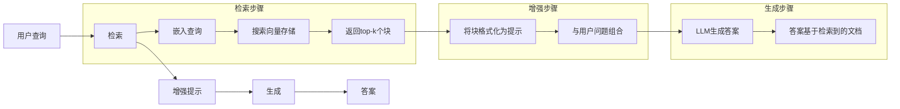
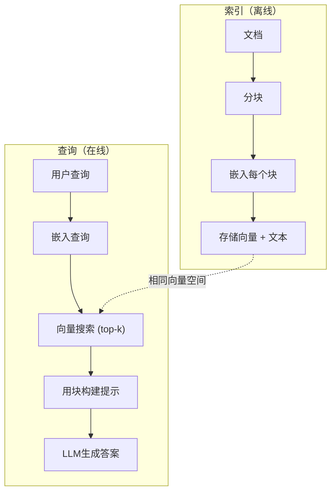

# RAG（检索增强生成）

> 你的LLM知道其训练截止日期之前的一切。它对你的公司文档、你的代码库或上周的会议记录一无所知。RAG通过检索相关文档并将其塞入提示来解决这个问题。它是生产级AI中部署最广的模式。如果你从这门课只能构建一样东西，构建一个RAG管道。

**类型：** 构建
**语言：** Python
**前置要求：** Phase 10（从零开始的LLM），Phase 11 Lessons 01-05
**时间：** 约90分钟
**相关：** Phase 5 · 23（RAG的分块策略）——六种分块算法及其适用场景。Phase 5 · 22（嵌入模型深度探索）——如何选择嵌入器。Phase 11 · 07（高级RAG）——混合搜索、重排序和查询转换。

## 学习目标

- 构建完整的RAG管道：文档加载、分块、嵌入、向量存储、检索和生成
- 使用向量数据库（ChromaDB、FAISS或Pinecone）实现带适当索引的语义搜索
- 解释为什么RAG在基于知识的应用中优于微调（成本、新鲜度、可归因性）
- 使用检索指标（精确率、召回率）和生成指标（忠实度、相关性）评估RAG质量

## 问题

你为公司构建一个聊天机器人。客户问："企业版的退款政策是什么？"LLM给出了一个关于典型SaaS退款政策的通用答案。实际的退款政策——埋藏在200页内部维基中——声明企业客户有60天的窗口并按比例退款。LLM从未见过这个文档。它不可能知道它没有受过训练的东西。

微调是一种解决方案。拿LLM，在你的内部文档上训练，部署更新后的模型。这可行，但有严重的问题。微调花费数千美元的算力。文档一旦变更，模型就过时了。你无法知道模型从哪个源文档得出结论。如果公司下个月收购了另一个产品线，你又要重新微调。

RAG是另一种解决方案。不用动模型。当一个问题进来时，搜索你的文档存储中相关的段落，将它们粘贴到提示中问题之前，让模型使用这些段落作为上下文来回答。文档存储可以在几分钟内更新。你可以准确看到哪些文档被检索到。模型本身永远不会改变。这就是为什么RAG是生产中的主导模式：它更便宜、更新鲜、更可审计，并且适用于任何LLM。

## 概念

### RAG模式

整个模式包含四个步骤：



查询 → 检索 → 增强提示 → 生成。每个RAG系统都遵循这个模式。生产级RAG系统之间的差异在于每个步骤的细节：你如何分块、如何嵌入、如何搜索、如何构建提示。

### 为什么RAG优于微调

| 关注点 | 微调 | RAG |
|--------|------|-----|
| 成本 | 每次训练$1,000-$100,000+ | 每次查询$0.01-$0.10（嵌入+LLM） |
| 新鲜度 | 重新训练前保持过时 | 重新索引文档即可在几分钟内更新 |
| 可审计性 | 无法追溯到源文档 | 可以展示精确检索到的段落 |
| 幻觉 | 仍可自由幻觉 | 基于检索到的文档 |
| 数据隐私 | 训练数据烘焙到权重中 | 文档保留在你的向量存储中 |

微调永久地改变了模型的权重。RAG临时改变了模型的上下文。对于大多数应用，"临时上下文"就是你要的。

微调赢的唯一场景：当你需要模型采用一种无法仅通过提示实现的特定风格、语气或推理模式时。对于事实性知识检索，RAG每次都是赢家。

### 嵌入模型

嵌入模型将文本转换为密集向量。相似的文本在这个高维空间中产生靠近的向量。"How do I reset my password?"和"I need to change my password"共享很少的词却产生几乎相同的向量。"The cat sat on the mat"产生一个非常不同的向量。

常见的嵌入模型（2026年阵容——完整分析见Phase 5 · 22）：

| 模型 | 维度 | 提供商 | 备注 |
|------|------|--------|------|
| text-embedding-3-small | 1536（Matryoshka） | OpenAI | 大多数场景最佳性价比 |
| text-embedding-3-large | 3072（Matryoshka） | OpenAI | 更高准确率，可截断至256/512/1024 |
| Gemini Embedding 2 | 3072（Matryoshka） | Google | MTEB检索第一；8K上下文 |
| voyage-4 | 1024/2048（Matryoshka） | Voyage AI | 领域变体（代码、金融、法律） |
| Cohere embed-v4 | 1024（Matryoshka） | Cohere | 强多语言，128K上下文 |
| BGE-M3 | 1024（dense+sparse+ColBERT） | BAAI（开源） | 一个模型三种视角 |
| Qwen3-Embedding | 4096（Matryoshka） | 阿里巴巴（开源） | 开源检索得分最高 |
| all-MiniLM-L6-v2 | 384 | 开源（Sentence Transformers） | 原型开发基线 |

本课我们使用TF-IDF构建自己的简单嵌入。不是因为TF-IDF是生产系统使用的，而是因为它使概念具体化：文本进去，向量出来，相似文本产生相似向量。

### 向量相似性

给定两个向量，你如何度量相似性？三个选项：

**余弦相似度**：两个向量之间夹角的余弦值。范围从-1（相反）到1（完全相同）。忽略幅度，只关注方向。这是RAG的默认选择。

```
余弦相似度(a, b) = 点积(a, b) / (||a|| * ||b||)
```

**点积**：原始的向量内积。更大的向量得到更高的分数。当幅度携带信息时有用（更长的文档可能更相关）。

```
点积(a, b) = Σ(a_i * b_i)
```

**L2（欧几里得）距离**：向量空间中的直线距离。距离越小=越相似。对幅度差异敏感。

```
L2(a, b) = sqrt(Σ((a_i - b_i)^2))
```

余弦相似度是标准。它优雅地处理不同长度的文档，因为它通过幅度进行归一化。当有人说"向量搜索"时，他们几乎总是指余弦相似度。

### 分块策略

文档太长，不能作为单个向量嵌入。一份50页的PDF可能产生一个糟糕的嵌入，因为它包含数十个主题。相反，你将文档分割成块，并单独嵌入每个块。

**固定大小分块**：每隔N个令牌分割。简单且可预测。一个512令牌的块带有50令牌重叠，意味着块1是令牌0-511，块2是令牌462-973，以此类推。重叠确保你不会在一个不幸的边界上分割一个句子。

**语义分块**：在自然边界分割。段落、章节或markdown标题。每个块是一个连贯的意义单元。实现更复杂，但产生更好的检索。

**递归分块**：首先尝试在最大的边界分割（章节标题）。如果一个章节仍然太大，在段落边界分割。如果一个段落仍然太大，在句子边界分割。这是LangChain的RecursiveCharacterTextSplitter方法，在实践中效果很好。

分块大小比人们想的更重要：

- 太小（64-128令牌）：每个块缺少上下文。"上季度增长了15%"——不知道"它"指代什么就毫无意义。
- 太大（2048+令牌）：每个块涵盖多个主题，稀释了相关性。当你搜索收入数据时，你得到一个10%关于收入、90%关于人员编制的块。
- 甜点（256-512令牌）：足够的上下文使其自包含，足够聚焦使其相关。

大多数生产RAG系统使用256-512令牌的块，带50令牌重叠。Anthropic的RAG指南推荐此范围。

### 向量数据库

一旦有了嵌入，你需要一个地方来存储和搜索它们。选项：

| 数据库 | 类型 | 最适合 |
|--------|------|--------|
| FAISS | 库（进程内） | 原型开发，小到中型数据集 |
| Chroma | 轻量级DB | 本地开发，小型部署 |
| Pinecone | 托管服务 | 无需运维的生产环境 |
| Weaviate | 开源DB | 自托管的正式环境 |
| pgvector | Postgres扩展 | 已在使用Postgres的场景 |
| Qdrant | 开源DB | 高性能自托管 |

本课我们构建一个简单的内存向量存储。它将向量存储在一个列表中，进行暴力余弦相似度搜索。这相当于FAISS的平面索引。它可以扩展到大约10万个向量，之后就会变慢。生产系统使用近似最近邻（ANN）算法如HNSW，在毫秒内搜索数百万个向量。

### 完整管道



索引阶段每个文档运行一次（或当文档更新时）。查询阶段在每次用户请求时运行。在生产中，索引可能处理数百万个文档，耗时数小时。查询必须在不到一秒钟内响应。

### 实际数字

大多数生产RAG系统使用以下参数：

- **k = 5到10** 每个查询检索的块数
- **块大小 = 256到512个令牌**，带50令牌重叠
- **上下文预算**：每个查询2500-5000个令牌的检索内容
- **总提示**：约8000-16000个令牌（系统提示 + 检索块 + 对话历史 + 用户查询）
- **嵌入维度**：384-3072，取决于模型
- **索引吞吐量**：使用API嵌入每秒100-1000个文档
- **查询延迟**：检索50-200ms，生成500-3000ms

## 构建

### Step 1: 文档分块

```python
def chunk_text(text, chunk_size=200, overlap=50):
    """使用滑动窗口将文本分割为重叠的块"""
    words = text.split()
    chunks = []
    start = 0
    while start < len(words):
        end = start + chunk_size
        chunk = " ".join(words[start:end])
        chunks.append(chunk)
        start += chunk_size - overlap  # 推进，保留重叠
    return chunks
```

### Step 2: TF-IDF嵌入

我们构建一个简单的嵌入函数。TF-IDF（词频-逆文档频率）不是神经嵌入，但它以一种捕获词重要性的方式将文本转换为向量。文档中的高频词获得更高的TF。在整个语料库中的稀有词获得更高的IDF。这个乘积产生一个向量，其中重要的、有区分度的词有较高的值。

```python
import math
from collections import Counter

def build_vocabulary(documents):
    """从所有文档构建一个排序的词汇表"""
    vocab = set()
    for doc in documents:
        vocab.update(doc.lower().split())
    return sorted(vocab)

def compute_tf(text, vocab):
    """计算文本中每个词相对于词汇表的归一化词频"""
    words = text.lower().split()
    count = Counter(words)
    total = len(words)
    return [count.get(word, 0) / total for word in vocab]

def compute_idf(documents, vocab):
    """计算词汇表中每个词的逆文档频率"""
    n = len(documents)
    idf = []
    for word in vocab:
        doc_count = sum(1 for doc in documents if word in doc.lower().split())
        # 平滑处理避免被零除
        idf.append(math.log((n + 1) / (doc_count + 1)) + 1)
    return idf

def tfidf_embed(text, vocab, idf):
    """将文本转换为TF-IDF向量（每个维度 = TF * IDF）"""
    tf = compute_tf(text, vocab)
    return [t * i for t, i in zip(tf, idf)]
```

### Step 3: 余弦相似度搜索

```python
def cosine_similarity(a, b):
    """计算两个向量之间的余弦相似度"""
    dot = sum(x * y for x, y in zip(a, b))
    norm_a = math.sqrt(sum(x * x for x in a))
    norm_b = math.sqrt(sum(x * x for x in b))
    if norm_a == 0 or norm_b == 0:
        return 0.0
    return dot / (norm_a * norm_b)

def search(query_embedding, stored_embeddings, top_k=5):
    """通过余弦相似度查找top-k个最相似的存储嵌入"""
    scores = []
    for i, emb in enumerate(stored_embeddings):
        sim = cosine_similarity(query_embedding, emb)
        scores.append((i, sim))
    scores.sort(key=lambda x: x[1], reverse=True)
    return scores[:top_k]
```

### Step 4: 提示构建

这是RAG中"增强"发生的地方。获取检索到的块，将它们格式化为提示，并要求LLM基于提供的上下文回答。

```python
def build_rag_prompt(query, retrieved_chunks):
    """构建一个RAG提示，仅从检索到的块中回答"""
    context = "\n\n---\n\n".join(
        f"[来源 {i+1}]\n{chunk}"
        for i, chunk in enumerate(retrieved_chunks)
    )
    return f"""仅根据以下上下文回答问题。
如果上下文不包含足够的信息，说"我没有足够的信息来回答这个问题。"

上下文：
{context}

问题：{query}

答案："""
```

### Step 5: 完整的RAG管道

```python
class RAGPipeline:
    """完整的RAG管道：索引 + 检索 + 提示构建"""
    def __init__(self):
        self.chunks = []
        self.embeddings = []
        self.vocab = []
        self.idf = []

    def index(self, documents):
        """索引文档：分块 → 构建词汇表 → 计算IDF → 嵌入所有块"""
        # 分块所有文档
        all_chunks = []
        for doc in documents:
            all_chunks.extend(chunk_text(doc))
        self.chunks = all_chunks

        # 构建词汇表 & 计算IDF
        self.vocab = build_vocabulary(all_chunks)
        self.idf = compute_idf(all_chunks, self.vocab)

        # 嵌入所有块
        self.embeddings = [
            tfidf_embed(chunk, self.vocab, self.idf)
            for chunk in all_chunks
        ]

    def query(self, question, top_k=5):
        """查询管道：嵌入问题 → 搜索 → 构建提示"""
        query_emb = tfidf_embed(question, self.vocab, self.idf)
        results = search(query_emb, self.embeddings, top_k)
        retrieved = [(self.chunks[i], score) for i, score in results]
        prompt = build_rag_prompt(
            question, [chunk for chunk, _ in retrieved]
        )
        return prompt, retrieved
```

### Step 6: 生成（模拟）

在生产中，这是你调用LLM API的地方。本课我们通过从检索到的上下文中提取最相关的句子来模拟生成。

```python
def simple_generate(prompt, retrieved_chunks):
    """模拟生成：找到与查询词重叠最多的句子"""
    # 从提示中提取查询词
    query_words = set(prompt.lower().split("question:")[-1].split())
    best_sentence = ""
    best_score = 0
    for chunk in retrieved_chunks:
        for sentence in chunk.split("."):
            sentence = sentence.strip()
            if not sentence:
                continue
            words = set(sentence.lower().split())
            overlap = len(query_words & words)
            if overlap > best_score:
                best_score = overlap
                best_sentence = sentence
    return best_sentence if best_sentence else "我没有足够的信息。"
```

## 使用

使用真实的嵌入模型和LLM，代码几乎不用改变：

```python
from openai import OpenAI

client = OpenAI()

def embed(text):
    """使用OpenAI嵌入文本"""
    response = client.embeddings.create(
        model="text-embedding-3-small",
        input=text
    )
    return response.data[0].embedding

def generate(prompt):
    """使用GPT生成答案"""
    response = client.chat.completions.create(
        model="gpt-4o-mini",
        messages=[{"role": "user", "content": prompt}],
        temperature=0
    )
    return response.choices[0].message.content
```

或者使用Anthropic：

```python
import anthropic

client = anthropic.Anthropic()

def generate(prompt):
    response = client.messages.create(
        model="claude-sonnet-4-20250514",
        max_tokens=1024,
        messages=[{"role": "user", "content": prompt}]
    )
    return response.content[0].text
```

管道相同。交换嵌入函数，交换生成函数。检索逻辑、分块、提示构建——无论你使用哪些模型，这些全部相同。

对于规模化的向量存储，用合适的向量数据库替换暴力搜索：

```python
import chromadb

client = chromadb.Client()
collection = client.create_collection("my_docs")

# 添加文档（Chroma在内部处理嵌入）
collection.add(
    documents=chunks,
    ids=[f"chunk_{i}" for i in range(len(chunks))]
)

# 查询
results = collection.query(
    query_texts=["退款政策是什么？"],
    n_results=5
)
```

Chroma在内部处理嵌入（默认使用all-MiniLM-L6-v2）并将向量存储在本地数据库中。相同的模式，不同的管道。

## 交付

本课产出：
- `outputs/prompt-rag-architect.md` —— 用于为特定用例设计RAG系统的提示
- `outputs/skill-rag-pipeline.md` —— 教导Agent如何构建和调试RAG管道的技能

## 练习

1. 用简单的词袋方法（二元：词存在则为1，否则为0）替换TF-IDF嵌入。在示例文档上比较检索质量。TF-IDF应该表现更好，因为它对稀有词赋予更高权重。

2. 对分块大小进行实验：在相同文档集上尝试50、100、200和500词。对每种大小，运行相同的5个查询并计数有多少返回了前3名中相关的块。找到检索质量达到峰值的最佳点。

3. 为每个块添加元数据（源文档名称、块位置）。修改提示模板以包含来源归因，使LLM能够引用其来源。

4. 实现一个简单的评估：给定10个问答对，将每个问题通过RAG管道运行，测量检索到的块中有多少比例包含答案。这是在k处的检索召回率。

5. 构建一个对话感知的RAG管道：维护最近3次交流的历史，并将其与检索到的块一起包含在提示中。用跟进问题测试，如在询问定价后问"那企业版呢？"

## 关键术语

| 术语 | 人们说的 | 它实际意味着 |
|------|---------|------------|
| RAG | "能读你文档的AI" | 检索相关文档、将它们粘贴到提示中、并生成基于这些文档的答案 |
| 嵌入 | "将文本转换为数字" | 文本的密集向量表示，相似的意义产生相似的向量 |
| 向量数据库 | "AI的搜索引擎" | 优化用于存储向量并通过相似度查找最近邻居的数据存储 |
| 分块 | "将文档分割成小块" | 将文档分解为更小的片段（通常256-512个令牌），使每个片段可以独立嵌入和检索 |
| 余弦相似度 | "两个向量有多相似" | 两个向量之间夹角的余弦值；1 = 相同方向，0 = 正交，-1 = 相反 |
| Top-k检索 | "获取k个最佳匹配" | 从向量存储中返回与查询最相似的k个块 |
| 上下文窗口 | "LLM能看多少文本" | LLM在单次请求中能处理的最大令牌数；检索到的块必须适配在此范围内 |
| 增强生成 | "使用给定上下文回答" | 使用检索到的文档作为上下文生成响应，而非仅依赖训练知识 |
| TF-IDF | "词重要性评分" | 词频乘以逆文档频率；根据词在语料库中的区分度进行加权 |
| 索引 | "为搜索准备文档" | 分块、嵌入和存储文档的离线过程，以便在查询时进行搜索 |

## 扩展阅读

- Lewis等人, "Retrieval-Augmented Generation for Knowledge-Intensive NLP Tasks" (2020) —— Facebook AI Research的原始RAG论文，形式化了先检索后生成的模式
- Anthropic的RAG文档 (docs.anthropic.com) —— 关于分块大小、提示构建和评估的实践指南
- Pinecone Learning Center, "What is RAG?" —— 对RAG管道的清晰视觉解释及生产考量
- Sentence-BERT: Reimers & Gurevych (2019) —— all-MiniLM嵌入模型背后的论文，展示了如何训练双编码器用于语义相似性
- [Karpukhin等人, "Dense Passage Retrieval for Open-Domain Question Answering" (EMNLP 2020)](https://arxiv.org/abs/2004.04906) —— DPR论文，证明密集双编码器检索在开放域问答上优于BM25，为现代RAG检索器设立了模式。
- [LlamaIndex高层概念](https://docs.llamaindex.ai/en/stable/getting_started/concepts.html) —— 构建RAG管道时需要了解的主要概念：数据加载器、节点解析器、索引、检索器、响应合成器。
- [LangChain RAG教程](https://python.langchain.com/docs/tutorials/rag/) —— 另一种风格的编排器；以可运行链的视角看待相同的先检索后生成模式。

---

## 📝 教师备课总结与读后感

### 一、文档整体评价

这篇文档是对RAG核心模式最精简、最生产导向的介绍。它的价值不在于"全面"——高级RAG内容（混合搜索、重排序、查询转换）被明确推迟到下一课——而在于它用最少的抽象让学生理解RAG的本质：四个步骤（分块、嵌入、存储、生成），从零实现。目标读者是第一次接触RAG的工程师，所以文档刻意用TF-IDF代替真实嵌入模型，用意深远：让"向量搜索"从一个黑盒API变成一个他们亲手实现的算法。最大优势是"自底向上"的教学设计——先让学生自己写嵌入函数和搜索函数，再用Chroma等框架展示"这就是你刚才写的东西，只是换成生产级的实现"。

### 二、知识结构梳理

- **认知基础**：TF-IDF的数学直觉（词频×逆文档频率=词的重要性/区分度加权）→ 余弦相似度的几何直觉（两个向量方向的接近程度）→ 分块的必要性（长文档的话题稀释）。这部分建立了"为什么向量搜索能工作"而非仅"怎么用"。
- **工程模式**：RAG的四步流水线（索引离线+查询在线）→ 分块策略的三种选择（固定、语义、递归）及其大小权衡 → 提示构建中"基于上下文回答"的硬约束。
- **实际应用**：从零RAG管道 → OpenAI/Anthropic的真实API替换 → Chroma/Pinecone的规模化存储迁移。每一步都有"这是你写的 → 这是生产用的"的对比。

### 三、核心洞察（备课时的关键理解）

1. **RAG和微调不是竞争，是互补**：微调改变模型的"思维方式"，RAG改变模型的"知识来源"。如果需要风格、推理模式的改变，微调赢。如果需要事实性、时效性知识，RAG赢。真正的生产系统往往是"微调基座 + RAG覆盖"——微调定义行为边界，RAG定义知识更新。
2. **分块大小决定了检索的上限**：无论你的嵌入模型有多好，如果块太小（缺少上下文）或太大（话题稀释），检索质量都有一个硬性的天花板。256-512令牌不是任意数字——它正好是大多数人一次提问需要的上下文粒度。
3. **TF-IDF作为教学工具的价值被低估了**：用TF-IDF实现RAG让学生真正理解了"向量搜索"——不是调用一个API，而是计算词的权重和向量夹角。之后换到OpenAI的嵌入API时，他们知道自己换下了什么（统计词频→神经网络语义理解）而不是"魔法的黑盒替代了魔法的黑盒"。
4. **RAG的"增强生成"不只是一种技术，是一种哲学**：给模型事实，让它基于事实回答。这不只是减少幻觉——它把LLM的角色从"知识渊博的智者"变成了"能读文档的推理引擎"。后者的定位在实际应用中更有用，也更诚实。
5. **向量数据库的选择本质上是"谁处理嵌入"的决策**：Chroma内置嵌入处理，Pinecone期望你预嵌入，pgvector只是存储。这个差异决定了你的索引管道是"Chroma直接喂文本"还是"OpenAI API → 向量 → pgvector"。
6. **RAG的评估有两个完全不同的维度**：检索质量（精确率/召回率）衡量"找没找到对的信息"，生成质量（忠实度/相关性）衡量"有没有基于找的信息正确回答"。二者独立又相互依赖。检索100%精准但生成乱编=没用；检索垃圾但生成诚实=还是没用。
7. **"如果上下文不包含足够信息"这句提示模板的话是RAG的灵魂**：它给了模型一个"不回答"的权利。没有这句话，RAG就退化成一个"在噪音中强行编造答案"的生成器。这个硬约束是RAG可审计性的最后防线。

### 四、教学建议

1. **从体验LLM的"知识盲区"开始**：先让学生问一个关于他们自己项目的问题——不提供任何上下文。看模型编造答案。然后给他们看RAG检索到的真实文档，再次提问。从"编造"到"基于事实"的转变是最具说服力的RAG推销。
2. **TF-IDF嵌入的"自己写一遍"是必须的**：不要让学生直接import OpenAI。让他们手写TF-IDF向量计算、手写余弦相似度搜索。当他们看到"I need to reset my password"和"How do I change my password"在向量空间中距离很近时产生的"Aha时刻"是任意数量的slides都替代不了的。
3. **分块大小的现场实验**：准备同一组文档，分别切成50、200、500、1000词的块。对同一个查询看哪个大小返回最相关的块。让他们亲自发现512词的"甜点"——这个发现记忆是一辈子的。
4. **用Chroma做"看到API之前 vs 之后"**：先让他们手写暴力搜索（10万向量可能已经有点慢），然后用Chroma替代。重点不是"换了个库"，而是"替换的是哪部分"——搜索算法变了，但分块、嵌入、提示构造都不动。
5. **提示构建中的"仅基于上下文"必须强调**：让学生对比两种提示模板：一种有"仅基于上下文"的指令，一种没有。让他们看到没有硬约束的提示会怎么"发挥想象力"。这堂课的一半时间应该花在"提示里写了什么"上，另一半花在"工程管道"上。
6. **练习3（元数据归因）是一个品味训练**：让学生给每个检索到的块标注来源，让LLM在回答中引用来源。这不仅是一个技术练习——它在教"可审计性是RAG的核心价值主张，不是nice to have"。
7. **结课时让学生对比"微调 vs RAG"的真实场景**：给三个场景（公司内部文档问答、电商产品推荐文案生成、法律合同审查），让学生论证用微调还是RAG。关键不是选对答案，而是让他们理解两套技术方案的"架构权衡"——成本、延迟、可维护性、数据隐私。

### 五、值得补充的内容

1. **嵌入模型的Matryoshka（俄罗斯套娃）特性**：text-embedding-3可以产出1536维向量但只用前256维就能保持95%的检索质量。这是实际的成本节省手段——存储和搜索时用低维，精度用高维。
2. **中文的分块特殊性**：中文文本没有空格分隔，分块算法需要考虑分词。固定令牌分块对中文来说，一个"令牌"不等于一个"词"。这对国内学生是直接实践中的坑。
3. **检索vs重排序的两阶段策略**：初级检索（用便宜的向量搜索获取top-20）+ 重排序（用更贵的cross-encoder筛出top-5）。本课只讲了初级检索，但重排序在实际生产中是标准配置。
4. **文档格式的复杂性**：PDF、HTML、Markdown——不同的格式在分块前需要不同的预处理。表格数据、代码块、图片说明——这些结构化数据的处理策略各不相同，且经常被忽略。
5. **混合搜索（稀疏+密集）的直观解释**：BM25擅长精确关键词匹配（如产品型号"WH-1000XM5"），向量搜索擅长语义匹配（如"最好的降噪耳机"）。两者的结合是本课的天然下一站——应该有一条清晰的路径。

### 六、一句话总结

**RAG不是"让AI读你的文档"，而是"把你的文档变成模型的上下文"——它让LLM从知识庞氏骗局的发明者变成了知识账簿的审计员。**

---

# 🎓 Agent 架构课：RAG的本质——为什么检索是在时间上延迟决策，而不是在训练中锁定它

你见过LLM编造退款规定吗？我见过。而且是真金白银。

一个电商聊天机器人告诉客户"我们的政策是30天全额退款"。实际上，客户买的是企业版，退款规定是"60天并按使用天数比例退款"。4,200美元的交易，一句话15字节，错了。不是因为模型坏，是因为模型从未见过公司的退款规定文档。

这个错误不能靠"更好的提示"修复。因为问题不在模型性格，在模型知识。模型知道怎么说话，但不知道你的企业版退款规定。

这就是RAG。不是黑魔法，是时间上的决策延迟。你把"什么是对的"从训练时搬到了查询时。

## 问题的本质：知识是时间敏感的，权重不是

让我给你讲一个架构师的选择。你有两种方式让你的LLM知道公司的退款规定。

**方式一：微调。** 你花5,000美元在一个A100上跑4小时，把退款规定文档融入模型权重。现在模型"知道"规定了。三周后，法务部更新了退款规定。模型不知道——它的权重没变。你再次微调。三周又三周，每次花费5,000美元和4小时GPU时间。而且客户问"你们上个月的退款规定是什么？"时，模型回答的是最新的——因为它只有最新的权重。

**方式二：RAG。** 模型权重从未改变。文档存储每次查询。退款规定更新了？更新数据库中的一行。客户问"根据你们的退款规定，我可以退货吗？"系统检索最新的规定、粘贴到提示中、让模型基于事实回答。5分钟内完成更新，0美元额外GPU时间，每次回答都可以回溯到具体来源。

方式一是在训练时锁定你的最佳知识。方式二是在查询时检索你的最新知识。

在信息密集且不断变化的世界里，你猜哪种方式赢？不是哪种"更好"——是哪种"更实际"。

## 两条路径，两种哲学

但RAG不是没有代价的。理解这个代价，才能选择合适的RAG策略。

**路径一：全量检索。"**把整个知识库嵌入，所有查询都搜索，所有搜索结果都放进提示。"这条路的问题：每次查询都在为不相关的搜索支付成本（嵌入API调用+向量搜索）。如果你的知识库有100万个文档，每个查询都全量检索——这是"滴滴每次接单都跑遍全城再选乘客"。

**路径二：分层检索。** 只在需要时检索。先看查询——"你是关于退款政策的吗？是→触发退款文档索引的检索。不是→不查退款文档。"更聪明的是，还分层：先用便宜的BM25或稀疏向量获取候选（top-100），再用昂贵的密集嵌入重排序（top-5）。就像滴滴先按区域匹配，再选评分最高的几辆车。

路径一简单但昂贵。路径二复杂但高效。生产的答案永远是路径二。

## 深入原理：按RAG管道流走

### Chunking：你不是在切文本，你是在切信息

分块是RAG管道中最被低估的步骤。每个人都在聊嵌入模型、向量数据库、提示模板。但实际上，如果你的分块错了，后面的一切都在弥补一个底层的数据损坏。

64个token的块："公司Q3收入增长了15%，主要受国际市场扩..."——这块有什么意义？你不知道"它"是什么公司，不知道Q3是哪一年，不知道15%是和什么比的。这不是检索问题，这是分块问题。你制造了一个信息不完整的片段，然后期望模型能填补空白。

1024个token的块：整页报表数据——收入、利润、员工数、市场分析——都在一个块里。你搜索"Q3收入"，这块的匹配分高吗？会高，因为"Q3收入"在其中出现了。但当你把这块放进提示时，模型必须在一整页数据中找到收入相关的那两行。它的注意力被分散到了1000个无关的token上。

512个token，50个token重叠。为什么是这个数字？因为512个token大约是一段人类可以一次理解的连贯信息。50个token重叠确保句子不会在中间断开。"它增长了15%"——重叠确保"它"的指代在前后两块中都能找到。这不是随便选的，是信息密度和计算效率的最优解。

### 嵌入：不是转换，是翻译

"将文本转换为向量"——这句话错了一半。嵌入不是转换，是翻译。它不是把英语翻译成数字，是把语义翻译成位置。

"退款政策"和"退货规定"在高维向量空间中的距离很近——不是因为它们共享词汇（它们只有"退"这个字相同），而是因为它们的语义在这768维空间的特定维度上投射到了附近的位置。

这就是为什么TF-IDF和真正的嵌入模型有根本区别。TF-IDF是靠词的统计分布来安排位置。"退款"和"退货"在TF-IDF空间里不近——它们是不同的词。真实的嵌入是靠语义理解来安排位置——"退款"和"退货"在神经嵌入空间中很近。

对于教学来说，TF-IDF足够了。它让你的学生理解"向量空间"是什么。但在生产中，每一次基于TF-IDF的搜索都是对语义理解能力的浪费。

### 提示构建：你在从"我猜"变成"我读了"

RAG提示中最重要的那行代码不是摘要逻辑，不是温度，不是k的选择。是这句：

"如果上下文不包含足够的信息，说'我没有足够的信息来回答'。"

这一行定义了RAG的哲学边界。没有它，RAG退化成一个"带有额外文本的生成器"。有它，RAG是一个"带有检索功能的推理引擎"。区别是什么？前者仍然会编造答案——它只是在编造的时候面前摆了一堆参考书。后者会说"我不知道"——它意识到了自己的知识边界。

这就是可审计性的来源。当你的RAG系统说"根据来源3，退款政策是..."时，你有证据。你可以验证。你可以溯源。这是从"相信AI"到"验证AI"的转变。

## 生产现实

- **嵌入 API 延迟**：OpenAI的text-embedding-3-small处理一个512 token的块需要约50ms。批量处理1000个块：50秒。如果你有100万个文档要索引，就是约14小时。
- **向量搜索的规模**：暴力搜索（像我们用的）：10万个向量=约100ms，100万个向量=约1秒。HNSW（近似搜索）：100万个向量=约5ms，1亿个向量=约20ms。生产系统= HNSW。
- **分块的索引膨胀**：一个1000词的文档，分成512令牌块，重叠50令牌 → 约3个块。1000个文档=3000个块=3000个嵌入向量=约4.5MB（1536维float32）。1百万个文档=300万个块=约4.5GB。
- **k的选择不是越多越好**：k=5: 约2500个token的上下文。k=10: 约5000个token。问题不是"能不能放得下"，而是"k=10时，第6到第10个块对答案贡献了5%还是50%？"实验显示，k=5到波峰，k=10的边际增益<5%。
- **检索质量+生成质量=整体RAG质量**：你的检索可能100%精确（每个检索到的块都是相关的），但召回率只有50%（只有一半的相关块被找到）。然后你的生成质量靠这50%的信息在编造一个"完整"的答案。

## 反模式 / 什么时候不该用RAG

**RAG替代基础提示工程**。"不用写好的系统提示了，反正有检索。"——错误。RAG的系统提示需要更精确，因为它要定义模型如何处理检索到的信息：相信它？验证它？如果两篇检索到的文档矛盾怎么办？好的RAG系统提示更复杂，不是更简单。

**"k越大越好"**。"给我返回top-20个块，让模型来决定哪些重要。"——你刚多花了12,000个token的输入成本（20×600 token），让模型的注意力被稀释了4倍。3个高质量块 > 20个混了噪音的块。

**对高结构化数据使用RAG**。如果你有结构化的产品目录（SKU、价格、库存），用SQL查询数据库，不要先把SQL表变成文本块再让LLM搜索——这是在绕远路。

**忽略索引的新鲜度**。"文档更新了，但我们两周后才重新索引。"——RAG的核心价值就是新鲜度。如果你不重新索引，RAG的唯一优势就消失了。

## 结语清单

作为Agent架构师，当你设计RAG系统时，check这7件事：

1. ☐ 分块策略是否使用256-512 token块，带50-100 token重叠？
2. ☐ 嵌入模型的选择是否匹配你的语言和领域（通用vs领域特定如代码/法律/金融）？
3. ☐ 检索是否使用分层策略（初筛top-100 + 重排序top-5），而不是单步检索？
4. ☐ RAG提示是否包含"如果上下文不包含就说不确定"的硬约束？
5. ☐ 是否在提示中要求模型引用来源（[来源1]），以便用户验证？
6. ☐ 是否有评估管道（检索召回率 + 生成忠实度）来自动检测降级？
7. ☐ 索引刷新频率是否与文档变更频率匹配？你的用户看到的信息是最新的吗？

**一句金句：RAG不是让模型变得"更有知识"，而是让模型在回答时"有条件地聪明"——它不是在脑子里装更多东西，而是学会了翻书。**
