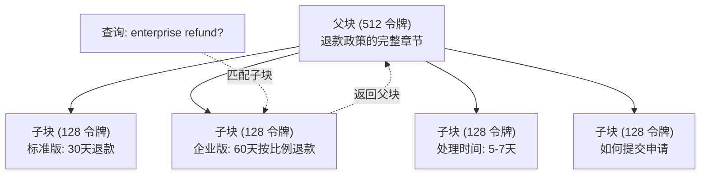

# 高级RAG（分块、重排序、混合搜索）

> 基础RAG检索前k个最相似的块。这对简单问题有效。对多跳推理、模糊查询和大规模语料库来说就不行了。高级RAG是一个在10个文档上工作的演示和在1亿个文档上工作的系统之间的差异。

**类型：** 构建
**语言：** Python
**前置要求：** Phase 11，Lesson 06（RAG）
**时间：** 约90分钟
**相关：** Phase 5 · 23（RAG的分块策略）涵盖所有六种分块算法——递归、语义、句子、父文档、延迟分块、上下文检索——以及Vectara/Anthropic基准。本课在此基础上构建：混合搜索、重排序、查询转换。

## 学习目标

- 实现保留文档结构和上下文的高级分块策略（语义、递归、父子）
- 构建一个混合搜索管道，结合BM25关键词匹配、语义向量搜索和cross-encoder重排序器
- 应用查询转换技术（HyDE、多查询、回退）来改善模糊或复杂问题的检索
- 诊断和修复常见RAG失败：检索到错误的块、答案不在上下文中、多跳推理断裂

## 问题

你在第06课构建了一个基础RAG管道。它对小型语料库的直接问题有效。现在试试这些：

**模糊查询**："上季度的收入是多少？"语义搜索返回关于收入策略、收入预测和CFO对收入增长看法的块。所有这些块在语义上都与"收入"这个词相似，但没有一个包含实际数字。正确的块写的是"2025年Q3为$47.2M"，但用的是"earnings"而不是"revenue"。嵌入模型认为"revenue strategy"比"Q3 earnings were $47.2M"更接近查询。

**多跳问题**："哪个团队的客户满意度分数提升最大？"这需要找到每个团队的满意度分数、比较它们、找出最大值。没有单个块包含答案。信息分散在各个团队报告中。

**大规模语料库问题**：你有200万个块。正确答案在块#1,847,293中。你的前5名检索拉出了块#14、#89,201、#1,200,000、#44和#901,333。在嵌入空间中接近，但没有一个包含答案。在这个规模上，近似最近邻搜索引入了足够的误差，使相关结果被挤出前k名。

基础RAG失败了，因为向量相似性不等于相关性。一个块可以在语义上相似于一个查询，但对于回答它没有用处。高级RAG用四种技术解决这个问题：混合搜索（添加关键词匹配）、重排序（更仔细地评分候选块）、查询转换（在搜索前修正查询）和更好的分块（以正确的粒度检索）。

## 概念

### 混合搜索：语义 + 关键词

语义搜索（向量相似性）擅长理解意义。"How do I cancel my subscription?"匹配"Steps to terminate your plan"，即使它们没有共享任何词。但它会漏掉精确匹配。"Error code E-4021"可能不匹配包含"E-4021"的块，如果嵌入模型将其视为噪声。

关键词搜索（BM25）正好相反。它擅长精确匹配。"E-4021"完美匹配。但如果文档说的是"terminate your plan"，"cancel my subscription"返回零结果。

混合搜索同时运行两者，然后合并结果。

**BM25**（最佳匹配25）是标准的关键词搜索算法。自1990年代以来一直是搜索引擎的骨干。其公式为词频乘以逆文档频率，配合文档长度归一化——包含查询词（尤其是稀有词）的文档得分更高，但对重复出现的词有边际收益递减。

### 倒数排名融合（RRF）

你有两个排名列表：一个来自向量搜索，一个来自BM25。如何合并它们？倒数排名融合是标准方法。

```
RRF分数(d) = Σ(1 / (k + rank_R(d)))
```

其中k是一个常数（通常60），防止排名第一的结果主导一切。RRF自然平衡两个信号——在两个列表中都排名靠前的文档获得最佳分数。

### 重排序

检索（无论向量、关键词还是混合）快速但不精确。它使用双编码器：查询和每个文档独立嵌入，然后比较。嵌入一次性计算并缓存。这可以扩展到数百万个文档。

重排序使用交叉编码器：将查询和一个候选文档一起输入一个模型，该模型输出一个相关性分数。模型同时看到两个文本，可以捕获它们之间的细粒度交互。

权衡：交叉编码器比双编码器慢100-1000倍。你不能为一百万个文档预计算交叉编码器分数。解决方案：从混合搜索中检索更大的候选集（前50名），然后用交叉编码器重排序得到最终的前5名。


### 查询转换

有时问题不是在检索上，而是在查询本身。"那个关于新政策变更的东西是什么？"是一个糟糕的搜索查询。它不包含具体词，嵌入是模糊的。

**查询改写**：用LLM将用户查询改写成更好的搜索查询。
**HyDE（假设文档嵌入）**：不直接用查询搜索，而是生成一个假设答案，嵌入它，然后搜索相似的真实文档。直觉：假设答案在嵌入空间中比原始问题更接近真实答案。

### 父子分块

标准分块迫使一个权衡：小块用于精确检索，大块用于充足的上下文。父子分块消除了这个权衡。

索引小块（128个令牌）用于检索。当一个小块被检索到时，返回其父块（512个令牌）用于提示。小块精确匹配查询，父块为LLM提供充足的上下文来生成好的答案。



### 元数据过滤

在运行向量搜索之前，通过元数据过滤语料库：日期、来源、类别、作者、语言。这减少了搜索空间并防止不相关的结果。

生产RAG系统在每个块旁边存储元数据：源文档、创建日期、类别、作者、版本。向量数据库支持在相似性搜索之前按元数据预过滤，这对大规模性能至关重要。

### 评估

你构建了一个RAG系统。怎么知道它是否有效？三个指标：

**检索相关性（Recall@k）**：对于一组具有已知相关文档的测试问题，有多少比例的相关文档出现在前k个结果中？

**忠实度**：生成的答案是否基于检索到的文档？如果检索到的块说"60天退款窗口"而模型说"90天退款窗口"，那就是忠实度失败。

**答案正确性**：生成的答案是否匹配预期答案？这是端到端指标，结合了检索质量和生成质量。

## 构建

### Step 1: BM25实现

```python
import math
from collections import Counter

class BM25:
    """BM25关键词搜索的完整实现"""
    def __init__(self, k1=1.2, b=0.75):
        self.k1 = k1  # 词频饱和参数
        self.b = b    # 长度归一化参数
        self.docs = []
        self.doc_lengths = []
        self.avg_dl = 0
        self.doc_freqs = {}
        self.n_docs = 0

    def index(self, documents):
        """用文档集合构建BM25索引"""
        self.docs = documents
        self.n_docs = len(documents)
        self.doc_lengths = []
        self.doc_freqs = {}

        for doc in documents:
            words = doc.lower().split()
            self.doc_lengths.append(len(words))
            unique_words = set(words)
            for word in unique_words:
                self.doc_freqs[word] = self.doc_freqs.get(word, 0) + 1

        self.avg_dl = sum(self.doc_lengths) / self.n_docs if self.n_docs else 1

    def score(self, query, doc_idx):
        """计算查询对单个文档的BM25分数"""
        query_words = query.lower().split()
        doc_words = self.docs[doc_idx].lower().split()
        doc_len = self.doc_lengths[doc_idx]
        word_counts = Counter(doc_words)
        score = 0.0

        for term in query_words:
            if term not in word_counts:
                continue
            tf = word_counts[term]
            df = self.doc_freqs.get(term, 0)

            # IDF 计算（含平滑处理）
            idf = math.log((self.n_docs - df + 0.5) / (df + 0.5) + 1)

            # BM25 词频分量
            numerator = tf * (self.k1 + 1)
            denominator = tf + self.k1 * (1 - self.b + self.b * doc_len / self.avg_dl)
            score += idf * numerator / denominator

        return score

    def search(self, query, top_k=10):
        """对所有文档进行评分，返回前k个"""
        scores = [(i, self.score(query, i)) for i in range(self.n_docs)]
        scores.sort(key=lambda x: x[1], reverse=True)
        return scores[:top_k]
```

### Step 2: 倒数排名融合

```python
def reciprocal_rank_fusion(ranked_lists, k=60):
    """将多个排名列表合并为一个，使用倒数排名融合"""
    scores = {}
    for ranked_list in ranked_lists:
        for rank, (doc_id, _) in enumerate(ranked_list):
            if doc_id not in scores:
                scores[doc_id] = 0.0
            scores[doc_id] += 1.0 / (k + rank + 1)
    fused = sorted(scores.items(), key=lambda x: x[1], reverse=True)
    return fused
```

### Step 3: 混合搜索管道

```python
def hybrid_search(query, chunks, vector_embeddings, vocab, idf, bm25_index, top_k=5, fusion_k=60):
    """结合向量搜索和BM25搜索的结果"""
    # 向量搜索
    query_emb = tfidf_embed(query, vocab, idf)
    vector_results = search(query_emb, vector_embeddings, top_k=top_k * 3)

    # BM25搜索
    bm25_results = bm25_index.search(query, top_k=top_k * 3)

    # 使用RRF融合
    fused = reciprocal_rank_fusion([vector_results, bm25_results], k=fusion_k)
    return fused[:top_k]
```

### Step 4: 简单重排序器

```python
def rerank(query, candidates, chunks):
    """简单重排序：词重叠 + 短语匹配 + 位置加权 + 初始分数"""
    query_words = set(query.lower().split())
    stop_words = {"the", "a", "an", "is", "are", "was", "were", "what", "how",
                  "why", "when", "where", "do", "does", "for", "of", "in", "to",
                  "and", "or", "on", "at", "by", "it", "its", "this", "that",
                  "with", "from", "be", "has", "have", "had", "not", "but"}
    query_terms = query_words - stop_words

    scored = []
    for doc_id, initial_score in candidates:
        chunk = chunks[doc_id].lower()
        chunk_words = set(chunk.split())

        # 关键词重叠
        term_overlap = len(query_terms & chunk_words)

        # 短语匹配（二元组）
        query_bigrams = set()
        q_list = [w for w in query.lower().split() if w not in stop_words]
        for i in range(len(q_list) - 1):
            query_bigrams.add(q_list[i] + " " + q_list[i + 1])
        bigram_matches = sum(1 for bg in query_bigrams if bg in chunk)

        # 位置加权：在文档开头出现的词获得加分
        position_boost = 0
        for term in query_terms:
            pos = chunk.find(term)
            if pos != -1 and pos < len(chunk) // 3:
                position_boost += 0.5

        rerank_score = (
            term_overlap * 1.0
            + bigram_matches * 2.0     # 短语匹配权重2倍
            + position_boost
            + initial_score * 5.0       # 保留原始信号
        )
        scored.append((doc_id, rerank_score))

    scored.sort(key=lambda x: x[1], reverse=True)
    return scored
```

### Step 5: HyDE（假设文档嵌入）

```python
def hyde_generate_hypothesis(query):
    """为查询生成一个假设答案文档"""
    templates = {
        "what": "对'{query}'的回答如下：根据我们的文档，{topic}涉及特定的政策和程序，定义了该过程的运作方式。",
        "how": "针对'{query}'：该过程涉及几个步骤。首先，你需要发起请求。然后，系统根据定义的规则处理它。",
        "default": "关于'{query}'：我们的记录表明与此主题相关的具体细节和政策，提供了全面的答案。"
    }

    # 选择模板
    query_lower = query.lower()
    if query_lower.startswith("what"):
        template = templates["what"]
    elif query_lower.startswith("how"):
        template = templates["how"]
    else:
        template = templates["default"]

    # 提取主题词
    topic_words = [w for w in query.lower().split()
                   if w not in {"what", "is", "the", "how", "do", "does", "a", "an",
                                "for", "of", "to", "in", "on", "at", "by", "and", "or"}]
    topic = " ".join(topic_words) if topic_words else "this topic"

    return template.format(query=query, topic=topic)


def hyde_search(query, chunks, vector_embeddings, vocab, idf, top_k=5):
    """使用HyDE搜索：先假设答案，再找相似的文档"""
    hypothesis = hyde_generate_hypothesis(query)
    hypothesis_emb = tfidf_embed(hypothesis, vocab, idf)
    results = search(hypothesis_emb, vector_embeddings, top_k)
    return results, hypothesis
```

### Step 6: 父子分块

```python
def create_parent_child_chunks(text, parent_size=200, child_size=50):
    """创建父子分块：小区块用于检索，大区块用于上下文"""
    words = text.split()
    parents = []
    children = []
    child_to_parent = {}

    parent_idx = 0
    start = 0
    while start < len(words):
        # 创建父块
        parent_end = min(start + parent_size, len(words))
        parent_text = " ".join(words[start:parent_end])
        parents.append(parent_text)

        # 从父块中创建子块
        child_start = start
        while child_start < parent_end:
            child_end = min(child_start + child_size, parent_end)
            child_text = " ".join(words[child_start:child_end])
            child_idx = len(children)
            children.append(child_text)
            child_to_parent[child_idx] = parent_idx
            child_start += child_size

        parent_idx += 1
        start += parent_size

    return parents, children, child_to_parent
```

### Step 7: 忠实度评估

```python
def evaluate_faithfulness(answer, retrieved_chunks):
    """检查生成的答案是否基于检索到的文档"""
    answer_sentences = [s.strip() for s in answer.split(".") if len(s.strip()) > 10]
    if not answer_sentences:
        return 1.0, []

    grounded = 0
    ungrounded = []
    context = " ".join(retrieved_chunks).lower()

    for sentence in answer_sentences:
        words = set(sentence.lower().split())
        stop_words = {"the", "a", "an", "is", "are", "was", "were", "and", "or",
                      "to", "of", "in", "for", "on", "at", "by", "it", "this", "that"}
        content_words = words - stop_words
        if not content_words:
            grounded += 1
            continue

        # 检查有多少内容词出现在检索到的上下文中
        matched = sum(1 for w in content_words if w in context)
        ratio = matched / len(content_words) if content_words else 0

        if ratio >= 0.5:
            grounded += 1
        else:
            ungrounded.append(sentence)

    score = grounded / len(answer_sentences) if answer_sentences else 1.0
    return score, ungrounded


def evaluate_retrieval_recall(queries_with_relevant, retrieval_fn, k=5):
    """测量检索管道在k处的召回率"""
    total_recall = 0.0
    results = []

    for query, relevant_indices in queries_with_relevant:
        retrieved = retrieval_fn(query, k)
        retrieved_indices = set(idx for idx, _ in retrieved)
        relevant_set = set(relevant_indices)
        hits = len(retrieved_indices & relevant_set)
        recall = hits / len(relevant_set) if relevant_set else 1.0
        total_recall += recall
        results.append({
            "query": query,
            "recall": recall,
            "hits": hits,
            "total_relevant": len(relevant_set)
        })

    avg_recall = total_recall / len(queries_with_relevant) if queries_with_relevant else 0
    return avg_recall, results
```

## 使用

使用真实的交叉编码器进行重排序：

```python
from sentence_transformers import CrossEncoder

reranker = CrossEncoder("cross-encoder/ms-marco-MiniLM-L-6-v2")

def rerank_with_cross_encoder(query, candidates, chunks, top_k=5):
    """使用Sentence Transformers交叉编码器进行重排序"""
    pairs = [(query, chunks[doc_id]) for doc_id, _ in candidates]
    scores = reranker.predict(pairs)
    scored = list(zip([doc_id for doc_id, _ in candidates], scores))
    scored.sort(key=lambda x: x[1], reverse=True)
    return scored[:top_k]
```

使用Cohere的托管重排序器：

```python
import cohere

co = cohere.Client()

def rerank_with_cohere(query, candidates, chunks, top_k=5):
    docs = [chunks[doc_id] for doc_id, _ in candidates]
    response = co.rerank(
        model="rerank-english-v3.0",
        query=query,
        documents=docs,
        top_n=top_k
    )
    return [(candidates[r.index][0], r.relevance_score) for r in response.results]
```

使用真实LLM的HyDE：

```python
import anthropic

client = anthropic.Anthropic()

def hyde_with_llm(query):
    response = client.messages.create(
        model="claude-sonnet-4-20250514",
        max_tokens=256,
        messages=[{
            "role": "user",
            "content": f"写一段简短的话，作为这个问题的好的答案。不要说你不知道。只需写出答案会是什么样的。\n\n问题：{query}"
        }]
    )
    return response.content[0].text
```

使用Weaviate的生产级混合搜索：

```python
import weaviate

client = weaviate.connect_to_local()

collection = client.collections.get("Documents")
response = collection.query.hybrid(
    query="enterprise refund policy",
    alpha=0.5,  # 0.0=纯关键词, 1.0=纯向量, 0.5=等权重
    limit=10
)
```

## 交付

本课产出：
- `outputs/prompt-advanced-rag-debugger.md` —— 用于诊断和修复RAG质量问题的提示
- `outputs/skill-advanced-rag.md` —— 用于构建包含混合搜索和重排序的生产级RAG的技能

## 练习

1. 在样例文档上对比BM25 vs 向量搜索 vs 混合搜索。对于5个测试查询，记录哪种方法在第1位返回最相关的块。混合搜索应在至少3/5的查询上胜出。

2. 实现一个元数据过滤器。为每个文档添加"category"字段（security、billing、api、product）。在运行向量搜索之前，将块过滤到仅相关类别。用"What encryption is used?"测试，验证它只搜索security类别的块。

3. 使用第06课的简单生成函数构建完整的HyDE管道。在所有5个测试查询上对比直接查询搜索和HyDE搜索的检索质量（前3名相关性）。HyDE应该在模糊查询上改善结果。

4. 在样例文档上实现父子分块策略。使用child_size=30和parent_size=100。用子块搜索但返回父块到提示中。将生成的答案与chunk_size=50的标准分块对比。

5. 创建一个评估数据集：10个带有已知答案块的问题。测量(a)仅向量搜索、(b)仅BM25、(c)混合搜索、(d)混合+重排序的Recall@3、Recall@5和Recall@10。绘制结果并识别重排序在哪些地方帮助最大。

## 关键术语

| 术语 | 人们说的 | 它实际意味着 |
|------|---------|------------|
| BM25 | "关键词搜索" | 一种概率排序算法，通过词频、逆文档频率和文档长度归一化来对文档评分 |
| 混合搜索 | "两全其美" | 并行运行语义（向量）和关键词（BM25）搜索，然后用排名融合合并结果 |
| 倒数排名融合 | "合并排名列表" | 通过对每个文档在所有列表上的1/(k+rank)求和来合并多个排名列表 |
| 重排序 | "第二轮评分" | 使用更昂贵的交叉编码器模型对初始检索的候选集重新评分 |
| 交叉编码器 | "联合查询-文档模型" | 一个将查询和文档作为单一输入、产生相关性分数的模型；比双编码器更准确但太慢无法进行全语料库搜索 |
| 双编码器 | "独立嵌入模型" | 一个独立嵌入查询和文档的模型；因为嵌入是预计算的所以快，但不如交叉编码器准确 |
| HyDE | "用假答案搜索" | 生成一个查询的假设答案，嵌入它，并搜索相似的真实文档 |
| 父子分块 | "小搜索，大上下文" | 索引小块以进行精确检索，但返回更大的父块以提供充足的上下文 |
| 元数据过滤 | "在搜索前缩小范围" | 在运行向量搜索之前通过属性（日期、来源、类别）过滤文档，以减少搜索空间 |
| 忠实度 | "它是否保持贴近事实" | 生成的答案是否由检索到的文档支撑，而不是从模型训练数据中幻觉出来的 |

## 扩展阅读

- Robertson & Zaragoza, "The Probabilistic Relevance Framework: BM25 and Beyond" (2009) —— BM25的权威参考，解释公式背后的概率基础
- Cormack等人, "Reciprocal Rank Fusion Outperforms Condorcet" (2009) —— 原始RRF论文，展示它击败了更复杂的融合方法
- Gao等人, "Precise Zero-Shot Dense Retrieval without Relevance Labels" (2022) —— HyDE论文，证明假设文档嵌入无需任何训练数据就能改善检索
- Nogueira & Cho, "Passage Re-ranking with BERT" (2019) —— 展示了在BM25之上使用交叉编码器重排序显著改善检索质量
- [Khattab等人, "DSPy" (2023)](https://arxiv.org/abs/2310.03714) —— 将提示构建和权重选择视为检索管道上的优化问题；读这个来"编程LLM"而非"提示LLM"。
- [Edge等人, "From Local to Global: A Graph RAG Approach" (Microsoft Research 2024)](https://arxiv.org/abs/2404.16130) —— GraphRAG论文：实体-关系提取 + Leiden社区检测用于以查询为中心的摘要
- [Asai等人, "Self-RAG" (ICLR 2024)](https://arxiv.org/abs/2310.11511) —— 带反思令牌的自我评估RAG；超越静态检索后生成的Agent前沿
- [LangChain查询构建博客](https://blog.langchain.dev/query-construction/) —— 如何将自然语言查询转换为结构化数据库查询（Text-to-SQL）

---

## 📝 教师备课总结与读后感

### 一、文档整体评价

这篇文档精准地回答了"基础RAG已经学会了，下一步是什么"。它不是罗列所有高级技巧，而是选出了四个最有工程价值的——混合搜索、重排序、查询转换（HyDE）、父子分块——每个都围绕一个具体的RAG失败案例展开。目标读者是已经跑通了基础RAG管道但正在撞到"在1个文档上完美、在1万个文档上崩溃"这堵墙的工程师。最大优势是用"I know what you are thinking"的口吻提前预判学生的失败点（模糊查询、多跳推理、大规模语料库），然后用每个技巧精准解决一个失败案例。

### 二、知识结构梳理

- **认知基础**：向量相似性≠相关性这一核心洞察 → 双编码器vs交叉编码器之间的速度-精度权衡 → "问题空间"和"答案空间"在嵌入中的差距（HyDE的动机）。
- **工程模式**：混合搜索并行管道→ RRF融合→ 交叉编码器重排序的两阶段检索 → 父子分块作为"检索用小的、上下文用大的"的架构决策。
- **实际应用**：所有从手工实现到生产API的升级路径（BM25 → Weaviate、简单reranker → CrossEncoder → Cohere API、模板HyDE → LLM HyDE）。

### 三、核心洞察（备课时的关键理解）

1. **向量相似性不是相关性，这是一个基础性的错误假设**。嵌入模型判断"语义上相像"，而不是"能用来回答问题"。一个关于"收入策略"的文档可能比包含"Q3营收$47.2M"的文档更接近"上季度收入"这个查询的向量——但前者完全没用。这个认知应该敲进每个RAG工程师的脑子里。
2. **混合搜索的本质是"信息互补"**：BM25抓住精确匹配（E-4021），向量搜索抓住语义匹配（取消订阅=终止计划）。两者的结合不是"备用+优化"，而是"不同的信息通道"——就像视觉和听觉同时提供不同的信息来帮助你定位。
3. **重排序是RAG中ROI最高的单点投入**：从top-50到top-5的重排序可以将检索精度提升15-30%，而成本只增加约0.01美元/查询（交叉编码器API调用）。相比微调嵌入模型或升级向量数据库，这个投入产出比是最高的。
4. **HyDE的思想比实现更值钱**：不是"造个假答案"来搜索，而是"桥接问题空间和答案空间"。查询和答案在嵌入空间中是不同的区域——查询是短而模糊的，答案是长而具体的。HyDE通过生成一个假设答案，让搜索发生在"答案空间"中。这个洞察适用于所有检索系统，不只是RAG。
5. **父子分块"解耦合"了两个相互矛盾的需求**：检索需要小块（精确匹配），理解需要大块（充足上下文）。强行在同一个块大小上解决两个问题就是永久地在甜蜜点和效率之间妥协。父子分块承认这两个需求不同，并分别优化。
6. **RRF用"排名"而不是"分数"来融合信号**：这是一个精妙的设计决策。BM25分数和余弦相似度分数在不同的尺度上，直接加权平均是不可信的。但"第1名"在两种体系中都意味着"最相关"——用排名而非原始分数来融合是数学上安全的。
7. **RAG评估需要三个独立的维度**：检索召回率（找到对的文档了吗？）、忠实度（答案有事实支撑吗？）、端到端正确性（答案对了吗？）。太多团队只看端到端正确性，然后发现检索失败时不知道是retrieval出了问题还是generation出了问题。

### 四、教学建议

1. **用"为什么基础RAG失败"作为整节课的驱动力**：不要在开头讲BM25的公式。从三个真实的失败案例开始：模糊查询、多跳推理、大规模语料。让学生在互动中自己说出"向量相似性≠相关性"这个洞察，然后介绍每个技巧恰好解决一个问题。
2. **BM25的现场对比实验是必须的**：让学生对同一个查询跑向量搜索和BM25。让他们亲眼看到：向量搜索找到了"收入策略"相关的块但错过了"E-4021"，BM25找到了"E-4021"但关键词匹配不到"Q3 earnings"的相关块。只有亲眼看到两种方法的互补，他们才会真心相信混合搜索的价值。
3. **双编码器vs交叉编码器的速度实验**：不要只讲"交叉编码器慢100-1000倍"。让学生实际比较：对一个查询+100个候选文档的双编码器搜索（预计算+点积=毫秒级）vs交叉编码器评分（逐对计算=秒级）。感觉到的时间差异比任何数字都有说服力。
4. **HyDE的"啊哈！"时刻**：让学生先搜索"企业退款政策"，记录结果。然后让他们用LLM生成一个假设答案（"企业客户在购买后的60天内可以申请全额退款..."），嵌入这个假设答案，再搜索。观看他们发现检索结果质量飞跃的那张脸——这就是教学的魔力时刻。
5. **父子分块作为架构权衡的练习**：让学生先用chunk_size=50跑RAG（检索精准但上下文不足），再用chunk_size=500跑（上下文充足但检索不精准），最后用child_size=50+parent_size=500跑（两全其美）。对比三者的答案质量。这不是为了证明"父子分块更好"，而是让学生体验"为什么要分离检索和上下文"。
6. **RRF作为"不用归一化"的融合方案**：很多人会先想到"把两个分数归一化再平均"。让学生对比直接平均（需要归一化，但归一化很敏感）和RRF（只用排名，鲁棒）。让他们看到优雅的设计决策如何消灭一类问题。
7. **评估管道作为"工程成熟度"的标志**：告诉学生：没有评估管道的RAG系统不是生产系统。让他们为第06课的RAG管道添加忠实度评估——不是因为评估技术有多复杂，而是因为"能度量才能改进"是区分爱好者和工程师的分水岭。

### 五、值得补充的内容

1. **自查询检索器**：让LLM自动从查询中提取元数据过滤条件。"最近更新的关于JWT认证的问题"→ LLM提取：category=authentication, date_filter=last_30_days。这是让元数据过滤变得动态可用的关键一步。
2. **中文的BM25特殊性**：BM25依赖空格分割的词汇。对中文来说，必须先分词再索引。jieba分词的质量直接影响BM25的召回率——这是国内学生实际落地的第一个坑。
3. **多模态RAG**：本课完全是文本→文本的范式。但图像、表格、图表的检索（CLIP嵌入+描述文本）在文档RAG中是常见需求。应该有一条到多模态扩展的路径。
4. **实时索引更新策略**：文档在变、嵌入要重建、向量索引要更新——这些都不是一次性操作。增量索引、版本化嵌入、零停机更新——这是生产RAG运维的核心问题。
5. **成本模型分析**：双编码器检索≈$0.0001/查询，交叉编码器重排序≈$0.01/查询，HyDE LLM调用≈$0.005/查询。对比基础RAG和高级RAG的每次查询成本曲线是重要的架构决策支撑。

### 六、一句话总结

**基础RAG问"相似的在哪里"，高级RAG问"能回答问题的在哪里"——前者找邻居，后者找答案。**

---

# 🎓 Agent 架构课：高级RAG——从"找到相似的"到"找到能回答的"

我第一次在生产中撞到RAG的墙是在一个有着50万份文档的知识库系统上。检索管道完美运行——查"退款政策"，返回的都是"退款"相关的块。但有一个问题：实际答案在块#312,401中。它说"72小时处理退款"。而我的检索返回的前5个块都是在讨论"退款流程优化"、"退款数据报告"、"我们如何改善退款体验"。

语义上完美。内容上完全没用。

这就是向量相似性和真实相关性之间的鸿沟。嵌入模型衡量的是"这两个文本谈论同一件事吗？"而不是"这个文本能回答那个问题吗？"一个关于"收入趋势"的段落和一个关于"Q3收入是47.2M美元"的段落——前者在语义上更像是"上季度收入"的答案，因为"收入"和"趋势"这两个词在嵌入空间中天然接近。但后者才是你真正需要的。

这个故事不只是RAG的故事。它是所有AI工程中"看起来正确"和"实际上有用"之间的差距。

## 问题的本质：语义相似是必要的，但远非充分的

让我用一个数学直觉来讲清楚。一个查询是一个N维向量。你的文档也是一个N维向量。余弦相似度衡量的是它们之间的角度——两个向量的"方向一致性"。

但现在想想："收入是什么？"和"收入是$47.2M美元"——它们的向量非常不同。前者是一个模糊的问题，后者是一个包含具体数字的陈述。在嵌入空间中，它们甚至可能不在同一个象限。

然而，"收入是什么？"和"收入增长是公司战略的核心焦点"——它们的向量可能非常接近。因为两者都是关于"收入"的泛化陈述。

余弦相似度告诉你：这两个文本"谈论同一件事"。它不会告诉你：这个文本"包含另一个文本需要的答案"。

这就是为什么你需要混合搜索。关键词搜索（BM25）做了一件向量搜索做不到的事：它找到包含精确词的文档。"E-4021"在语义上是一个无意义的符号字符串，但BM25知道它是精确的。混合搜索不是"备用"，是"互补"——就像视觉和听觉提供关于同一事件的不同信息。

## 两条路径，两种哲学

**路径一：一阶检索。** 一次搜索，返回top-5，直接喂给LLM。这就是第06课的基础RAG。它在100个文档上完美运行。它在100万个文档上开始破裂。它在1000万个文档上崩溃。

问题不是"一次搜索不够"，而是"一次搜索无法区分相关和有用"。在前5名中，1个是真正需要的文档，另外4个"在语义上相似但内容上无关"。你的LLM盯着这5个文档，其中4个是噪音——它需要从噪音中提取信号。

**路径二：多阶检索+重排序。** 第一阶段：混合搜索（向量+BM25）获取top-50候选。第二阶段：交叉编码器对这50个候选重新评分——这次不是基于"谈论同一件事吗"，而是基于"这个文档能回答这个问题吗"。交叉编码器同时看到查询和文档，可以理解它们的交互关系——一个双编码器做不到的事。

这个两阶段策略的核心洞察是：检索应该分成两个步骤——快速地"找到可能相关的"，然后仔细地"验证哪个真正相关"。这就像图书馆检索：先用目录找到合适的区域（top-50），再走到书架前一本本看一下（top-5）。你不会读50本书来决定哪5本最相关——你不会，交叉编码器会，而且它比你快1000倍。

## 深入原理

### BM25：精确性的后盾

BM25是1990年代的产物。当LLM和深度学习都不存在时，BM25就是搜索的全部。它的核心是两个数字：TF（这个词在文档中出现了多少次）和IDF（这个词在整个语料库中是否稀有）。

"Error"这个词出现在3000个文档中。它的IDF很低——不稀有。"E-4021"只出现在2个文档中。它的IDF很高——稀有且重要。当有人搜索"E-4021"时，BM25给那2个包含这个词的文档极高的分数。

向量嵌入在这里会失败，因为"E-4021"不是一个语义概念——它只是一个字符串。嵌入模型可能把它当噪声。BM25把它当精确信号。

### 重排序：把"看起来相似"变成"真正相关"

这里有一个投资建议：如果你只从今天这节课做一件事，加重排序到你的RAG管道中。不是混合搜索，不是HyDE，不是父子分块。是重排序。

为什么？因为它解决了RAG中最昂贵的问题：将不相关的文档提供给LLM。

一次GPT-5调用消耗几千个令牌。如果前5个检索结果中有4个是噪音，你就在为这些噪音付费（输入令牌的成本），而且你的LLM被噪音分散了注意力（输出质量的成本）。重排序用一个小额投资（一次交叉编码器调用≈$0.01）来过滤掉噪音，确保喂给LLM的3-5个块都是真正有用的。

投资回报率的计算很简单：如果重排序将一个噪音块替换为一个相关块，而那次LLM调用的成本是$0.03，你刚用$0.01的投资保护了$0.03的LLM调用不被浪费。净收益：$0.02。每天1万次查询？每天节省$200。

### HyDE：在答案空间里搜索

这是我最喜欢的一个RAG技巧，因为它揭示了一个关于嵌入空间的深层事实。

查询是简短的、模糊的、缺上下文的。答案是长文本片段，包含具体的数字、名称和条件。在嵌入空间中，"问题和答案"处于不同的区域——就像你站在北京问"纽约在哪里？"北京和纽约在地球上是不同的位置。

HyDE说：别搜索"纽约在哪里"，先猜一个答案："纽约在美国东海岸，位于北纬40度。"然后搜索和这个假设答案相似的文档。你的假设答案是一份"伪答案文档"，它在嵌入空间中天然更接近真实答案。

这个技巧的威力来自一个事实：**答案的邻居也是答案**。在向量空间中，相似的实际文档聚集在一起。一个假答案落在真实答案附近的可能性远大于原始查询落在那里的可能性。

## 生产现实

- **BM25索引的维护成本**：必须和向量索引同步更新。如果你重建了向量索引但忘了重建BM25索引，混合搜索会给你一半准确的、一半过时的结果。
- **交叉编码器的实际延迟**：ms-marco-MiniLM-L-6-v2在CPU上约20ms/对，50个候选=1秒。在生产中，对50个候选用交叉编码器是不可接受的延迟预算。解决方案：先用简单的reranker筛到20个，再对20个运行交叉编码器≈400ms。或者直接用GPU batch推理。
- **HyDE的LLM调用成本**：每增加一个LLM调用就是200-500ms的延迟和$0.003-0.01的成本。如果HyDE提升你的检索质量超过10%，它可能是值的。如果只提升1-2%，你就是在花0.01美元换取1%的精度——而且在某些场景这是值的。
- **RRF的k参数**：k=60是标准的，但如果你检索100个候选而不是标准的10个，应该增加k来防止排名靠后的文档被过度惩罚。
- **父子分块的存储膨胀**：如果父块=512 token，子块=128 token，每个父块创建4个子块。你的索引大小×5。对于100万token的语料库，向量索引从~1.5GB膨胀到~7.5GB。

## 反模式

**混合搜索alpha=0.5一刀切**。不同的查询类型需要不同的混合比例。精确查询（"E-4021"）需要alpha≈0.2（更偏向BM25）。模糊查询（"退款相关的东西"）需要alpha≈0.8（更偏向向量）。一刀切的alpha抹平了混合搜索的价值。

**对所有查询使用HyDE**。如果查询已经足够具体（"2025年Q3的营收是多少？"），HyDE不会帮助——它只会增加延迟和成本，检索质量不会显著提升。HyDE是模糊查询的专门工具，不是通用增强。

**过度依赖元数据过滤**。如果你在搜索前过滤掉太多文档（"只在最近30天的安全文档中搜索"），你可能会不小心切掉正确答案。元数据过滤减少搜索空间也减少召回率——这是一个权衡。

**在没有忠实度检查的系统中评估**——如果忠实度是0.7，你的端到端正确性指标可能看起来不错（LLM编了一个好答案），但你离一个真正可靠的系统还差得远。

## 结语清单

1. ☐ 混合搜索是否包含BM25作为向量搜索的补充，而不是替代？
2. ☐ 重排序是否是标准管道的一部分，将候选从20-50个削减到3-5个？
3. ☐ HyDE是否只针对模糊查询启用以避免不必要的延迟？
4. ☐ 分块策略是否解耦了检索粒度（小块）和上下文粒度（大块）？
5. ☐ 评估管道是否同时衡量检索召回率、忠实度和端到端正确性？
6. ☐ 元数据过滤的阈值是否经过校准，以避免过度排除相关文档？
7. ☐ 混合搜索的alpha是否根据查询类型（精确vs模糊）动态调整？

**一句金句：基础RAG找邻居，高级RAG找证据。邻居可能只是住得近，但证据必须能回答你的问题。**
