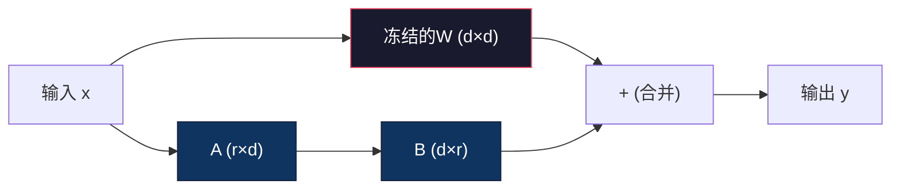

# 使用LoRA和QLoRA进行微调

> 对一个7B模型进行全量微调需要56GB显存。你没有。大多数公司也没有。LoRA让你通过训练不到1%的参数，在6GB显存下就能微调同一个模型。这不是妥协——在大多数任务上它匹配全量微调的质量。整个开源微调生态都跑在这一个技巧上。

**类型：** 构建
**语言：** Python
**前置要求：** Phase 10，Lesson 06（指令微调/SFT）
**时间：** 约75分钟
**相关：** Phase 10涵盖了从零开始的SFT/DPO循环。本课将这些接入2026年的PEFT工具包（PEFT、TRL、Unsloth、Axolotl、LLaMA-Factory）。

## 学习目标

- 通过将低秩适配器矩阵（A和B）注入预训练模型的注意力层来实现LoRA
- 计算LoRA vs 全量微调的参数节省：秩r配合d_model维度训练2*r*d个参数而非d^2
- 使用QLoRA（4比特量化基座+LoRA适配器）微调模型，使其适配消费级GPU显存
- 将LoRA权重合并回基座模型用于部署，并比较有无适配器的推理速度

## 问题

你有一个基座模型。Llama 3 8B。你想让它用你公司的语调回答客户支持工单。SFT是答案。但SFT有成本问题。

全量微调更新模型中的每一个参数。Llama 3 8B有80亿个参数。在fp16精度下，每个参数占用2字节。仅仅加载权重就需要16GB。在训练期间，你还需要梯度（16GB）、Adam优化器状态（32GB，用于动量和方差）和激活值。总计：一个8B模型大约需要56GB显存。

一块A100 80GB勉强能装下。两块A100在云提供商上花费每小时$3-4。在50,000个样本上训练3个epoch需要6-10小时。每次实验$30-40。运行10次实验来调整超参数，在部署任何东西之前就花了$400。

扩展到Llama 3 70B，数字变得荒谬。仅权重就需要140GB。你需要一个集群。每次实验$100+。

还有一个更深层的问题。全量微调修改了模型中的每一个权重。如果你在客户支持数据上微调，你可能会降低模型的通用能力。这叫灾难性遗忘。模型在你的任务上变好了，但在其他所有事情上变差了。

你需要一个方法：训练更少的参数，使用更少的内存，并且不破坏模型现有的知识。

## 概念

### LoRA：低秩适应

微软的Edward Hu及其同事在2021年6月发表了LoRA。论文的洞察：微调期间的权重更新具有低的内在秩。你不需要更新一个4096x4096权重矩阵中的所有1670万个参数。更新中的有用信息可以被一个秩为16或32的矩阵捕获。

数学如下。一个标准线性层计算：

```
y = Wx
```

其中W是一个d_out × d_in的矩阵。对于一个4096x4096的注意力投影，那是16,777,216个参数。

LoRA冻结W并添加一个低秩分解：

```
y = Wx + BAx
```

其中B是(d_out × r)，A是(r × d_in)。秩r远小于d——通常是8、16或32。

对于r=16在一个4096×4096的层上：
- 原始参数：4096×4096 = 16,777,216
- LoRA参数：(4096×16) + (16×4096) = 131,072
- 缩减：131,072 / 16,777,216 = **0.78%**

你训练了0.78%的参数，获得了95-100%的质量。



A用随机高斯初始化。B初始化为零。这意味着LoRA贡献从零开始——模型从其原始行为开始训练，逐渐学习适应。

### 缩放因子：Alpha

LoRA引入了一个缩放因子alpha，控制低秩更新对输出的影响程度：

```
y = Wx + (alpha / r) * BAx
```

实际指导：alpha = 2 * rank是常见的社区惯例（原始论文在大多数实验中使用alpha = rank）。更高的alpha意味着每步更大的更新。

### 在哪里应用LoRA

一个Transformer有许多线性层。你不需要在所有层上都加LoRA。

| 目标层 | 可训练参数(7B) | 质量 |
|--------|---------------|------|
| 仅q_proj | 4.7M | 好 |
| q_proj + v_proj | 9.4M | 更好 |
| q_proj + k_proj + v_proj + o_proj | 18.9M | 注意力最佳 |
| 所有线性层 | 37.7M | 边际增益，2倍参数 |

大多数任务的甜点：q_proj + v_proj。

### 秩选择

| 秩 | 每层可训练参数 | 最适合 |
|----|---------------|--------|
| 4 | 32,768 | 简单分类、情感分析 |
| 8 | 65,536 | 单领域问答、摘要 |
| 16 | 131,072 | 多领域任务、指令遵循 |
| 32 | 262,144 | 复杂推理、代码生成 |
| 64+ | 524,288+ | 大多数任务收益递减 |

r=16是最常见的生产选择。

### QLoRA：4比特量化 + LoRA

华盛顿大学的Tim Dettmers及其同事在2023年5月发表了QLoRA。思路：将冻结的基座模型量化为4比特精度，然后在其上附加fp16的LoRA适配器。

这极大地改变了内存方程：

| 方法 | 权重内存(7B) | 训练内存(7B) | 所需GPU |
|------|-------------|-------------|---------|
| 全量微调(fp16) | 14GB | ~56GB | 1× A100 80GB |
| LoRA(fp16基座) | 14GB | ~18GB | 1× A100 40GB |
| QLoRA(4-bit基座) | 3.5GB | ~6GB | 1× RTX 3090 24GB |

QLoRA的三大技术贡献：
- **NF4**：专为神经网络权重设计的新数据类型，将16个量化级别放在标准正态分布的分位数上——对正态分布数据是信息论最优的
- **双重量化**：量化常数本身也占用内存，双重量化将这些常数从fp32压缩到fp8
- **分页优化器**：当GPU内存耗尽时自动将优化器状态换页到CPU RAM

### 质量对比

| 方法 | MMLU (5-shot) | MT-Bench | HumanEval |
|------|--------------|----------|-----------|
| 全量微调 | 48.3 | 6.72 | 14.6 |
| LoRA r=16 | 47.9 | 6.68 | 14.0 |
| QLoRA r=16 (NF4) | 47.5 | 6.61 | 13.4 |
| QLoRA r=64 (NF4) | 48.1 | 6.70 | 14.2 |

QLoRA r=64在大多数基准上基本匹配全量微调，同时使用少90%的内存。

### 实际成本

在50,000个样本上微调Llama 3 8B（3个epoch）：

| 方法 | GPU | 时间 | 成本 |
|------|-----|------|------|
| 全量微调 | 2× A100 80GB | 8小时 | ~$32 |
| LoRA r=16 | 1× A100 40GB | 4小时 | ~$8 |
| QLoRA r=16 | 1× RTX 4090 24GB | 6小时 | ~$5 |
| QLoRA r=16 (Unsloth) | 1× RTX 4090 24GB | 2.5小时 | ~$2 |

在一块消费级GPU上QLoRA的成本不到一顿午饭的钱。

### 2026年PEFT技术栈

| 框架 | 是什么 | 什么时候选 |
|------|--------|----------|
| **HF PEFT** | 规范的LoRA/QLoRA/DoRA/IA3库 | 需要原始控制且训练循环已基于transformers.Trainer |
| **TRL** | HF的反馈强化训练器(SFT, DPO, GRPO等) | SFT之后需要DPO/GRPO |
| **Unsloth** | Triton内核重写的前后向传播 | 需要2-5倍加速+一半显存且无损质量 |
| **Axolotl** | YAML配置包装器 | 需要可复现、版本控制的训练运行 |
| **LLaMA-Factory** | GUI/CLI/API | 零代码微调；支持100+模型系列 |

### 合并适配器

训练后你有两样东西：冻结的基座模型和一个小的LoRA适配器（通常10-100MB）。你可以：

1. **保持分离**：加载基座模型，在上面加载适配器。为不同任务交换适配器。
2. **永久合并**：计算W' = W + (alpha/r) * BA并保存为一个新的完整模型。没有推理开销。

对于服务多个任务，保持分离。对于部署单一专业模型，合并。

### 什么时候不该微调

微调是第三选择，不是第一选择。

**第一：提示工程。** 写一个更好的系统提示、加少样本示例、用思维链。如果提示能让你到达80%，你大概不需要微调。

**第二：RAG。** 如果模型需要知道你的特定数据（文档、知识库、产品目录），检索比烘焙到权重中更便宜且更可维护。

**第三：微调。** 当你需要模型采用一种无法通过提示实现的特定风格、格式或推理模式时使用。

## 构建

### Step 1: LoRA层

```python
import torch
import torch.nn as nn
import math

class LoRALayer(nn.Module):
    """LoRA低秩适配层：A初始化为缩放随机值，B初始化为零"""
    def __init__(self, in_features, out_features, rank=8, alpha=16):
        super().__init__()
        self.rank = rank
        self.alpha = alpha
        self.scaling = alpha / rank

        # A: 用缩放的随机值初始化 (kaiming风格)
        self.A = nn.Parameter(torch.randn(in_features, rank) * (1 / math.sqrt(rank)))
        # B: 初始化为零 → LoRA贡献从零开始
        self.B = nn.Parameter(torch.zeros(rank, out_features))

    def forward(self, x):
        return (x @ self.A @ self.B) * self.scaling
```

### Step 2: 带LoRA包装的线性层

```python
class LinearWithLoRA(nn.Module):
    """包装标准线性层，添加LoRA适配器"""
    def __init__(self, linear, rank=8, alpha=16):
        super().__init__()
        self.linear = linear  # 冻结的原始权重
        self.lora = LoRALayer(
            linear.in_features, linear.out_features, rank, alpha
        )

        # 冻结原始层——只有LoRA参数可训练
        for param in self.linear.parameters():
            param.requires_grad = False

    def forward(self, x):
        return self.linear(x) + self.lora(x)
```

### Step 3: 将LoRA注入模型

```python
def inject_lora(model, target_modules, rank=8, alpha=16):
    """冻结所有参数，将匹配的线性层替换为LinearWithLoRA"""
    # 冻结整个模型
    for param in model.parameters():
        param.requires_grad = False

    lora_layers = {}
    for name, module in model.named_modules():
        if isinstance(module, nn.Linear):
            if any(t in name for t in target_modules):
                # 替换为LoRA包装版本
                parent_name = ".".join(name.split(".")[:-1])
                child_name = name.split(".")[-1]
                parent = dict(model.named_modules())[parent_name]
                lora_linear = LinearWithLoRA(module, rank, alpha)
                setattr(parent, child_name, lora_linear)
                lora_layers[name] = lora_linear
    return lora_layers
```

### Step 4: 参数计数

```python
def count_parameters(model):
    """统计总参数、可训练参数和冻结参数"""
    total = sum(p.numel() for p in model.parameters())
    trainable = sum(p.numel() for p in model.parameters() if p.requires_grad)
    frozen = total - trainable
    return {
        "total": total,
        "trainable": trainable,
        "frozen": frozen,
        "trainable_pct": 100 * trainable / total if total > 0 else 0
    }
```

### Step 5: 将权重合并回

```python
def merge_lora_weights(model):
    """将LoRA适配器烘焙到原始权重中：W ← W + (alpha/r)*BA"""
    for name, module in model.named_modules():
        if isinstance(module, LinearWithLoRA):
            with torch.no_grad():
                merged = (
                    module.lora.A @ module.lora.B
                ) * module.lora.scaling
                module.linear.weight.data += merged.T
            # 替换回普通线性层（移除LoRA开销）
            parent_name = ".".join(name.split(".")[:-1])
            child_name = name.split(".")[-1]
            parent = dict(model.named_modules())[parent_name] if parent_name else model
            setattr(parent, child_name, module.linear)
```

### Step 6: 模拟QLoRA量化

```python
def quantize_to_nf4(tensor, block_size=64):
    """将权重张量量化为4比特（在64个元素的块内）"""
    blocks = tensor.reshape(-1, block_size)
    scales = blocks.abs().max(dim=1, keepdim=True).values / 7.0
    scales = torch.clamp(scales, min=1e-8)
    quantized = torch.round(blocks / scales).clamp(-8, 7).to(torch.int8)
    return quantized, scales

def dequantize_from_nf4(quantized, scales, original_shape):
    """从4比特格式反量化权重"""
    dequantized = quantized.float() * scales
    return dequantized.reshape(original_shape)
```

### Step 7: 训练循环 + 完整演示

```python
def train_lora(model, data, epochs=5, lr=1e-3, batch_size=4):
    """仅优化可训练参数（LoRA的A和B矩阵）"""
    optimizer = torch.optim.AdamW(
        [p for p in model.parameters() if p.requires_grad], lr=lr
    )
    criterion = nn.MSELoss()
    losses = []

    for epoch in range(epochs):
        epoch_loss = 0.0
        n_batches = 0
        indices = torch.randperm(len(data["inputs"]))
        for i in range(0, len(indices), batch_size):
            batch_idx = indices[i:i + batch_size]
            x = data["inputs"][batch_idx]
            y = data["targets"][batch_idx]
            output = model(x)
            loss = criterion(output, y)
            optimizer.zero_grad()
            loss.backward()
            optimizer.step()
            epoch_loss += loss.item()
            n_batches += 1
        losses.append(epoch_loss / n_batches)
    return losses
```

## 使用

使用Hugging Face生态，在真实模型上做LoRA只需约20行代码：

```python
from transformers import AutoModelForCausalLM
from peft import LoraConfig, get_peft_model

model = AutoModelForCausalLM.from_pretrained("meta-llama/Llama-3.1-8B")

lora_config = LoraConfig(
    task_type="CAUSAL_LM",
    r=16,             # 秩
    lora_alpha=32,    # alpha = 2*r 是标准选择
    lora_dropout=0.05,
    target_modules=["q_proj", "v_proj"],  # 甜点组合
)

model = get_peft_model(model, lora_config)
model.print_trainable_parameters()  # 仅 ~0.5-1% 可训练
```

QLoRA附加bitsandbytes量化：

```python
from transformers import BitsAndBytesConfig

bnb_config = BitsAndBytesConfig(
    load_in_4bit=True,
    bnb_4bit_quant_type="nf4",
    bnb_4bit_compute_dtype=torch.bfloat16,
    bnb_4bit_use_double_quant=True,
)

model = AutoModelForCausalLM.from_pretrained(
    "meta-llama/Llama-3.1-8B",
    quantization_config=bnb_config,
    device_map="auto",
)
model = get_peft_model(model, lora_config)
# 现在适配 ~6GB VRAM
```

保存的适配器只有10-100MB。基座模型保持不变。你可以在Hugging Face Hub上分享适配器而无需重新分发完整模型。

## 交付

本课产出：
- `outputs/prompt-lora-advisor.md` —— 一个帮助为特定任务决定LoRA秩、目标模块和超参数的提示
- `outputs/skill-fine-tuning-guide.md` —— 教导Agent微调决策树的技能

## 关键术语

| 术语 | 人们说的 | 它实际意味着 |
|------|---------|------------|
| LoRA | "高效微调" | 低秩适应：冻结基座权重，训练两个小矩阵A和B，其乘积近似完整的权重更新 |
| QLoRA | "在笔记本上微调" | 量化LoRA：以4比特NF4加载基座模型，在之上训练fp16的LoRA适配器 |
| 秩 (r) | "模型能学多少" | A和B矩阵的内维度；控制表达能力vs参数数量的权衡 |
| Alpha | "LoRA学习率" | 应用于LoRA输出的缩放因子 |
| NF4 | "4比特量化" | Normal Float 4：量化级别位于正态分布分位数上的4比特数据类型 |
| 适配器 | "小训练部分" | 作为独立文件保存的LoRA A和B矩阵(10-100MB) |
| 合并 | "烘焙进去" | 计算W + (alpha/r)*BA并替换原始权重 |
| 灾难性遗忘 | "微调破坏了其他一切" | 当更新所有权重导致模型失去先前学习的能力 |

## 扩展阅读

- Hu等人, "LoRA: Low-Rank Adaptation of Large Language Models" (2021)
- Dettmers等人, "QLoRA: Efficient Finetuning of Quantized Language Models" (2023)
- [PEFT库文档](https://huggingface.co/docs/peft)
- [Rafailov等人, "Direct Preference Optimization" (NeurIPS 2023)](https://arxiv.org/abs/2305.18290)
- [TRL文档](https://huggingface.co/docs/trl/)
- [Unsloth文档](https://docs.unsloth.ai/)
- [Axolotl文档](https://axolotl-ai-cloud.github.io/axolotl/)

---

## 📝 教师备课总结与读后感

### 一、文档整体评价

这篇文档对LoRA/QLoRA的讲解具备"从第一原理出发"的优秀教学设计——不是"用这个库跑一下就行"，而是从低秩矩阵分解的数学直觉开始（W + BA），逐步走向训练循环、量化模拟和权重合并。目标读者是知道模型需要微调但被56GB显存吓退的工程师。最大优势是用一个"参数计数 → 显存方程 → 成本对比"的链条，让学生清楚看到从全量微调到QLoRA的每一步节省了多少。

### 二、知识结构梳理

- **认知基础**：权重更新具有低秩性质（LoRA的核心假设）→ 矩阵分解BA替代ΔW → 为什么冻结基座+训练适配器不会导致灾难性遗忘 → alpha/r缩放因子的数学来源。
- **工程模式**：LoRA层实现 → 模型注入 → 训练循环（仅优化可训练参数）→ 合并推理→ 多适配器服务。QLoRA在此基础上增加了NF4量化、双重量化和分页优化器。
- **实际应用**：Hugging Face PEFT → QLoRA + Unsloth → Axolotl配置化 → 适配器合并/分发。

### 三、核心洞察（备课时的关键理解）

1. **LoRA不是"近似"，是"分解"**：全量微调的ΔW矩阵实际可能秩只有4-16——矩阵的大部分"信息"是可压缩的。LoRA只是显式做了这个压缩。所以r=16的LoRA能匹配全量微调——不是因为"近似够好"，而是因为"ΔW本来就只有16个有效维度"。
2. **B初始化为零是LoRA的精妙设计**：A随机→B零→BA=0。模型从原始行为开始训练，逐步偏离。这避免了微调早期的震荡——不像全量微调，一开始就把所有权重噪声化。
3. **QLoRA的NF4是专为神经网络权重"定制"的量化**：INT4均匀量化对正态分布的权重极其低效——大部分信息集中在大值区域，小值区域浪费了大量量化级别。NF4把16级放在正态分布的分位数上，使得每个级别都"信息等量"。这不是工程hack，是信息论的直接应用。
4. **Unsloth真正的价值是"Triton内核重写"**：不是调参，不是加层，是重写了Transformer的前向/反向传播的GPU内核。2-5倍的速度提升来自于更少的内存搬运和更好的计算复用。对于学生来说这是"框架不是魔法"的最好证明。
5. **适配器合并是部署架构的核心决策**：保持分离=多任务从一份基座服务（像给同一辆车换引擎），不能同时用两个适配器。合并=单任务专用模型，无推理开销。多适配器组合（TIES-Merging、DARE）是"如何把两个微调好的能力融合到一个模型中"，是高级玩法。
6. **微调不是第一选择，是第三选择**：提示工程→RAG→微调这个决策树是整个课程最重要的架构原则之一。学生最容易犯的错误是跳过前两步直接微调——然后发现微调了3天的问题，一个50词的提示就能解决。
7. **LoRA适配器是新的"模型分发单位"**：完整模型=几十GB，适配器=几十MB。共享适配器而不是完整模型——这是开源微调社区的基础设施创新。

### 四、教学建议

1. **从"显存方程"开始**：让学生计算全量微调Llama 8B需要多少显存（权重+梯度+优化器+激活=~56GB）。然后再展示LoRA把这个数字砍到~18GB、QLoRA砍到~6GB。数字的冲击力比任何描述都强。
2. **手写LoRA层是必修**：`class LoRALayer(nn.Module)`——让学生自己写这个不到20行的类。当他们看到A和B只是两个小矩阵、B初始化为零、BA就是低秩乘积——LoRA的神秘感就消失了。
3. **秩消融实验是最有力的可视化**：让学生用r=2, 4, 8, 16, 32, 64分别训练同一个任务，画loss曲线。他们会看到r=16比r=4好很多，但r=32比r=16提升微乎其微——这就是"低秩假设的实证验证"。
4. **"B初始化为零"的实验对比**：让学生做一个A/B测试——B随机初始化 vs B零初始化。看看随机B在训练前期的不稳定性。这不是理论教学，是工程直觉。
5. **量化误差分析**：量化和反量化后计算MSE、最大绝对误差、原始权重与重构权重的相关性。让学生看到"4比特量化到底丢失了多少信息"和"为什么丢这么多信息还能训练"。
6. **合并vs不合并的推理速度对比**：合并前（base + LoRA adapter = 两次矩阵乘法）vs 合并后（单次矩阵乘法）。让学生测量实际的wall-time差异——这直接关联到部署决策。
7. **决策树练习**：给3个真实场景（客服机器人、代码补全、翻译），让学生走"提示工程→RAG→微调"的决策树。让他们论证每一步为什么跳过或为什么不跳过。

### 五、值得补充的内容

1. **DoRA（权重分解的LoRA）**：2024年的改进——将预训练权重分解为幅度和方向，然后对方向应用LoRA但保留幅度不变。在某些任务上优于LoRA 1-3%。
2. **中文模型的LoRA最佳实践**：Qwen和DeepSeek的模型结构特殊性（如GQA、不同注意力头数）如何影响target_modules的选择——对国内学生这是直接的生产知识。
3. **LoRA的dropout和正则化**：LoRA dropout 0.05是社区默认值，但它实际在防止什么？过度秩？还是类似于普通神经网络的过拟合防止？
4. **多轮对话的微调数据格式**：ShareGPT格式、ChatML格式、Alpaca格式——不同格式对LoRA训练的影响。数据格式错误导致"训练了但模型表现不提升"是最常被忽略的原因。
5. **评估微调效果的方法**：不只是看loss曲线。应该在微调前后用同一个基准（如MT-Bench或自定义测试集）做对比评测。

### 六、一句话总结

**LoRA不是妥协——它揭示了全量微调的权重更新天然就是低秩的。你不是在"节省参数"，你是在"消除冗余参数"。**

---

# 🎓 Agent 架构课：LoRA——为什么微调80亿参数和微调80万参数是同一件事

我猜你是从"需要微调但显存不够"这个方向来的。对吧？所有人都一样。你有一个8B的模型，你有一些很好的训练数据，A100太贵了。然后有人告诉你："试试LoRA，你只需要训练1%的参数。"

你的第一反应是什么？我猜是怀疑。"只训练1%？那质量肯定打折。"我也是这么想的。直到我看了Hu等人的原始论文——在GPT-3 175B上，r=4的LoRA几乎匹配了全量微调的质量。

r=4。不是40，不是400，是4。在1750亿参数的模型上，可训练的参数不到700万。不到0.004%的参数。

这不是"近似"，这是"暴露真相"。全量微调训练了ΔW的全部16.7M个参数，但其中有用的信息可能只占了前4到16个奇异值方向。LoRA只是跳过噪音，直接学这个低秩结构。

## 问题的本质：全量微调在浪费96%的计算

让我用线性代数的直觉来把这个讲清楚。

全量微调更新一个4096×4096的权重矩阵。数学上，任何这样的更新都可以用SVD分解为4096个秩-1矩阵的和。按奇异值从大到小排。

前4个奇异值通常占了总方差的60-80%。前16个占了85-95%。后面的4080个？噪声。它们代表的是对训练数据的过拟合、不稳定的方向、甚至是对模型通用能力的破坏。

全量微调训练所有4096个秩-1分量，而真正有用的只有前16个。你花了$32训练一个模型，其中$26花在了噪音上。

LoRA说：别训练整个ΔW，直接训练低秩近似B×A，秩=16。

这就是为什么LoRA r=16能匹配全量微调。不是因为"近似质量很高"，而是因为"ΔW的有效秩本身就很低"。

## 两条路径，两种哲学

**路径一：全量微调。** 你需要56GB显存。一块A100 80GB。每实验$30-40。灾难性遗忘。不能共享模型（70GB的模型怎么发邮件？）。每次任务都需要重新训练。

**路径二：QLoRA。** 6GB显存。一块RTX 3090你家里就有。$2-5每次实验。基座模型不碰（没有灾难性遗忘）。适配器文件10-100MB（可以发邮件、放GitHub、在Hugging Face Hub上分享）。一个基座模型，100个适配器，100种不同的能力。

路径一的人说"这是最佳质量"。路径二的人说"这是最佳工程"。我今天站路径二，不是因为质量——在r=64上QLoRA已经追平了全量微调——而是因为迭代速度。你能在2小时内跑3个实验，而不是在3天内跑1个。在微调的世界里，快速迭代比精确结果更重要——因为你永远不知道哪个超参数组合最好，直到你试过20组。

## 深入原理

### LoRA注入——"外科手术"而非"全身换血"

`inject_lora`这个函数是整个LoRA哲学的实现。它不是"替换所有权重"，而是"在特定位置放置小的学习单元"。

冻结（`requires_grad = False`）不只是性能优化——它是一个哲学声明。"模型的99%应该保持不变。我们只在选定的几个地方让它学习。"

传统微调：模型像一个被重新粉刷的房间——每一个表面都被修改了。有些好，有些坏，但你无法区分。LoRA：模型像一个房间，你只替换了两件家具——其他地方完全不动。你知道哪两样是新的。你可以随时把它们换回来。

### 秩的选择——"少即是多"的数学证明

秩r=4能工作这件事，是LLM领域最被低估的结果之一。想象一下：一个1750亿参数的模型，全部知识压缩在权重中。你拿一个新任务（比如客服回复），你"教"了它新东西。这个"新东西"用16个维度就能表示。

16个维度。在4096维的参数空间中。0.39%。

这不只是工程便利——这是一个关于LLM本质的深刻洞察。模型已经知道如何推理、如何写作、如何表达。你教的只是一层"风格"或"知识"补丁。这层补丁自然就是低秩的——因为它不需要重新定义"什么是写作"，只需要重新定义"用哪种语调写"。

### QLoRA——"量化不是损失"的重新定义

传统观念：量化=损失精度=质量下降。QLoRA打破了这一点。

4比特量化确实会损失信息。NF4的16个级别意味着每个权重只能取16个可能的值。但关键洞察是：**LoRA适配器运行在fp16上**。基座模型是4比特的——它提供"语言的基础能力"（语法、常识、推理模式），这些在4比特下依然保留得很好。LoRA适配器是fp16的——它提供"任务的特定适应"，这些需要更高的精度。

这就像是：书本的正文用大字号印（4比特基座），但你在空白处用极细的笔做笔记（fp16适配器）。正文虽然粗糙但不影响阅读，笔记虽精细但只在需要的地方。

## 生产现实

- **适配器存储膨胀**：如果你服务100个不同的微调任务，你不需要100×模型的存储——你只需要1个基座模型（14GB）+ 100个适配器（每个约20-100MB，总计2-10GB）。相比全量微调的100×14GB=1.4TB，节省约99%。
- **推理时的适配器开销**：未合并的LoRA在每次前向传播中多一次矩阵乘法（BAx）。对于单个请求可能只多1-5ms。但对于高吞吐量API服务，这个开销累加。合并后无开销。
- **适配器兼容性**：LoRA适配器绑定到特定的基座模型检查点。如果你升级基座模型（Llama 3 → Llama 3.1），你的Llama 3适配器可能不可用。适配器和基座模型的版本必须匹配。
- **训练数据量**：LoRA在少量高质量数据（500-2000样本）上效果最好。大量数据（50000+样本）下，全量微调的优势才会体现。对于大多数企业用例（用你的产品文档/客服对话微调），500-2000个高质量样本就足够。
- **多适配器组合**：TIES-Merging和DARE让你可以合并多个适配器——微调代码+数学的适配器，在合并后模型通常都能做。这不是"免费午餐"——有干扰损失——但在许多场景下是可接受的。

## 反模式

**在可以用提示工程解决的问题上微调**。"我想让模型用JSON格式回答。"——在提示里写"用JSON格式回答"。不要为此微调。0行代码→0美元→0小时。

**在没有评估基准的情况下微调**。训练完说"感觉好了"。感觉不是指标。在微调前建立评估集，微调前后都测试。否则你不知道你是改善了模型还是只是改变了它。

**把秩设得太高**。r=128在一台A100上跑的"Lora"训练，实际上训练了5-10%的参数——这不是LoRA，这是伪装成LoRA的全量微调。你应该用最高的秩来换取边际收益吗？不——你应该优化数据质量。

**忘记了灾难性遗忘的方向**。LoRA/QLoRA解决了全量微调的灾难性遗忘。但少样本提示和多轮对话中的"指令漂移"（持续多轮后忘记系统提示）是一个相关但不同的问题。

## 结语清单

1. ☐ 在微调之前是否已尝试提示工程和RAG来达到足够的效果？
2. ☐ 秩(r)是否与任务复杂度匹配（简单任务r=4-8，复杂任务r=16-32）？
3. ☐ alpha是否设为2×r（社区标准）或根据收敛速度调整？
4. ☐ 是否建立了微调前后的评估基准来量化改善？
5. ☐ 适配器是否针对所有支持的用例与基座模型版本兼容？
6. ☐ 对于多任务部署，是否选择了正确的合并策略（保持分离vs合并）？
7. ☐ 训练数据是否经过质量筛选（500-2000个高质量>>50000个中等质量）？

**一句金句：LoRA不是"用更少参数模仿全量微调"——它发现了全量微调本来就在浪费96%的参数来学习16个有效维度。你不是在妥协，你是在清醒。**
