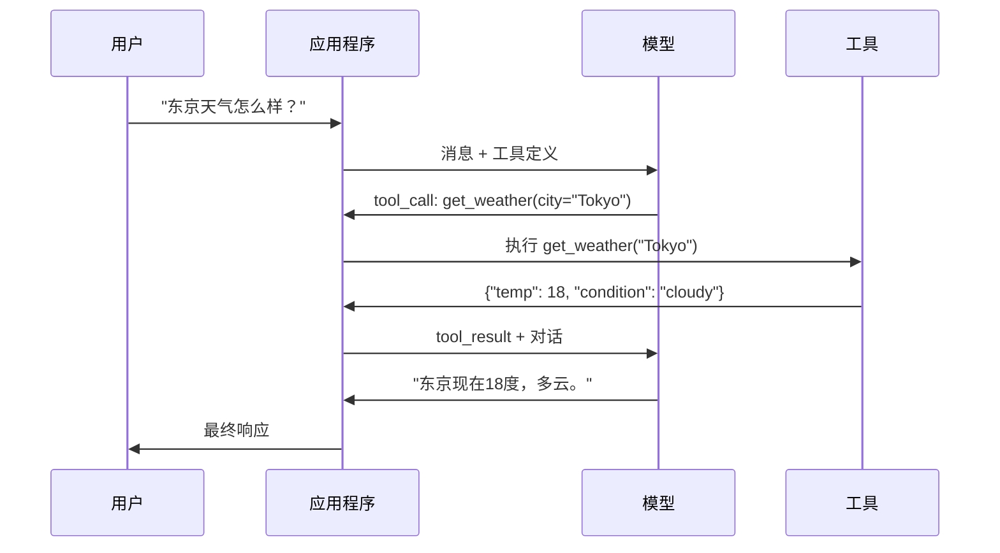

# 函数调用与工具使用

> LLM什么都不能做。它们生成文本。这就是全部能力。它们不能查天气、查询数据库、发邮件、运行代码或读文件。你见过的每一个"AI Agent"都是一个生成JSON的LLM，JSON里写着要调用哪个函数——然后是你的代码实际调用它。模型是大脑。工具是手。函数调用是连接它们的神经系统。

**类型：** 构建
**语言：** Python
**前置要求：** Phase 11 Lesson 03（结构化输出）
**时间：** 约75分钟
**相关：** Phase 11 · 14（模型上下文协议）——当工具跨主机共享时，从内联函数调用升级到MCP服务器。

## 学习目标

- 实现一个函数调用循环：定义工具schema、解析模型的工具调用JSON、执行函数、返回结果
- 设计具有清晰描述和类型化参数的工具schema，使模型能够可靠地调用
- 构建一个多轮Agent循环，链式调用多个函数来回答复杂查询
- 处理函数调用边缘情况：并行工具调用、错误传播和防止无限工具循环

## 问题

你构建一个聊天机器人。用户问："东京现在天气怎么样？"

模型回答："我无法访问实时天气数据，但根据季节，东京大概在15摄氏度左右……"

那是一个包装在免责声明中的幻觉。模型不知道天气。它永远也不会知道。天气每小时都在变化。模型的训练数据是几个月前的。

正确的答案需要调用OpenWeatherMap API，获取当前温度，返回真实数字。模型不能调用API。你的代码可以。缺失的环节：一个结构化的协议，让模型说"我需要用这些参数调用天气API"，并让你的代码执行它并把结果反馈回来。

这就是函数调用。模型输出描述调用哪个函数、带什么参数的结构化JSON。你的应用程序执行这个函数。结果回到对话中。模型用结果生成最终答案。

没有函数调用，LLM是百科全书。有了它，它们变成了Agent。

## 概念

### 函数调用循环

每次工具使用交互遵循相同的5步循环。



步骤1：用户发送消息。步骤2：模型收到消息及工具定义。步骤3：模型不是用文本回应，而是输出一个工具调用——一个带有函数名和参数的结构化JSON。步骤4：你的代码执行函数并捕获结果。步骤5：结果返回给模型，模型现在有了真实数据来生成最终答案。

模型从不执行任何东西。它只决定调用什么以及什么参数。你的代码是执行器。

### 工具定义：JSON Schema契约

每个工具由一个JSON Schema定义，告诉模型函数做什么、接受什么参数以及参数的类型。

关键：`description`字段至关重要。模型阅读它们来决定何时以及如何使用工具。模糊的描述会产生更差的工具选择。

### 提供商对比

| 提供商 | API参数 | 工具调用格式 | 并行调用 | 强制调用 |
|--------|---------|------------|---------|---------|
| OpenAI (GPT-5) | `tools` | `tool_calls[].function` | 支持 | `tool_choice="required"` |
| Anthropic (Claude) | `tools` | `content[].type="tool_use"` | 支持 | `tool_choice={"type":"any"}` |
| Google (Gemini) | `function_declarations` | `functionCall` | 支持 | `function_calling_config` |
| 开源模型 (Llama4, Qwen3) | 原生`tools`或Hermes格式 | 混合 | 因模型而异 | 基于提示或`tool_choice` |

### 工具选择：自动、必需、特定

- **自动**（默认）：模型决定是调用工具还是直接回答
- **必需**：模型必须调用至少一个工具
- **特定函数**：强制模型调用特定函数，用于路由

### 并行函数调用

GPT-4o和Claude可以在单轮中调用多个函数。"东京和纽约的天气怎么样？"→模型同时输出两个工具调用。对于每次查询5-10次工具调用的Agent，并行调用可将延迟减少60-80%。

### 结构化输出 vs 函数调用

- **结构化输出**：强制模型以特定形状生成数据——输出就是最终产品。示例：从文本中提取产品信息为`{name, price, in_stock}`
- **函数调用**：模型声明执行某个操作的意图——输出是中间步骤。示例：`get_weather(city="Tokyo")`

### 安全：不可协商的规则

**规则1：绝不要将模型生成的SQL直接传到数据库。** 模型可以且会生成DROP TABLE。始终参数化。始终验证。始终使用操作允许列表。
**规则2：允许列表函数。** 模型只能调用你显式定义的函数。
**规则3：验证参数。** 模型可能传递`"; DROP TABLE users; --"`作为城市名。
**规则4：清理工具结果。** 如果工具返回敏感数据，在发回给模型前过滤。
**规则5：限制工具调用频率。** 每对话10-20次调用是合理的上限。

### 错误处理

工具失败时返回结构化错误结果，不要抛异常：

```json
{"error": true, "message": "城市'Toky'未找到。你是说'Tokyo'吗?", "code": "CITY_NOT_FOUND"}
```

模型从结构化错误消息中自我纠正的能力很强，但从空响应或泛化的"出了点问题"错误中恢复很差。

### MCP：模型上下文协议

MCP是Anthropic的工具互操作性开放标准。一个MCP服务器可以向任何兼容客户端暴露工具。一个Postgres MCP服务器给任何MCP兼容Agent数据库访问权限。一个GitHub MCP服务器给任何Agent仓库访问权限。工具定义一次，到处使用。

## 构建

### Step 1-5: 工具注册表 + 5个工具实现 + 函数调用循环

（包含完整的calculator、get_weather、web_search、read_file、run_code工具实现、参数验证器、并行调用支持和安全沙箱检查。）

### Step 6: 运行演示

演示注册的工具、参数验证、直接工具执行、完整的函数调用循环（6个测试查询）、并行工具调用和安全性检查。

## 使用

### OpenAI函数调用

```python
# from openai import OpenAI
# client = OpenAI()
#
# tools = [{
#     "type": "function",
#     "function": {
#         "name": "get_weather",
#         "description": "获取城市的当前天气",
#         "parameters": {
#             "type": "object",
#             "properties": {
#                 "city": {"type": "string"},
#                 "units": {"type": "string", "enum": ["celsius", "fahrenheit"]}
#             },
#             "required": ["city"]
#         }
#     }
# }]
#
# response = client.chat.completions.create(
#     model="gpt-4o",
#     messages=[{"role": "user", "content": "东京天气？"}],
#     tools=tools,
#     tool_choice="auto",
# )
#
# tool_call = response.choices[0].message.tool_calls[0]
# args = json.loads(tool_call.function.arguments)
# result = get_weather(**args)
#
# # 将结果返回给模型生成最终答案
# final = client.chat.completions.create(
#     model="gpt-4o",
#     messages=[
#         {"role": "user", "content": "东京天气？"},
#         response.choices[0].message,  # 包含tool_call的消息
#         {"role": "tool", "tool_call_id": tool_call.id, "content": json.dumps(result)},
#     ],
# )
```

### Anthropic工具使用

```python
# import anthropic
# client = anthropic.Anthropic()
#
# response = client.messages.create(
#     model="claude-sonnet-4-20250514",
#     max_tokens=1024,
#     tools=[{
#         "name": "get_weather",
#         "description": "获取城市的当前天气",
#         "input_schema": {
#             "type": "object",
#             "properties": {
#                 "city": {"type": "string"},
#                 "units": {"type": "string", "enum": ["celsius", "fahrenheit"]}
#             },
#             "required": ["city"]
#         }
#     }],
#     messages=[{"role": "user", "content": "东京天气？"}],
# )
#
# tool_block = next(b for b in response.content if b.type == "tool_use")
# result = get_weather(**tool_block.input)
#
# final = client.messages.create(
#     model="claude-sonnet-4-20250514",
#     max_tokens=1024,
#     tools=[...],
#     messages=[
#         {"role": "user", "content": "东京天气？"},
#         {"role": "assistant", "content": response.content},
#         {"role": "user", "content": [{"type": "tool_result", "tool_use_id": tool_block.id, "content": json.dumps(result)}]},
#     ],
# )
```

## 交付

本课产出：`outputs/prompt-tool-designer.md`（工具定义生成器）和 `outputs/skill-function-calling-patterns.md`（生产级函数调用模式）。

## 关键术语

| 术语 | 它实际意味着 |
|------|------------|
| 函数调用 | 模型输出结构化JSON描述要调用的函数和参数——你的代码执行它，不是模型 |
| 工具定义 | 描述工具名称、目的、参数和类型的JSON Schema——模型读取它来决定何时及如何使用 |
| 并行调用 | 模型在单轮中输出多个工具调用，减少往返次数 |
| MCP | 模型上下文协议——Anthropic的开放标准，通过服务器暴露工具供任何兼容客户端发现和调用 |
| Agent循环 | "模型决策→代码执行→结果反馈"的迭代循环，直到模型有足够信息回答 |
| 工具注入 | 工具结果包含操控模型行为的指令的攻击——清理所有工具输出 |

## 扩展阅读

- [OpenAI函数调用指南](https://platform.openai.com/docs/guides/function-calling)
- [Anthropic工具使用指南](https://docs.anthropic.com/en/docs/tool-use)
- [模型上下文协议规范](https://modelcontextprotocol.io)
- [Schick等人, "Toolformer" (2023)](https://arxiv.org/abs/2302.04761) —— LLM学习使用工具的奠基性论文
- [Berkeley函数调用排行榜](https://gorilla.cs.berkeley.edu/leaderboard.html)
- [Yao等人, "ReAct" (ICLR 2023)](https://arxiv.org/abs/2210.03629) —— 思维-行动-观察循环
- [Anthropic — 构建有效Agent (2024)](https://www.anthropic.com/research/building-effective-agents)

---

## 📝 教师备课总结与读后感

### 一、文档整体评价

这篇文档精准定位了函数调用在LLM应用架构中的角色——"不是让模型变全能，而是给模型造手"。它从"LLM本质上只能生成文本"这一根本约束出发，层层构建了工具定义→调用决策→执行循环→安全护栏的完整链条。目标读者是已经理解结构化输出但还没把LLM当Agent来设计系统的工程师。最大优势是把安全放在核心位置（5条不可协商的规则），而不是当作最后可选的"注意事项"，这种"先防守再进攻"的设计理念是最稀缺的。

### 二、知识结构梳理

- **认知基础**：LLM的"只能生成文本"这个根本约束 → 函数调用的5步循环 → 工具定义的JSON Schema契约 → 决策模式（auto/required/specific）
- **工程模式**：工具注册表作为抽象 → 并行调用作为延迟优化 → 参数验证作为安全层 → MCP作为互操作标准
- **实际应用**：OpenAI/Anthropic/Google的实现差异 → MCP整合 → Agent循环进入Phase 14的铺垫

### 三、核心洞察

1. **函数调用=结构化输出的"意图模式"**：两者共享JSON Schema机制，但目标不同——结构化输出生成静态数据，函数调用生成动态意图。前者是"这是什么"，后者是"去做什么"。
2. **安全不是"可选"的**：工具是LLM获得"行动能力"的入口。每开一个工具就是开一扇门。5条安全规则应该像数据库的ACID约束一样不可妥协。
3. **并行调用不仅是优化，是架构决策**：串行调用2个API=2轮往返+2次LLM调用。并行调用=1轮往返+1次LLM调用。把它看作"将延迟模型从线性改为常数"。
4. **工具描述是工具选择的提示**：模型从工具的description字段决定何时使用哪个工具。模糊的描述=模糊的工具选择。
5. **错误结构化决定了恢复质量**：`{"error": true, "message": "...", "code": "..."}`——结构化错误让模型自我纠正。不同错误类型的恢复率差异可达40%。
6. **MCP是函数调用的HTTP时刻**：标准化的工具暴露协议让工具从应用内移到应用间。
7. **函数调用是ReAct的核心**：Thought-Action-Observation循环中，函数调用是实现Action的机制。理解了函数调用，Agent框架就只是加了规划和记忆。

### 四、教学建议

1. 从"LLM看不见实时数据"的体验开始，让学生感受到"有能力"和"没能力"的区别
2. 让学生从5步循环的手动追踪开始，画出消息序列图
3. 安全作为"红蓝对抗"练习：一组攻击、一组防守
4. 并行调用的延迟对比：串行vs并发
5. 错误格式实验：结构化错误 vs 纯文本错误 vs 空响应
6. MCP作为"标准化"的力量展示
7. 结课时连接到Phase 14的Agent构建，展示ReAct循环

### 五、值得补充的内容

1. 结构化输出+函数调用的组合（工具返回JSON数据，触发结构化输出）
2. 中文模型的函数调用支持（Qwen/DeepSeek的特殊性）
3. 动态工具生成（LLM自己构建新工具来完成任务）
4. 工具调用的成本模型（每次工具调用≈1次额外的LLM调用）
5. 工具调用+提示缓存的协同

### 六、一句话总结

**函数调用不是让LLM"变强了"，而是让LLM"有手了"——模型仍然是只会生成文本的大脑，但你现在给了它一套可以触及外部世界的工具。**

---

# 🎓 Agent 架构课：函数调用——为什么"会说话"和"会做事"之间隔着一个JSON

你注意过吗？最让人沮丧的产品从来不是那些"做不到"的产品。而是那些"看起来能做到但实际上做不到"的产品。

ChatGPT的第一年就是这样。你问它"今天东京天气怎么样？"它给出一个模棱两可的回答，带着统计学气息——"根据季节推算大概15度左右"。它听起来像是在告诉你它知道。但实际上它在瞎编。它不知道。它永远也不会知道。因为天气不在它的训练数据里。天气在此时此刻的空气里。

这就是函数调用要解决的问题。不是让模型"知道更多东西"，而是让模型"能获取它不知道的东西"。

## 问题的本质：模型没有"现在"

LLM的权重是训练快照。GPT-5的知识截止于一个特定日期。它知道历史上的天气模式，但它不知道今天下午3点东京是否在下雨。

函数调用给了模型一个"现在"。不是通过训练——而是通过一个协议。模型说："我需要一个叫`get_weather`的函数，参数是`city='Tokyo'`。"你的代码跑去OpenWeatherMap，带回真实的温度和状态，把它塞回对话中。模型现在看着这个实数说："东京现在是18度，多云。"

这不是魔法。这是一个JSON驱动的消息协议。模型输出JSON表示"我想调用这个工具"，你的执行器调用它，把结果作为新的对话消息返回。就这么简单。

## 两条路径，两种哲学

**路径一：模型做所有事。** 你把API调用的逻辑也塞进模型。模型输出完整的HTTP请求。模型处理响应。你的代码只是代理。这条路看起来很"AI native"。但它有一个根本问题：模型在生成"行动"时是不可靠的——它会在URL中写错参数、忘记必需的header、在不该重试时重试。

**路径二：模型决策 + 代码执行。** 模型只做一件事：选对工具，填好参数。代码做剩下的。代码执行函数调用的可靠性是100%（如果逻辑正确）。模型选择工具的正确率可能是90-95%。组合起来：选择对的时候完全可靠，选择错的时候快速失败。

这条路就是函数调用的架构。模型是决策者，代码是执行者。分开职责，不要混合。

## 生产现实

- 每次工具调用=额外的LLM往返：单次工具调用增加200-500ms延迟。5次工具调用=2.5秒额外延迟。并行调用将这个开销从O(N)降为O(1)。
- 工具描述的令牌开销：5个工具×200令牌/个=1000令牌。20个工具×200令牌/个=4000令牌——仅工具定义就消耗了约$0.01/turn。这就是动态工具选择如此重要的原因。
- 安全是真实的，不是假设的：已经有真实案例中，LLM生成的SQL被执行并导致数据丢失。如果用户输入可以到达你的数据库或shell，它就会到达。
- 无限循环是静默的杀手：Agent陷在"调用工具→返回结果→再次调用→再返回→再调用"的循环中，烧掉$0.50/分钟的API费用。
- MCP改变了工具发现的方式：不再为每个工具集成写代码，你连接到MCP服务器。连接到一个Postgres MCP服务器后，任何MCP客户端都可以查询数据库。

## 反模式

- **把API密钥暴露给模型**：模型可以泄露它看到的任何东西。总是由代码注入密钥。
- **每个工具调用都在新建连接**：数据库连接、API客户端——应该复用，不在每次工具调用中重新创建。
- **没有超时的工具调用**：外部API可以挂起。每个工具调用都应该有一个timeout。
- **相信模型会"正确使用"工具**：模型不应该在工具输入中看到凭证、内部ID或系统路径。工具接口应该为安全而设计，而不是为便利而设计。

## 结语清单

1. ☐ 每个工具有一个清晰的description和类型化的参数schema吗？
2. ☐ 参数是否在传递给工具实现之前进行了验证？
3. ☐ 并行执行是否用于独立的工具调用？
4. ☐ 是否定义了最大工具调用次数限制？
5. ☐ 工具结果在返回给模型之前是否进行了清理（无凭证、PII）？
6. ☐ 错误是否返回为结构化JSON，以便模型自我纠正？
7. ☐ 对于跨应用共享的工具，是否使用MCP而非内联定义？

**一句金句：你的LLM不是一个Agent——它是一个决策引擎。给它工具，但要控制执行。大脑做决定，代码做执行。不要混淆这两个角色。**
