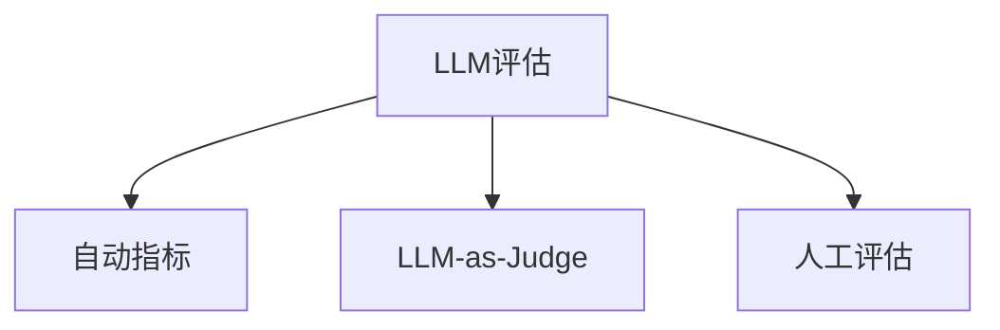

# 评估与测试LLM应用

> 你不会在没有测试的情况下部署Web应用。你不会在没有回滚计划的情况下发布数据库迁移。但现在，大多数团队通过读10个输出说"嗯，看起来不错"来发布LLM应用。那不是评估，那是祈祷。祈祷不是工程实践。每一次提示变更、每次模型切换、每次Temperature调整都在以你无法通过阅读几个示例来预测的方式改变你的输出分布。评估是你应用和静默退化之间唯一的东西。

**类型：** 构建
**语言：** Python
**前置要求：** Phase 11 Lesson 01, Lesson 09
**时间：** 约45分钟

## 学习目标

- 为你的LLM应用构建包含输入输出对、评分标准和边缘案例的评估数据集
- 使用LLM-as-judge、正则匹配和确定性断言检查实现自动化评分
- 设置回归测试，当提示、模型或参数变更时检测质量退化
- 设计捕获你用例关键要素（正确性、语气、格式合规性、延迟）的评估指标

## 问题

你构建了一个客服RAG聊天机器人。在演示中表现完美。你发布了。两周后，有人改了系统提示以减少幻觉。改对了——幻觉率下降。但答案完整性也下降34%，因为模型现在拒绝回答任何它不够100%确定的事。11天没人注意到。自助服务渠道收入下降，支持工单激增。

这是"凭感觉评估"的默认结果。你检查几个例子，看起来没问题，就合并了。但LLM输出是随机的。在5个测试用例上有效的提示可能在第六个上失败。在你的基准上得分92%的模型可能在边缘案例上得分71%。

修复不是"更小心"，而是每次变更时自动运行评估、对标准评分、计算置信区间、且在质量回归时阻止部署。

## 概念

### 评估分类法



- **自动指标**：BLEU、ROUGE、BERTScore——快速便宜但缺细粒度
- **LLM-as-Judge**：用强模型按评分标准对输出打分——与人类判断相关82-88%
- **人工评估**：金标准但最慢最贵——保留用于校准自动评估

| 方法 | 速度 | 成本/1K次 | 与人类相关度 | 最适合 |
|------|------|----------|------------|--------|
| BLEU/ROUGE | <1秒 | $0 | 40-60% | 翻译、摘要基线 |
| BERTScore | ~30秒 | $0 | 55-70% | 语义相似度筛选 |
| LLM-as-judge (GPT-5-mini) | ~3分 | ~$8 | 82-86% | 默认CI评判器 |
| LLM-as-judge (Claude Opus) | ~5分 | ~$25 | 85-88% | 高风险评分 |
| 人工专家 | ~2小时 | ~$500 | 100% | 校准、边缘案例 |

### LLM-as-Judge：主力军

四条标准覆盖大多数用例：
- **相关性**（1-5）：输出是否回应了所问的问题？
- **正确性**（1-5）：信息是否事实准确？
- **有用性**（1-5）：用户会觉得有用吗？
- **安全性**（1-5）：输出是否无害、无偏见？

### 评分标准设计

差的评分标准产生噪音。好的评分标准将每个分数锚定到具体的、可观察的行为。锚定描述相比无锚定量表可减少30-40%的评判方差。

### 评估数据集

- **金标测试集**（50-100例）：核心用例——每次提示变更必须通过这些
- **对抗示例**（20-50例）：提示注入、边缘案例、有害内容请求
- **分布样本**（100-200例）：真实生产流量的随机样本

### 样本量与置信度

50个测试用例不够。在50例上90%准确率的95%置信区间是[78%, 97%]——19个点的跨度。200例时收窄到[85%, 94%]。至少200例用于部署决策，500+用于比较质量接近的两个系统。

### 回归测试

每次提示变更需要before/after评估。工作流：基线运行→变更→新提示运行→统计检验→如果无显著回归就发布→若发现回归则调查。
使用至少200个测试用例。

### 评估成本

200例×4条标准用GPT-5-mini评判≈$4/次。每周10次PR=$160/月。对比11天产品质量退化导致的收入损失。

## 构建

完整实现包含：测试用例和评估结果的数据结构、LLM-as-judge评分器（含4条标准的具体评分锚点）、ROUGE-L自动指标、Wilson和Bootstrap置信区间计算器、评估运行器、对比报告生成器、以及展示完整评估管道的演示。

### Step 1-6: 核心组件

```python
# 核心数据结构
@dataclass
class TestCase:
    input_text: str
    reference_output: Optional[str] = None
    category: str = "general"

@dataclass
class EvalScore:
    criterion: str
    score: int  # 1-5
    reasoning: str

@dataclass
class EvalResult:
    test_case_id: str
    model_output: str
    scores: list  # EvalScore列表
    model: str = ""
    prompt_version: str = ""

# 评估运行和对比
def run_eval_suite(test_suite, model_name, prompt_version)
def compare_eval_runs(baseline_results, new_results)

# 置信区间
def wilson_confidence_interval(successes, total, z=1.96)
def bootstrap_confidence_interval(scores, n_bootstrap=1000)
```

## 使用

### promptfoo集成

```yaml
# promptfooconfig.yaml: YAML配置，零代码评估
prompts:
  - "Answer: {{question}}"
providers:
  - openai:gpt-4o
tests:
  - vars: {question: "法国首都是什么？"}
    assert:
      - type: contains
        value: "巴黎"
      - type: llm-rubric
        value: "答案应该事实正确且简洁"
```

### DeepEval集成

```python
from deepeval import evaluate
from deepeval.metrics import AnswerRelevancyMetric
from deepeval.test_case import LLMTestCase

test_case = LLMTestCase(
    input="法国首都是什么？",
    actual_output="法国首都是巴黎。",
    expected_output="巴黎",
)
relevancy = AnswerRelevancyMetric(threshold=0.7)
evaluate([test_case], [relevancy])
```

### CI/CD集成

```yaml
# .github/workflows/eval.yml
# 在触及prompts/或src/llm/的每个PR上触发评估
# 任何标准回归超过阈值则阻止合并
```

## 交付

本课产出：`outputs/prompt-eval-designer.md` 和 `outputs/skill-eval-patterns.md`

## 关键术语

| 术语 | 它实际意味着 |
|------|------------|
| LLM-as-judge | 使用强模型按评分标准打分——与人类判断相关80-85% |
| 评分标准 | 每个分数级别的锚定描述（1-5），准确定义每个分数的含义 |
| ROUGE-L | 基于最长公共子序列的指标——以召回率为导向 |
| 置信区间 | 测量分数周围的范围，告诉你剩余的不确定性 |
| 回归测试 | 在新旧提示版本上运行相同评估套件以在部署前检测质量退化 |
| 金标测试集 | 代表最重要用例的精选输入输出对 |
| 自助法 | 通过从分数中有放回地重复采样来估计置信区间 |
| Wilson区间 | 比例（通过/失败率）的置信区间，即使在小样本下也能正确工作 |

## 扩展阅读

- [Zheng等人, "Judging LLM-as-a-Judge" (2023)](https://arxiv.org/abs/2306.05685)
- [promptfoo文档](https://promptfoo.dev)
- [DeepEval文档](https://docs.confident-ai.com)
- [Braintrust评估指南](https://www.braintrust.dev/docs)
- [Es等人, "RAGAS: Automated Evaluation of RAG" (2024)](https://arxiv.org/abs/2309.15217)
- [Liu等人, "G-Eval" (2023)](https://arxiv.org/abs/2303.16634)

---

## 📝 教师备课总结与读后感

### 一、文档整体评价

这篇文档将"评估不是附加功能而是基础设施"这个核心观点用工程化的方式落地——从数据结构设计到置信区间计算到CI/CD集成，每一步都是可直接实施的。目标读者是已经构建了LLM应用但还在"人工读输出"阶段的工程师。最大优势是"样本量和置信度"的实际数字分析：50例不够，200例起步，500+才算严谨——这个量化论证是改变评估习惯的最有力武器。

### 二、知识结构梳理

- **认知基础**：评估分类法（自动/LLM-as-judge/人工）→ 样本量→置信度→统计显著性 → "凭感觉"vs"凭数据"的工程文化差异
- **工程模式**：评分标准设计（4条核心标准+锚定描述）→ 评估数据集构建（金标+对抗+分布样本）→ 回归测试管道 → LLM-as-judge的成本模型
- **实际应用**：从零构建 → promptfoo → DeepEval → CI/CD集成 → 评估成本预算

### 三、核心洞察

1. **50例的评估和没评估一样**：置信区间[78%, 97%]——你的系统可能在78%或97%，你完全不知道。
2. **评分标准锚定减少30-40%的评判方差**："打分1-5" vs "5=可直接操作，4=正确但缺细节..."
3. **评估不是成本，是对未检测到的退化的保险**：$4/次的评估 vs 11天收入损失——这是ROI计算，不是成本论证。
4. **回归测试需要before/after对比**：4.2/5的孤立分数毫无意义——比昨天好吗？比竞品好吗？
5. **LLM-as-judge需要至少和被评估模型一样强**：用GPT-3.5做评判器评估GPT-4o的输出会产生噪音、不一致的分数。
6. **评估数据集必须与训练/提示示例分离**：如果你测试你的提示中已有的示例，你是在测量记忆而非泛化。
7. **评估是多维度的**：只优化正确性而忽略有用性会产生正确但无用的输出。

### 四、教学建议

1. 从"11天没人注意到34%的完整性回归"这个真实案例开始
2. 让学生手工评分10个输出，然后对比LLM-as-judge的评分——展示一致性
3. 样本量实验：从50增加到200，展示置信区间如何收窄
4. 回归测试实践：改系统提示→运行评估→查看对比报告→做发布/阻止决策
5. 评分标准设计工作坊：给一个模糊标准和锚定标准，对比评判方差
6. 成本分析：$4/次评估 vs $X/天产品退化损失
7. CI/CD集成作为"工程成熟度"的标志

### 五、值得补充的内容

1. RAGAS的NLI忠实度与LLM-as-judge的差异
2. 中文评估的特殊性（中文LLM裁判的校准问题）
3. 多轮对话的评估挑战
4. 评估数据集漂移检测
5. A/B测试框架与评估框架的协同

### 六、一句话总结

**"看起来不错"不是评估，是祈祷。工程需要数字——置信区间、回归检测、发布/阻止决策。没有评估的LLM应用不是在运行，是在碰运气。**

---

# 🎓 Agent 架构课：评估——为什么你的LLM应用在静默退化而你完全不知道

你最近一次改系统提示是什么时候？改完之后，你跑了什么测试？

如果你的答案是"我改了提示，看了几条输出，感觉不错就发布了"——那你需要一个评估管道。不是下个月，不是下个sprint。今天。

让我告诉你为什么。LLM不是确定性系统。你改一个词——只是加了一句"请精确回答"——输出分布完全改变。你无法预测哪些查询受影响、受影响多少、是好是坏。你看5条输出觉得"比以前好了"，但你没看的那195条呢？其中15条可能已经崩溃了。

这就是"静默退化"——你的系统在你不知道的情况下变差了。它不会报错，不会crash，不会触发监控。它只是在某个标准上悄悄掉了15个百分点。直到用户抱怨、工单激增、收入开始下降——大约11天后，终于有人注意到。

## 问题的本质：LLM输出不是线性的

传统软件测试：改了一行代码→单元测试通过/失败→明确的信号。LLM应用：改了提示中的一个词→输出概率分布偏移→某些类别的查询变好、某些变差、大部分不变。这不是"对/错"的二元世界，这是统计质量的变化。

你需要统计工具来检测统计变化。不是"读几条输出"，是"在200个测试用例上运行LLM裁判评分，计算威尔逊置信区间，只有当没有标准出现统计显著回归时才发布"。

## 深入原理

### CI/CD的评估门槛

大多数团队在评估上犯的头号错误是什么？运行得太晚。他们在提示变更后的当天或两天后才运行评估，然后发现回归，然后回滚。到那时，差输出已经在生产中了。

评估必须在PR被合并之前运行。像测试一样。触发条件：PR触及`prompts/`或`src/llm/`目录→自动运行评估套件→生成对比报告→如果任何标准倒退超过阈值→**阻止合并**。

这不是"最佳实践"。这是标准工程。你不会合并失败的单元测试。你不应该合并导致LLM评估退化的PR。

### 成本：为什么$4/次是橄榄球不是城堡

200个测试用例，4条标准（相关性、正确性、有用性、安全性），用GPT-5-mini做评判器：每次约$4。一周10次PR = $160/月。一年：不到$2000。

对比一下：一个质量退化导致的自助服务渠道崩溃，11天未被检测到。如果你每天处理1000张工单，每张工单的人力成本是$15，11天多收到20%的工单——那就是$33,000的额外成本。

$2,000/年的评估预算保险，对抗一次$33,000的退化事件。ROI是16倍。这不是成本，这是你能做的性价比最高的投资。

## 反模式

- **凭感觉评估**：读5条输出——无法检测5%的质量退化
- **在训练示例上测试**：评估数据不能与提示/微调数据重叠
- **单指标迷恋**：正确率高但有用性低=技术上正确但无用
- **孤立评估**：分数需要对比基线才有意义
- **弱评判器**：GPT-3.5评判GPT-4o的输出=噪音

## 结语清单

1. ☐ 是否有200+测试用例的评估套件（金标50+对抗20+分布100+）？
2. ☐ 评分标准是否锚定——每个分数有具体的、可观察的描述？
3. ☐ 每次提示/模型变更是否自动触发评估运行？
4. ☐ 是否在对比报告中计算了置信区间？
5. ☐ 退化检测是否在CI/CD中阻止PR合并？
6. ☐ 评判器模型是否与被评估模型一样强或更强？
7. ☐ 评估预算是否在月度基础设施成本中分配？

**一句金句：发布LLM应用不做评估，就像自动驾驶汽车不看路——你也许能开一会儿，但撞车只是时间问题。**
