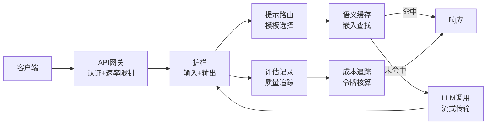

# 构建生产级LLM应用

> 你已经构建了提示、嵌入、RAG管道、函数调用、缓存层和护栏。分开地。孤立地。就像练习吉他音阶却从未弹过一首歌。这节课就是那首歌。你将把第01-12课的每一个组件连接成一个生产就绪的服务。不是玩具。不是演示。是一个处理真实流量、优雅降级、流式传输令牌、追踪成本、并在前10,000个用户中存活下来的系统。

**类型：** 构建（Capstone） | **语言：** Python | **时间：** 约120分钟

## 学习目标

- 将所有Phase 11组件接入一个生产就绪的服务
- 实现流式传输、优雅错误处理和请求超时管理
- 构建可观察性：请求日志、成本追踪、延迟百分位数和错误率仪表板
- 部署带有健康检查、速率限制和提供商中断后备策略的应用

## 问题

构建一个LLM功能需要一个下午。发布一个LLM产品需要数月。

差距不在智能，在基础设施。你的原型调用OpenAI，获取响应，打印出来。在你的笔记本上可以工作。然后现实来了：
- 一个用户发送了一个5万令牌的文档。你的上下文窗口溢出。
- 两个用户在4秒内问了同一个问题。两次你都付了费。
- API在凌晨2点返回500错误。你的服务崩溃了。
- 用户让模型生成SQL。模型输出`DROP TABLE users`。
- 月度账单达到$12,000，但你完全不知道哪个功能导致的。
- 平均响应时间8秒。用户在3秒后就离开了。

## 概念

### 生产架构

每个严肃的LLM应用遵循相同的流程。



### 技术栈

| 组件 | 课程 | 技术 |
|------|------|------|
| API服务器 | -- | FastAPI + Uvicorn |
| 提示模板 | L01-02 | Jinja2 / 字符串模板 |
| 嵌入 | L04 | text-embedding-3-small |
| 向量存储 | L06-07 | 内存 (生产: Pinecone/Qdrant) |
| 函数调用 | L09 | 工具注册表 + JSON Schema |
| 评估 | L10 | 自定义指标 + 日志 |
| 缓存 | L11 | 语义缓存 (基于嵌入) |
| 护栏 | L12 | 正则 + 分类器规则 |
| 成本追踪 | L11 | 令牌计数器 + 定价表 |
| 流式传输 | -- | Server-Sent Events (SSE) |

### 流式传输：为什么重要

GPT-5对500输出令牌的响应需要3-8秒才能完全生成。没有流式传输，用户全程盯着一个旋转图标。有了流式传输，第一个令牌在200-500ms内到达。总时间相同，感知延迟下降90%。

SSE是默认选择。OpenAI、Anthropic和Google都通过SSE流式传输。

### 错误处理：三层

**第1层：API故障**（429/500/超时）→ 指数退避加抖动重试，最多3次
**第2层：模型故障**（格式错误JSON、幻觉函数名）→ 带错误上下文重试
**第3层：应用故障**（下游服务不可达）→ 优雅降级

**后备模型链：**
```
claude-sonnet-4 → gpt-4o → gpt-4o-mini → 缓存响应 → "服务暂时不可用"
```

### 可观察性：要测量什么

| 指标 | 目标 | 原因 |
|------|------|------|
| P50延迟 | <2秒 | 中位用户体验 |
| P99延迟 | <10秒 | 尾部延迟驱动流失 |
| 缓存命中率 | >30% | 直接成本节省 |
| 护栏阻止率 | <5% | 过高=误报影响用户 |
| 每次请求成本 | <$0.01 | 单位经济学可行性 |

### 生产中A/B测试提示

- **影子模式**：新提示在100%流量上运行但仅记录结果，不向用户展示
- **百分比推出**：10%→25%→50%→100%，监控指标，即时回滚

### 真实架构案例

- **Perplexity**：搜索→检索→重排序→RAG上下文→带引用的LLM答案→流式返回。两个模型：快速（搜索查询改写）+强（答案合成）。估算5000万+查询/天
- **Cursor**：打开的文件、周围文件、最近编辑和终端输出构成上下文。提示路由器：自动补全用快模型（~20ms），聊天用强模型（~3s）。MCP集成
- **ChatGPT**：插件+函数调用+MCP服务器。路由层决定调用哪些能力。多模型服务不同功能

## 构建

完整生产服务的实现包括：

**核心服务类 `ChatService`**：整合提示模板存储、流式LLM调用、exact/semantic缓存、输入/输出护栏、成本追踪器、多个backoff退避和错误恢复模式。主要方法：
- `chat_stream()`：完整的流式聊天管道，token-by-token SSE
- `_build_prompt()`：提示组装与变量替换
- `_check_cache()`：双层缓存查找（exact+semantic）
- `_generate_stream()`：带重试的流式LLM调用
- `_run_guardrails()`：输入和输出安全检查

**FastAPI应用**：`/health`（健康检查）、`/chat`（非流式端点）、`/chat/stream`（SSE流式端点）、`/metrics`（实时指标）、`/stats`（详细统计）。包含认证中间件和CORS配置。

**生产检查清单**：崩溃重启、优雅关闭、每个端点的超时、单点故障缓解、健康检查、日志聚合、指标收集、机密管理。

## 交付

`outputs/prompt-production.md` 和 `outputs/skill-production-patterns.md` 加上完整的生产级聊天服务代码。

## 关键术语

| 术语 | 含义 |
|------|------|
| 流式传输 | 逐个令牌发送响应，首令牌在200-500ms内到达 |
| 指数退避 | 重试延迟呈指数增长：1s→2s→4s→放弃 |
| 优雅降级 | 次要组件故障时继续服务，而非崩溃 |
| 可观察性 | 日志+追踪+指标——三个支柱用于理解生产行为 |
| 影子模式 | 运行新代码但仅记录结果，不暴露给用户 |

## 扩展阅读

- [FastAPI文档](https://fastapi.tiangolo.com)
- [OpenAI流式指南](https://platform.openai.com/docs/guides/streaming)
- [OpenTelemetry for Python](https://opentelemetry.io/docs/instrumentation/python/)
- [Vercel AI SDK](https://sdk.vercel.ai)

---

## 📝 教师备课总结与读后感

### 一、文档整体评价

这是一节"Capstone"课——Phase 11的最终集成。它不是教新知识，而是将前12节课的所有组件（提示工程、RAG、结构化输出、函数调用、缓存、护栏、评估）连接成一个可运行的生产服务。目标读者是已经独立掌握了各组件但还没将它们拼成一个完整系统的工程师。最大优势是用"一首歌而不是音阶练习"的比喻，将集成工作从"额外工作"重新定义为"唯一有意义的工作"。

### 二、知识结构梳理

- **系统架构**：API网关→提示路由→缓存→LLM→护栏→评估→成本追踪的完整请求流
- **服务质量**：流式传输（感知延迟）、三层错误处理（API/模型/应用）、后备模型链
- **可观察性**：结构化日志→分布式追踪→五个核心指标仪表板

### 三、核心洞察

1. **原型和产品的差距全在基础设施上**：12门课的组件单独运行时是"教科书示例"，集成时是"生产系统"。差距不是智能，是工程师的严谨。
2. **流式传输改变的是感知延迟而非实际延迟**：总时间不变，但首令牌在200-500ms→用户"感觉"快了90%
3. **每个LLM组件都会失败——为每个设计降级路径**：缓存挂了→直接调LLM。LLM挂了→换模型。护栏挂了→记录日志跳过。从不因为辅助系统失败而崩溃主流程
4. **后备模型链是"质量换可用性"的自动决策**：claude-sonnet→gpt-4o→gpt-4o-mini→缓存→"暂时不可用"
5. **五个指标定义LLM产品的健康**：P50延迟+P99延迟+缓存命中率+护栏阻止率+每次请求成本
6. **A/B测试提示需要影子模式和百分比推出**：不是"我觉得这个提示更好"，是"数据显示在10%流量上质量提高3%，扩展到100%"
7. **每个生产系统都会崩溃——问题是你需要花多长时间发现**：日志+追踪+指标=5分钟发现而非5天

### 四、教学建议

1. "音阶vs歌曲"开场：展示前12课各自独立→本课将它们连接成一个文件
2. 让学生从零构建`ChatService`类——手动集成组件
3. 流式传输的现场演示：非流式vs流式——感受差异
4. 故障注入实验：杀掉缓存、让API返回500、让模型返回格式错误的JSON——演示降级
5. 仪表板作为评估：对比"无仪表板"和"有仪表板"的调试体验
6. 成本冲击：在追踪器中显示模拟账单
7. 结课时讨论Perplexity/Cursor/ChatGPT如何解决这些问题

### 五、值得补充的内容

1. 多模型下的A/B测试框架完整实现
2. 日志量管理等运维层面
3. CI/CD部署管道
4. 负载测试
5. 中文模型的生产环境特殊性

### 六、一句话总结

**你能在一天内构建一个LLM功能。你需要数月来构建一个LLM产品。差距不在于AI——在于当你睡着了、当API挂了、当用户发送5万令牌文档时，你的系统做什么。**

---

# 🎓 Agent 架构课：生产部署——为什么你的原型离产品之间隔着一个凌晨2点的500错误

你做过这个梦吗？凌晨2点，手机响了。你的LLM应用在生产中崩溃了。OpenAI API返回了500。你的重试逻辑没有生效。你的监控没有告警。你在睡梦中，系统在崩溃中。

这不是噩梦，这是"从原型到产品"的默认路径。

让我告诉你为什么大多数LLM应用在生产中失败，以及我如何构建永不崩溃的系统。

## 问题的本质：原型假设一切都是完美的

你的原型假设：API永远返回200，模型永远输出有效JSON，用户输入永远正常。生产假设：以上都不是。

凌晨2点的API故障：不是"可能发生"，是"一定会发生"。GPT-5的可用性是99.5%，意味着每个月有3.6小时的停机时间。在某个时间点，你的API调用会返回500。你的选择不是"会不会发生"，是"发生时你的系统做什么"。

## 深入原理

### 流式传输不是为了"用户感觉更快"，是为了"用户不离开"

首令牌时间（TTFT）超过1秒，用户开始怀疑系统是否在工作。超过3秒，用户开始切换标签页。超过5秒，用户关闭了窗口。你花了$0.03生成一个完美的答案，但用户在看到它之前就离开了。

流式传输将TTFT从3-8秒压缩到200-500ms——用户看到第一个词立即知道"它在工作"。这不是UI优化，这是用户留存机制。

### 后备链：质量换可用性的自动化

当claude-sonnet宕机，自动切换到gpt-4o。质量可能降低3%，但可用性保持100%。当gpt-4o也宕机，自动切换到gpt-4o-mini。质量降低10%，但可用性仍然100%。当所有模型都宕机，返回缓存的响应或"服务暂时不可用"。

这是可用性工程，不是AI工程。

## 结语清单

1. ☐ 是否在所有LLM调用上启用了流式传输？
2. ☐ 是否存在三层重试策略（API/模型/应用）？
3. ☐ 是否存在后备模型链？
4. ☐ 是否记录了每次API调用的令牌、延迟和成本？
5. ☐ 是否存在仪表板显示五个核心指标？
6. ☐ 网关层是否处理了认证和速率限制？
7. ☐ 是否存在优雅关机和健康检查？
8. ☐ 是否启用了提示缓存（提供商+自定义）？

**一句金句：原型回答"它能工作吗？"，产品回答"凌晨2点API挂了它还能工作吗？"——LLM工程不是关于AI，是关于可靠性。**
